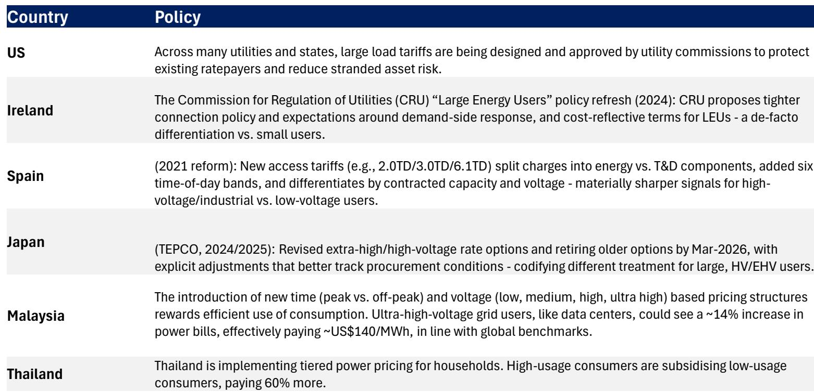
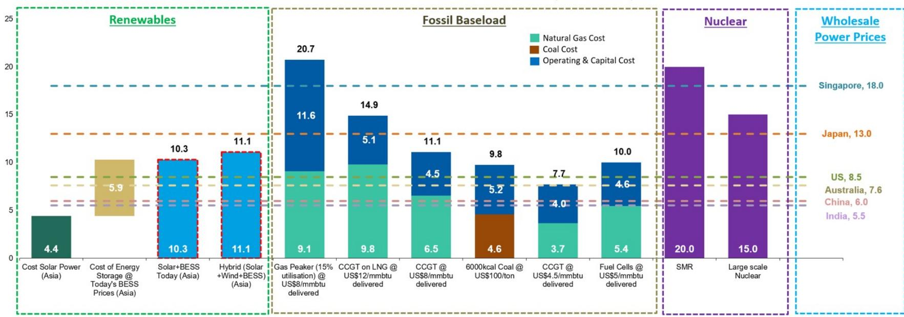
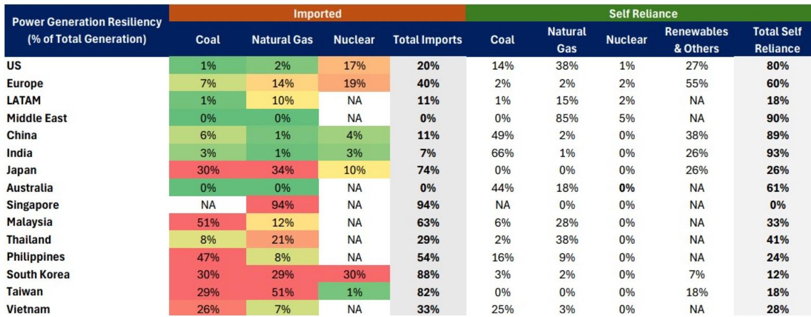

# Asia's Power Supercycle Is Not Just About AI: It Is About Energy Sovereignty

The prevailing narrative that artificial intelligence is the singular driver of Asia's power demand boom is incomplete. A deeper examination of the region's electricity markets reveals a more fundamental structural shift: Asia is entering an age of electricity where energy sovereignty has become the overriding strategic imperative. AI demand is the accelerant, but the fire was already lit by geopolitics, supply chain fragility, and the recognition that power is the new currency of economic and technological competition.

Asia now imports more than a third of its power needs in the form of fuel. Japan relies on imports for 74 percent of its power generation. South Korea stands at 88 percent. Singapore at 94 percent. These are not merely statistics; they are strategic vulnerabilities that policymakers can no longer ignore. The era of assuming cheap, reliable energy from global markets is over. Every energy shock since the 1970s has triggered a wave of emergency response policies, and the current cycle is no different. What has changed is the scale of the response and the speed at which it must happen.

A global investment bank report estimates that Asia will require over USD 5 trillion in energy security investment, with power accounting for approximately 65 percent of that total. This is not a cyclical capex cycle. It is a structural supercycle driven by the co-existence of coal, gas, renewables, and nuclear as nations seek to build resilience into every part of their energy systems. The value creation opportunity from these investments, when combined with the security of technology, AI, and food supply chains, could reach nearly USD 9 trillion. That is a 1.6x torque on the investment itself, suggesting that the returns on energy sovereignty extend far beyond the power sector.

The critical insight for observers is that the power supply chain has already begun to re-rate. Over the past two years, companies in this space have seen valuation multiples expand by 20 to 50 percent. This re-rating reflects a fundamental change in the consumption growth outlook, not a temporary spike in demand. The question is whether this is just the beginning, and which parts of the energy ecosystem will benefit next.

## The AI Energy Demand Surge Is Real, But Its Geographic Distribution Will Surprise Markets

Global AI data center capital expenditure is on track to surpass investment in both power and oil and gas. This is an extraordinary shift in capital allocation, and it is happening faster than most models predicted. Weekly token demand from leading AI models is rising globally, and the energy implications are straightforward: more compute requires more electricity. The report estimates that the power demand growth expectations for Asia have been consistently revised upward, and the compound annual growth rate to 2030 is now meaningfully higher than previous forecasts.

What is less understood is how the geography of AI data center capacity will evolve. China is expected to drive a significant portion of Asia's data center growth, driven by inference demand and the push for chip self-sufficiency. This is leading to commoditization and faster commercialization of data center capacity in the region. But there is another dynamic at play that the market has not fully priced in.

The United States faces its own power supply chain constraints. The report estimates a potential power shortfall of approximately 9 gigawatts for US data centers, even after factoring in suitable nuclear and fuel cell power. This creates a spillover effect: as much as 6 gigawatts of data center capacity could shift to Asia. This is not a marginal adjustment. It represents a structural relocation of AI compute capacity, with profound implications for power demand in Southeast Asia, India, and other regions with available energy and favorable policy environments.

The implication is that Asia's AI-driven power demand will be more front-loaded and more geographically dispersed than current consensus suggests. Markets that have historically been peripheral to the global tech supply chain are now becoming central to the energy infrastructure that powers AI.

## The Return of Coal Is Not a Step Backward; It Is a Strategic Hedge

One of the most counterintuitive conclusions from the report is that coal is making a comeback in Asia's energy mix. This is not a regression to old habits. It is a calculated response to energy security concerns that cannot be solved by renewables alone. The report estimates that Asian markets will spend USD 318 billion on coal investments, driven by higher power demand and coal-to-gas switching.

The economics of round-the-clock power generation make this clear. When comparing the levelized cost of different energy sources for 24/7 dispatchable power, coal remains competitive in many Asian markets, particularly when the cost of energy storage is factored into renewable-heavy portfolios. More importantly, coal provides a degree of energy independence that imported LNG cannot match. For countries like India, which generates 66 percent of its power from domestically sourced coal, the fuel is not just an economic choice. It is a sovereignty play.

This does not mean that Asia is abandoning its climate commitments. Rather, it signals a pragmatic recognition that the transition to a low-carbon grid will take longer than idealistic models suggest, and that in the interim, energy security must come first. The report's framework for energy security implementation versus urgency shows that many Asian economies are in the high-urgency, low-implementation quadrant. Coal offers a bridge solution that can be deployed quickly while longer-term investments in nuclear, storage, and grid infrastructure come online.

The strategic question for observers is whether coal investments will be stranded assets in a decade or essential infrastructure that enables the transition. The answer likely depends on the pace of technological change in carbon capture and the evolution of energy storage costs. But for now, the market is signaling that coal has a longer economic life than many assumed.

## Energy Storage and Grid Infrastructure Are the Unsung Bottlenecks

The report highlights that energy storage is expanding rapidly, even in markets outside of China. This is a critical development because the intermittency of renewables is the single biggest barrier to their large-scale adoption as baseload power. Without storage, solar and wind remain complementary sources, not substitutes for dispatchable generation.

The deployment of power grid infrastructure is also booming. This is where the report's analysis becomes particularly valuable for observers. The power supply chain has already re-rated, but the story is widening to include all dependable energy sources, not just renewables. Grid equipment, transformers, and transmission lines are becoming scarce assets. Companies that manufacture these components are benefiting from a multi-year demand cycle that is only partially reflected in current valuations.

The report's energy security exposure guide maps this out systematically. It shows that energy capital expenditure is set to double by 2030, and that the beneficiaries will include not just traditional power companies but also manufacturers of grid equipment, energy storage systems, and nuclear components. The supply chain shift is also creating opportunities in solar manufacturing, as economies onshore critical production capacity. India, for example, is seeing a wave of investment in polysilicon, ingot, wafer, cell, and module manufacturing, with several companies building fully integrated facilities.

The open question is whether the supply side can keep up with demand. The report does not fully answer how the industry will resolve the tension between the need for rapid deployment and the long lead times for manufacturing capacity. This is a meaningful gap in the analysis, and it suggests that the re-rating of power supply chain stocks may have further to run as observers realize that the bottleneck is not demand but the ability to produce the equipment needed to meet it.

## How to Build an Observation Framework Around Asia's Power Supercycle

For institutional observers, the report provides a useful decision framework that goes beyond simple sector allocation. The key is to recognize that the power supercycle is not monolithic. It has three distinct layers, each with different risk-return profiles and time horizons.

The first layer is the infrastructure build-out. This includes grid equipment, transformers, transmission lines, and energy storage systems. These are the most direct beneficiaries of the capex cycle, and they offer relatively predictable revenue streams tied to government and utility spending. The risk here is execution: can these companies scale manufacturing fast enough to meet demand without destroying margins?

The second layer is fuel sourcing and security. This includes coal, natural gas, and nuclear fuel supply chains. The report's analysis of power generation resiliency shows that Asia's dependence on imported fuels varies dramatically by country. Japan, South Korea, and Singapore are highly exposed to global fuel markets. India and China are more self-reliant, but even they face risks in specific fuel categories. The observation opportunity here is in companies that can provide fuel security solutions, whether through domestic production, long-term supply agreements, or fuel-switching capabilities.

The third layer is the AI and data center demand. This is the most dynamic and uncertain layer. The report's estimate of a potential 6 gigawatt spillover of US data center capacity to Asia is a powerful thesis, but it depends on assumptions about US power constraints and Asian policy responses that are not guaranteed. Observers should monitor regulatory developments in both regions closely, as they will determine whether this spillover materializes.

The report also suggests that the value creation opportunity extends beyond the power sector itself. The USD 9 trillion figure includes the unlocking of value in technology, AI, and food supply chains that depend on reliable energy. This means that observers should look for companies whose business models are constrained by energy availability and that stand to benefit disproportionately from improved power infrastructure.

## The Unresolved Analytical Questions That Demand Further Study

The report leaves several important questions open. First, how will the economics of round-the-clock power generation evolve as the US shale revolution is exported to Asia at scale starting in 2027? The report notes that this will have repercussions across the powering AI and energy security thematics, but it does not fully model the second-order effects on pricing, fuel switching, and investment returns.

Second, what is the realistic timeline for nuclear deployment in Asia? The report includes nuclear in its energy mix analysis, but the lead times for new nuclear plants are long, and the regulatory hurdles are significant. If nuclear cannot scale fast enough, the burden will fall on coal and gas, with implications for carbon emissions and policy credibility.

Third, the report's framework for energy security implementation versus urgency is useful, but it does not provide a clear pathway for how countries in the high-urgency, low-implementation quadrant can close the gap. This is where the most interesting observation opportunities may lie, as these countries will need to make rapid decisions that create winners and losers across the energy value chain.

These are not weaknesses in the report. They are invitations for further analysis, and they suggest that the power supercycle thesis is still evolving. The companies and observers that can anticipate the answers to these questions will have a significant advantage.

## Join the community to read the full report and review the original charts.

The data behind these conclusions is detailed and worth examining directly. The original report includes comprehensive exhibits on power generation economics, energy security exposure, and supply chain mapping that cannot be fully conveyed in a summary. The charts on the re-rating of the power supply chain, the comparison of data center power demand across regions, and the investment needs by fuel type are particularly valuable for building conviction around this thesis.

*For informational purposes only. Portions may be generated, translated, summarized, or edited with AI assistance based on source materials and may contain omissions or errors. Please verify independently. This is not professional advice.*

For informational purposes only. Portions may be generated, translated, summarized, or edited with AI assistance based on source materials and may contain omissions or errors. Please verify independently. This is not professional advice.

