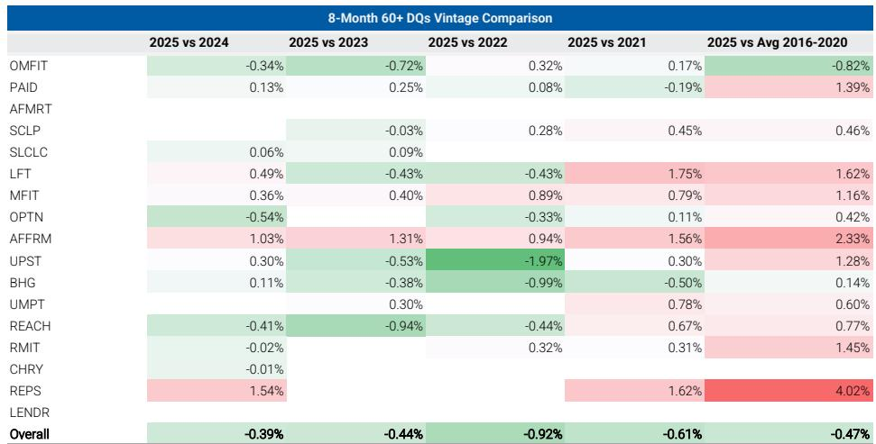
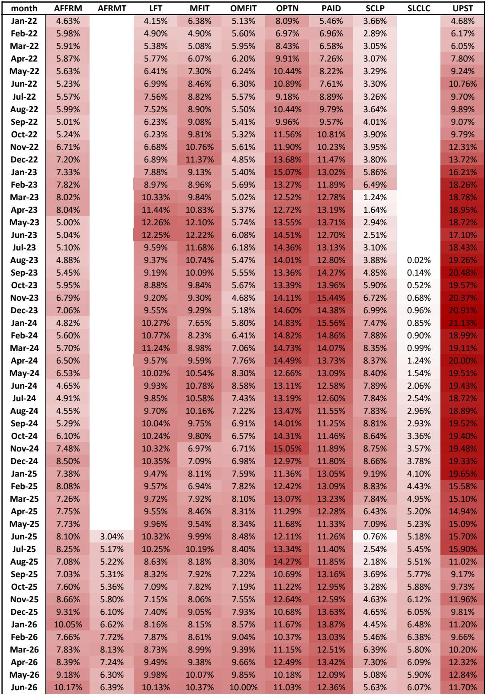
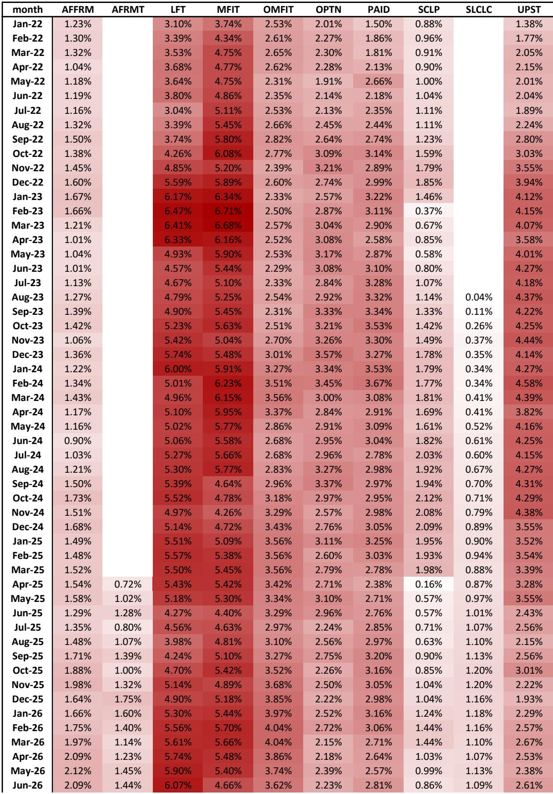

# The Aggregate Delinquency Improvement in MPL ABS Is a Composition Effect, Not a Credit Quality Breakthrough

The most dangerous pattern in fixed income is when a portfolio-wide metric improves for the wrong reason. In unsecured consumer ABS, aggregate 60+ day delinquencies have been falling for several years, a trend that has led many market participants to conclude that post-COVID lending standards have tightened meaningfully and that the 2025 vintage represents a structural improvement in underwriting. A careful examination of the data tells a different story. The improvement is real at the aggregate level, but it is driven primarily by a shift in the composition of the market, not by uniformly better performance across individual issuers. New shelves that have entered the market since 2021 now account for roughly 26% of outstanding balances, and every single one of those new shelves has below-average delinquency rates. When you remove the compositional effect, the individual vintage curves of the largest issuers tell a far more mixed story. For investors who rely on aggregate delinquency trends to make allocation decisions, this distinction matters enormously. It means that the apparent strength of the 2025 vintage may be masking underlying dispersion that could become visible as these newer shelves season and as the market share of older, higher-delinquency shelves stabilizes or reverses.

The timing of this insight is particularly important given the record-breaking pace of ABS issuance. The second quarter of 2026 saw $117 billion in ABS issuance, a new quarterly record, bringing year-to-date totals to $228 billion, up 26% versus the same period in 2025. Consumer ABS spreads finally softened in June after months of tightening, with prime auto AAA spreads widening approximately 8 basis points from their May tights and subprime auto AAA widening roughly 13 basis points. The market has been absorbing heavy supply across consumer ABS, residential credit, and commercial products, and the spread widening in June suggests that the technical backdrop may be shifting. In this environment, understanding the true credit quality of the underlying collateral is not an academic exercise. It is a prerequisite for making informed risk-adjusted decisions about which vintages, which shelves, and which sub-sectors deserve premium valuations.

## The Aggregate Delinquency Trend in MPL ABS Masks a Fundamental Shift in Market Composition

The headline data on MPL ABS performance appears unequivocally positive. Aggregate 60+ day delinquencies have been declining for several years and are now well below the highs observed during the COVID period. The 2025 vintage, when measured at the aggregate level, outperforms every prior year including the average of 2016 through 2020. This is the kind of statistic that would normally lead an analyst to conclude that underwriting standards have tightened materially and that the asset class is experiencing a structural improvement in credit quality. The narrative that lenders rapidly tightened standards in the aftermath of COVID is widespread and intuitively appealing. It is also incomplete.

When you disaggregate the data by individual shelf, the pattern changes dramatically. Among the largest shelves, defined as those with more than $1 billion currently outstanding, none of them show consistently better delinquency performance across all prior years at the 8-month seasoning mark. Some shelves do show improvement versus certain prior years, but the pattern is inconsistent and often contradictory. For example, one of the largest shelves shows a 0.34 percentage point improvement in 60+ delinquencies versus its 2024 vintage but a 0.32 percentage point deterioration versus its 2022 vintage. Another shelf shows improvement versus 2023 and 2022 but deterioration versus 2024 and 2021. The aggregate improvement, in other words, is not the sum of uniformly better individual performances. It is the arithmetic result of a changing composition.

The compositional shift is stark. Of the 25 largest MPL shelves by current outstanding balance, ten are new since the beginning of 2021. These ten shelves collectively account for 22% of the total universe, and every single one of them has a 12-month average 60+ delinquency rate that is below the market average. The newest entrants have delinquency rates that are 0.1 to 0.5 times the market average, while many of the older, larger shelves have delinquency rates that are 1.0 to 2.9 times the market average. As the newer, lower-delinquency shelves have gained market share, the aggregate delinquency rate has naturally fallen, even without any improvement in the underlying performance of the older shelves. This is not a credit quality improvement story. It is a market structure story.

## New Entrants Are Reshaping the MPL ABS Universe, but Their Performance Has Not Yet Been Tested Through a Full Cycle

The acceleration of market share acquisition by new shelves is a relatively recent phenomenon. While new shelves have been entering the market since 2021, the real acceleration has occurred since the start of 2024. This timing is important because it means that the newer shelves have not yet been tested through a full economic cycle. They have originated loans and issued ABS during a period of relatively strong employment, low unemployment, and generally benign consumer credit conditions. Their below-average delinquency rates may reflect genuine underwriting discipline, or they may reflect the favorable macroeconomic environment in which their loans were originated and have seasoned.

There is a parallel here to the subprime auto ABS market, where the report notes that aggregate delinquencies continue to show weakness versus prior years. In subprime auto, the compositional effect works in the opposite direction, with older, higher-delinquency shelves maintaining or increasing their market share. The contrast between the two markets is instructive. In MPL, the entry of new, lower-delinquency shelves has improved the aggregate picture. In subprime auto, the persistence of older, higher-delinquency shelves has weighed on the aggregate. The difference is not primarily about underwriting quality at the issuer level. It is about which issuers are growing and which are shrinking.

For investors, this raises a critical question that the aggregate data cannot answer. Will the newer MPL shelves maintain their below-average delinquency performance as their loans season and as the macroeconomic environment potentially deteriorates? The oldest of the new shelves have been originating loans for approximately five years, which is long enough to observe performance through some variation in economic conditions but not long enough to observe performance through a genuine recession. The most recent entrants have only been originating loans for two to three years. Their performance track record is short, and their delinquency rates are mechanically low because their loans are young and have not yet reached the peak delinquency period. Investors who rely on the aggregate delinquency trend to justify premium valuations for the entire MPL sector may be underestimating the risk that the newer shelves will converge toward the market average as they season.

## The Disconnect Between Aggregate and Individual Performance Creates Both Risk and Opportunity for Active Investors

The compositional effect in MPL ABS creates a classic active management opportunity. Investors who rely on aggregate indices or broad market benchmarks to make allocation decisions are effectively buying a blend of older, higher-delinquency shelves and newer, lower-delinquency shelves at a single market price. The spread compression that has occurred across consumer ABS in recent months means that the market is not fully differentiating between shelves with fundamentally different risk profiles. The newer shelves, with their below-average delinquency rates, may be priced too cheaply relative to their actual performance, while the older shelves with above-average delinquency rates may be priced too richly.

The data on spread movements supports this interpretation. Consumer ABS spreads tightened significantly through the first five months of 2026, with prime auto AAA spreads reaching new year-to-date tights in May despite very heavy supply. The spread widening in June was modest and may reflect technical factors related to supply rather than a reassessment of credit risk. If the market is not fully pricing in the compositional effect, then there is an opportunity for investors who can identify which shelves are likely to maintain their below-average performance and which are likely to revert toward the mean.

However, this opportunity comes with significant analytical complexity. The report's analysis shows that even among the largest shelves, the pattern of vintage-by-vintage performance is highly idiosyncratic. Some shelves show consistent improvement across multiple vintages, while others show deterioration. Some shelves have very low delinquency rates but very short track records, while others have longer track records but higher delinquency rates. Investors cannot simply assume all new shelves will perform well and expect to benefit. They need to understand the specific underwriting practices, borrower demographics, and economic exposure of each shelf.

## A Decision Framework for Navigating the Compositional Shift in MPL ABS

For investors who want to incorporate the insights from this analysis into their portfolio construction process, a structured decision framework is essential. The first step is to recognize that the aggregate delinquency trend is not a reliable signal for individual shelf selection. Investors should stop using broad market averages as a shortcut for credit quality assessment and instead build their analysis from the bottom up.

The second step is to segment the MPL ABS universe into three categories based on shelf age and delinquency performance relative to the market average. The first category consists of newer shelves, launched since 2021, that have below-average delinquency rates. These shelves represent the compositional tailwind that has been driving the aggregate improvement. The second category consists of older shelves with below-average delinquency rates. These shelves have demonstrated consistent performance across multiple vintages and economic environments. The third category consists of older shelves with above-average delinquency rates. These shelves are the compositional headwind that the aggregate improvement has been masking.

The third step is to assess the sustainability of each shelf's performance. For newer shelves, the key question is whether their below-average delinquency rates reflect structural underwriting advantages or simply the favorable macroeconomic conditions of their origination period. Investors should examine the loan-level characteristics of each shelf, including weighted average FICO scores, loan-to-value ratios, debt-to-income ratios, and geographic concentration. They should also consider the issuer's track record in other asset classes or in earlier vintages of the same shelf, if available. For older shelves with below-average performance, the key question is whether their performance is improving, stable, or deteriorating relative to their own history. For older shelves with above-average performance, the key question is whether the deterioration is cyclical or structural.

The fourth step is to evaluate the valuation of each shelf relative to its risk profile. The spread compression that has occurred across consumer ABS means that many shelves are trading at similar levels despite having fundamentally different credit profiles. Investors should identify shelves that are trading at spreads that do not fully reflect their delinquency performance, their seasoning, or their issuer concentration. This is where the opportunity lies, but it requires granular data and disciplined analysis.

The fifth step is to monitor the compositional shift over time. The market share of new shelves has been increasing rapidly, but this trend may not continue indefinitely. If the pace of new issuance slows or if older shelves regain market share, the compositional tailwind could reverse. Investors should track the market share of new versus old shelves on a quarterly basis and adjust their portfolios accordingly.

## What the Report Does Not Yet Answer

The analysis in the report is powerful, but it leaves several important questions unanswered. The first question is whether the newer shelves will maintain their below-average delinquency performance as their loans season and as the macroeconomic environment potentially deteriorates. The report provides data on 8-month delinquency comparisons, but it does not provide data on longer-term performance for the newer shelves. Investors need to see how these shelves perform at 12 months, 18 months, and 24 months of seasoning before they can confidently conclude that their performance is structural rather than cyclical.

The second question is whether the compositional effect is specific to MPL ABS or whether it is also present in other consumer ABS sectors. The report notes that subprime auto ABS shows a different pattern, with aggregate delinquencies remaining weak relative to prior years. But the report does not provide a similar compositional analysis for other sectors such as credit cards, student loans, or equipment ABS. If the compositional effect is widespread, then the implications for portfolio construction are broader than just the MPL sector.

The third question is how the compositional shift will interact with the macroeconomic outlook. The report was published in July 2026, and the macroeconomic environment at that time was relatively benign. But if the economy weakens, the newer shelves may experience delinquency increases that are proportionally larger than those of older shelves, simply because their loans are younger and have not yet been tested. Conversely, if the economy remains strong, the newer shelves may continue to perform well, and the compositional tailwind may persist.

The fourth question is whether the market will eventually price in the compositional effect. The spread widening in June 2026 was modest, but it may be the beginning of a more significant repricing. If investors begin to differentiate more carefully between shelves based on their age and performance, the spread dispersion within the MPL sector could increase significantly. This would create opportunities for active managers but would also increase the risk for passive investors who are exposed to the aggregate index.

## Join the Community to Read the Full Report and Review the Original Charts

The analysis presented here is based on a detailed examination of shelf-level data that is not available in standard market reports. The full report includes vintage curves for the largest six shelves, a complete table of the top 25 MPL shelves with their current market share, change in market share since January 2021, and 12-month average delinquency rates, as well as charts showing the evolution of market share for new versus old shelves over time. These exhibits are essential for investors who want to conduct their own analysis of the compositional effect and its implications for their portfolios. Join the community to read the full report and review the original charts.

*For informational purposes only. Portions may be generated, translated, summarized, or edited with AI assistance based on source materials and may contain omissions or errors. Please verify independently. This is not investment, legal, tax, accounting, or other professional advice.*

For informational purposes only. Portions may be generated, translated, summarized, or edited with AI assistance based on source materials and may contain omissions or errors. Please verify independently. This is not investment, legal, tax, accounting, or other professional advice.

