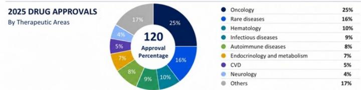

# 2025年药品审批情况：按治疗领域划分

2026年7月6日 03:42 GMT

中国医疗健康 | 亚太地区

# 本周图表——2026年上半年及2025年中国药品审批情况

## 核心要点

国家药监局在2026年上半年和2025年分别批准了58款和120款创新药。2026年上半年获批的药物中，31款为小分子药物，27款为生物制品。

这些药物包括izalontamab brengitecan（用于复发/转移性鼻咽癌）、satricabtagene autoleucel（用于CLDN18.2+/HER2-胃/胃食管交界处腺癌）以及retlirafusp（用于PD-L1+胃/胃食管交界处癌）。

与美国市场的审批趋势相似，小分子药物仍占中国获批药物的多数：2019年至2025年，按数量计算占比超过60%。

2025年，肿瘤学领域的获批适应症数量最多，其中乳腺癌领域有9款药物上市，例如PI3Kα和AKT抑制剂、TROP2/HER2靶向抗体偶联药物。

2025年，中国创新药获批数量首次突破三位数，本土研发企业的获批数量超过跨国企业：在2025年获批的120款创新药中，63款源自中国本土研发企业（跨国企业为57款）。我们认为，这体现了中国作为生物制药研发力量持续崛起，以及支持性的监管环境加速了药物开发和试验启动。中国庞大的CDMO行业也为实现技术突破提供了助力。2025年，中国原研资产覆盖了多种具有潜力的模式：1）mazdutide（信达生物），一种用于减重和2型糖尿病的双重GCG/GLP-1激动剂；2）trastuzumab rezetecan（恒瑞医药），一种用于非小细胞肺癌和HER2+乳腺癌的新型HER-2靶向ADC；3）recaticimab（恒瑞医药），一种用于高胆固醇血症和混合型血脂异常的新型PCSK9抑制剂。我们对药明康德-A（中国领先的CDMO）的核心关注点之一，是小分子药物审批加速的趋势，这有望带来更多商业合同以及跨国企业和生物科技公司更高的外包倾向（详见报告）。

图表1：过去7年国家药监局审批情况

<table><tr><td colspan="2"></td><td>2019</td><td>2020</td><td>2021</td><td>2022</td><td>2023</td><td>2024</td><td>2025</td><td>2026年至今</td></tr><tr><td></td><td>小分子药物</td><td>33</td><td>28</td><td>38</td><td>27</td><td>48</td><td>47</td><td>80</td><td>31</td></tr><tr><td></td><td>生物制品</td><td>17</td><td>17</td><td>33</td><td>18</td><td>26</td><td>37</td><td>40</td><td>27</td></tr><tr><td colspan="2">总计</td><td>50</td><td>45</td><td>71</td><td>45</td><td>74</td><td>84</td><td>120</td><td>58</td></tr></table>

  
来源：PharmCube；国家药监局；MS。

MS ASIA LIMITED+

股票分析师

+852 2239-1753

Marco Wong
研究助理
Marco.Wong@morganstanley.com

+852 3963-2021

亚洲暑期学校 2026

中国医疗健康

亚太地区

行业观点

具有吸引力

MS与报告中涉及的公司有业务往来，并寻求开展此类业务。因此，读者应注意，该公司可能存在影响MS客观性的利益冲突。读者应将MS视为做出决策的单一因素之一。

有关分析师认证及其他重要披露，请参阅本报告末尾的披露部分。

+= 受雇于非美国关联公司的分析师未在FINRA注册，可能不是该会员的关联人士，且可能不受FINRA关于与主题公司沟通、公开露面以及交易研究分析师账户所持证券的限制。

## 估值方法与风险

## 药明康德 (603259.SS)

基准情况，采用现金流折现法。关键假设：加权平均资本成本为10%，终值增长率为4%。

## 上行风险

■ 跨国企业对外包倾向持续上升，尤其是针对潜力药物；

■ 在人工智能助力下，新药靶点和先导化合物以更快速度涌现，带动湿实验室服务需求；

■ 利用率提升带来利润率扩张。

## 下行风险

■ 重要商业合同的终端市场销售不及预期，例如专营权丧失。

■ 风险投资/私募股权融资的波动；

■ 中美关系。

## 披露部分

MS中的信息和观点由MS Asia Limited（对其内容负责）和/或MS Asia (Singapore) Pte.（注册号199206298Z）和/或MS Asia (Singapore) Securities Pte Ltd（注册号200008434H，由新加坡金融管理局监管，对其内容承担法律责任，如有任何相关问题应联系该机构）和/或MS Taiwan Limited和/或MS & Co International plc, Seoul Branch和/或MS Australia Limited（ABN 67 003 734 576，持有澳大利亚金融服务许可证号233742，对其内容负责）和/或MS Wealth Management Australia Pty Ltd（ABN 19 009 145 555，持有澳大利亚金融服务许可证号240813，对其内容负责）和/或MS India Company Private Limited（公司识别号U22990MH1998PTC115305，由印度证券交易委员会监管，持有研究分析师、股票经纪人、商人银行家和存管参与人牌照）及其关联公司（统称“MS”）编制或传播。MS India Company Private Limited (MSICPL) 可能在使用人工智能工具提供研究服务。本报告中的所有建议均由合格的研究分析师做出。

有关重要披露、股价图表和股权评级历史，请访问MS披露网站www.morganstanley.com/eqr/disclosures/webapp/generalresearch，或联系您的投资代表或MS。

有关估值方法和风险，请联系客户支持团队。

## 分析师认证

以下分析师特此证明，他们对本报告中讨论的公司及其证券的看法准确表达，且未因表达具体建议或观点而直接或间接获得补偿：Laurence Tam; Marco Wong。

## 全球研究冲突管理政策

MS已根据我们的冲突管理政策发布，该政策可在www.morganstanley.com/institutional/research/conflictpolicies获取。

## 关于主题公司的重要监管披露

截至2026年5月29日，MS实益拥有MS所覆盖的以下公司1%或以上的普通股权益：阿里巴巴健康信息技术、爱博医疗、凯莱英、大参林、迪安诊断、泰格医药、诺诚健华、恒瑞医药、康方生物、康龙化成、威高股份、药明康德、药明生物、益丰药房、一心堂。

在过去12个月内，MS管理或共同管理了以下公司的公开发行（或144A发行）：三生制药、康方生物、Duality Biotherapeutics Inc、云顶新耀、翰森制药、英矽智能、恒瑞医药、南京传奇生物、深圳精锋医疗、先声药业、药明康德、药明生物、药明合联。

在过去12个月内，MS已从以下公司获得投资银行服务补偿：三生制药、康方生物、云顶新耀、翰森制药、信达生物、英矽智能、Medtide、深圳精锋医疗、先声药业、药明康德、药明生物、药明合联。

在未来3个月内，MS预计将寻求或打算寻求从以下公司获得投资银行服务补偿：三生制药、和誉生物、艾迪康、爱尔眼科、康方生物、阿里巴巴健康信息技术、时代天使、美丽田园医疗健康、康哲药业、石药集团、Duality Biotherapeutics Inc、云顶新耀、复星医药、福寿园、金斯瑞生物科技、翰森制药、和黄医药、海吉亚医疗、诺诚健华、信达生物、英矽智能、恒瑞医药、锦欣生殖、康方生物、Medtide、微创医疗、迈瑞医疗、南京传奇生物、沛嘉医疗、平安好医生、深圳精锋医疗、先声药业、中国生物制药、国药控股、维昇药业、药明康德、药明生物、药明合联、益丰药房、云南白药、浙江华海药业、归创通桥。

在过去12个月内，MS已从以下公司获得投资银行服务以外的产品和服务补偿：三生制药、艾迪康、时代天使、海吉亚医疗、先声药业、中国生物制药、联邦制药、药明康德、药明生物、药明合联。

在过去12个月内，MS已向或正在向以下公司提供投资银行服务，或与以下公司存在投资银行客户关系：三生制药、和誉生物、艾迪康、爱尔眼科、康方生物、阿里巴巴健康信息技术、时代天使、美丽田园医疗健康、康哲药业、石药集团、Duality Biotherapeutics Inc、云顶新耀、复星医药、福寿园、金斯瑞生物科技、翰森制药、和黄医药、海吉亚医疗、诺诚健华、信达生物、英矽智能、恒瑞医药、锦欣生殖、康方生物、Medtide、微创医疗、迈瑞医疗、南京传奇生物、沛嘉医疗、平安好医生、深圳精锋医疗、先声药业、中国生物制药、国药控股、维昇药业、药明康德、药明生物、药明合联、益丰药房、云南白药、浙江华海药业、归创通桥。

在过去12个月内，MS已向或正在向以下公司提供非投资银行、证券相关服务，和/或过去已签订协议提供服务或与以下公司存在客户关系：三生制药、和誉生物、艾迪康、康方生物、时代天使、Duality Biotherapeutics Inc、和黄医药、海吉亚医疗、信达生物、英矽智能、锦欣生殖、康方生物、Medtide、南京传奇生物、沛嘉医疗、荣昌生物、先声药业、中国生物制药、联邦制药、维昇药业、药明康德、药明生物、药明合联、归创通桥。

MS & Co. LLC 在再鼎医药的证券中做市。

主要负责编制MS的股票研究分析师或策略师的薪酬基于多种因素，包括研究质量、读者客户反馈、选股能力、竞争因素、公司收入和整体投资银行收入。股票研究分析师或策略师的薪酬不与MS执行的投行或资本市场交易挂钩，也不与特定交易台的盈利能力或收入挂钩。

MS及其关联公司与MS所涵盖的公司/工具有业务往来，包括做市、提供流动性、基金管理、商业银行、信贷扩展、投资服务和投资银行。MS以自营方式向客户买卖MS所涵盖公司的证券/工具。MS可能持有本报告讨论的公司债务或工具的头寸。MS可能作为自营交易商交易债务证券（或相关衍生品），这些证券是债务研究报告的主题。

上述某些披露也是为了遵守非美国司法管辖区的适用法规。

## 股票评级

MS使用相对评级系统，术语包括超配、等配、未评级或低配（定义见下文）。MS不对我们覆盖的股票分配买入、持有或报告评级。超配、等配、未评级和低配不等同于买入、持有和卖出。读者应仔细阅读MS中使用的所有评级的定义。此外，由于MS包含分析师观点的更完整信息，读者应仔细阅读MS全文，而不应仅从评级推断内容。在任何情况下，评级（或研究）不应被用作或依赖为建议。读者买卖股票的决定应取决于个人情况（例如读者现有持仓）和其他考虑因素。

## 全球股票评级分布

## （截至2026年6月30日）

下文描述的股票评级适用于MS的基础股票研究，不适用于公司生产的债务研究。

仅为披露目的（根据FINRA要求），我们在超配、等配、未评级和低配评级旁边包含了买入、持有和卖出的类别标题。MS不对我们覆盖的股票分配买入、持有或报告评级。超配、等配、未评级和低配不等同于买入、持有和卖出，而是代表建议的相对权重（见下文定义）。为满足监管要求，我们将超配（我们最积极的股票评级）对应为买入建议；将等配和未评级对应为持有，将低配对应为卖出建议。

<table><tr><td></td><td colspan="2">覆盖范围</td><td colspan="3">投资银行客户 (IBC)</td><td colspan="2">其他重要投资服务客户 (MISC)</td></tr><tr><td>股票评级类别</td><td>数量</td><td>占总计百分比</td><td>数量</td><td>占IBC总计百分比</td><td>占评级类别百分比</td><td>数量</td><td>占其他MISC总计百分比</td></tr><tr><td>超配/买入</td><td>1544</td><td>42%</td><td>453</td><td>49%</td><td>29%</td><td>757</td><td>44%</td></tr><tr><td>等配/持有</td><td>1577</td><td>43%</td><td>390</td><td>42%</td><td>25%</td><td>769</td><td>44%</td></tr><tr><td>未评级/持有</td><td>3</td><td>0%</td><td>1</td><td>0%</td><td>33%</td><td>1</td><td>0%</td></tr><tr><td>低配/卖出</td><td>544</td><td>15%</td><td>89</td><td>10%</td><td>16%</td><td>204</td><td>12%</td></tr><tr><td>总计</td><td>3,668</td><td></td><td>933</td><td></td><td></td><td>1731</td><td></td></tr></table>

数据包括当前已分配评级的普通股和ADR。投资银行客户是MS在过去12个月内从中获得投资银行补偿的公司。由于四舍五入，“占总计百分比”列中的百分比可能不完全等于100%。

## 分析师股票评级

超配 (O)：预计该股票的总回报将在未来12-18个月内，在风险调整基础上，超过分析师行业（或行业团队）覆盖范围的平均总回报。

等配 (E)：预计该股票的总回报将在未来12-18个月内，在风险调整基础上，与分析师行业（或行业团队）覆盖范围的平均总回报一致。

未评级 (NR)：目前分析师对该股票的总回报相对于分析师行业（或行业团队）覆盖范围的平均总回报没有足够信心。

低配 (U)：预计该股票的总回报将在未来12-18个月内，在风险调整基础上，低于分析师行业（或行业团队）覆盖范围的平均总回报。

除非另有说明，MS中包含的目标价时间范围为12至18个月。

## 分析师行业观点

具有吸引力 (A)：分析师预计其行业覆盖范围在未来12-18个月内的表现相对于相关广泛市场基准具有吸引力，如下所示。

中性 (I)：分析师预计其行业覆盖范围在未来12-18个月内的表现与相关广泛市场基准一致，如下所示。谨慎 (C)：分析师认为其行业覆盖范围在未来12-18个月内的表现相对于相关广泛市场基准需谨慎，如下所示。各区域基准如下：北美 - 标普500；拉丁美洲 - 相关MSCI国家指数或MSCI拉丁美洲指数；欧洲 - MSCI欧洲；日本 - TOPIX；亚洲 - 相关MSCI国家指数或MSCI次区域指数或MSCI AC亚太（除日本）指数。

## 股票价格、目标价和评级历史（参见评级定义）

目标价历史：2021年6月17日：162；2021年7月15日：182；2021年8月13日：188；2021年11月3日：192；2022年4月14日：174；2022年5月11日：152；2022年8月4日：142；2022年8月6日：153；2023年1月30日：171；2023年10月24日：167；2023年11月22日：168；2024年3月4日：151；2024年4月24日：86；2024年7月31日：59.8；2024年10月30日：73.1；2025年3月11日：76.4；2025年4月5日：87；2025年7月3日：92；2025年8月19日：105；2025年11月21日：128；2025年12月15日：130；2026年2月16日：132；2026年3月25日：135；2026年4月27日：145；2026年6月29日：153

来源：MS 日期格式：MM/DD/YY 目标价 未分配目标价 (NA)

股票价格（非当前分析师覆盖）—— 股票价格（当前分析师覆盖）

股票和行业评级（缩写如下）显示为 ♦ 股票评级/行业观点

行业观点：具有吸引力 (A) 中性 (I) 谨慎 (C) 未评级 (NR)

自2014年1月13日起，MS亚太地区覆盖的股票将相对于分析师的行业（或行业团队）覆盖范围进行评级。

自2014年1月13日起，MS亚太地区的行业观点基准如下：相关MSCI国家指数或MSCI次区域指数或MSCI AC亚太（除日本）指数。

## 重要披露

MS政策是在研究分析师和研究管理层认为适当的情况下，根据发行人、行业或市场的发展更新研究报告，这些发展可能对其中所述的研究观点或意见产生重大影响。此外，某些研究出版物旨在定期更新（每周/每月/每季度/每年），并将按此频率更新，除非研究分析师和研究管理层根据当前情况确定不同的发布时间表更合适。

MS不提供个性化建议。MS的编制未考虑接收者的具体情况和目标。MS建议读者独立评估特定投资和策略，并鼓励读者寻求财务顾问的建议。投资或策略的适当性取决于读者的具体情况和目标。MS中讨论的证券、工具或策略可能不适合所有读者，某些读者可能没有资格购买或参与其中部分或全部。MS不是购买或出售任何证券/工具或参与任何特定交易策略的要约或招揽。您的研究价值和收入可能因利率、汇率、违约率、提前还款率、证券/工具价格、市场指数、公司的运营或财务状况或其他因素的变化而波动。期权或其他证券/工具交易权利的行使可能存在时间限制。过往表现不一定是未来业绩的指引。未来业绩的估计基于可能无法实现的假设。

除非另有说明，封面上的收盘价是主题公司证券/工具的主要交易所价格。

固定收益研究分析师、策略师或经济学家主要负责编制MS的薪酬基于多种因素，包括质量、准确性和研究价值、公司盈利能力或收入（包括固定收益交易和资本市场盈利能力或收入）、客户反馈和竞争因素。固定收益研究分析师、策略师或经济学家的薪酬不与MS执行的投行或资本市场交易挂钩，也不与特定交易台的盈利能力或收入挂钩。

MS中的“关于主题公司的重要监管披露”部分列出了MS持有公司普通股权益1%或以上的所有提及公司。对于MS中提及的所有其他公司，MS可能持有少于1%的证券/工具或衍生品，并可能以与MS中讨论不同的方式进行交易。未参与MS编制的MS员工可能持有提及公司的证券/工具或衍生品，并可能以与MS中讨论不同的方式进行交易。衍生品可能由MS或关联人士发行。

除MS信息外，MS基于公开信息。MS尽一切努力使用可靠、全面的信息，但我们不保证其准确或完整。我们没有义务在MS中的意见或信息发生变化时通知您，除非我们打算停止对主题公司的股票研究覆盖。MS中呈现的事实和观点未经MS其他业务领域（包括投资银行人员）的专业人员审查，可能不反映其已知信息。

MS人员可能参与公司活动，如实地考察，通常被禁止接受公司支付相关费用，除非获得研究管理层授权成员的预先批准。

MS可能做出与本报告中的建议或观点不一致的决策。

对于基于台湾或交易台湾证券/工具的读者：有关在台湾交易的证券/工具的信息由MS Taiwan Limited ("MSTL") 分发。此类信息仅供您参考。读者应独立评估风险，并自行负责其决策。未经MS明确书面同意，MS不得向公共媒体分发、引用或由公共媒体使用。访问和/或接收MS的任何非客户读者不得向任何第三方提供MS或从事任何可能产生或看似产生利益冲突的与MS相关的活动。有关不在台湾交易的证券/工具的信息仅供参考，不构成建议或招揽交易此类证券/工具。MSTL可能无法为客户执行这些证券/工具的交易。

MS中的某些信息由MS Asia Limited上海代表处的员工为MS Asia Limited的使用而获取。MS未根据中国法律注册，与此报告相关的研究在中国境外进行。MS不构成在中国出售任何证券的要约或招揽。中国读者应具有相关资格，并应自行负责从相关政府机构获得所有必要的批准、许可、验证和/或注册。本报告或其任何部分均不旨在或构成中国法律定义的任何咨询或顾问服务。此类信息仅供您参考。

MS在巴西由MS C.T.V.M. S.A.分发；在墨西哥由MS México, Casa de Bolsa, S.A. de C.V分发；在日本由MS MUFG Securities Co., Ltd.分发；在香港由MS Asia Limited分发；在新加坡由MS Asia (Singapore) Pte.和/或MS Asia (Singapore) Securities Pte Ltd分发；在澳大利亚由MS Australia Limited和MS Wealth Management Australia Pty Ltd分发；在韩国由MS & Co International plc, Seoul Branch分发；在印度由MS India Company Private Limited分发；在加拿大由MS Canada Limited分发；在德国和欧洲经济区由MS Europe S.E.分发；在美国由MS & Co. LLC分发。MS & Co. International plc在英国分发。RMB MS Proprietary Limited是JSE Limited和A2X (Pty) Ltd的成员。MS的信息由MS Saudi Arabia分发。

MS Hong Kong Securities Limited是以下在香港联交所上市的证券的流动性提供者/做市商：康方生物、阿里巴巴健康信息技术、石药集团、复星医药、信达生物、京东健康、微创医疗、平安好医生、荣昌生物、中国生物制药、药明康德、药明生物、药明合联。更新列表可在香港交易所网站获取。

MS中的信息由MS & Co. International plc (DIFC Branch) 或MS & Co. International plc (ADGM Branch) 传达，并仅针对专业客户。

MS中的信息由MS & Co. International plc (QFC Branch) 传达，并仅针对商业客户和市场对手方。

根据土耳其资本市场委员会的要求，此处所述的建议和评论不属于咨询活动范围。

MS中包含的商标和服务标志是其各自所有者的财产。第三方数据提供商不对其提供的数据的准确性、完整性或及时性做出任何保证，也不对此类数据的任何损害承担责任。全球行业分类标准由MSCI和S&P开发并为其专有财产。

未经MS书面同意，MS或其任何部分不得转载、出售或重新分发。

MS中引用的指标和追踪器不得用作或被视为基准。

某些固定收益研究报告中推荐或讨论的发行人和/或固定收益产品可能不会持续跟踪。因此，读者应将这些固定收益研究报告视为独立分析，不应期望对相关发行人和/或个别固定收益产品进行持续分析或额外报告。MS可能不时对研究报告所涉及的公司持有重大财务和商业利益。

SEBI的注册和NISM的认证不以任何方式保证中介机构的业绩或向读者提供任何回报保证。证券市场的投资受市场风险影响。投资前请仔细阅读所有相关文件。

行业覆盖：中国医疗健康

<table><tr><td>公司 (股票代码)</td><td>评级 (截至)</td><td>价格* (2026年7月3日)</td></tr><tr><td colspan="3">Alexis Yan, CFA</td></tr><tr><td>三生制药 (1530.HK)</td><td>O (2025年8月1日)</td><td>HK$19.55</td></tr><tr><td>艾迪康控股 (9860.HK)</td><td>O (2023年8月3日)</td><td>HK$4.08</td></tr><tr><td>爱尔眼科 (300015.SZ)</td><td>U (2024年7月8日)</td><td>Rmb8.55</td></tr><tr><td>阿里巴巴健康信息技术 (0241.HK)</td><td>U (2025年5月28日)</td><td>HK$3.29</td></tr><tr><td>时代天使 (6699.HK)</td><td>E (2023年3月17日)</td><td>HK$74.95</td></tr><tr><td>美丽田园医疗健康 (2373.HK)</td><td>O (2026年1月21日)</td><td>HK$17.00</td></tr><tr><td>北京天坛生物 (600161.SS)</td><td>O (2024年5月27日)</td><td>Rmb12.18</td></tr><tr><td>华兰生物 (300294.SZ)</td><td>E (2024年5月27日)</td><td>Rmb15.14</td></tr><tr><td>石药集团 (1093.HK)</td><td>O (2012年8月15日)</td><td>HK$8.00</td></tr><tr><td>迪安诊断 (300244.SZ)</td><td>E (2022年7月12日)</td><td>Rmb20.22</td></tr><tr><td>复星医药 (2196.HK)</td><td>O (2025年9月8日)</td><td>HK$16.57</td></tr><tr><td>复星医药 (600196.SS)</td><td>O (2025年9月8日)</td><td>Rmb23.29</td></tr><tr><td>金域医学 (603882.SS)</td><td>U (2024年7月8日)</td><td>Rmb23.86</td></tr><tr><td>固生堂 (2273.HK)</td><td>O (2024年7月8日)</td><td>HK$30.46</td></tr><tr><td>翰森制药 (3692.HK)</td><td>O (2019年7月16日)</td><td>HK$33.70</td></tr><tr><td>华东医药 (000963.SZ)</td><td>U (2024年5月6日)</td><td>Rmb30.05</td></tr><tr><td>海吉亚医疗 (6078.HK)</td><td>O (2020年7月30日)</td><td>HK$9.47</td></tr><tr><td>爱美客 (300896.SZ)</td><td>U (2026年1月21日)</td><td>Rmb91.63</td></tr><tr><td>京东健康 (6618.HK)</td><td>E (2025年5月28日)</td><td>HK$36.10</td></tr><tr><td>恒瑞医药 (600276.SS)</td><td>O (2025年7月1日)</td><td>Rmb54.45</td></tr><tr><td>恒瑞医药 (1276.HK)</td><td>O (2025年7月1日)</td><td>HK$59.90</td></tr><tr><td>锦欣生殖 (1951.HK)</td><td>U (2025年7月14日)</td><td>HK$2.12</td></tr><tr><td>迈瑞医疗 (300760.SZ)</td><td>O (2020年7月15日)</td><td>Rmb140.02</td></tr><tr><td>平安好医生 (1833.HK)</td><td>E (2025年5月28日)</td><td>HK$7.41</td></tr><tr><td>威高股份 (1066.HK)</td><td>E (2020年7月10日)</td><td>HK$3.26</td></tr><tr><td>联影医疗 (688271.SS)</td><td>E (2025年2月21日)</td><td>Rmb104.93</td></tr><tr><td>精锋医疗 (2675.HK)</td><td>O (2026年2月16日)</td><td>HK$44.36</td></tr><tr><td>新产业生物 (300832.SZ)</td><td>O (2024年5月28日)</td><td>Rmb44.30</td></tr><tr><td>科伦药业 (002422.SZ)</td><td>U (2025年5月16日)</td><td>Rmb47.98</td></tr><tr><td>先声药业 (2096.HK)</td><td>E (2025年5月16日)</td><td>HK$11.47</td></tr><tr><td>中国生物制药 (1177.HK)</td><td>O (2019年4月9日)</td><td>HK$4.74</td></tr><tr><td colspan="3">Clinton Ng</td></tr><tr><td>爱博医疗 (688617.SS)</td><td>O (2025年10月21日)</td><td>Rmb194.66</td></tr><tr><td>康哲药业 (0867.HK)</td><td>E (2025年5月16日)</td><td>HK$11.53</td></tr><tr><td>微创医疗 (0853.HK)</td><td>E (2023年9月25日)</td><td>HK$6.75</td></tr><tr><td>沛嘉医疗 (9996.HK)</td><td>O (2020年6月18日)</td><td>HK$4.32</td></tr><tr><td>归创通桥 (2190.HK)</td><td>O (2021年8月5日)</td><td>HK$20.00</td></tr><tr><td colspan="3">Jack Lin</td></tr><tr><td>和誉生物 (2256.HK)</td><td>O (2021年11月17日)</td><td>HK$11.48</td></tr><tr><td>康方生物 (9926.HK)</td><td>O (2020年5月28日)</td><td>HK$102.40</td></tr><tr><td>Duality Biotherapeutics Inc (9606.HK)</td><td>O (2025年5月22日)</td><td>HK$215.20</td></tr><tr><td>云顶新耀 (1952.HK)</td><td>E (2024年3月15日)</td><td>HK$27.80</td></tr><tr><td>和黄医药 (0013.HK)</td><td>E (2026年5月29日)</td><td>HK$18.05</td></tr><tr><td>和黄医药 (HCM.O)</td><td>E (2026年5月29日)</td><td>US$11.44</td></tr><tr><td>诺诚健华 (9969.HK)</td><td>O (2026年5月29日)</td><td>HK$13.08</td></tr><tr><td>信达生物 (1801.HK)</td><td>O (2026年3月3日)</td><td>HK$87.80</td></tr><tr><td>英矽智能 (3696.HK)</td><td>O (2026年2月3日)</td><td>HK$37.38</td></tr><tr><td>康方生物 (2162.HK)</td><td>O (2021年8月10日)</td><td>HK$81.35</td></tr><tr><td>南京传奇生物 (9887.HK)</td><td>E (2025年9月2日)</td><td>HK$52.75</td></tr><tr><td>荣昌生物 (9995.HK)</td><td>E (2024年5月8日)</td><td>HK$87.80</td></tr><tr><td>维昇药业 (2561.HK)</td><td>O (2025年4月29日)</td><td>HK$26.42</td></tr><tr><td>再鼎医药 (ZLAB.O)</td><td>O (2023年12月14日)</td><td>US$19.12</td></tr><tr><td>再鼎医药 (9688.HK)</td><td>O (2023年12月14日)</td><td>HK$14.96</td></tr><tr><td colspan="3">Laurence Tam</td></tr><tr><td>百普赛斯 (301080.SZ)</td><td>O (2025年9月11日)</td><td>Rmb48.89</td></tr><tr><td>普洛药业 (000739.SZ)</td><td>O (2025年2月28日)</td><td>Rmb18.24</td></tr><tr><td>凯莱英 (002821.SZ)</td><td>E (2025年8月1日)</td><td>Rmb165.80</td></tr><tr><td>凯莱英 (6821.HK)</td><td>E (2023年6月6日)</td><td>HK$118.70</td></tr><tr><td>同仁堂 (600085.SS)</td><td>U (2014年11月3日)</td><td>Rmb23.36</td></tr><tr><td>同仁堂科技 (3613.HK)</td><td>O (2015年1月14日)</td><td>HK$6.47</td></tr><tr><td>国药一致 (000028.SZ)</td><td>U (2022年7月25日)</td><td>Rmb20.36</td></tr><tr><td>华润医药 (3320.HK)</td><td>O (2022年6月16日)</td><td>HK$4.50</td></tr><tr><td>华润三九 (000999.SZ)</td><td>O (2019年8月30日)</td><td>Rmb24.03</td></tr><tr><td>中国中药 (0570.HK)</td><td>U (2025年1月17日)</td><td>HK$1.41</td></tr><tr><td>大参林 (603233.SS)</td><td>O (2022年7月25日)</td><td>Rmb17.05</td></tr><tr><td>东阿阿胶 (000423.SZ)</td><td>O (2024年5月16日)</td><td>Rmb47.09</td></tr><tr><td>福寿园 (1448.HK)</td><td>E (2025年3月19日)</td><td>HK$2.64</td></tr><tr><td>金斯瑞生物科技 (1548.HK)</td><td>O (2024年8月14日)</td><td>HK$13.61</td></tr><tr><td>泰格医药 (300347.SZ)</td><td>O (2025年8月1日)</td><td>Rmb46.93</td></tr><tr><td>江中药业 (600750.SS)</td><td>O
