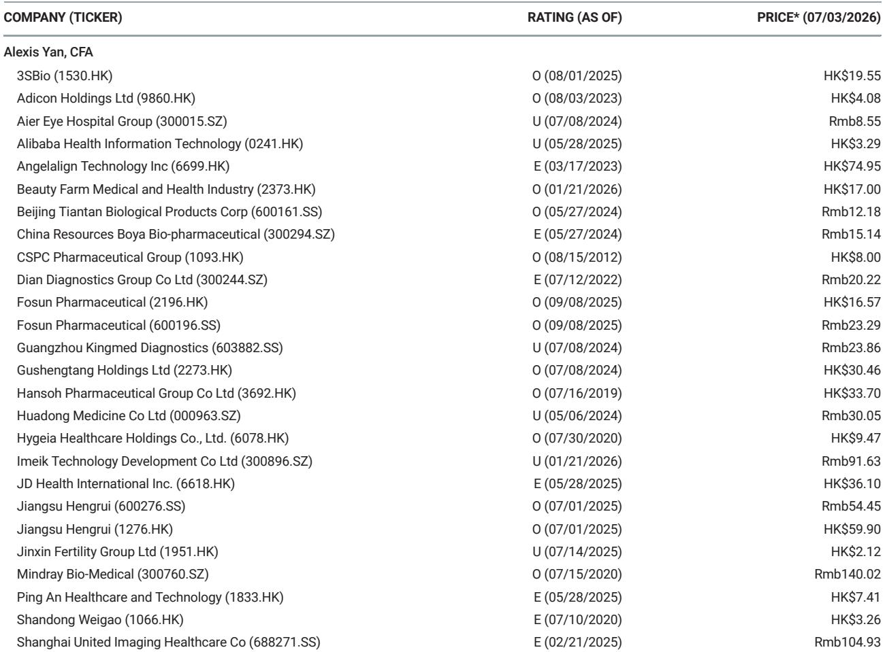
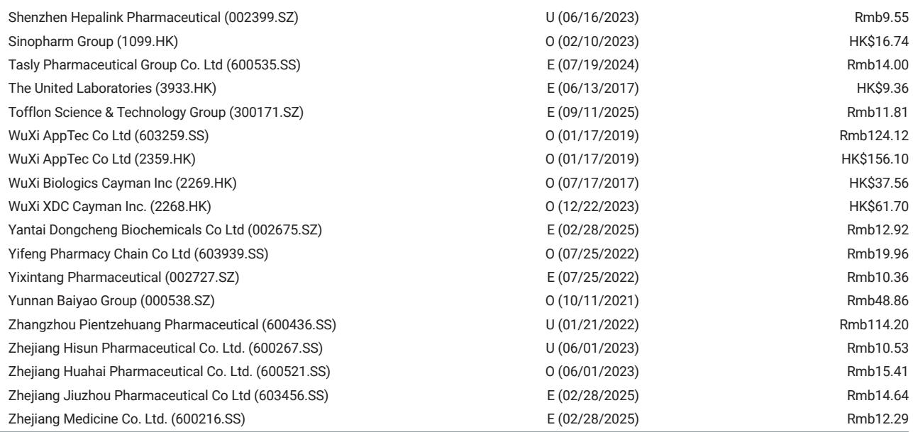
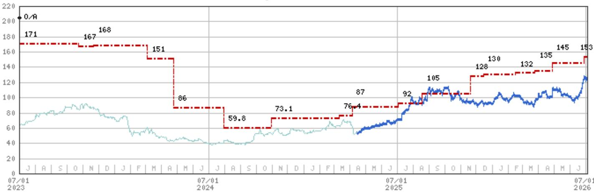

# MS：中国医药审批量变到质变，本土企业63个新药超越跨国药企

2025年，中国药监局（NMPA）批准了120个新药，首次突破三位数。这个数字本身不算意外——过去几年审批量一直在爬坡。真正值得关注的，是结构性的变化：在这120个新药中，63个来自国内企业，首次超过跨国药企的57个。

MS最新发布的研究报告用一张图表梳理了过去7年的审批趋势，并给出了一个清晰的判断：中国作为生物医药研发强国的地位正在从量变走向质变。小分子依然是主力，但本土企业的参与深度、技术覆盖的广度，以及CDMO产业链的支撑作用，都在重新定义这个市场的竞争逻辑。

> **KC评论：** 120个新药这个数字本身不是最重要的。重要的是国产占比过半——这背后是本土研发能力、监管效率、以及CXO产业链协同三个变量同时起作用。报告里有一张2019-2026年的审批趋势图，值得细看的是2025年相比2024年跳升的幅度，以及小分子与生物药的比例变化。

## 1. 小分子依然是审批主力，但生物药正在追赶

从2019年到2025年，小分子药物在获批新药中的占比始终超过60%。2025年获批的80个小分子药物，延续了这一趋势。但生物药的审批量也在加速——2025年获批40个，而2024年是37个，2023年只有26个。

这种结构在2026年上半年延续：58个获批新药中，小分子31个、生物药27个。生物药的占比正在逼近50%。MS认为，这反映了两个趋势：一是国内企业在抗体、ADC、细胞治疗等领域的研发能力正在成熟；二是监管机构对这些复杂疗法的审评经验在积累。

对行业来说，这意味着CDMO的需求结构正在变化。小分子商业化合同依然是稳定的基本盘，但生物药尤其是ADC和双抗的产能需求，正在成为新的增长引擎。

## 2. 本土企业不仅在数量上取胜，在技术上也覆盖了多个重磅领域

报告列举了几个有代表性的本土创新药：信达生物的玛仕度肽（GCG/GLP-1双靶点激动剂，用于减重和2型糖尿病）、恒瑞的HER2 ADC（用于非小细胞肺癌和HER2阳性乳腺癌）、以及恒瑞的PCSK9抑制剂（用于高胆固醇血症）。

这些品种覆盖了代谢疾病、肿瘤、心血管三个最大的治疗领域。MS的分析师特别指出，这些资产的潜力值得关注——它们面对的是全球最大的几个治疗市场，而且都是经过验证的靶点或机制。

> **KC评论：** 报告里没有展开讲的，是这些品种的竞争格局。GLP-1赛道已经非常拥挤，PCSK9也有多个玩家。真正值得关注的不是“有没有潜力”，而是这些产品能否在商业化阶段跑赢对手。报告提到了CDMO的作用，但没说的是：CDMO的产能和效率，会直接影响这些产品的上市速度和成本结构。

## 3. CDMO的角色被低估了：审批加速的底层支撑

MS在报告中明确提到，中国庞大的CDMO产业在实现技术突破方面发挥了关键作用。这一点在药明康德的分析中体现得最充分——小分子审批加速导致更多商业化合同，而MNC和biotech的外包意愿也在提升。

这不是一个孤立的判断。2025年获批的120个新药中，有相当一部分的工艺开发和规模化生产依赖CDMO。如果审批量继续增长，CDMO的产能利用率、客户粘性、以及从临床到商业化的转化率，都会成为更关键的竞争变量。

报告没有完全回答的问题是：CDMO的产能扩张速度能否跟上审批加速的节奏？以及，当本土企业成为新药主力时，他们的外包策略和MNC有什么不同？这些变量会直接影响CDMO的定价权和利润率。

## 4. 报告没有展开的追问：商业化能力才是下一道坎

审批量破百、国产占比过半，这些数据很亮眼。但一个关键问题报告没有完全展开：获批之后，这些产品能卖得好吗？

中国创新药市场的一个长期情况是“审批快、进院慢、放量难”。2025年获批的63个国产新药，最终能有多少成为年销售额10亿以上的品种？这取决于医保谈判、进院效率、医生的处方习惯，以及和跨国药企同类产品的正面竞争。

MS的报告给出了一个乐观的供给侧图景，但需求侧的情况——支付能力、患者基数、医生的接受度——同样决定这个市场的真实规模。对于产业决策者来说，与其盯着审批数字，不如关注这些新药在2026-2027年的实际销售数据。

---

For informational purposes only. Portions may be generated,translated,summarized,or edited with AI assistance based on source materials and may contain omissions or errors. Please verify independently. This is not investment,legal,tax,accounting,or other professional advice.

For informational purposes only. Portions may be generated,translated,summarized,or edited with AI assistance based on source materials and may contain omissions or errors. Please verify independently. This is not investment,legal,tax,accounting,or other professional advice.

