July 6, 2026 08:00 PM GMT

# Autos & Shared Mobility | Europe

# A Tactical View on a Sector in Transition

A series of factors has contributed to sustained relative underperformance for Auto OEMs. As market valuations decline, we believe a significant amount of negative information is already reflected in current levels. We see potential for temporary rebounds for companies that have recently issued profit warnings, such as BMW.

The automotive sector may be approaching a cyclical low point. The European auto index has notably underperformed the broader European market, as pressures have accumulated from various directions. The index is now back near the 430 level, which has served as a support area over the past decade, while earnings expectations are approaching levels not seen outside of the pandemic period.

Market valuations have fallen below net industrial cash levels. Several OEMs, including BMW, VW and Renault, now have market capitalizations below their industrial net cash, before accounting for financial services or truck assets. At the same time, dividend yields are near historical highs, and price-to-book ratios are close to historical lows. Supplier stocks have outperformed OEMs and are trading more in line with historical averages.

Potential catalysts point to tactical opportunities within a longer-term structural transition. We see several factors that could help improve sentiment in the sector, including reports of EU tariffs on Chinese PHEVs, potential adjustments to US/MX/CA tariffs, local-content rules from the EU Industrial Accelerator Act, and any signs that conditions in China are stabilizing. After a prolonged period of negative earnings revisions, we believe a stabilization in earnings expectations could be sufficient to drive a temporary rebound in the sector.

We remain selective, but see potential for tactical opportunities following profit warnings. We still see risks to FY26 guidance and do not believe the structural challenges have been resolved. However, we expect that profit warnings could mark a point where negative news is already more than reflected in current valuations. We would focus on OEMs that have lagged and have valuation support, particularly BMW, Mercedes-Benz, and Volkswagen. Key risks include the possibility that this is not yet the cyclical low point: pressure from Chinese OEMs may persist, inflation and interest rates could remain elevated, and further deterioration in free cash flow could raise questions about shareholder returns.

<table><tr><td colspan="2">MS EUROPE S.E., MADRID BRANCH+</td></tr><tr><td colspan="2">Javier Martinez de Olcoz Cerdan</td></tr><tr><td colspan="2">Equity Analyst</td></tr><tr><td>Javier.Martinez.Olcoz@morganstanley.com</td><td>+34 9141-81289</td></tr><tr><td colspan="2">MS &amp; CO. INTERNATIONAL PLC+</td></tr><tr><td colspan="2">Shaqeal A Kirunda</td></tr><tr><td colspan="2">Equity Analyst</td></tr><tr><td>Shaqeal.Kirunda@morganstanley.com</td><td>+44 20 7425-0736</td></tr><tr><td colspan="2">Matias Rodriguez Florez-Estrada</td></tr><tr><td colspan="2">Research Associate</td></tr><tr><td>Matias.Rodriguez@morganstanley.com</td><td>+44 20 7425-1091</td></tr><tr><td colspan="2">AUTOS &amp; SHARED MOBILITY</td></tr><tr><td colspan="2">Europe</td></tr><tr><td>Industry View</td><td>In-Line</td></tr></table>

Exhibit 5: Auto stocks have continued to underperform the market in 2026. SXAP is now close to 430, a level which has represented a historical support

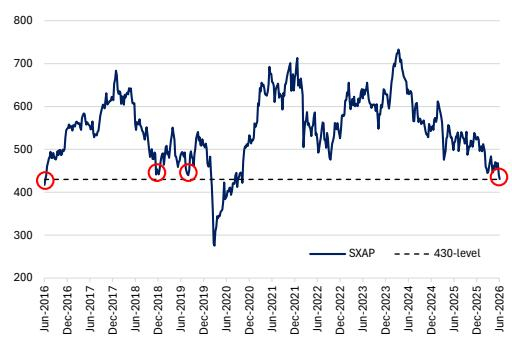  
Source: Refinitiv Eikon, MS

MS does and seeks to do business with companies covered in MS. As a result, investors should be aware that the firm may have a conflict of interest that could affect the objectivity of MS. Investors should consider MS as only a single factor in making their investment decision.

## For analyst certification and other important disclosures, refer to the Disclosure Section, located at the end of this report.

+= Analysts employed by non-U.S. affiliates are not registered with FINRA, may not be associated persons of the member and may not be subject to FINRA restrictions on communications with a subject company, public appearances and trading securities held by a research analyst account.

Exhibit 8 : BMW, MBG, VW, and Renault's market caps are particularly low compared to industrial net cash + FinCo levels  
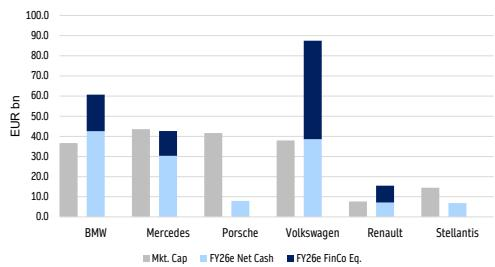  
Source: Datastream, MS estimates

Tactical upside

Tactical opportunities in a structural transition. The European auto index has notably underperformed the broader European market as pressures have mounted from macro concerns, to conditions in China, US tariff risk, Chinese OEMs entering Europe, and Middle East-related cost pressures. We still see European autos as facing structural challenges, but with the index back near the 430 support level, earnings expectations approaching decade lows (excluding the pandemic period), and several OEMs trading below industrial net cash, we think it is reasonable to consider temporary rebounds.

Focus on OEMs (BMW, Mercedes-Benz, VW) after profit warnings. A few potential positive catalysts face the sector, in the form of Chinese PHEV tariffs, lower US/MX/CA tariffs, and local content rules from the EU Industrial Accelerator Act. These predominantly benefit the OEMs, which have underperformed the market the most year-to-date, whilst suppliers and tires have outperformed. We think the opportunity now lies with OEM stocks – in particular those supported by weak performance and low valuations – pointing us to BMW, Mercedes-Benz, and VW. Critically, we still see some risk to FY26 guidances, prompting us to consider tactical opportunities after any profit warnings.

Exhibit 3: Although the auto industry faces sustained structural headwinds, we think cyclical troughs could present temporary opportunities for tactical upside  
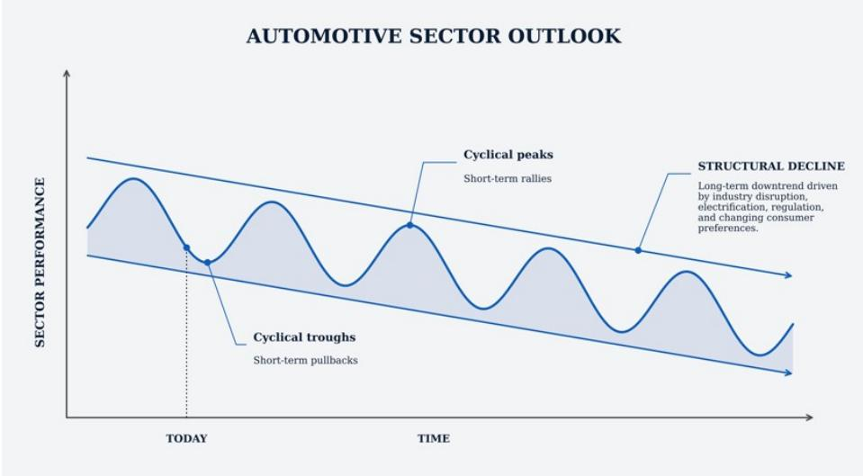  
Source: MS

## SXAP has significantly underperformed the market

SXAP has significantly underperformed the broader European market. The pressure started in 2024 with price/mix normalization on weaker consumer demand, higher financing costs, softer discretionary spending and fading confidence in the durability of auto margins. As time progressed, the debate shifted toward China, where pricing pressure, weaker mix and intensifying local competition from Chinese OEMs put sustained pressure on earnings expectations.

The next leg of underperformance came from tariff and trade uncertainty. US tariff risk created a new source of potential margin leakage, particularly for OEMs with complex North American production footprints across the US, Mexico and Canada. At the same time, the market became more concerned that Chinese OEMs would not only pressure European carmakers in China, but increasingly bring that pressure into Europe through lower-cost, aggressively-priced EVs and PHEVs.

The list of challenges has now broadened further. Tensions in the Middle East have added pressure through oil, freight and supply-chain risk, while higher inflation, higher interest rates and rising input costs have reinforced the squeeze on both demand and margins. This creates a difficult combination for autos: consumers face worsening affordability, OEMs face higher cost bases, and investors see less confidence in earnings resilience.

We think underperformance has reached a critical level. We still think European autos are structurally challenged, driven by Chinese competition and regulatory pressures, but we think the tactical question is different at this point. If the earnings outlook is now closer to a cyclical low, and if estimates stop falling rather than continue to be revised lower, then even without a strong recovery in earnings, depressed positioning, low valuations and a less negative revisions cycle could create tactical opportunities, particularly in the higher-beta OEMs that have led the decline.

Exhibit 4: The European Auto sector has materially underperformed the European stock market (100 = -1Y)  
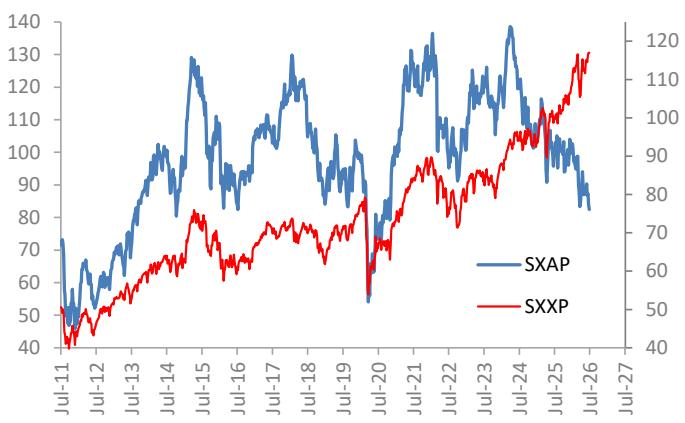  
Source: Datastream, MS

Exhibit 5: OEMs vs Suppliers: the decline has been led by OEMs, relative performance now nears the lows  
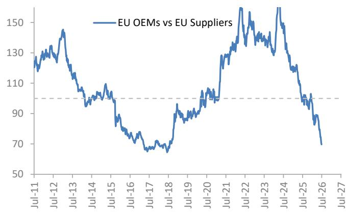  
Source: Datastream, MS

## The 430 level is a historical SXAP trough

The 430 level has acted as a support for SXAP. The automotive index is now back around the 430 level, which has acted as a natural support area for SXAP over the past decade. The sector has tested this level several times and has often found buyers around it. We think this creates an opportunity – we do not disagree that the sector is undergoing a structural transition, but we question whether the market has now priced in more negative news than is presented in current conditions. With SXAP back at this support zone, earnings expectations close to prior non-pandemic lows, and market capitalizations below industrial net cash for several companies, we expect investors to start to look for tactical opportunities.

Sector performance is tightly linked to earnings expectations. Since 2024, SXAP has continued to underperform the market, driven by falling EPS expectations. Earnings expectations now appear to be approaching the lower end of the 10-year range, excluding the pandemic trough. We think it's important to recognize this does not mean earnings need to recover sharply for the stocks to work. We think it may be enough for earnings expectations to stabilize, supported by some potential upcoming positive catalysts.

Exhibit 6: After sustained underperformance SXAP is now back near 430, the lowest level since the pandemic, and somewhat of a support level in the past 10y period  
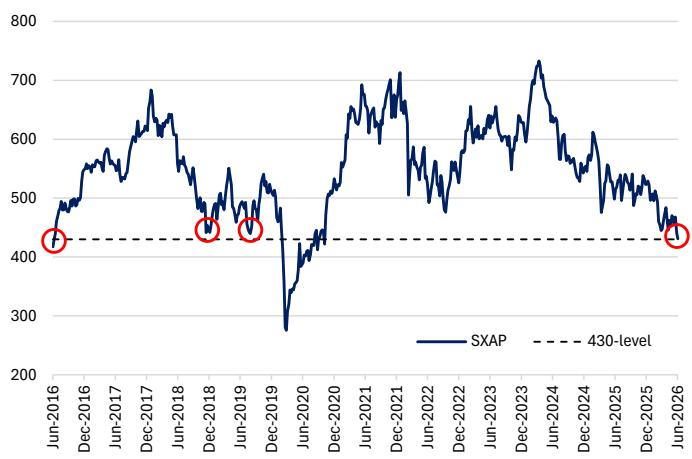  
Source: Refinitiv Eikon, MS

Exhibit 7: Auto stock performance is driven by earnings expectations – since 2024, these have continued to decline for the sector  
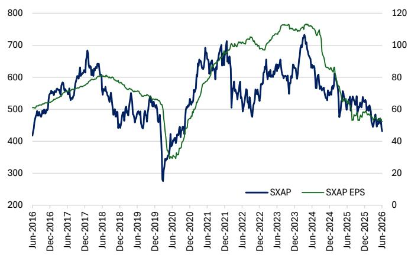  
Source: Refinitiv Eikon, MS

## Valuations approaching the lows

Valuation perspective. Several OEMs within the sector (BMW, VW and Renault) are now trading with market caps below their industrial net cash levels, before consideration of other assets such as the financial services companies and stakes in truck businesses. We would consider this to be an extreme signal: the market is effectively giving limited, or no credit for the core industrial businesses once net cash is taken into account. It suggests investors are pricing in a very depressed earnings outlook. Whilst we agree that the sector faces a structural transition, we think the decline will be gradual, and current valuations may overestimate the speed of change. Other metrics present a similar picture, with EU OEMs trading close to all-time lows on price-to-book, suggesting the market is assigning very little value to the asset base. The suppliers are not showing the same degree of valuation stress, with supplier P/B still broadly in line with historical averages. This reinforces the broader argument that the valuation opportunity sits more clearly in OEMs than suppliers, following a large relative underperformance.

Dividend yields at elevated levels. European OEM dividend yields remain high versus both suppliers and the broader European market. The sector continues to offer a material shareholder return while trading at depressed valuations. Of course, the key risk is whether dividends prove sustainable if earnings continue to fall, but if earnings expectations stabilize rather than keep declining, then the high yield becomes part of the tactical support case.

P/E is less compelling as a standalone argument. OEMs look closer to long-term average levels on P/E, but P/E can be a misleading valuation tool around cyclical peaks and troughs. At peak earnings, low P/E can be a value trap because the “E” is too high. At trough earnings, P/E can also look optically uninteresting because the “E” is depressed.

Exhibit 8: Dividend yield: OEM vs Suppliers vs European market (%)  
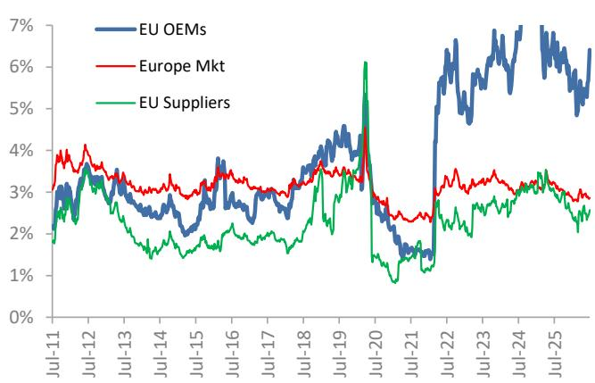  
Source: Datastream

Exhibit 9: OEMs: Ind. Net Cash/Market Cap now below 1x for BMW, VW and Renault  
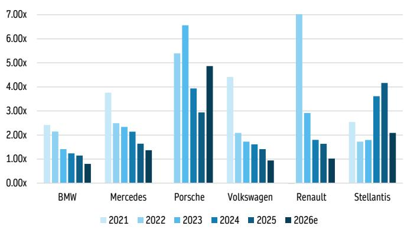  
Source: Company data, Datastream, MS estimates

Exhibit 10: European OEMs market cap / net cash ratios have been steadily declining over the years  
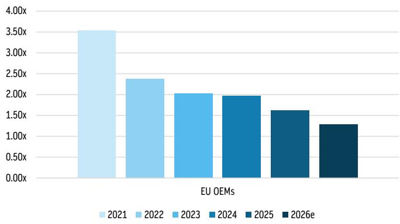  
Source: Company data, Datastream, MS estimates

Exhibit 11: BMW, MBG, VW, and Renault's market caps are particularly low compared to industrial net cash + FinCo levels  
  
Source: Datastream, MS estimates

Exhibit 12: EU OEM P/E: in line with long term averages  
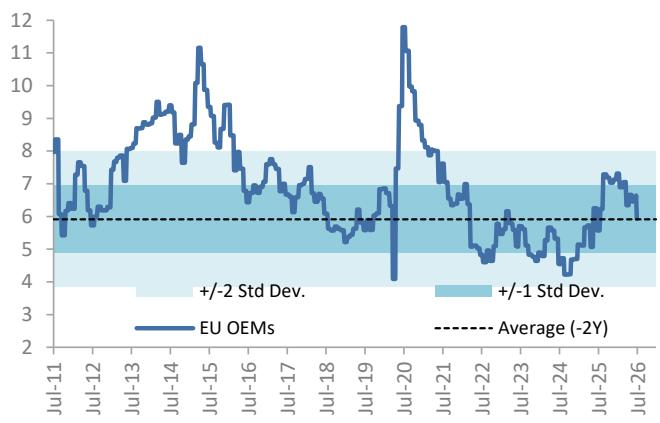  
Source: Datastream

Exhibit 13: EU Suppliers P/E: headed towards the high end of the historical range  
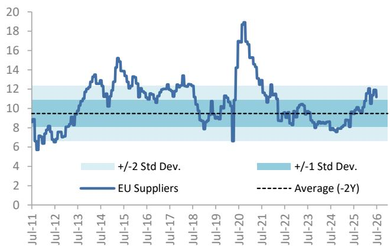  
Source: Datastream

Exhibit 14: P/BV: EU OEM valuations are at their all-time lows  
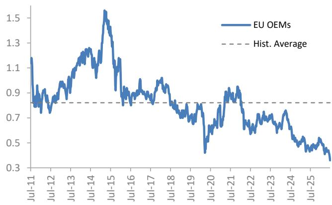  
Source: Datastream

Exhibit 15: P/BV: EU Suppliers still trading in line with historical averages...  
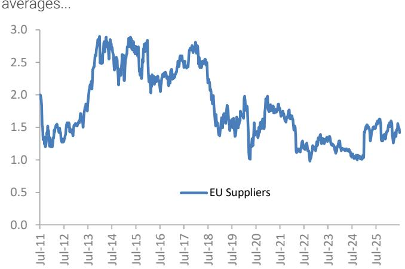  
Source: Datastream

Exhibit 16: ... following a large EU OEMs fall ...  
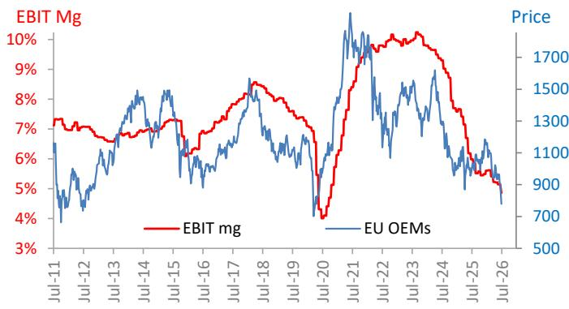  
Source: Datastream

Exhibit 17: ... and a large EU OEMs vs APs relative underperformance  
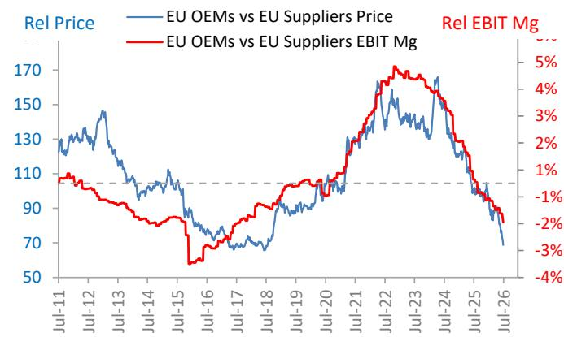  
Source: Datastream

## Potential positive catalysts

A stabilization in earnings expectations is already an improvement in sentiment. Middle East concerns, pressure from Chinese OEMs, and continued macroeconomic challenges have driven continued weakness in the auto sector. As a result, earnings expectations, the key driver of share price performance, have declined across the sector. Whilst we think the sector remains in a structural transition, we think we could be approaching a cyclical low, creating opportunity for an earnings stabilization story rather than a full upgrade cycle. After a prolonged period of negative revisions, we think the sector does not need estimates to rise sharply for the stocks to rebound. We think the market only needs to gain confidence that the moving pieces that have been driving downgrades are no longer worsening, even if that is only a temporary effect. We see several potential catalysts on the horizon that could momentarily improve the narrative in the sector, thereby driving rallies in selected names.

Exhibit 18: NTM EPS trends: mass market OEMs  
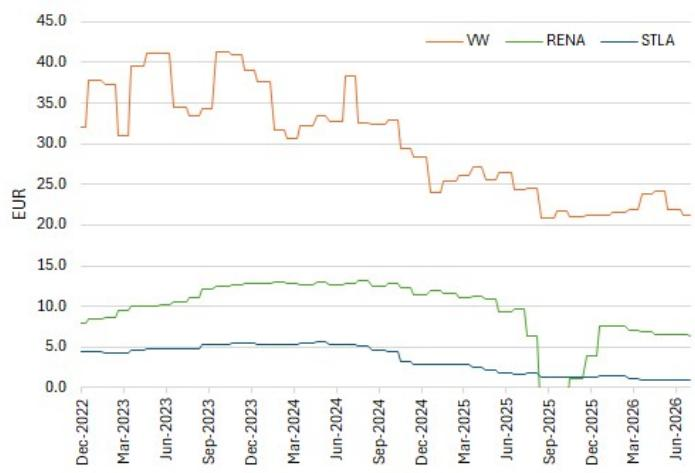  
Source: Datastream

Exhibit 19: NTM EPS trends: premium OEMs  
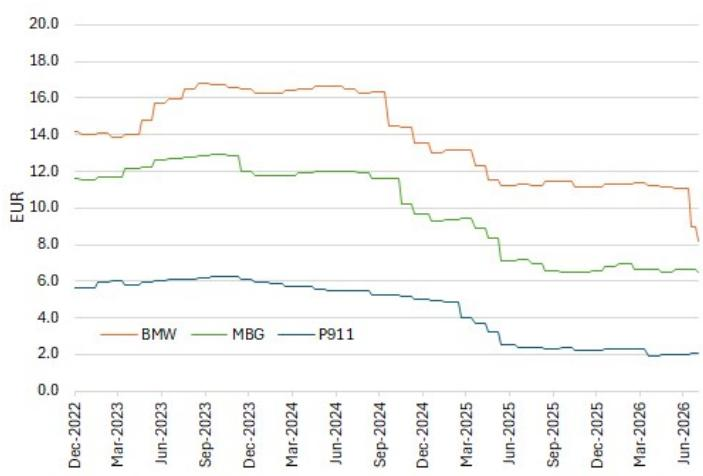  
Source: Datastream

New tariffs incoming for Chinese OEMs. The EU's existing countervailing duties already cover Chinese BEVs, with additional duties of up to $35\%$ . So far, these duties excluded PHEVs. Reuters, citing Handelsblatt, has reported that the European Commission is preparing countervailing duties on Chinese hybrid vehicles from manufacturers such as BYD, Chery and SAIC, pending member-state approval. The EC did not comment on the article. Should these tariffs go ahead, then this would reduce the competitiveness of Chinese OEMs in the PHEV segment, which is a much larger market than BEVs, and also represents a market where Chinese OEMs have rapidly taken share. The introduction of such tariffs would reduce the pricing pressure for European OEMs, supporting margins and stabilizing earnings expectations.

Reduced US/MX/CA tariffs could provide meaningful support to the sector. A softer North American tariff outcome could be a meaningful earnings improvement catalyst. US/MX/CA tariffs are now an outlier within the US auto tariff framework, as exporters such as the EU, Japan and Korea sit at 15%, and the UK has secured a 10% rate. Canada and Mexico remain exposed to a 25% auto tariff, with relief only where vehicles or parts qualify under USMCA. This creates a disproportionate earnings headwind for OEMs with integrated North American production footprints. If US/MX/CA tariffs moved closer to the 15% framework applied to most other major auto exporters, then we could see an immediate improvement in overall market sentiment.

## The EU Industrial Accelerator Act could provide a more supportive regulatory

backdrop. The IAA could help stabilize earnings expectations by shifting the policy backdrop toward active support for European production. The Commission's proposal introduces targeted "Made in EU" and low-carbon requirements for public procurement and public support schemes in strategic sectors, including cars, batteries and other net-zero technologies, with the aim of boosting demand for European-made products and reducing dependency on non-EU suppliers. For autos specifically, the relevance is that local-content rules could create a clearer demand pool for European-built EVs and European-made batteries, especially through company car tax incentives, public procurement and subsidy-linked schemes. We think the IAA implementation could reduce the risk of further downward revisions, as it would partially offset the China competitive threat by making access to subsidies dependent on European content. There are still risks around loopholes, administrative burden and final legislative design, but if the IAA creates a more durable local demand base for European xEVs, then this could support sentiment for the industry.

## Reversal of Fortunes: OEMs over Suppliers

We think OEMs could outperform Suppliers from here. We think an opportunity for a tactical rebound looks more compelling in the OEM stocks than suppliers, given valuations and the scale of OEM underperformance, with relative performance now close to historical lows. Supplier stocks have held up much better in recent years, while OEMs have absorbed the brunt of the pressure from China, weak margins, and tariff uncertainty. We think the factors most likely to drive a tactical rebound should benefit OEMs more directly: EU tariffs on Chinese PHEVs would ease the competitive pressure on European carmakers, reduced US/MX/CA tariffs would support US earnings, the EU Industrial Accelerator Act could improve unit economics, and China market stabilization would be most impactful for the names most exposed to the region. Tyres and other supplier subsegments have outperformed this year, but that now looks at risk if our view of a tactical rebound plays out. In such a scenario we would expect investors to seek higher beta, OEM exposure in favor of lower beta exposures such as Tyres. There is scope for a reversal of the fortunes where the weakest performing OEMs, especially mass market names, outperform as margin expectations stop falling and investors rotate back into cyclicality. Examining the valuation and performance trends, this highlights names such as BMW, Mercedes-Benz, and Volkswagen – post potential profit warnings.

Exhibit 20: OEMs vs Suppliers: Supplier stocks have held up better in recent years  
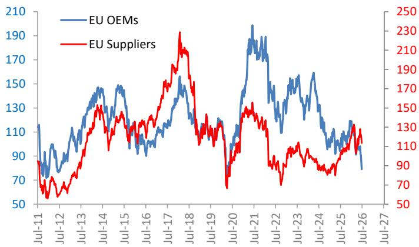  
Source: Datastream, MS

Exhibit 21: OEMs vs Suppliers: OEMs relative performance now near historical lows  
  
Source: Datastream, MS

Exhibit 22: Margin expectations are the key drivers of performance  
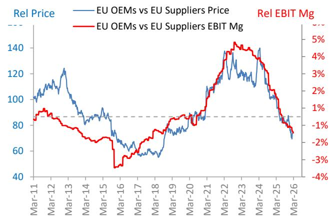  
Source: Datastream

Exhibit 23: Stellantis, Renault and Porsche underperformed in the last 2Y  
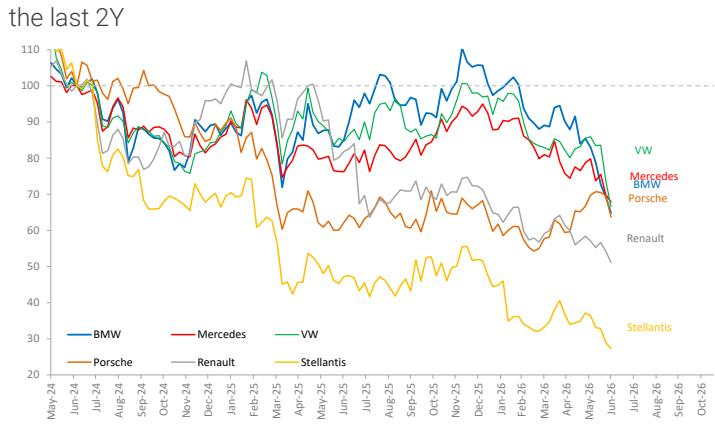  
Source: Datastream, MS

## Where could we be wrong?

Are we really at the bottom? Our tactical view hinges on a cyclical low forming within a structural transition. Timing such lows is incredibly complex, and the competitive and macro pressure facing European OEMs may prove to be more persistent than the market is currently assuming. The key risk is that Chinese OEM pressure does not abate: share losses and pricing pressure continue in China, while the next leg of pain comes from Chinese OEMs coming to Europe with lower-cost EVs and PHEVs, now armed with stronger local distribution and production. Further, whilst the outlook for economic growth remains stable, inflation expectations have increased, with interest rates subsequently likely to stay at high levels. Auto OEMs tend to struggle when inflation is sticky because higher-for-longer rates make vehicle financing more expensive, and pressure consumer demand. Finally, any deterioration in free cash flow could raise questions around shareholder returns, removing one of the key supports for the sector's investment case.

Exhibit 24: European OEMs have continued to see their market share in Europe decline – consensus, optimistically, assumes this ceases  
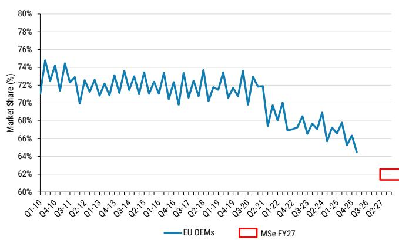  
Source: Local Auto Associations, MS estimates. Notes: 1) This chart includes Germany, UK, France, Italy and Spain auto sales. 2) This chart includes as EU OEMs: Stellantis, VW, Renault, MBG, BMW, Porsche, Iveco, Lada, Ferrari.

Exhibit 25: European OEMs have lost more share vs Chinese OEMs than any other global group. We think market share losses continue from here  
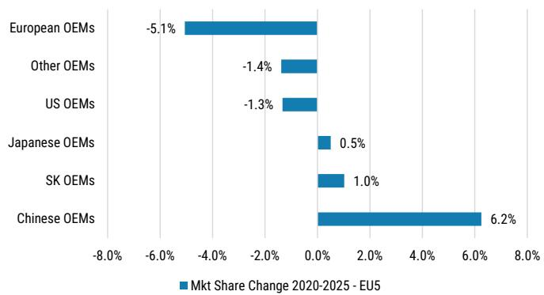  
Source: Local Autos Associations, MS

Exhibit 26: Key European market (EU5) trends and OEM exposure

<table><tr><td>EU market</td><td>Status</td><td>EU OEM Market Share (2020-25)</td><td>CRI OEM Market Share (2020-25)</td><td>Notable trend</td><td>GEM exposure</td><td>Characteristics</td></tr><tr><td rowspan="2">Norway</td><td rowspan="2"></td><td rowspan="2">12%pp decline, from 53% to 61%</td><td rowspan="2">9%pp gain, from 10% to 18%</td><td>Broad-based market share losses across European, Japanese, US, South Korean OEMs</td><td rowspan="2">All</td><td rowspan="2">Highest European JV penetration</td></tr><tr><td>European OEM share losses decelerating in recent years</td></tr><tr><td rowspan="2">Spain</td><td rowspan="2"></td><td rowspan="2">10%pp decline, from 67% to 57%</td><td rowspan="2">10%pp gain, from 2% to 11%</td><td>European OEM share losses accelerating for three consecutive years</td><td rowspan="2">Renault</td><td rowspan="2">Price-sensitive European market</td></tr><tr><td>Renault grew share during the period despite strong Chinese OEM growth</td></tr><tr><td rowspan="3">Italy</td><td rowspan="3"></td><td rowspan="3">9%pp decline, from 74% to 65%</td><td rowspan="3">9%pp gain, from 2% to 9%</td><td>Largest gain for Chinese OEMs in EUIS market with strong incumbent bonds</td><td rowspan="3">Stantonics</td><td rowspan="3">Strong incumbent bondsPolicy sensitivityStrong&amp;IC segment</td></tr><tr><td>European OEM market share losses did not appear to be decelerating</td></tr><tr><td>Chinese OEM market share approaching 20% in April, an EUIS high</td></tr><tr><td rowspan="2">UK</td><td rowspan="2"></td><td rowspan="2">6%pp decline, from 57% to 51%</td><td rowspan="2">10%pp gain, from 6% to 5%</td><td>European market share losses span across mass market and premium OEMs</td><td rowspan="2">BMW</td><td rowspan="2">Lack of targeted tariffsLack of local incumbent brands</td></tr><tr><td>Renault grew share during the period despite strong Chinese OEM growth</td></tr><tr><td rowspan="2">EUS</td><td rowspan="2"></td><td rowspan="2">5%pp decline, from 72% to 67%</td><td rowspan="2">6%pp gain, from 2% to 8%</td><td>European OEMs have consistently lost market share over the past five years</td><td rowspan="2">All</td><td rowspan="2">~47% of European volumes</td></tr><tr><td>Chinese OEMs market share gains are accelerating</td></tr><tr><td rowspan="2">France</td><td rowspan="2"></td><td rowspan="2">4%pp decline, from 60% to 76%</td><td rowspan="2">2%pp gain, from 1% to 6%</td><td>European OEM share losses decelerating in recent yearsRenault, Volkswagen grows share during the period despite strong Chinese OEM growth</td><td rowspan="2">Renault and Stantonics</td><td rowspan="2">Strong incumbent bondsPolicy sensitivityStrong&amp;IC segment</td></tr><tr><td>Japanese OEMs gaining share alongside Chinese players</td></tr><tr><td>Germany</td><td></td><td>1%pp gain, from 70% to 77%</td><td>2%pp gain, from 2% to 5%</td><td>Only market with growing share for EU OEMs, led by VolkswagenChinese OEMs continue to gain, at expense of South Korea and US players</td><td>BMW, Mercedes-Bere, Porsche, Volkswagen</td><td>Strong incumbent bondsHigh front salesStrong premium offering</td></tr></table>

Source: Local auto associations, MS

Exhibit 27: Chinese OEMs are significantly exposed to SUV sub-segments

<table><tr><td>Segment/Type</td><td>2025</td><td>% of total sales</td></tr><tr><td>C-SUV</td><td>372,096</td><td>32%</td></tr><tr><td>D-SUV</td><td>276,874</td><td>24%</td></tr><tr><td>B-SUV</td><td>200,479</td><td>17%</td></tr><tr><td>B-Hatchback</td><td>100,443</td><td>9%</td></tr><tr><td>E-SUV</td><td>53,005</td><td>5%</td></tr><tr><td>C-Hatchback</td><td>26,915</td><td>2%</td></tr><tr><td>Other</td><td>122,892</td><td>11%</td></tr></table>

Source: S&P Global, MS. Note: West and Central Europe only

## Comps

Exhibit 28: Global OEMs valuation table

<table><tr><td rowspan="2">Prices date: July 6, 2026</td><td rowspan="2">Crrc.</td><td rowspan="2">Mkt Cap US$ mn</td><td colspan="2">Price</td><td rowspan="2">MS Rating</td><td colspan="3">EPS</td><td rowspan="2">Revenue CAGR 25-27E</td><td colspan="2">EBIT margin</td><td colspan="2">EV/EBIT</td><td colspan="2">EV/EBITDA</td><td colspan="2">P/E</td><td colspan="2">Dividend Yield</td><td colspan="2">EV/Revenue</td></tr><tr><td>Last</td><td>Target</td><td>2025</td><td>2026E</td><td>2027E</td><td>2026E</td><td>2027E</td><td>2026E</td><td>2027E</td><td>2026E</td><td>2027E</td><td>2026E</td><td>2027E</td><td>2026E</td><td>2027E</td><td>2026E</td><td>2027E</td></tr><tr><td>OEMs</td><td></td><td>2,802,299</td><td></td><td></td><td></td><td></td><td></td><td></td><td>9%</td><td>6%</td><td>6%</td><td>267.6x</td><td>168.9x</td><td>56.0x</td><td>47.9x</td><td>299.4x</td><td>187.5x</td><td>3.1%</td><td>3.5%</td><td>8.8x</td><td>7.5x</td></tr><tr><td>Europe</td><td></td><td>218,010</td><td></td><td></td><td></td><td></td><td></td><td></td><td>0%</td><td>5%</td><td>6%</td><td>8.7x</td><td>6.5x</td><td>3.0x</td><td>2.9x</td><td>11.4x</td><td>13.2x</td><td>5.3%</td><td>5.8%</td><td>0.5x</td><td>0.5x</td></tr><tr><td>BMW</td><td>EUR</td><td>45,631</td><td>60.6</td><td>91.0</td><td>OW</td><td>12.4</td><td>9.5</td><td>10.9</td><td>1%</td><td>6%</td><td>7%</td><td>1.8x</td><td>1.7x</td><td>0.9x</td><td>0.9x</td><td>7.0x</td><td>6.2x</td><td>5.7%</td><td>6.6%</td><td>0.1x</td><td>0.1x</td></tr><tr><td>Mercedes</td><td>EUR</td><td>49,557</td><td>45.2</td><td>65.0</td><td>OW</td><td>5.3</td><td>5.8</td><td>7.4</td><td>2%</td><td>6%</td><td>7%</td><td>2.7x</td><td>2.3x</td><td>1.4x</td><td>1.3x</td><td>7.9x</td><td>6.3x</td><td>7.7%</td><td>8.1%</td><td>0.2x</td><td>0.2x</td></tr><tr><td>Stellantis</td><td>EUR</td><td>16,322</td><td>4.9</td><td>7.1</td><td>EW</td><td>(7.7)</td><td>(0.5)</td><td>0.1</td><td>2%</td><td>1%</td><td>2%</td><td>17.9x</td><td>7.8x</td><td>3.2x</td><td>2.5x</td><td>n.m.</td><td>60.9x</td><td>0.0%</td><td>0.6%</td><td>0.2x</td><td>0.2x</td></tr><tr><td>Renault</td><td>EUR</td><td>8,746</td><td>26.4</td><td>29.0</td><td>UW</td><td>(40.0)</td><td>6.0</td><td>6.0</td><td>0%</td><td>4%</td><td>4%</td><td>1.1x</td><td>1.1x</td><td>0.4x</td><td>0.5x</td><td>4.6x</td><td>4.6x</td><td>6.1%</td><td>7.3%</td><td>0.0x</td><td>0.0x</td></tr><tr><td>Volkswagen</td><td>EUR</td><td>42,825</td><td>74.7</td><td>100.0</td><td>EW</td><td>13.3</td><td>19.2</td><td>22.1</td><td>1%</td><td>4%</td><td>5%</td><td>n.m.</td><td>n.m.</td><td>n.m.</td><td>n.m.</td><td>3.9x</td><td>3.4x</td><td>8.2%</td><td>9.4%</td><td>n.m.</td><td>n.m.</td></tr><tr><td>Porsche</td><td>EUR</td><td>47,682</td><td>46.0</td><td>42.0</td><td>UW</td><td>0.5</td><td>1.7</td><td>2.1</td><td>-2%</td><td>7%</td><td>8%</td><td>20.2x</td><td>16.6x</td><td>7.3x</td><td>7.3x</td><td>27.5x</td><td>22.3x</td><td>2.2%</td><td>1.8%</td><td>1.
