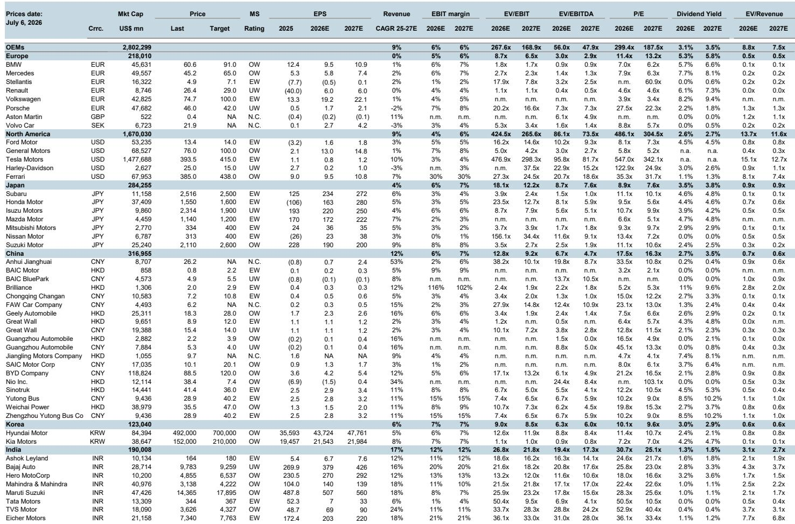
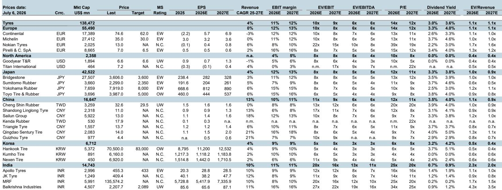
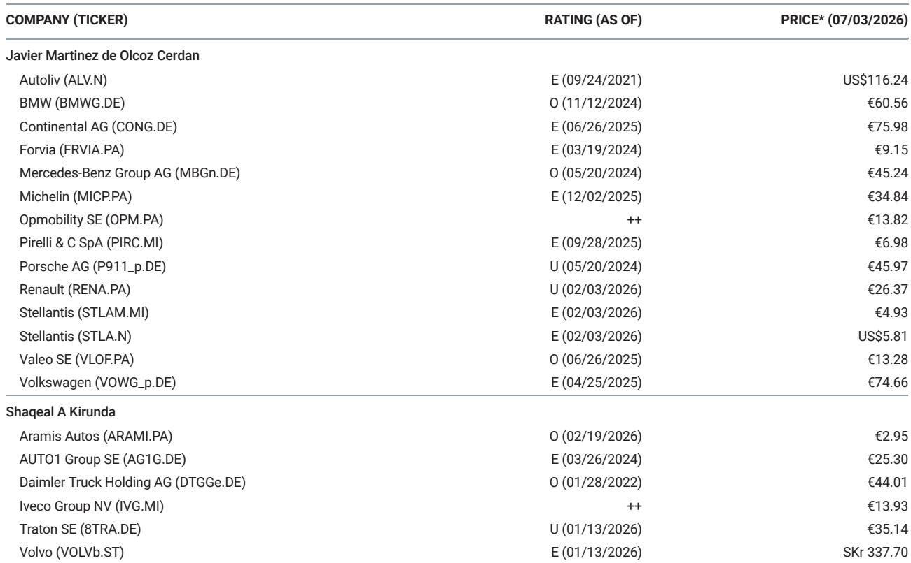

# 欧洲汽车行业或接近周期性底部，部分已充分反映负面预期的整车企业存在战术性机会

欧洲汽车板块在过去两年多的时间里持续面临多重挑战。来自中国市场的需求变化、美国关税政策的不确定性、中国整车企业进入欧洲市场、中东地区相关因素带来的成本波动，以及持续较高的利率环境，共同导致该板块表现相对落后。SXAP指数已回落至接近430点水平，这一区间在过去十年中曾多次形成自然支撑。盈利预期正接近非疫情时期的低点。多家主要整车企业的市值已低于其工业净现金水平，这意味着市场对其核心制造业务的估值实际上已降至负值。

这并非认为欧洲汽车行业面临的结构性挑战已经解决。事实上，这些挑战依然存在。中国企业的竞争将持续加剧，监管压力不会减轻，电动化转型仍充满不确定性。但市场目前可能已经反映了比当前基本面所证实的更多的负面信息。在经历了长时间的盈利预期下调后，预期的企稳本身可能就足以推动一次战术性反弹，尤其是在那些领跌的高贝塔整车企业股票中。

逻辑很简单：当估值达到极端水平时，即使叙事出现温和改善，也可能产生超额的回报。问题在于，读者是否有信心在整体叙事仍偏负面时采取行动，还是等待确认底部已经过去。历史经验表明，等待确认往往意味着错过行情。

## 市值低于工业净现金，表明市场定价可能过于悲观

该板块最引人注目的估值信号是市值与工业净现金之间的关系。对于宝马、大众和雷诺而言，其当前市值已低于各自的工业净现金头寸，这还未考虑其金融服务资产或卡车业务的价值。这意味着，以当前价格买入这些公司的读者，实际上相当于免费获得了金融服务部门及其他资产，而工业运营部分则被赋予了负估值。

这是一个极端的信号。它表明市场不仅是在定价一个周期性下行，而是在定价一个结构性崩溃，即工业业务将完全不产生任何价值。尽管该行业确实面临严峻挑战，但下行过程更可能是渐进的，而非灾难性的。欧洲整车企业拥有可观的品牌价值、成熟的经销商网络以及随时间调整产品组合的能力。市场当前定价所隐含的下行速度，与汽车行业实际变化缓慢的底层现实并不一致。

相应地，股息回报表现已接近历史高位。对于相信股息能够维持的读者而言，当前的回报表现水平为股价提供了一个有意义的底部支撑。当然，风险在于盈利持续恶化可能迫使公司削减股息。但如果盈利能够企稳而非继续下滑，那么高股息率将成为有力的支撑机制，而非价值陷阱。

欧洲整车企业的市净率处于历史低位。相比之下，零部件供应商在该指标上的交易价格更接近其历史平均水平。这种分化进一步强化了以下观点：在经历了极端的相对表现落后之后，估值机会更明显地存在于整车企业而非零部件供应商中。

## 430点支撑位已维持十年，盈利预期正接近底部

SXAP指数在过去十年中多次测试430点水平，并始终在该阈值附近找到买家。这并不能保证该水平将再次提供支撑，但它为思考风险回报提供了一个有用的参考点。当一个指数回到历史支撑区域，同时盈利预期接近周期性底部时，出现战术性反弹的概率会显著增加。

该板块的盈利预期自2024年以来持续下滑。模式很清晰：随着不利因素清单的扩大，每个季度都会带来新的下调。但下调的速度现在可能正在放缓，原因很简单：进一步下调的空间已经不大。盈利预期正接近十年区间的下端（不包括疫情时期的低谷）。这为预期企稳的故事创造了条件，即使全面复苏仍遥遥无期。

关键是要理解，该板块并不需要盈利大幅上升才能推动股价反弹。在经历了长时间的负面修正之后，市场只需要获得信心，认为导致下调的因素不再恶化。预期的企稳，即使是在低迷的水平上，也足以触发一次战术性反弹，尤其是在持仓较轻且估值极端的情况下。

## 多个潜在催化剂可能改善市场叙事，即使不解决结构性问题

报告指出了几个可能改善市场情绪的潜在催化剂，即使它们不能解决根本的结构性挑战。这些催化剂值得理解，因为它们可能为战术性反弹提供触发因素，但同时也引发了关于可持续性的重要问题。

第一个催化剂是欧盟可能对中国插电式混合动力汽车征收新关税。欧盟已对中国纯电动汽车征收反补贴税，但迄今为止这些关税并未涵盖插电式混合动力汽车。有报道称，欧盟委员会正准备将这些关税扩大到中国混合动力汽车，这将是一个更重要的举措，因为插电式混合动力汽车细分市场规模远大于纯电动汽车，并且一直是中国企业市场份额增长的关键领域。如果这些关税得以实施，将减轻欧洲整车企业的定价压力并支撑利润率。但问题在于，这是否代表着竞争格局的真正改变，抑或仅仅是一次暂时的喘息。

第二个催化剂是美国可能降低对墨西哥和加拿大产汽车的关税。当前的美国关税政策对拥有北美一体化生产布局的整车企业造成了不成比例的压力。加拿Daiwa墨西哥面临25%的汽车关税，只有在车辆或零部件符合《美墨加协定》条件时才能获得减免。如果这些关税能够降低，与其他主要出口国适用的15%框架更为接近，将为盈利提供有意义的支撑。但这仍不确定，结果取决于本质上不可预测的政治谈判。

第三个催化剂是欧盟工业加速法案，该法案可能在包括汽车在内的战略领域，为公共采购和补贴计划引入本地化含量要求。这将为欧洲生产创造一个更有利的监管环境，可能部分抵消来自中国整车企业的竞争压力。实施细节仍在最终确定中，存在关于漏洞和行政负担的风险，但政策方向对欧洲整车企业是有利的。

## 整车企业比零部件供应商更适合战术性反弹，但进一步发布盈利预警的风险依然存在

报告明确区分了整车企业和零部件供应商。零部件供应商的股票在行业下行期间表现优于整车企业，其交易价格更接近历史估值均值。相比之下，整车企业领跌，目前估值处于极端水平。这意味着整车企业出现战术性反弹的潜力要大得多，尤其是那些已经发布过盈利预警的公司。

逻辑在于，盈利预警标志着坏消息已被股价充分甚至过度反映的时点。预警之后，市场已经下调了预期，进一步出现负面意外的风险降低。这为战术性买家创造了更有利的风险回报，即使根本挑战依然存在。

报告指出，宝马、梅赛德斯-奔驰和大众是采用此方法最值得关注的公司。这三家公司的估值都反映了极度的悲观情绪，并且都显著受益于上述讨论的催化剂。但报告也承认，整个行业2026财年的指引仍存在风险，这意味着进一步发布盈利预警是可能的。建议是在预警之后成为战术性买家，而非之前。

这为读者提出了一个重要问题：如何区分标志着底部到来的盈利预警和预示着进一步恶化的盈利预警？答案并不简单，报告也没有提供机械的规则。这种区分需要对预警的具体驱动因素以及这些因素是否可能持续或减弱做出判断。

## 报告未完全解答的问题：如何区分周期性底部与结构性价值陷阱

报告提出了令人信服的观点，认为欧洲汽车行业正接近周期性底部，但也承认结构性挑战不会消失。这造成了一个根本性的紧张关系。读者如何区分一个提供有吸引力风险回报的真正周期性底部，与一个低估值仅仅反映永久性受损盈利能力的结构性价值陷阱？

报告没有完全解答这个问题，这也有其合理原因。答案取决于本质上不确定的因素：中国整车企业进入欧洲市场的速度、贸易政策的走向、电动化转型的速度，以及欧洲整车企业调整其成本结构和产品组合的能力。这些问题无法精确回答，但它们将决定当前的机会是一次战术性交易，还是更长期复苏的开始。

读者在评估时应考虑几个因素。首先，估值压力的程度从历史标准来看确实极端。市值低于工业净现金的情况很少见，通常只发生在存在性危机时期。其次，报告中确定的催化剂是真实的，即使其影响不确定。第三，经过多年的表现落后，该板块的持仓可能非常轻，这意味着任何正面惊喜都可能产生超乎寻常的波动。

但风险同样真实。中国整车企业的压力可能加剧而非减弱。关税结果可能比预期更差。盈利可能继续恶化，迫使削减股息，从而削弱估值支撑。关键在于认识到，这是在结构性下行中的一次战术性机会，而非认为结构性问题已经解决。

## 欧洲汽车行业战术性布局的决策框架

对于考虑战术性布局欧洲汽车行业的读者，以下框架可能有所帮助。它不是一个机械系统，而是一组应指导决策的问题。

首先，评估催化剂的时间线。报告中确定的潜在催化剂并非都具有同等可能性或同等影响力。欧盟对中国插电式混合动力汽车的关税可能是最接近的催化剂，而欧盟工业加速法案则更偏中期。读者应优先选择那些最有可能在近期实现的催化剂中受益最大的公司。

其次，关注估值支撑。最引人注目的机会存在于市值低于工业净现金的整车企业，因为这提供了一个独立于盈利的底部支撑。宝马、梅赛德斯-奔驰和大众都符合这一标准。读者应警惕估值支撑不那么明确的公司，因为如果催化剂未能实现，这些公司提供的下行保护较少。

第三，管理仓位规模。这是一次战术性交易，而非结构性信念。欧洲汽车行业面临的结构性挑战是真实的，需要数年时间才能解决。仓位规模应反映机会的战术性质，并设定明确的退出条件。

第四，监控盈利修正周期。战术性反弹的关键变量不是盈利的相对水平，而是修正的方向。只要盈利预期继续下降，该板块就会面临压力。机会出现在预期企稳时，即使是在低迷的水平上。读者应密切关注修正周期，并准备在下调速度放缓时采取行动。

第五，为波动做好准备。困境行业的战术性交易本质上具有高波动性。催化剂可能不会按预期时间表出现，或者可能弱于预期。结构性挑战可能随时重新显现。读者需要具备在波动中坚持的信心，以及在逻辑被打破时退出的纪律。

## 加入社区阅读完整报告并查看原始图表

以上分析基于一份详细的研究报告，其中包含关于估值指标、盈利修正和催化剂情景的广泛数据。原始报告包含说明历史支撑水平、市值与净现金关系以及整车企业与零部件供应商估值分化的图表。这些图表对于理解机会的规模和所涉及的风险至关重要。

要获取完整报告和原始图表，请加入我们的社区，这里汇聚了依赖机构级研究来指导决策的严肃研究者。该社区提供原始研究、交互式数据工具，以及与正在思考同样问题的其他专业人士的讨论。

欧洲汽车行业代表了当前市场中一个非常有趣的战术性机会，但并非没有风险。完整报告提供了做出明智决策所需的细节和细微差别。加入我们以获取完整图景。

*仅供参考。部分内容可能基于源材料通过人工智能辅助生成、翻译、总结或编辑，可能存在遗漏或错误。请独立核实。这不构成任何专业建议。*

仅供参考。部分内容可能基于源材料通过人工智能辅助生成、翻译、总结或编辑，可能存在遗漏或错误。请独立核实。这不构成任何专业建议。

