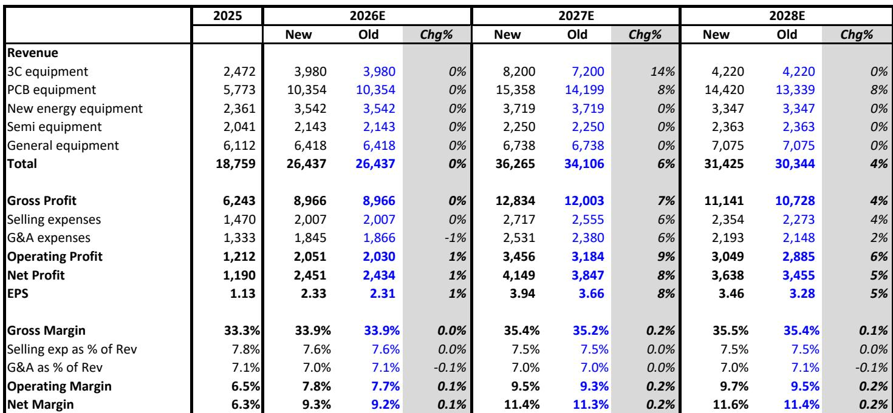
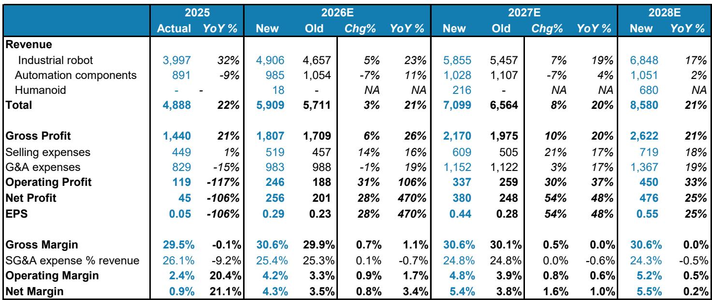
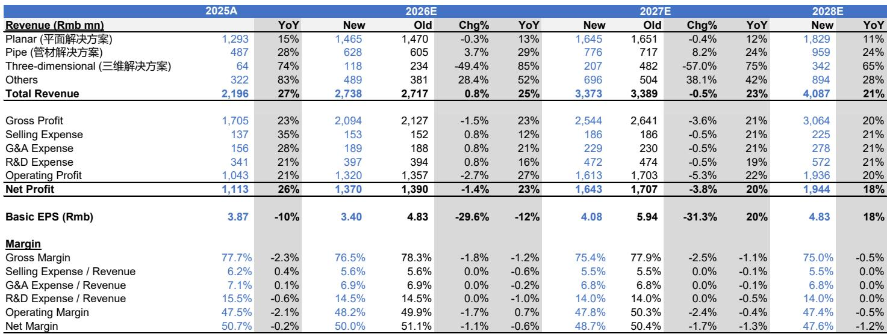

# 中国工业板块进入精选个股阶段：行业整体配置已非最优策略

过去两年推动中国工业板块扩张的资本支出周期并未消退。事实上，其背后的结构性驱动力正在增强。AI基础设施投入的轨迹预计将持续至2027年。人形机器人正从原型阶段迈向早期量产。自动化、工程机械乃至电池设备领域，订单情况均显示出需求的持续性。然而，市场已对此前的乐观预期进行了充分定价。在2026年上半年工业板块表现分化之后，观察者面临的问题不再是资本支出周期是否真实存在，而是哪些公司能够将这一周期转化为超出预期的盈利增长，哪些公司仅仅是随波逐流，在下一次轮动来临时可能面临估值过高的风险。

当前环境下的风险在于，假设强劲的宏观背景会转化为一致的回报。事实并非如此。我们参考的研究报告清晰地指出了这一区别。资本支出前景总体强劲，但个股选择必须具有选择性。这是本文的核心论点。将整个工业板块视为单一交易的观察者，可能持有盈利增长有限、资本回报率低且缺乏催化因素的公司。而那些基于盈利能力、估值和特定子主题敞口进行区分的观察者，则有望捕捉到周期的下一阶段。这两种结果之间的差异不容小觑。

要理解为何现在选择性如此重要，我们需要审视是什么在驱动资本支出周期，以及它在何处创造了真实的盈利动力，又在何处制造了噪音。该报告确定了四大主题：AI基础设施、人形机器人商业化、不断扩大的自动化和设备更新周期，以及出口优势。每个主题都有明确的领先者和落后者。关键在于识别出谁是谁。

## AI基础设施并非单一交易，而是一场“卖铲子”的游戏，最佳敞口来自电力设备和精密制造

全球AI资本支出周期在结构上保持完整，报告预计其将持续至2027年。快速的技术迭代和产能扩张正在加速，为AI所需的设备创造了强劲需求。但参与这一领域的方式并非通过超大规模企业本身或芯片设计公司，而是通过那些提供发电、冷却和制造设备的公司，它们是AI淘金热中的“卖铲人”。

这一类别中最引人注目的例子是与AI数据中心相关的发电机组业务。报告重点提到一家公司，其来自AI数据中心发电机的净利润预计在2026年同比增长约360%，2027年增长160%，分别贡献当年总净利润的21%和40%。这并非增量增长，而是变革性的。其估值在2026年和2027年预期市盈率分别为20倍和15倍，仍具吸引力。这才是值得关注的敞口：一家公司中，AI需求并非附属故事，而是主导盈利驱动力，且市场尚未完全为其发展轨迹定价。

此处的第二个关键受益者是一家激光设备制造商，它受益于AI驱动的PCB投资和产品组合的改善。随着AI服务器需要更先进的印刷电路板，生产这些电路板的制造设备变得更加专业化和高价值。这不是大宗商品交易，而是AI供应链内部的技术升级周期。

这里的战略洞察是，AI基础设施投资仍处于早期到中期阶段。报告认为该周期将持续至2027年，这表明最佳机会在于那些AI敞口仍在加速而非见顶的公司。观察者需要思考的问题是，他们能否识别出哪些公司对周期下一阶段（可能涉及更高功率计算和更先进制造要求）具有最大的杠杆效应。

## 人形机器人从炒作走向早期商业化，但估值分化意味着仅有少数公司值得溢价

人形机器人一直是激烈讨论的主题，但报告提出了一个基于事实的观点：商业化正在加速。对中国2026年人形机器人出货量的预测已上调至5万台，2027年10万台，到2030年达到44.6万台。这是一个值得关注的复合年增长率。更重要的是，报告预计全尺寸操作型机器人的渗透率将快速提升，催化剂包括主要产品发布和中国人形机器人公司的潜在IPO。

该主题下的关键标的是精密驱动部件制造商，预计人形机器人业务将在2026年贡献其总收入的35%，2027年达到50%。这是业务结构的巨大转变。该领域的其他公司包括精密减速器制造商和液压部件公司，后者同时受益于工程机械复苏和人形机器人部件需求。

人形机器人领域的挑战在于估值。那些最纯粹参与该主题的公司，其交易倍数假设了商业化的顺利和快速推进。如果生产规模扩张出现延迟，或者成本曲线下降速度不及预期，下行风险可能很大。报告的方法是偏好那些将人形机器人敞口与其他增长动力相结合的公司，例如同样受益于工程机械复苏的液压公司。这种多元化提供了纯人形机器人公司所缺乏的安全边际。

报告未完全解答的一个开放问题是，人形机器人供应链将多快实现商品化。如果多个部件供应商能生产质量相似的零件，定价权将迅速削弱。赢家将是那些拥有专有技术或独特制造能力、能形成进入壁垒的公司。报告对拥有合资企业和长期竞争优势公司的偏好表明，分析人士正在沿着这些思路思考，但供应链结构的全部影响值得进一步探讨。

## 更广泛的资本支出周期真实存在，但它青睐那些实现产品组合改善和新终端市场扩张的公司，而不仅仅是销量增长

除了AI和人形机器人，报告还指出了自动化、工程机械和电池设备领域不断扩大的资本支出周期。这一点很重要，因为它意味着机会不仅限于最受关注的主题。预计2026年工业机器人出货量将同比增长18%。自动化行业销售额应增长5%，且势头将持续至2027年。工程机械正受益于替换需求和海外市场份额上升而复苏。

电池设备板块因近期对产能扩张收紧和储能需求的担忧而有所回调，但报告预计替换需求、可再生能源转型和新技术将支撑设备需求维持在高位。这是一个细致的观点。它承认了近期的不利因素，但看到了应能防止急剧下滑的结构性支撑。

该主题下的标的选择说明了选择性原则。一家公司受益于强劲的订单势头和电动汽车架构的转变，这应会推动其产品在2027年的需求。其估值具有吸引力，预期市盈率为28倍和22倍。另一家公司受益于制造业资本支出复苏、结构性激光渗透和新产品扩张。一家电池设备公司因其技术领先地位、全球客户基础以及向新设备类别的扩张而仍受青睐。

这些选择的模式很清晰：赢家不仅仅是暴露于增长终端市场的公司。它们是拥有特定产品或技术优势、正在向新市场扩张、或受益于其终端市场结构性转变的公司。仅靠销量增长是不够的。观察者需要看到产品组合改善、利润率扩张或尚未完全反映在一致预期中的新收入来源。

## 出口优势是已被定价的顺风车，但工程机械仍有空间

出口主题是报告中最直接的主题之一，但也最有可能被完全定价。对于重型卡车，报告将2026年预测上调至127万辆，同比增长11%，其中包括40万辆出口，增长22%。然而，报告也指出，预计2027年将在高基数上基本持平或略有上升，这阻止了对相关公司的评级上调。这是一个关键的细微差别。重型卡车的出口繁荣可能在增长率上已经见顶，相关公司股价的上行空间可能有限。

工程机械则是另一番景象。报告将2026年中国挖掘机销量预测上调至同比增长21%，反映了替换需求和海外份额上升，这一趋势应会持续至2027年和2028年。该领域受青睐的公司将国内复苏与有韧性的海外增长相结合。这种双重敞口提供了比纯出口主题更持久的增长轨迹。

观察者面临的战略问题是，出口主题是否已变得过于一致。如果每个人都预期强劲的出口增长，那么它已经被定价。报告对重型卡车的谨慎态度表明，分析人士认识到了这一风险。机会可能在于工程机械，其增长前景更为长远且理解程度较低。

## 报告未完全解答的问题：当资本支出周期见顶时如何估值，以及哪些子主题能在放缓中幸存

每份研究报告都有其局限性，这份也不例外。报告坚定地聚焦于当前的上升周期及其近期轨迹。它没有花太多时间讨论周期转向时会发生什么。AI基础设施支出最终将趋于平稳。人形机器人将达到一个点，即低垂的果实已被摘取。工程机械的替换需求将正常化。观察者应该问的问题是，到那时，哪些公司将建立起持久的竞争优势，哪些公司将面临产能过剩和利润率下降。

报告的估值分析显示，大多数板块的交易价格高于其历史五年平均市盈率。这反映了对持续工业升级、全球化和AI顺风车的预期。但这也意味着容错空间有限。如果这些主题中的任何一个令人失望，下行风险可能很大。报告没有提供一个详细的框架来在不同情景下对这些估值进行压力测试。

另一个值得更多探讨的领域是人形机器人供应链内的竞争动态。报告将部件制造商视为参与人形机器人领域的首选方式，但并未完全解决商品化的风险。如果多家中国制造商能够为人形机器人生产精密减速器或液压部件，定价权将被削弱。赢家将是那些拥有难以复制的专有技术或规模优势的公司。报告通过其对拥有合资企业和长期竞争定位公司的偏好暗示了这一点，但供应链结构的全部影响值得进一步分析。

## 观察者的决策框架：如何根据风险承受能力和时间跨度在四大主题间配置资源

对于希望根据报告见解采取行动的观察者来说，一个结构化的决策框架至关重要。这四个主题具有不同的风险特征、时间跨度和估值特点。配置应反映观察者的具体约束。

对于AI基础设施主题，关键决策是专注于电力设备还是制造设备。电力设备的优势在于直接与AI建设中最显眼、增长最快的部分相关联。盈利增长显著，估值仍然合理。制造设备则更依赖于AI内部的技术升级周期，这可能更具波动性。对于风险承受能力较高、时间跨度为两到三年的观察者来说，电力设备是明确的选择。

对于人形机器人，决策在于纯度与多元化。纯部件制造商在商业化加速时提供最高的上行空间，但它们也承载着最高的估值倍数和最大的执行风险。同时涉足人形机器人和其他终端市场的公司提供了更平衡的风险回报特征。对于看好机器人但希望限制下行风险的观察者来说，多元化的公司更为合适。

对于更广泛的资本支出周期，决策在于终端市场敞口。自动化和工程机械提供了更高的可见性和更低的估值倍数，而电池设备则面临近期不利因素。报告对产品组合改善和新市场扩张公司的偏好表明，观察者应优先考虑质量而非数量。仅靠销量增长是不够的。

对于出口主题，决策在于时机。重型卡车的增长率可能已经见顶，而工程机械仍有空间。较晚参与出口主题的观察者应关注工程机械，其增长前景更为长远。

贯穿四大主题的共同主线是，选择性比以往任何时候都更重要。资本支出周期强劲，但市场已经认识到这一点。下一阶段的回报将来自识别那些能够超出预期的公司，而不是购买整个板块。

## 完整报告包含使这些区别可见的图表和数据

本文的分析基于一份详细报告，该报告包含跨多个子行业的估值比较、盈利增长预测和历史表现数据。原始报告中的图表显示了每个板块在周期中的位置、每股盈利增长轨迹的差异，以及估值倍数与历史平均值的比较。这些并非抽象观察，而是报告所倡导的精选个股方法的基础。

加入社区阅读完整报告并查看原始图表。

*仅供参考。部分内容可能基于源材料通过AI辅助生成、翻译、总结或编辑，可能存在遗漏或错误。请独立核实。本文不构成专业建议。*

仅供参考。部分内容可能基于源材料通过AI辅助生成、翻译、总结或编辑，可能存在遗漏或错误。请独立核实。本文不构成专业建议。

