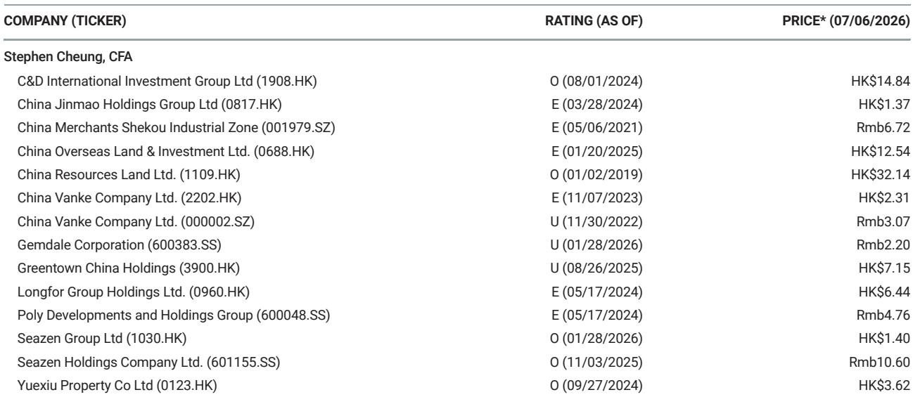
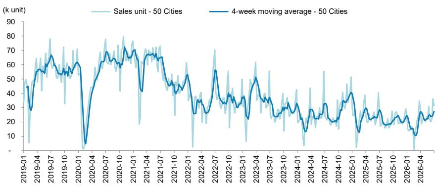

# 中国房地产市场并非均匀复苏——而是正在分化为两种截然不同的格局

从中国房地产市场最新周度数据中得出的最重要结论，并非销售有所改善。而是这种改善揭示了新房与二手房市场之间、一线与二线城市之间的结构性分化，这需要一种根本不同的研究框架。截至7月5日当周，50城新房登记单位销售同比增长22%，较前一周-11%的跌幅出现明显逆转。10城二手房销售同比增长4%，增幅较为温和，前一周为-1%。表面上看，这似乎是市场在企稳。但在这些汇总数字之下，隐藏着一种与全面反弹叙事相悖的模式。一线城市新房销售同比下降6%，而二线城市新房销售增长29%。与此同时，一线城市二手房销售增长14%，而二线城市二手房销售下降3%。报告观点——去化率（衡量新推单位被吸收速度的指标）从上周的53%跃升至68%，但一线城市达到90%，二线城市为68%。市场并非在愈合，而是在分裂。

这种分化之所以重要，是因为它表明近几个月的政策刺激正在产生不对称效应。一线城市的买家正倾向于二手房市场，那里的库存更具议价空间，价格调整也更明显。在二线城市，新房市场正在吸收需求，这很可能是由开发商降价和政府支持的库存收购推动的。其含义很明确：相同的宏观环境正在根据城市层级和交易渠道产生相反的微观动态。将中国房地产视为单一资产类别的观察者正在误读信号。数据需要一个更精细的框架——一个能够区分需求真实的城市与需求受补贴的城市，以及区分流动性正在改善的市场与仅处于稳定状态的市场。

报告观点去化率为68%，虽然令人鼓舞，但掩盖了一个关键细节。在一线城市，90%的去化率意味着新房市场基本上清空了所有新增供应。在二线城市，68%意味着超过三分之一的新单位仍未售出。90%与68%之间的差距并非四舍五入的误差——而是卖方市场与买方市场之间的差异。六城二手房挂牌价跟踪指数从前一周的17.0%降至16.7%，表明价格发现仍在进行中。一线城市房产中介指数从51.6升至54.7，表明中介情绪有所改善，但这只是一个狭窄的信号。它告诉我们，最接近交易的从业者不那么悲观了，而非周期已经逆转。

报告没有完全回答——也是每位严肃研究者必须考虑的问题——新房销售同比增长22%是否可持续，抑或仅仅是去年同期基数较低的统计假象。年初至今的数据仍为同比下降11%。一周的数据不足以构成趋势。更重要的问题是，流动性改善能否持续到下半年，届时开发商的现金流压力通常会加剧，季节性需求模式也会发生变化。报告提供了数据，但将解读留给了读者。这正是本文旨在填补的空白。

## 新房与二手房的分化并非噪音——而是信号

新房销售增长22%和二手房销售增长4%并非同一枚硬币的两面。它们代表了根本不同的买家行为。在一线城市，新房销售下降6%，而二手房销售增长14%。这是一种替代效应：买家选择现有住房而非新房。为什么？因为二手房市场价格调整更为积极，而且开发商违约风险——仍是一个现实问题——在已完成交易中较低。在二线城市，情况相反：新房销售增长29%，而二手房销售下降3%。这表明二线城市买家正在响应开发商主导的折扣和政府库存吸收计划，而非有机需求。

其战略含义是，一线城市二手房市场正成为终端用户需求的首选渠道，而二线城市新房市场则受到政策干预的支撑。对于研究者而言，这意味着对一线城市二手房市场——无论是通过物业服务、经纪平台还是资产管理公司——的观察可能比关注二线城市新房开发商提供更持久的需求特征。后者更依赖于持续的政策支持和开发商降价的意愿。当这种支持减弱时，29%的增长率可能会迅速逆转。

## 去化率揭示了定价权实际所在

68%的去化率听起来健康。但一线城市（90%）与二线城市（68%）之间的差距是整个报告中最具可操作性的指标。在一线城市，开发商几乎清空了推出的每一个单位。这赋予了它们定价权。在二线城市，68%的去化率意味着每三个单位中就有一个未售出。这些市场的开发商必须在价格上竞争，这会压缩利润并增加进一步减值的可能性。

一线城市房产中介指数升至54.7，突破了区分乐观与悲观的50阈值。这与高去化率一致。一线城市的中介看到更快的周转和更坚挺的价格。但二手房挂牌价跟踪指数降至16.7%，意味着卖家仍在降低预期。高去化率与挂牌价下降的结合表明，这是一个成交量正在恢复但价格尚未触底的市场。这是典型的触底前兆——但仅限于一线城市。在二线城市，成交量和价格都尚未稳定到足以宣告触底。

对于决策者而言，去化率应成为资本配置的主要过滤器。任何依赖全面价格复苏的研究假设都应重新审视。数据支持对一线城市新房和二手房市场的选择性关注，而非对中国房地产的全面押注。

## 年初至今的数据比周度飙升讲述了一个更谨慎的故事

人们很容易关注22%的周度飙升并宣布转折点。但新房销售的年初至今数据仍为同比下降11%。一周的强劲数据，尤其是基于非常疲弱的去年同期基数（前一周为-11%），并不构成趋势。二手房市场年初至今增长5%的数据更为稳定，但这完全由一线城市驱动。二线城市二手房销售持平或为负。

风险在于，周度飙升反映了一次性催化剂——也许是几个城市集中推出折扣单位，或是政策公告带来的暂时提振。如果没有持续四到六周的改善，年初至今的轨迹仍将保持负面。研究者应关注四周移动平均线，报告在图表1中引用了该指标，作为更可靠的指标。如果该移动平均线在未来几周转为正值，则逐步复苏的论点将获得可信度。如果停滞不前，周度飙升将被视为虚假曙光。

## 报告未回答的问题——以及为什么这是最有趣的部分

报告留下了几个关键问题未予解答。首先，它没有按开发商类型分解22%的新房销售增长。是国有企业推动了成交量，还是私营开发商也参与其中？如果国有企业是主要受益者，那么复苏并非市场驱动——而是政策导向的。其次，报告没有提供交易价值与成交量的数据。如果销售单位数量增长22%伴随着平均价格下降10%，那么对开发商的收入影响远没有成交量显示的那么积极。第三，没有买家类型的细分。读者是否在回归，还是需求完全来自首次购房者和改善型购房者？读者需求更不稳定，对资本收益预期更敏感。第四，报告没有涉及去化率之外的库存水平。未售出的总库存，尤其是在二线城市，仍然是任何持续复苏的拖累。

这些空白并非报告的缺陷。它们是深入分析的邀请。任何仅依赖此周度跟踪报告而不辅以定价、开发商财务状况和买家构成等详细数据的研究者，都是在信息不完整的情况下操作。报告告诉你是什么。为什么则需要额外的工作。

## 基于此数据的研究决策框架

对于机构研究者而言，周度跟踪报告支持一个三部分决策框架。首先，按城市层级而非全国总量进行资本配置。一线城市在新房和二手房渠道均显示出真实的需求复苏。二线城市显示出政策驱动的改善，但可靠性较低。三线城市新房销售同比增长22%，最为不透明，执行风险最高。其次，在一线城市，优先关注二手房市场而非新房市场。一线城市二手房销售同比增长14%，加上中介情绪指数上升，表明已完成交易是需求最真实的领域。第三，将去化率作为定价权的领先指标进行监测。如果二线城市去化率接近80%，定价权回归，开发商利润稳定。如果仍低于70%，价格竞争将持续，进一步减值可能发生。

对于企业战略家和房地产高管而言，框架有所不同。数据支持关注一线城市二手房库存，并对二线城市的新推项目采取谨慎态度。二线城市新房销售增长29%是真实的，但很可能是通过价格让步实现的。问题在于，这种成交量能否在不进一步降价的情况下持续。如果答案是否定的，战略应转向变现现有库存，而非获取新土地。

## 完整报告包含使此分析生动的图表

周度跟踪报告包括图表1，该图绘制了50城新房周度单位销售和四周移动平均线。该图表对于区分信号与噪音至关重要。单周数据可能具有误导性。移动平均线平滑了波动性并揭示了潜在趋势。没有看到该图表，就不可能知道22%的飙升是新趋势的开始还是暂时的偏离。完整报告还包括按城市层级和交易渠道的详细分类，使分化论点可检验。

加入社区阅读完整报告并查看原始图表。

*仅供参考。部分内容可能基于源材料通过AI辅助生成、翻译、总结或编辑，可能存在遗漏或错误。请独立核实。这不构成任何专业建议。*

仅供参考。部分内容可能基于源材料通过AI辅助生成、翻译、总结或编辑，可能存在遗漏或错误。请独立核实。这不构成任何专业建议。

