# 宏观环境观察：就业、政策与汇率动态

2026年7月6日

## 就业增长放缓，过热风险降低

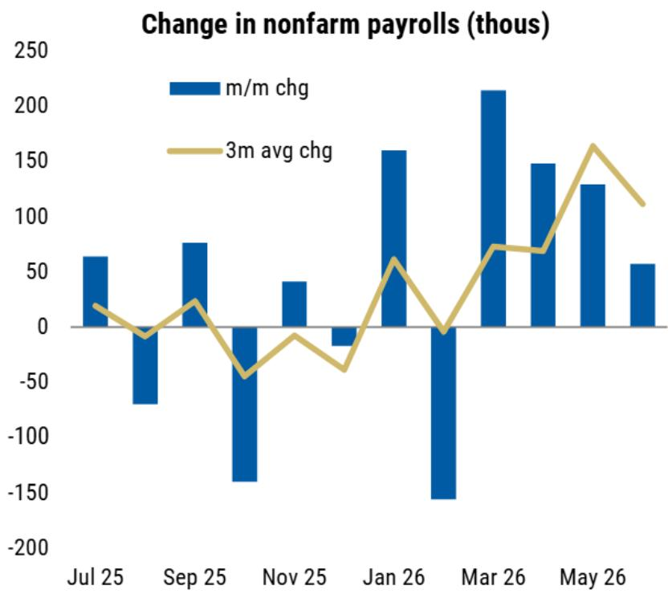  
来源：BLS, Haver Analytics

## 主要劳动年龄人口参与率6月出现下降

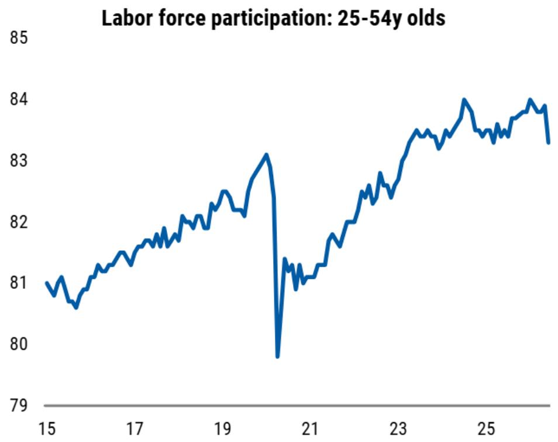

## 宏观环境条件在地区冲突后有所收紧

## 市场隐含路径仍较研究观点偏紧

当前市场定价隐含的收紧路径，与研究团队概率加权路径中预期的宽松方向存在差异

目标联邦基金利率区间上限与研究基线及4种情景

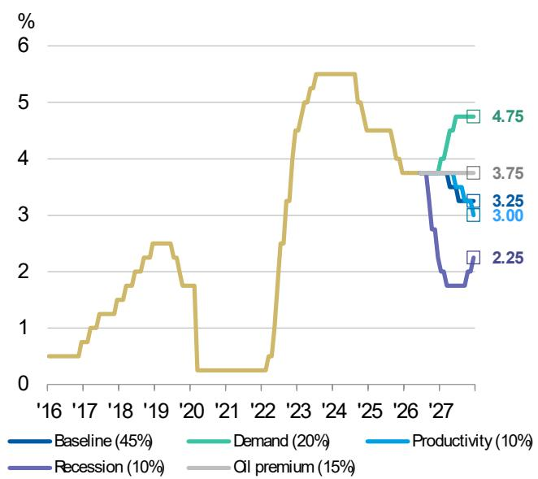  
目标联邦基金利率区间上限与概率加权均值 vs. 市场定价

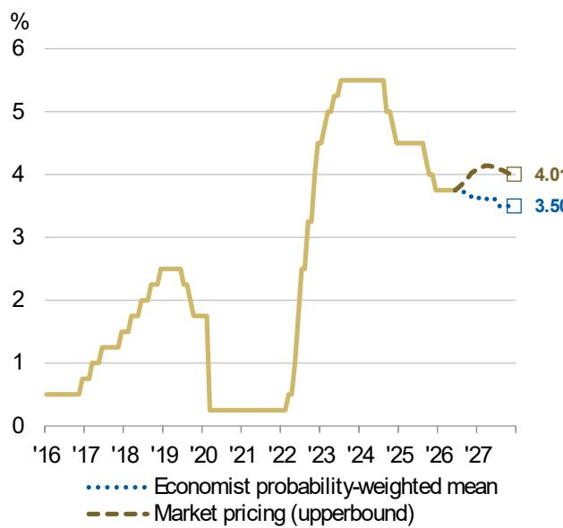

## 地区冲突以来利率上行相当于约100个基点的加息

根据旧金山联储的代理基金利率，美国国债、信用债及抵押贷款支持证券的利率上行，实质上起到了加息效果。

代理有效联邦基金利率与实际有效联邦基金利率

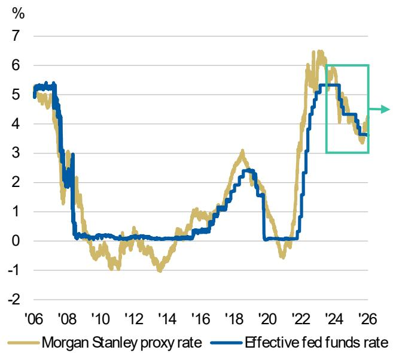  
代理有效联邦基金利率与实际有效联邦基金利率：2024-2026

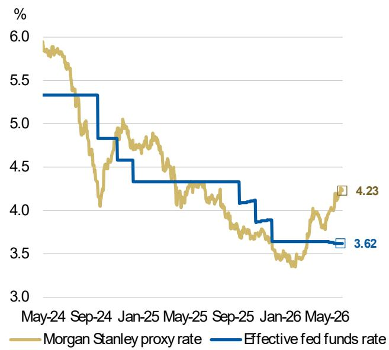

## 我们认为这100个基点的有效加息幅度可能过高

除全球金融危机和全球信贷危机等非常时期外，代理基金利率与实际基金利率的利差通常维持在+/-100个基点的区间内

代理有效联邦基金利率减去实际有效联邦基金利率

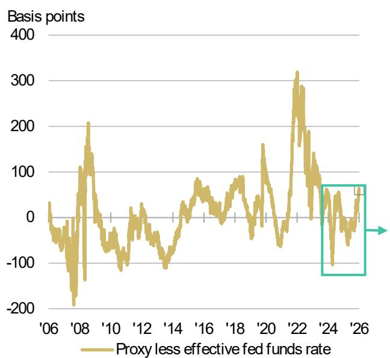  
来源：FRB San Francisco, Bloomberg  
代理有效联邦基金利率减去实际有效联邦基金利率：2024-2026

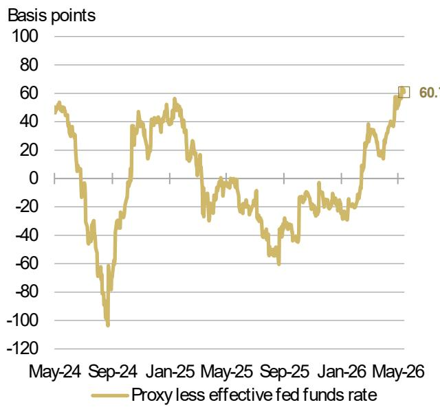

## 市场广度扩大的趋势随着油价回落而重新显现

相对估值指标已回到前期高点，作为领先指标

  
来源：Bloomberg

## 动量领先板块——半导体可能已见顶，或有助于这一趋势

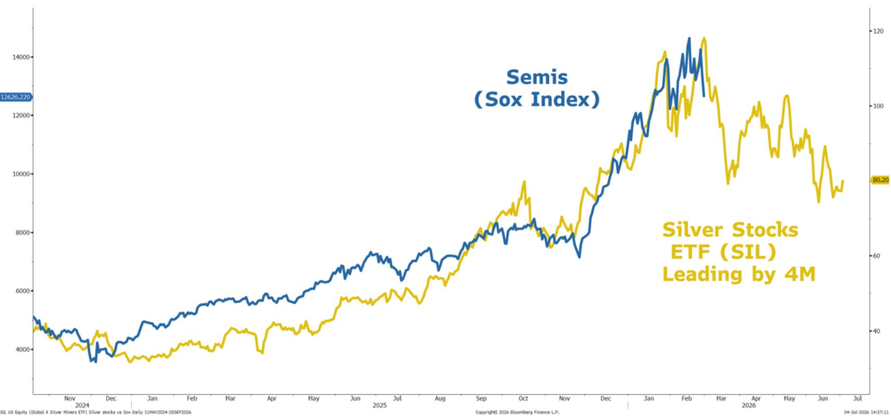  
来源：Bloomberg

## 随着市场对资本纪律的要求提升，我们更关注超大规模企业而非半导体

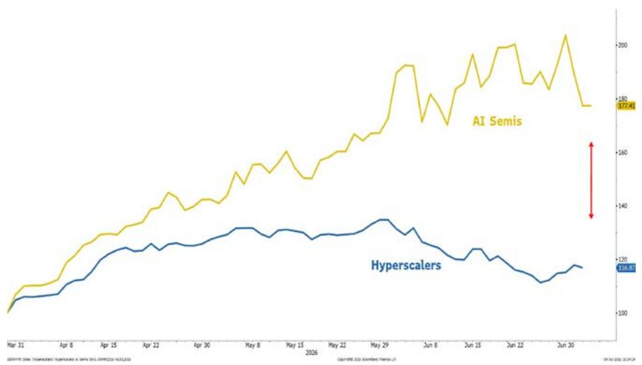  
整体市场因子表现：资本支出与销售比率（高 vs. 低）

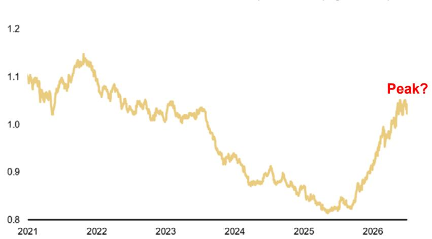

## 我们关注的受益于市场广度扩大的领域包括可选消费品、交通运输和生物科技

油价下行带动利率走低

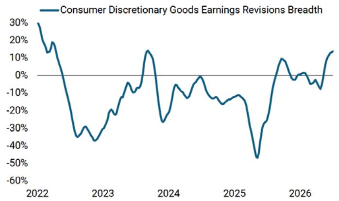

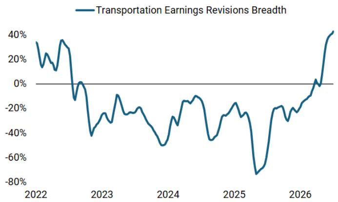

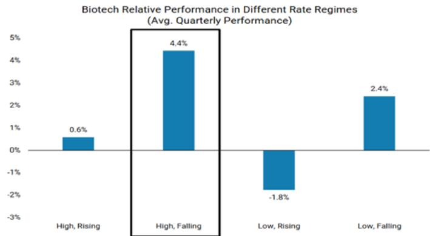

## 美元/日元汇率走高主要由美元整体走强驱动

自上次外汇干预以来，日元并未出现特别弱势。当前美元/日元水平相对于美联储定价、风险情绪和贸易条件而言处于合理区间。

G10即期汇率兑美元表现

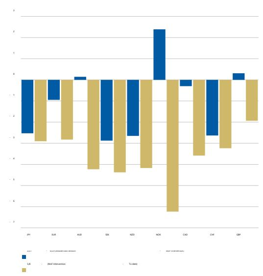  
美元/日元与其由美国终端利率定价、风险情绪和日本贸易条件隐含的公允价值对比

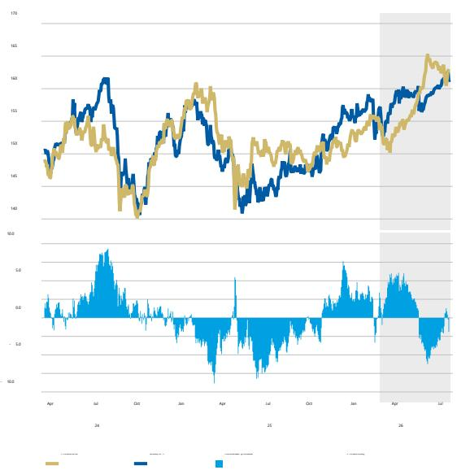  
来源：Bloomberg

## 核心观点

- 美国宏观研究视角：6月就业数据低于预期，前几个月数据也进行了下修。我们认为，油价走低、美联储主席关于通胀风险已下降的言论，以及招聘活动放缓，意味着美联储在7月及今年剩余时间将维持当前政策不变。宏观环境条件较冲突前水平适度收紧。

- 美国国债市场观点：当前市场定价隐含的收紧路径，与研究团队概率加权路径中预期的宽松方向存在差异。根据旧金山联储的代理基金利率，美国国债、信用债及抵押贷款支持证券的利率上行，实质上起到了加息效果。我们认为这100个基点的有效加息幅度可能过高。

- 美国权益市场观点：市场广度扩大的趋势随着油价回落而重新显现，且动量领先板块——半导体可能已见顶，或有助于这一趋势。我们更关注超大规模企业而非半导体。我们关注的受益于市场广度扩大的领域包括可选消费品、交通运输和生物科技，因油价下行带动利率走低。

- 日元视角：自上次外汇干预以来，日元并未出现特别弱势。当前美元/日元水平相对于美联储定价、风险情绪和贸易条件而言处于合理区间。
