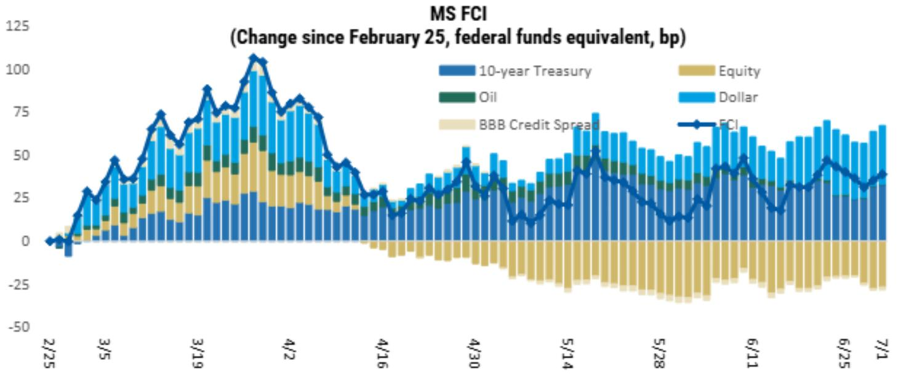
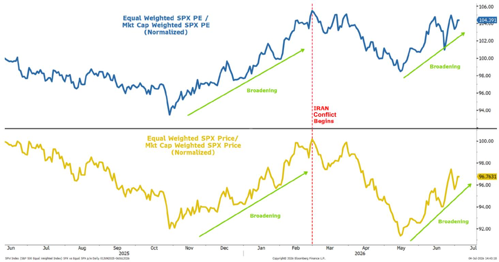
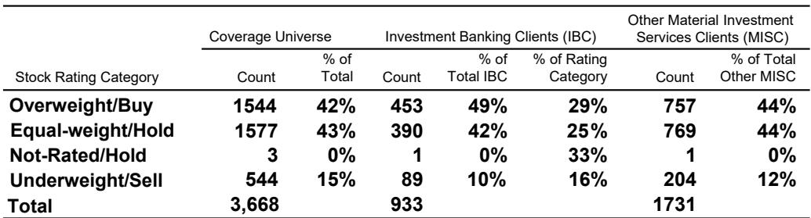

# MS：就业数据变化与油价回落，市场对利率路径的预期正在调整

一份来自MS全球宏观论坛的月度研判，在7月初给出了一个与市场主流叙事存在微妙差异的判断：就业数据走软、油价回落、以及资金条件已显著收紧，这三点叠加意味着市场对利率路径的定价存在调整空间。报告同时指出，一旦利率预期开始变化，市场的结构性机会将从半导体等动量板块向外扩散。

报告的核心逻辑并不复杂，但它的价值在于把几个看似独立的变量——就业、油价、地缘因素、日元汇率——放进了同一个分析框架里。

## 1. 就业数据变化与油价回落，7月按兵不动已成大概率

6月非农数据低于预期，且前值被下修。报告认为，这并非单月噪音，而是与近期油价回落、以及美联储主席关于“通胀不确定性已经下降”的表态形成了一致信号。三件事放在一起看，在7月会议上维持利率不变，并且全年不再调整，是一个合理的基准情形。

真正值得关注的不是这个结论本身，而是报告对“资金条件”的解读。根据旧金山联储的代理有效联邦产品利率模型，中东局势变化之后，美国国债、信用债和MBS市场的利率上行，已经相当于一次约100个基点的有效调整。换句话说，市场自己已经完成了一轮紧缩。

> **KC评论：** 这张图是整份报告最有信息量的部分之一。它提醒读者，不要只看美联储的联邦产品利率，更要看市场实际承受的融资成本。100个基点的有效调整如果被证明是过度反应，那么后续的修正本身就会带来宽松效应。

## 2. 市场定价的紧缩路径与宏观环境学家的概率加权路径出现明显裂口

报告对比了当前市场隐含的利率路径与MS宏观环境学家给出的概率加权路径。两者之间存在显著差异：市场定价仍然偏向紧缩，而宏观环境学家的基准假设是逐步转向宽松。报告认为，市场定价存在调整空间。

这一判断的支撑在于，代理有效联邦产品利率与实际联邦产品利率的利差，已经超过了正常波动区间。除了全球资金扰动和欧债扰动等极端时期，这一利差通常维持在正负100个基点以内。当前利差的扩张，更像是对地缘不确定性的过度定价，而非基本面驱动的结果。

## 3. 板块轮动正在重新启动，半导体动量见顶是信号

报告在权益市场部分给出了一个值得追踪的观察框架。随着油价下跌减轻了利率的不确定性，“broadening out”（扩散）的故事正在重新浮现。报告特别指出，半导体板块的动量可能已经见顶，而资金开始流向那些更受益于利率节奏变化的领域。

具体来说，报告看好的扩散受益者包括：可选消费、交通运输和生物技术。逻辑链条是：油价下跌传导至通胀预期回落，进而压低利率预期，最终利好那些对利率敏感、此前被高利率压制的板块。

> **KC评论：** 报告在这里做了一个主动选择——在AI链条内部，它更倾向于超大规模云厂商（hyperscalers）而非半导体。理由是市场开始要求资本纪律，而半导体板块的capex-to-sales比率已经处于高位。这个视角在AI研究热潮中提供了一面冷静的镜子。

## 4. 日元：弱势并非日元独有问题，当前汇率相对公允

报告对日元的判断也值得单独拿出来看。市场普遍关注日元汇率变化，但报告指出，近期美元/日元的上行主要由美元整体走强驱动，日元并未特别跑输。基于美联储定价、不确定性情绪和日本贸易条件构建的公平价值模型显示，当前美元/日元水平是相对公允的。

这意味着，除非美联储政策路径出现根本性变化，或者日本央行采取超出预期的行动，否则日元在当前区间内的波动更多是美元强弱的映射，而非日元自身的结构性变化。

## 报告尚未完全回答的关键问题

尽管报告在多个维度上给出了清晰的判断，但仍有几个问题值得读者继续追问。第一，100个基点的有效调整是否真的“过度”？如果地缘因素持续变化，资金条件的收紧可能不是过度，而是尚未充分定价。第二，板块扩散的逻辑依赖于油价持续回落，但如果OPEC+或其他供给端因素导致油价反弹，这一轮动可能很快中断。第三，日元公平价值模型的假设前提是不确定性情绪和贸易条件不会大幅出现变化，这两个变量在当下都面临不确定性。

对于产业决策者和专业读者而言，这份报告的价值不在于提供一个确定的信号，而在于提供了一套可以持续跟踪的验证框架。就业数据、油价、资金条件利差、板块动量——这几个变量构成了一个可观测、可验证的分析闭环。读者可以带着这套框架，在后续数据发布中自行检验报告的判断是否成立。

For informational purposes only. Portions may be generated,translated,summarized,or edited with AI assistance based on source materials and may contain omissions or errors. Please verify independently. This is not investment,legal,tax,accounting,or other professional advice.

For informational purposes only. Portions may be generated,translated,summarized,or edited with AI assistance based on source materials and may contain omissions or errors. Please verify independently. This is not investment,legal,tax,accounting,or other professional advice.

