July 6, 2026 08:20 PM GMT

Autos & Shared Mobility | North America

# Global EV Tracker: Europe Leads BEV Growth as China Turns a Corner and US Hybrids Gain

Global EV sales in May grew 15% y/y to 1.3mn. Tesla global share rebounds to 11% (vs 8% LM). Europe continues to drive BEV sales growth (+34% y/y), and China inflects positive for the first time in 2026 (+4% y/y). US hybrid penetration increases to 22% (vs. 21% LM) amidst elevated fuel costs.

## Key BEV highlights for the month of May 2026:

1. Global BEV sales (exc. hybrids and plug ins): 1,298,203, up 15% y/y, and up 5% vs. last month's 1,235,929 BEV sales.

2. Top BEV OEMs Globally: 1) BYD at 160.9k sales, 2) Tesla at 144.5k, 3) Geely at 87.7k sales.

3. Top Global BEV Models: 1) Tesla Model Y at 93.5k and 2) Unspec LCV at 53.0k, 3) Tesla Model 3 at 47.1k. We note LCV Unspec BEV refers to fully electric light commercial vehicle registrations where model-level or OEM information is not available from for China, Italy, Sweden, and Spain, with the majority of registrations coming from the Chinese market.

4. Tesla's share of the global BEV market in the month of May 2026 is 11.1%, vs. 7.9% share last month and 10.4% share for May 2025. We also note that this market share includes a wide definition of BEVs including large volumes of EV mini-car BEVs (with sub 100 mile ranges) in the Chinese market. Tesla's share of the US BEV market in May 2026 was 43.5%, up from 41.0% share last year. We note that Motor Intelligence recorded that Tesla's share of the US BEV market in June 2026 came in at 50.2% vs 48.5% last year.

Please note BYD and Geely are covered by Tim Hsiao.

## Geography:

1. US BEV Sales: down 17% y/y to 82,180 in May-26 vs. 99,376 last year and up 9.1% m/m vs. 75,349 last month. US EV Penetration in May-26 is at 5.6% vs. 6.7% in May-25.

2. Europe BEV Sales: up 34% y/y to 306,444 in May-26 vs. 228,274 last year and up 2.7% m/m vs. 298,465 last month. EU EV Penetration in May-26 is at 26.6% vs. 20.5% in May-25.

3. China BEV Sales: up 4% y/y to 687,210 in May-26 vs. 663,624 last year and up 7.0% m/m vs. 642,323 last month. China EV Penetration in May-26 is at 30.7% vs. 28.1% in May-25.

## Key Battery highlights for the month of May 2026:

1. Total MWh Deployed: Up 15% y/y in May-26 to 79,372 MWh vs 68,790 MWh last year and 74,837 MWh last month.

2. Top Cell Suppliers: The top 5 cell suppliers deployed a combined 61,635 MWh in May-26 vs 53,225 MWh last year.

3. Chemistry breakdown: Of total deployments in May-26, NMC made up 43% of deployments, LFP made up 48%, and NCA made up 5% of deployment. In May-25, NMC made up 46% of deployments, LFP made up 45%, and NCA made up 7%.

Exhibit 1: Global BEV Sales - YTD May 2026 vs. YTD May 2025  
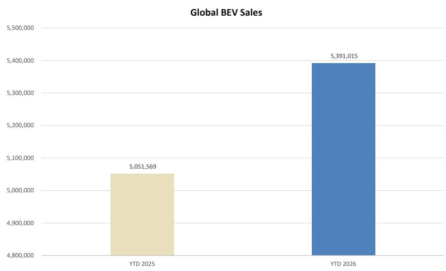  
Source: EV-volumes.com, MS

Exhibit 2: Global EV Sales by Powertrain  
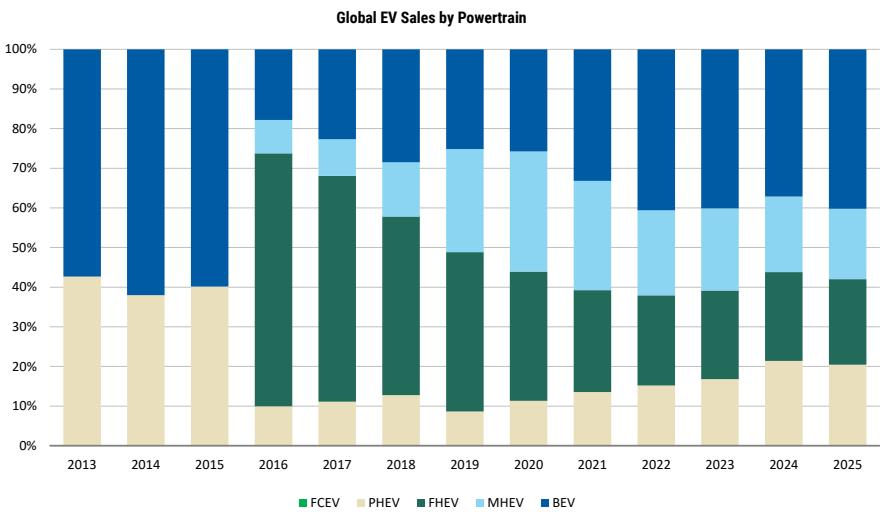  
Source: EV-volumes.com, MS

Exhibit 3: BEV Penetration - May 2026 vs. May 2025  
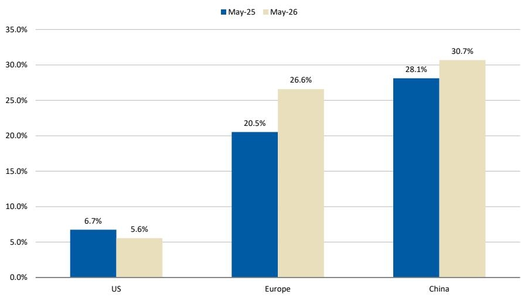  
Source: EV-volumes.com, MS

Exhibit 4: Top Global BEV OEM Market Share Regional Tracker

<table><tr><td rowspan="3">Sr. No</td><td colspan="10">Top Global BEV OEMs Market Share Regional Tracker</td></tr><tr><td rowspan="2">BEV OEMs</td><td colspan="3">US market</td><td colspan="3">Europe Market</td><td colspan="3">China Market</td></tr><tr><td>May-25</td><td>May-26</td><td>FY2025</td><td>May-25</td><td>May-26</td><td>FY2025</td><td>May-25</td><td>May-26</td><td>FY2025</td></tr><tr><td>US OEMs</td><td></td><td colspan="3"></td><td colspan="3"></td><td colspan="3"></td></tr><tr><td>1</td><td>Tesla Inc.</td><td>41.0%</td><td>43.5%</td><td>43.2%</td><td>6.7%</td><td>9.2%</td><td>8.9%</td><td>5.8%</td><td>6.9%</td><td>7.4%</td></tr><tr><td>2</td><td>Ford</td><td>6.8%</td><td>4.6%</td><td>7.0%</td><td>3.8%</td><td>3.2%</td><td>4.0%</td><td>0.0%</td><td>0.0%</td><td>0.0%</td></tr><tr><td>3</td><td>GM</td><td>15.9%</td><td>13.3%</td><td>14.1%</td><td>0.0%</td><td>0.0%</td><td>0.0%</td><td>9.4%</td><td>6.5%</td><td>10.3%</td></tr><tr><td>Europe OEMs</td><td></td><td colspan="3"></td><td colspan="3"></td><td colspan="3"></td></tr><tr><td>1</td><td>BMW Group</td><td>4.0%</td><td>3.0%</td><td>3.8%</td><td>9.0%</td><td>8.0%</td><td>8.9%</td><td>1.1%</td><td>0.5%</td><td>0.8%</td></tr><tr><td>2</td><td>VW Group</td><td>3.7%</td><td>3.0%</td><td>5.9%</td><td>28.1%</td><td>20.3%</td><td>24.7%</td><td>1.8%</td><td>0.7%</td><td>1.3%</td></tr><tr><td>3</td><td>Mercedes-Benz Group</td><td>1.7%</td><td>0.4%</td><td>1.1%</td><td>4.2%</td><td>5.2%</td><td>4.8%</td><td>0.2%</td><td>0.1%</td><td>0.2%</td></tr><tr><td>4</td><td>Stellantis</td><td>2.4%</td><td>0.3%</td><td>1.7%</td><td>12.0%</td><td>10.3%</td><td>11.3%</td><td>0.0%</td><td>0.0%</td><td>0.1%</td></tr><tr><td>Japan OEMs</td><td></td><td colspan="3"></td><td colspan="3"></td><td colspan="3"></td></tr><tr><td>1</td><td>Honda Motor</td><td>4.0%</td><td>2.3%</td><td>4.2%</td><td>0.1%</td><td>0.1%</td><td>0.1%</td><td>0.2%</td><td>0.1%</td><td>0.2%</td></tr><tr><td>2</td><td>Toyota Motor Corp.</td><td>2.3%</td><td>6.7%</td><td>1.8%</td><td>2.1%</td><td>3.8%</td><td>1.8%</td><td>0.9%</td><td>1.9%</td><td>1.3%</td></tr><tr><td>3</td><td>Mazda Motor Corp.</td><td>0.0%</td><td>0.0%</td><td>0.0%</td><td>0.1%</td><td>0.4%</td><td>0.3%</td><td>0.2%</td><td>0.0%</td><td>0.2%</td></tr><tr><td>4</td><td>Subaru Corp.</td><td>1.3%</td><td>3.8%</td><td>0.9%</td><td>0.1%</td><td>0.2%</td><td>0.0%</td><td>0.0%</td><td>0.0%</td><td>0.0%</td></tr><tr><td>5</td><td>R-N-M Alliance</td><td>3.4%</td><td>0.5%</td><td>1.7%</td><td>6.7%</td><td>8.8%</td><td>8.0%</td><td>0.7%</td><td>0.6%</td><td>0.8%</td></tr><tr><td>S.Korea OEMs</td><td></td><td colspan="3"></td><td colspan="3"></td><td colspan="3"></td></tr><tr><td>1</td><td>Hyundai Motor</td><td>7.6%</td><td>11.3%</td><td>8.6%</td><td>8.5%</td><td>7.9%</td><td>7.6%</td><td>0.1%</td><td>0.0%</td><td>0.1%</td></tr><tr><td>China OEMs</td><td></td><td colspan="3"></td><td colspan="3"></td><td colspan="3"></td></tr><tr><td>1</td><td>NIO Inc.</td><td>0.0%</td><td>0.0%</td><td>0.0%</td><td>0.0%</td><td>0.1%</td><td>0.1%</td><td>3.5%</td><td>5.2%</td><td>3.8%</td></tr><tr><td>2</td><td>Geely Auto Group</td><td>1.8%</td><td>1.7%</td><td>1.6%</td><td>0.9%</td><td>1.7%</td><td>1.0%</td><td>14.7%</td><td>9.8%</td><td>12.9%</td></tr><tr><td>3</td><td>SAIC</td><td>0.0%</td><td>0.0%</td><td>0.0%</td><td>2.0%</td><td>1.9%</td><td>2.2%</td><td>1.2%</td><td>3.0%</td><td>1.8%</td></tr><tr><td>4</td><td>BAIC</td><td>0.0%</td><td>0.0%</td><td>0.0%</td><td>0.0%</td><td>0.0%</td><td>0.0%</td><td>2.6%</td><td>2.5%</td><td>2.3%</td></tr><tr><td>5</td><td>Great Wall Motors</td><td>0.0%</td><td>0.0%</td><td>0.0%</td><td>0.1%</td><td>0.0%</td><td>0.1%</td><td>0.2%</td><td>0.4%</td><td>0.4%</td></tr><tr><td>6</td><td>GAC</td><td>0.0%</td><td>0.0%</td><td>0.0%</td><td>0.0%</td><td>0.1%</td><td>0.0%</td><td>3.4%</td><td>2.9%</td><td>3.5%</td></tr><tr><td>7</td><td>BYD</td><td>0.0%</td><td>0.0%</td><td>0.0%</td><td>5.7%</td><td>5.7%</td><td>6.0%</td><td>21.8%</td><td>15.6%</td><td>19.1%</td></tr><tr><td>8</td><td>Changan Automobile Group</td><td>0.0%</td><td>0.0%</td><td>0.0%</td><td>0.0%</td><td>0.6%</td><td>0.1%</td><td>5.3%</td><td>7.4%</td><td>5.4%</td></tr><tr><td>9</td><td>Dongfeng Motor</td><td>0.0%</td><td>0.0%</td><td>0.0%</td><td>0.2%</td><td>0.6%</td><td>0.3%</td><td>2.5%</td><td>1.8%</td><td>2.1%</td></tr><tr><td>10</td><td>Xiaopeng</td><td>0.0%</td><td>0.0%</td><td>0.0%</td><td>0.7%</td><td>1.3%</td><td>0.7%</td><td>4.5%</td><td>3.4%</td><td>4.5%</td></tr></table>

Source: EV-volumes.com, MS

Exhibit 5: Regional BEV Sales Distribution as % of Total - May 2026  
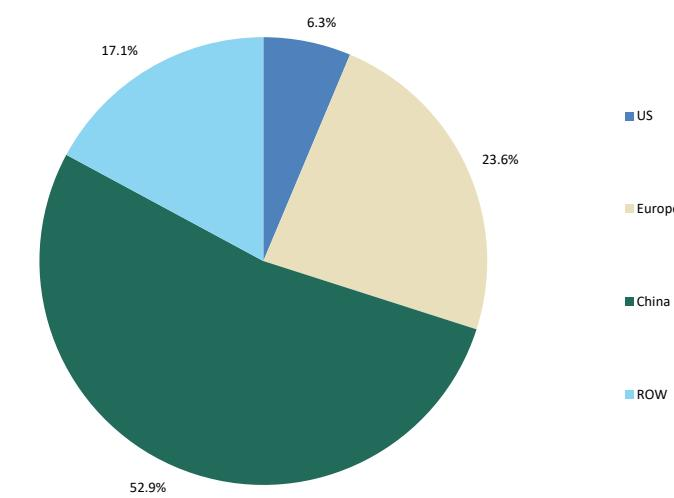  
Source: EV-volumes.com, MS

## Select OEM BEV Sales:

1. BYD: down 13% Y/Y to 160,850 in May-26 vs 185,930 last May and 164,203 last month.

2. Tesla: up 23% Y/Y to 144,468 in May-26 vs. 117,031 last May and 97,652 last month.

3. VW: down 13% Y/Y to 72,963 in May-26 vs. 84,105 last May and 77,839 last month.

4. GM: down 24% Y/Y to 62,134 in May-26 vs. 82,296 last May and 54,728 last month.

5. BMW: down 4% Y/Y to 34,837 in May-26 vs. 36,193 last May and 35,327 last month.

6. Toyota: up 155% Y/Y to 34,623 in May-26 vs. 13,580 last May and 37,156 last month.

7. Stellantis: up 6% Y/Y to 32,594 in May-26 vs. 30,872 last May and 35,131 last month.

8. Mercedes-Benz: up 35% Y/Y to 18,578 in May-26 vs. 13,779 last May and 19,951 last month.

9. Ford: down 10% Y/Y to 15,028 in May-26 vs. 16,629 last May and 17,444 last month.

Exhibit 6: Top 10 OEMs by Global BEV Sales - May 2026

<table><tr><td>Rank</td><td>OEMs</td><td>May BEV Sales</td><td>May BEV Market Share</td></tr><tr><td>1</td><td>BYD</td><td>160,850</td><td>12%</td></tr><tr><td>2</td><td>Tesla</td><td>144,468</td><td>11%</td></tr><tr><td>3</td><td>Geely</td><td>87,662</td><td>7%</td></tr><tr><td>4</td><td>VW</td><td>72,963</td><td>6%</td></tr><tr><td>5</td><td>GM</td><td>62,134</td><td>5%</td></tr><tr><td>6</td><td>Hyundai</td><td>59,956</td><td>5%</td></tr><tr><td>7</td><td>Changan</td><td>55,503</td><td>4%</td></tr><tr><td>8</td><td>SAIC</td><td>37,869</td><td>3%</td></tr><tr><td>9</td><td>Nio</td><td>35,889</td><td>3%</td></tr><tr><td>10</td><td>BMW</td><td>34,837</td><td>3%</td></tr><tr><td colspan="2">Total Top 10 May-26 BEV Sales</td><td>752,131</td><td>58%</td></tr><tr><td colspan="2">Other BEV Sales</td><td>546,072</td><td>42%</td></tr><tr><td colspan="2">Total May-26 BEV Sales</td><td>1,298,203</td><td>100%</td></tr></table>

Source: EV-volumes.com, MS

Exhibit 7: Global BEV OEM Market Share - May 2026  
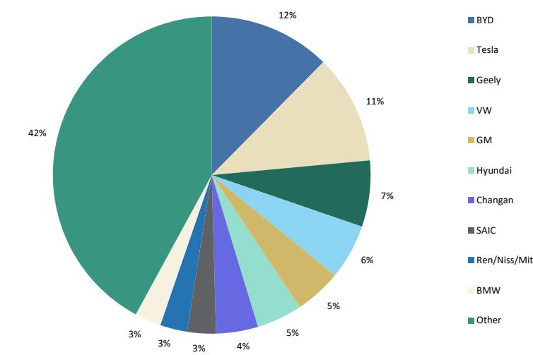  
Source: EV-volumes.com, MS

Exhibit 8: Top OEMs by Global BEV Sales - May 2026 vs. May 2025  
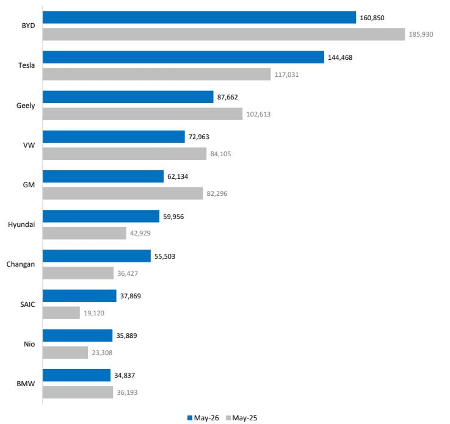  
Source: EV-volumes.com, MS

Exhibit 9: Tesla Monthly BEV Sales  
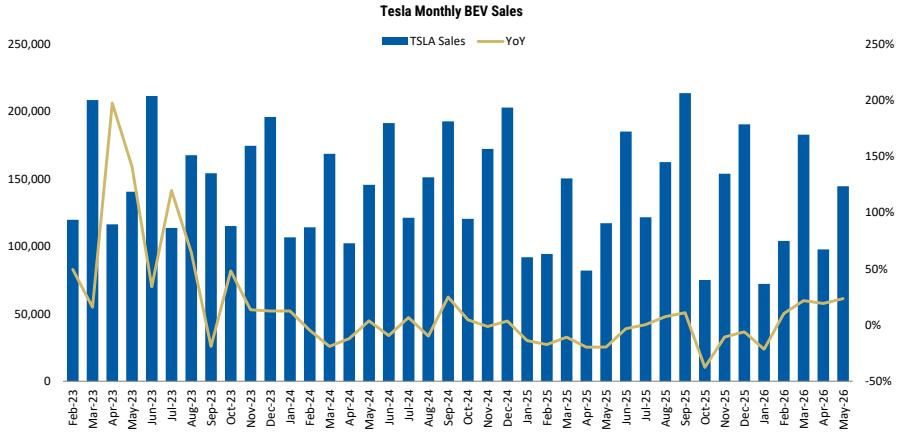  
Source: EV-volumes.com, MS

Exhibit 10: Tesla BEV Monthly Market Share - US, Europe, China & Global  
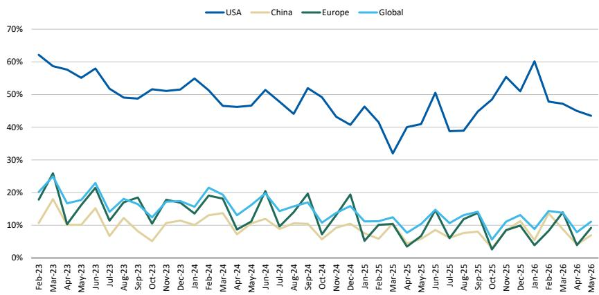  
Source: EV-volumes.com, MS

Exhibit 11: May 2026 - Top BEV Model Sales - Global

<table><tr><td>Rank</td><td>Model</td><td>BEV Sales</td><td>BEV Market Share</td></tr><tr><td>1</td><td>Tesla Model Y BEV</td><td>93,525</td><td>7%</td></tr><tr><td>2</td><td>Unspec. LCV BEV</td><td>52,956</td><td>4%</td></tr><tr><td>3</td><td>Tesla Model 3 BEV</td><td>47,109</td><td>4%</td></tr><tr><td>4</td><td>Geely Geome Xingyuan / EX2 BEV</td><td>46,224</td><td>4%</td></tr><tr><td>5</td><td>BYD Seagull / Dolphin Surf BEV</td><td>23,988</td><td>2%</td></tr><tr><td>6</td><td>Xiaomi SU7 BEV</td><td>23,949</td><td>2%</td></tr><tr><td>7</td><td>BYD Yuan UP / Atto-2 BEV</td><td>22,714</td><td>2%</td></tr><tr><td>8</td><td>BYD Dolphin BEV</td><td>21,827</td><td>2%</td></tr><tr><td>9</td><td>Leapmotor A10 / B03X BEV</td><td>21,428</td><td>2%</td></tr><tr><td>10</td><td>Li Xiang I6 BEV</td><td>20,832</td><td>2%</td></tr><tr><td>11</td><td>BYD Sea Lion 06 BEV</td><td>15,169</td><td>1%</td></tr><tr><td>12</td><td>Wuling HongGuang Mini BEV</td><td>15,085</td><td>1%</td></tr><tr><td>13</td><td>Qiyuan Q05 BEV</td><td>14,561</td><td>1%</td></tr><tr><td>14</td><td>Xpeng M03 BEV</td><td>13,834</td><td>1%</td></tr><tr><td>15</td><td>Deepal S05 BEV</td><td>12,892</td><td>1%</td></tr><tr><td>16</td><td>Wuling Bingo Pro BEV</td><td>12,278</td><td>1%</td></tr><tr><td>17</td><td>MG 4 / MG 4 Urban BEV</td><td>11,854</td><td>1%</td></tr><tr><td>18</td><td>NIO es8 / EL8 BEV</td><td>11,713</td><td>1%</td></tr><tr><td>19</td><td>BYD Yuan Plus / Atto-3 BEV</td><td>10,424</td><td>1%</td></tr><tr><td>20</td><td>AITO Wenjie M6 BEV</td><td>10,242</td><td>1%</td></tr><tr><td colspan="2">Total Top 20 BEV Models</td><td>502,604</td><td>39%</td></tr><tr><td colspan="2">Total BEV Sales</td><td>1,298,203</td><td>100%</td></tr></table>

Source: EV-volumes.com. Note: LCV Unspec BEV refers to fully electric light commercial vehicle registrations where model-level or OEM information is not available from for China, Italy, Sweden, and Spain, with the majority of registrations coming from the Chinese market.

Exhibit 12: May 2026 vs. May 2025 - Top 10 BEV Models - Global  
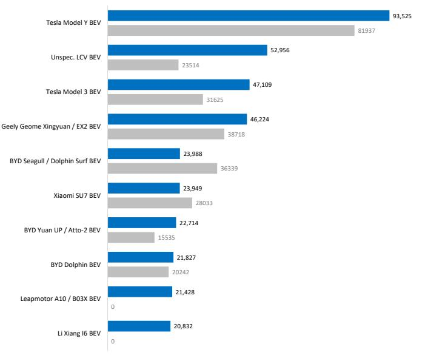  
■ May-26 ■ May-25  
Source: EV-volumes.com, MS

Exhibit 13: USA - May 2026 vs. May 2025 - Top 10 BEV Models  
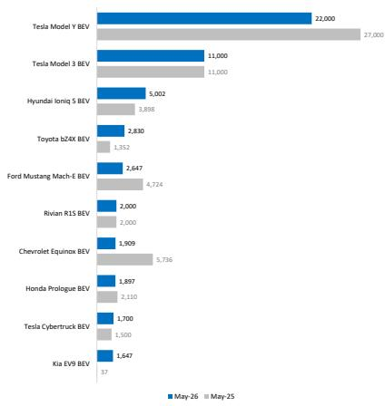  
Exhibit 14: USA - YTD 2026 vs. YTD 2025- Top 10 BEV Models  
Source: EV-volumes.com, MS

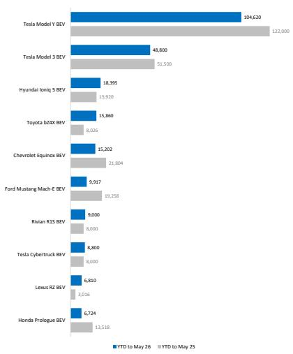  
Source: EV-volumes.com, MS

Exhibit 15: USA - Hybrid vs BEVs Penetration  
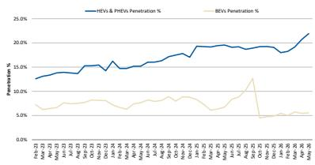  
Source: EV-volumes.com, MS
Note: HEVs includes FHEV, MHEV & PHEV

Exhibit 16: USA - May 2026 vs. May 2025- Top 20 Hybrid Models

<table><tr><td>Rank</td><td>Model</td><td>HEV Sales</td><td>Market Share</td></tr><tr><td>1</td><td>Toyota Camry FHEV</td><td>35,796</td><td>11%</td></tr><tr><td>2</td><td>Toyota RAV4 FHEV</td><td>32,910</td><td>11%</td></tr><tr><td>3</td><td>Honda CR-V FHEV</td><td>24,401</td><td>8%</td></tr><tr><td>4</td><td>Ram Pick-Up MHEV</td><td>15,869</td><td>5%</td></tr><tr><td>5</td><td>Ford Maverick FHEV</td><td>10,870</td><td>3%</td></tr><tr><td>6</td><td>Toyota Sienna FHEV</td><td>10,511</td><td>3%</td></tr><tr><td>7</td><td>Honda Accord FHEV</td><td>9,414</td><td>3%</td></tr><tr><td>8</td><td>Kia Sportage FHEV</td><td>8,790</td><td>3%</td></tr><tr><td>9</td><td>Toyota Grand Highlander FHEV</td><td>8,480</td><td>3%</td></tr><tr><td>10</td><td>Honda Civic FHEV</td><td>8,450</td><td>3%</td></tr><tr><td>11</td><td>Kia Telluride FHEV</td><td>7,525</td><td>2%</td></tr><tr><td>12</td><td>Subaru Forester FHEV</td><td>6,698</td><td>2%</td></tr><tr><td>13</td><td>Hyundai Santa Fe FHEV</td><td>5,946</td><td>2%</td></tr><tr><td>14</td><td>Hyundai Tucson FHEV</td><td>5,876</td><td>2%</td></tr><tr><td>15</td><td>Hyundai Sonata FHEV</td><td>5,870</td><td>2%</td></tr><tr><td>16</td><td>Mazda CX-50 MHEV</td><td>5,660</td><td>2%</td></tr><tr><td>17</td><td>Hyundai Palisade FHEV</td><td>5,490</td><td>2%</td></tr><tr><td>18</td><td>Lexus RX FHEV</td><td>4,822</td><td>2%</td></tr><tr><td>19</td><td>Ford F-150 FHEV</td><td>4,317</td><td>1%</td></tr><tr><td>20</td><td>Mazda CX-90 MHEV</td><td>4,303</td><td>1%</td></tr><tr><td colspan="2">Total Top 20 HEV Models</td><td>221,998</td><td>71%</td></tr><tr><td colspan="2">Total HEV Sales</td><td>312,267</td><td>100%</td></tr></table>

Source: EV-volumes.com, MS

Exhibit 17: Europe - May 2026 vs. May 2025 - Top 10 BEV Models  
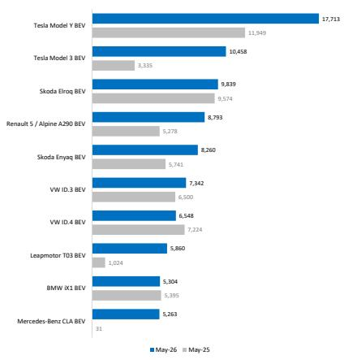  
Source: EV-volumes.com, MS

Exhibit 18: Europe - YTD 2026 vs. YTD 2025 - Top 10 BEV Models  
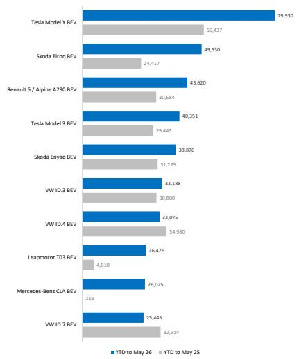  
Source: EV-volumes.com, MS

Exhibit 19: China - May 2026 vs. May 2025 - Top 10 BEV Models  
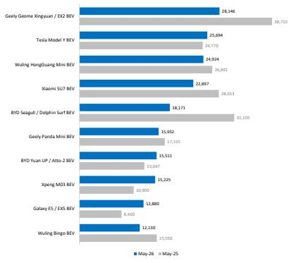  
Source: EV-volumes.com, MS

Exhibit 20: China - YTD 2026 vs. YTD 2025 - Top 10 BEV Models  
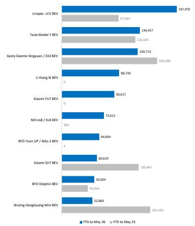  
Source: EV-volumes.com, MS

Exhibit 21: Total MWh Deployed by Month  
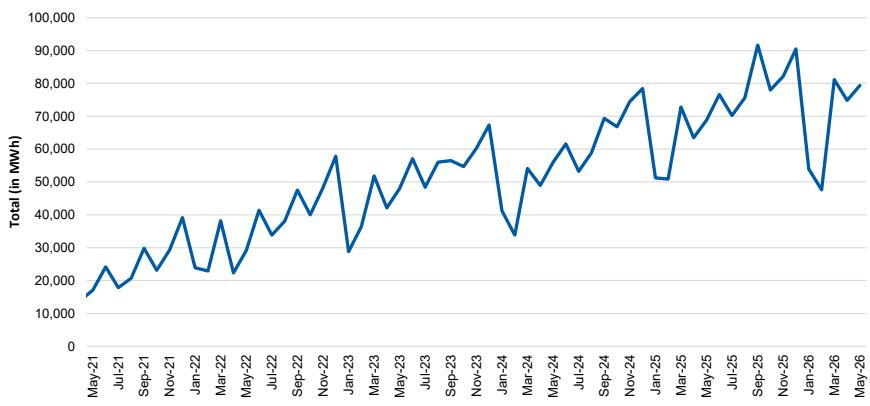  
Source: EV-Volumes.com, MS

Exhibit 22: May 2026: YTD Deployments by Region in MWh  
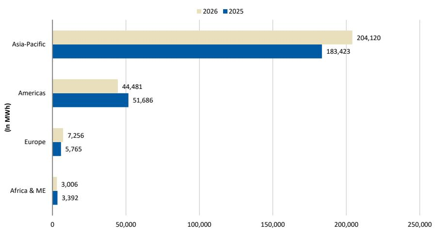  
Source: EV-volumes.com, MS

Exhibit 23: May 2026: YTD Regional Deployment %  
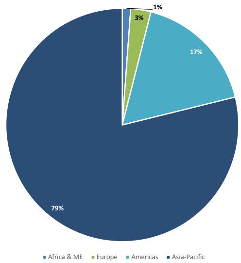  
Source: EV-volumes.com, MS

Exhibit 24: May 2026 YTD: Top 5 Countries by Deployment in MWh

<table><tr><td>Rank</td><td>Countries</td><td>2026 YTD MWh</td><td>2025 YTD MWh</td><td>2026 Market Share</td></tr><tr><td>1</td><td>China</td><td>158,936</td><td>159,627</td><td>46%</td></tr><tr><td>2</td><td>USA</td><td>32,087</td><td>42,788</td><td>9%</td></tr><tr><td>3</td><td>Germany</td><td>20,963</td><td>15,183</td><td>6%</td></tr><tr><td>4</td><td>UK</td><td>16,058</td><td>13,501</td><td>5%</td></tr><tr><td>5</td><td>France</td><td>12,565</td><td>7,987</td><td>4%</td></tr><tr><td colspan="2">Total Top 5 Countries- YTD</td><td>240,609</td><td>239,086</td><td>69%</td></tr><tr><td colspan="2">Total MWh YTD</td><td>349,097</td><td>315,130</td><td>100%</td></tr></table>

Source: EV-volumes.com, MS

Exhibit 25: May 2026 vs May 2025: Top 5 Countries by MWh Deployed  
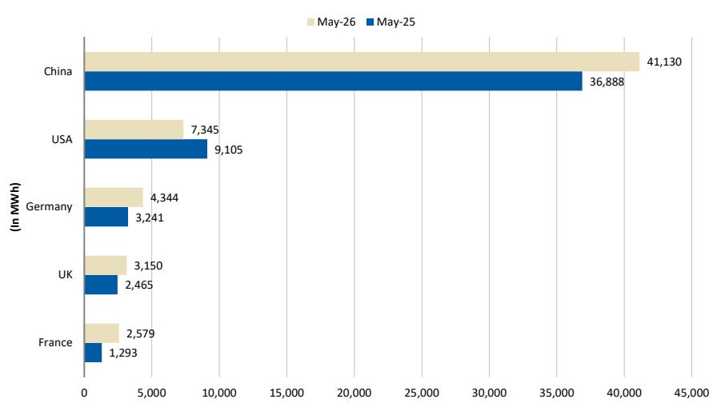  
Source: EV-volumes.com, MS

Exhibit 26: May 2026 YTD : Top 10 OEMs by MWh Deployed

<table><tr><td>Rank</td><td>OEM</td><td>2026 YTD MWh</td><td>2025 YTD MWh</td><td>2026 Market Share</td></tr><tr><td>1</td><td>Tesla Inc.</td><td>44,099</td><td>39,071</td><td>13%</td></tr><tr><td>2</td><td>BYD</td><td>34,675</td><td>42,033</td><td>10%</td
