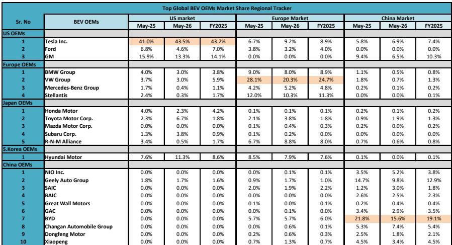
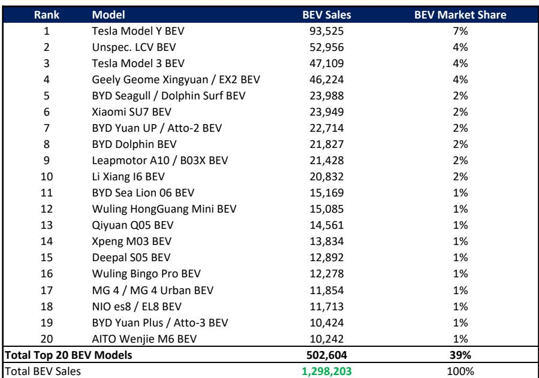

# MS：美国混动销量反超纯电，消费者为何选择折中方案

全球电动车市场在2026年5月交出了一份看似平淡、实则暗藏分化的成绩单。MS最新发布的全球电动车追踪报告显示，当月全球纯电动车（BEV）销量同比增长15%至129.8万辆，增速较前几个月有所回升。但真正值得关注的不是这个总量数字，而是三个区域市场截然不同的驱动力——欧洲在加速、中国在企稳、美国在走弱，以及纯电与混动之间正在发生的竞争格局变化。

这份报告覆盖了从整车销量到电池装机的完整数据链，其中几个判断值得产业决策者和市场参与者反复推敲。

## 1. 欧洲接棒成为全球纯电增长引擎，渗透率突破26%

5月欧洲BEV销量同比增长34%至30.6万辆，渗透率从去年同期的20.5%跃升至26.6%。这是报告中最亮眼的数据点。欧洲正在从政策驱动转向产品周期驱动——大众、宝马、奔驰等本土品牌的纯电车型矩阵逐步完善，叠加充电基础设施的持续铺设，正在形成可持续的增长基础。

相比之下，美国市场同期BEV销量同比下降17%至8.2万辆，渗透率从6.7%降至5.6%。高燃料成本推动的并非纯电需求，而是混动车型——美国混动渗透率升至22%，丰田、本田的混动车型占据了榜单前列。这揭示了一个关键信号：在价格敏感且充电设施不完善的美国市场，消费者更倾向于选择“折中方案”，而非一步到位转向纯电。

> **KC评论：** 欧洲纯电渗透率突破26%的意义在于，它证明在政策补贴退坡后，产品力本身可以支撑增长。美国混动走强则提醒我们，纯电的普及路径并非线性，宏观环境中的某些因素在特定市场反而会强化混动的竞争力。报告中的美国混动车型排名图表值得细看——丰田凯美瑞混动单月销量超过3.5万辆，这个数字已经超过绝大多数纯电车型。

## 2. 中国BEV销量同比增长4%，市场正在从“量增”转向“份额争夺”

中国5月BEV销量同比增长4%至68.7万辆，是2026年以来首次转正。渗透率从28.1%升至30.7%。这个增速虽然不如欧洲亮眼，但意义在于确认了市场底部——经历了一季度的价格战和需求波动后，市场正在企稳。

但报告中的数据也暴露了结构性问题。比亚迪5月BEV销量同比下降13%至16.1万辆，其在中国纯电市场的份额从21.8%降至15.6%。与此同时，长安、蔚来、小鹏等品牌的份额在提升。这说明中国纯电市场已经从“一超多强”进入“群雄割据”阶段，头部玩家的增量空间正在被压缩，而新车型的推出节奏和渠道下沉能力成为决定胜负的关键。

报告还指出，特斯拉在中国的市场份额从5.8%升至6.9%，Model Y和Model 3分别位居全球纯电车型销量第一和第三。在竞争最激烈的中国市场，特斯拉凭借品牌力和产品力仍然在收复失地。

## 3. 电池技术路线正在发生不易察觉的切换，LFP首次超越NMC

电池数据是这份报告中最容易被忽视但可能最具前瞻性的部分。5月全球电池装机量同比增长15%至79.4 GWh，其中磷酸铁锂（LFP）占比48%，首次超过三元锂（NMC）的43%。一年前，这个比例是LFP 45%对NMC 46%。

这个切换的意义远超技术本身。LFP在能量密度上的劣势正在被系统集成效率和成本优势所抵消。当LFP成为主流，意味着电动车成本曲线将继续下移，这对中低端市场的渗透率提升是重大利好。但同时，这也对高镍三元路线的供应商形成不确定性——如果高端车型无法在续航和快充上建立足够大的差异，消费者可能不会为更高成本买单。

> **KC评论：** LFP占比超过NMC是一个结构性拐点。报告没有展开的是，这个切换对电池材料供应链的影响——锂、镍、钴的需求结构将随之重构。如果LFP持续主导增量市场，镍和钴的需求增速可能低于市场预期，而锂的需求则会更依赖于磷酸铁锂路线的技术迭代。

## 4. 报告尚未完全回答的关键问题：特斯拉的份额回升是否可持续？

特斯拉5月全球BEV市场份额从4月的7.9%回升至11.1%，同比也高于去年的10.4%。在美国市场，其BEV份额从41%升至43.5%，6月进一步升至50.2%。这个反弹值得关注，但需要追问的是：这是否只是季度末交付冲量的结果？还是产品竞争力的真实体现？

报告提供了数据，但没有给出判断。从历史经验看，特斯拉的月度份额波动较大，季度末的集中交付往往会拉高当月数据。真正的考验在于，当欧洲和中国本土品牌的新车型持续涌入市场，特斯拉能否维持目前的份额水平。特别是中国市场的竞争烈度在加剧，比亚迪、长安、蔚来等品牌的产品矩阵正在向各个价格带渗透。

对于产业观察者而言，跟踪特斯拉的月度份额变化，尤其是剔除季度末效应后的趋势，将是判断全球纯电市场格局演变的重要指标。

For informational purposes only. Portions may be generated,translated,summarized,or edited with AI assistance based on source materials and may contain omissions or errors. Please verify independently. This is not investment,legal,tax,accounting,or other professional advice.

