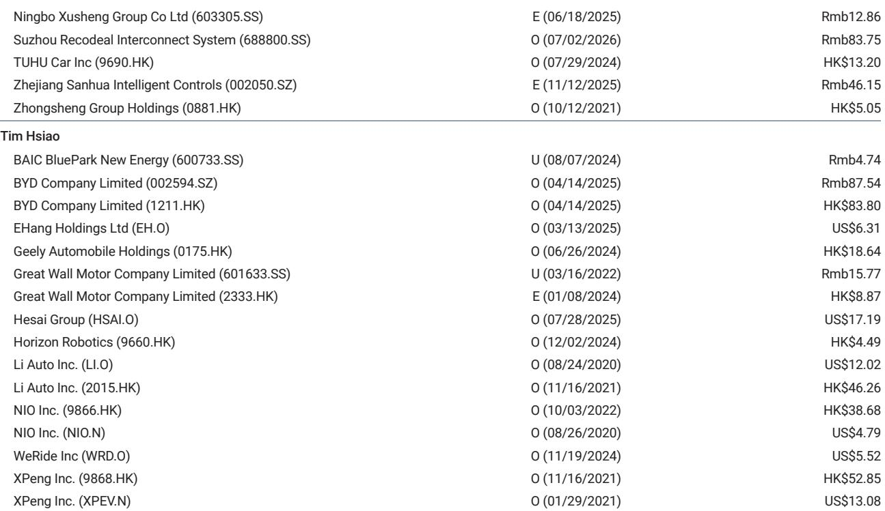
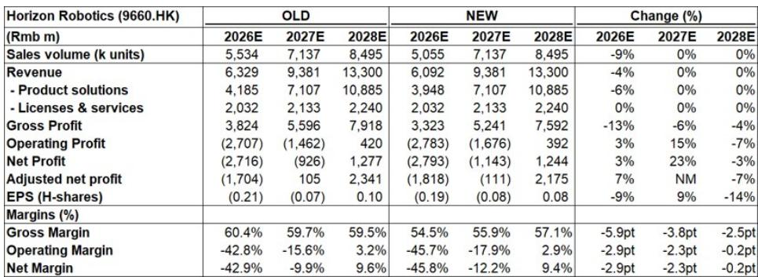
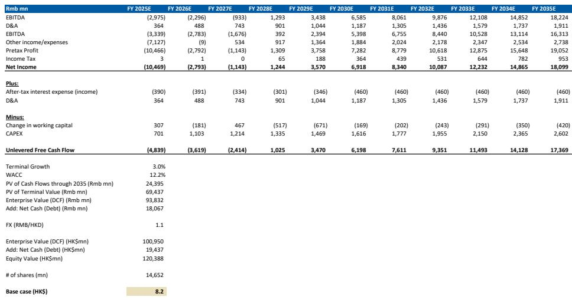

# Horizon Robotics Is Not a Victim of Vertical Integration — It Is the Partner OEMs Need

The market has reacted to Horizon Robotics significantly in 2026. Year-to-date, its share price has declined approximately 50 percent, driven by a single, powerful narrative: that China's largest automakers are building their own chips, and that Horizon is being squeezed out of the most valuable part of the autonomous driving stack. On the surface, this story appears logical. BYD, the country's dominant electric vehicle manufacturer, is developing in-house silicon. NVIDIA continues to offer high-performance alternatives. Horizon, the argument goes, will be relegated to low-margin, basic ADAS functions while the premium autonomous driving opportunity flows elsewhere.

That narrative is wrong. And the evidence from a recent management meeting hosted by a global investment bank suggests the market has fundamentally misread the competitive dynamics.

The price decline reflects a misunderstanding of what is actually happening inside China's automotive technology ecosystem. What appears to be a structural loss of orders is, in fact, a platform migration. What looks like a threat from vertical integration is actually an opening for a new kind of supplier relationship. And what the market prices as an ADAS company with limited upside is, in our view, a firm with embedded optionality that the current valuation simply does not reflect.

This article examines why the market's pessimism on Horizon is overdone, where the real competitive dynamics lie, and what observers should watch for in the coming quarters. We draw on a detailed research report published in early July 2026, but we extend its logic into strategic implications and unresolved questions that matter for decision-making.

## The Market Sees BYD as an Exit; The Evidence Points to a Platform Migration

The single largest driver of Horizon's share price decline has been the perception that BYD's move toward in-house chip development represents a terminal loss of a critical customer. This interpretation is understandable but incomplete.

BYD's God's Eye system is not a static product line. The upcoming 5.0 upgrade represents a fundamental platform refresh that changes the architecture of how the vehicle perceives, plans, and acts. Horizon's management has indicated that this refresh creates a natural opportunity to re-engage across multiple tiers of the God's Eye lineup, including both the mass-market C variant and the higher-spec B variant.

The key insight here is that platform migrations in automotive technology are not zero-sum events. When an OEM upgrades its entire electronic architecture, it must evaluate not just individual chips but the full software and hardware stack that makes those chips useful. Horizon's competitive advantage lies precisely in this breadth: it offers a comprehensive portfolio spanning the BPU (brain processing unit), NPU toolchain, system-on-chip designs, and its Horizon SuperDrive (HSD) software stack.

This matters because even OEMs that aspire to full vertical integration rarely achieve it in practice. The pace of silicon iteration in autonomous driving is rapid. Each new generation brings changes in thermal management, power delivery, and software engineering requirements that strain the capabilities of even the most well-funded in-house teams. Horizon's management has drawn a direct parallel to the smartphone industry, where historical experience shows that even the most vertically integrated device manufacturers rely on third-party silicon and IP providers for critical components.

What the market has priced as an exit is better understood as a reconfiguration. BYD is not leaving Horizon; it is renegotiating the terms of engagement across a more complex product architecture. And Horizon's ability to offer both hardware and software solutions, from mass-market J6M chips to high-end J6H/P processors and the newly launched HSD 2.0 software suite, positions it to capture value across the entire spectrum of BYD's needs.

## The Moat Is Not a Single Chip — It Is the Full Stack, and That Changes Everything

A common analytical error in evaluating Horizon is to compare its individual chips against competitors' offerings on a spec-by-spec basis. This misses the point entirely.

Horizon's competitive moat is structural, not technical in the narrow sense. The company offers a complete ecosystem: the BPU architecture for neural network acceleration, the NPU toolchain that allows developers to optimize their algorithms for Horizon hardware, the SoC designs that integrate these components, and the HSD software stack that provides a full autonomous driving solution. No other Chinese supplier offers this combination of breadth and depth.

For OEMs, this matters in a very practical way. A chip is only as valuable as the software ecosystem that supports it. When an automaker chooses Horizon, it is not simply buying a piece of silicon. It is buying access to a development environment that reduces time-to-market, lowers integration risk, and provides ongoing optimization as algorithms evolve. This is particularly important in China, where the pace of ADAS and autonomous driving feature deployment is among the fastest in the world.

Even highly self-reliant OEMs, those that have publicly committed to in-house development, can leverage Horizon's architecture as a reference design or as a component within their own solutions. This is not speculation; it is a model that already exists in the industry. ARM, for example, does not manufacture chips. It licenses architectures that customers then customize. Horizon's royalty-based revenue model, which allows it to continue earning income even when customers fully insource development, mirrors this approach.

The implication is significant. The market's binary framing — either Horizon wins the full order or loses it entirely — is incorrect. There is a middle ground where Horizon provides the foundational architecture while the OEM handles integration and customization. This middle ground is likely to become the dominant model as the industry matures, and it is a model that Horizon is uniquely positioned to exploit.

## Semi-Localization Is the Real Story, and It Favors Domestic Platforms Over Global Incumbents

The second-order trade that the market has not fully priced is the broader trend of localization across China's automotive technology stack. This is not simply about Chinese companies replacing foreign suppliers. It is about the emergence of a domestic ecosystem that competes on cost, efficiency, and policy alignment.

Horizon's management has indicated that both in-house and third-party domestic players will continue to gain share from global incumbents in the autonomous driving market through 2026 and 2027. This is consistent with what we observe across other layers of the automotive technology stack, from battery chemistry to operating systems to sensor suites.

The key strategic question is whether this localization trend leads to a winner-takes-all outcome or a more balanced industry structure. Our view, supported by the research, is that the latter is more likely. The reasons are structural. Autonomous driving technology is not a single market but a series of overlapping markets defined by vehicle segment, geographic region, regulatory environment, and feature set. A supplier that dominates in mass-market ADAS may not have the right product for premium autonomous driving, and vice versa.

Horizon's product portfolio reflects this reality. The J6M targets the mass market. The J6B is designed for overseas expansion, where regulatory and competitive dynamics differ from China. The J6H/P and HSD address the high-end segment. This segmentation allows Horizon to participate in multiple growth vectors simultaneously, rather than betting on a single winner.

The market appears to value Horizon as if it is primarily an ADAS supplier, comparable to Mobileye. The current market capitalization, broadly in line with Mobileye's, implies that the market assigns little value to Horizon's autonomous driving optionality. This is a significant disconnect. If Horizon successfully captures even a modest share of the premium autonomous driving market through its J6P and HSD offerings, the upside to current valuation is substantial.

## The Report Leaves Critical Questions Unanswered — And That Is Where the Opportunity Lies

No research report can answer everything, and this one is no exception. Several unresolved questions are worth highlighting because they define the key debates that will shape Horizon's trajectory over the next 12 to 18 months.

First, the report does not fully address the competitive dynamics of HSD 2.0 relative to its closest rivals. The HSD 2.0 rollout began on June 30, 2026, and management believes it could prompt OEM customers to reassess their in-house solutions. But the report does not provide detailed benchmarking data on performance, cost, or integration complexity. Without this information, it is difficult to assess whether HSD 2.0 is a genuine game-changer or an incremental improvement.

Second, the report's analysis of BYD's platform migration is convincing at the strategic level, but it lacks granularity on timing and volume. When will the God's Eye 5.0 refresh begin to generate orders? How many vehicles will be affected? What is the revenue per vehicle across different tiers? These are the questions that will determine whether the platform migration thesis translates into financial results.

Third, the report acknowledges that Horizon's gross margin assumptions have been lowered by approximately 6 percentage points in 2026, with further reductions in subsequent years. But it does not fully explore the implications of this margin compression for the company's long-term business model. If gross margins stabilize around 55 percent, as the report projects, what does that imply for the sustainability of Horizon's R&D spending, which remains a significant drag on profitability?

Fourth, the report's valuation methodology relies on a probability-weighted DCF with 25 percent weights on both the bull and bear cases. This is a reasonable approach, but it leaves open the question of what specific catalysts would shift the probability distribution. What would it take for the bull case to become the base case? What would confirm the bear case? The report does not provide a clear framework for monitoring these probabilities.

These unanswered questions are not weaknesses in the analysis. They are the natural result of a dynamic and uncertain competitive environment. For observers, they represent the key areas to monitor as the story unfolds.

## A Decision Framework for Observers: What to Watch and When to Act

For those trying to form a view on Horizon, we offer a structured framework based on the report's analysis. This framework is designed to help distinguish between noise and signal in the coming quarters.

The first dimension to monitor is platform win momentum. The single most important catalyst for Horizon's stock is a confirmed design win with a major OEM, particularly one that involves the J6P or HSD product lines. The report explicitly states that potential platform wins offer upside not reflected in current valuation. Observers should track announcements related to BYD's God's Eye 5.0, as well as any new customer wins in the premium segment. A single meaningful win could trigger a significant re-rating.

The second dimension is HSD 2.0 adoption. The software stack is critical because it represents Horizon's move up the value chain from hardware supplier to full-solution provider. If HSD 2.0 gains traction with existing customers, it would validate the thesis that Horizon can compete in the premium autonomous driving market. If adoption is slow, the market's current skepticism may prove justified.

The third dimension is margin trajectory. The report projects gross margins above 55 percent over the next three years, but this is below previous expectations. Observers should watch for signs of further compression, particularly if competition intensifies or if customers demand more favorable pricing. Conversely, if margins stabilize or improve earlier than expected, that would be a positive signal.

The fourth dimension is the broader localization trend. The report argues that semi-localization favors domestic players, but this is not a guaranteed outcome. Observers should monitor policy developments, particularly any changes in government support for domestic technology suppliers. They should also track the progress of global competitors such as Mobileye and NVIDIA in the Chinese market. If these companies maintain or grow their share, the localization thesis weakens.

The final dimension is financial trajectory. The report expects Horizon to reach net profit breakeven by 2028, with revenue growing from approximately Rmb 6.1 billion in 2026 to Rmb 13.3 billion in 2028. These are ambitious targets that depend on the successful execution of the platform migration and HSD 2.0 strategies. Any deviation from this trajectory, positive or negative, would have significant implications for the stock.

## The Debate Will Continue, But the Risk-Reward Has Shifted

The market's current view of Horizon Robotics is overly pessimistic. The stock has declined approximately 50 percent year-to-date, and the valuation implies that the company is an ADAS supplier with limited upside. The evidence from the research report suggests otherwise.

Horizon is not a victim of vertical integration. It is a supplier that has positioned itself to benefit from the structural trends reshaping China's automotive technology ecosystem: localization, platform migration, and the growing importance of software-defined vehicles. The company's comprehensive product portfolio, spanning hardware, software, and toolchains, gives it a competitive moat that the market has not fully appreciated.

The risk-reward skew has shifted toward upside. The worst-case scenarios appear to be largely priced in, while the potential for platform wins and HSD 2.0 adoption offers asymmetric upside. The debate will continue, and there will be volatility. But for those who can look beyond the near-term noise, the setup is compelling.

*For informational purposes only. Portions may be generated, translated, summarized, or edited with AI assistance based on source materials and may contain omissions or errors. Please verify independently. This is not professional advice.*

For informational purposes only. Portions may be generated, translated, summarized, or edited with AI assistance based on source materials and may contain omissions or errors. Please verify independently. This is not professional advice.

