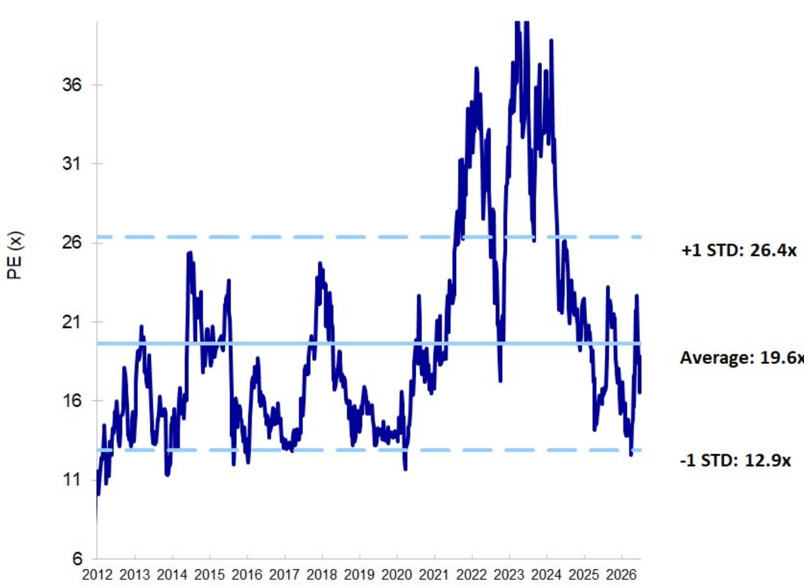
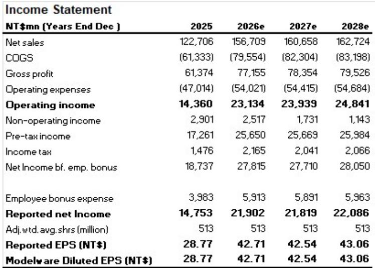
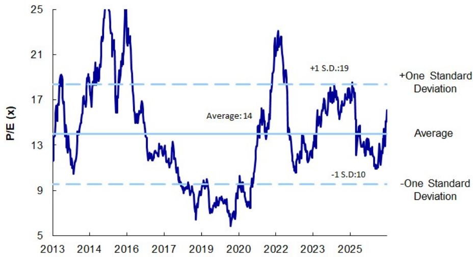

# MS：PC半导体补货不是需求驱动，而是供给焦虑

市场对PC半导体的共识是“需求平稳、库存偏高、短期难有显著变化”。MS最新发布的报告却提出了一个反直觉的判断：第三季度出货量大概率稳定，甚至部分关键元件还会环比增长。原因不是需求突然好转，而是客户开始担忧“买不到货”——一种名为FOMP（Fear of Missing Procurement）的情绪正在蔓延。

但出货量稳住并不等于所有公司都能喘口气。报告真正值得关注的信号，藏在毛利率的分化里。

## 1. 这轮补货不是需求驱动，而是供给焦虑

报告指出，成熟制程代工厂和封测产能的紧张，正在推高成本并限制供应。PC半导体的客户——品牌厂和模组厂——在三季度维持了持平的采购目标，CPU等核心芯片甚至还有进一步环比增长。驱动因素不是终端需求的回暖，而是客户担心若不提前锁定产能，后续可能面临缺货不确定性。

这与2020-2021年的“恐慌性补货”有相似之处，但一个关键区别在于，当下的产能紧张源头不在PC本身，而是服务器需求间接挤占了成熟制程产能。因此，PC半导体的供应紧张程度和持续时间，更多取决于服务器市场的节奏，而非PC自身的景气度。

> **KC评论：** 这意味着，单纯跟踪PC出货量来判断半导体公司业绩，可能已经不够了。需要同时关注代工厂和封测厂的产能利用率变化，以及服务器市场的排产节奏。

## 2. 规模与客户组合正在拉开毛利率差距

报告的核心洞察在于：所有PC半导体公司都在尝试将代工厂和封测的成本上涨转嫁给客户，但结果不会像疫情期间那样“水涨船高”。毛利率的分化将取决于三个变量——公司的规模、供应链管理能力、以及客户组合。

大型IC设计公司，如联咏和瑞昱，凭借强大的供应链议价能力和更完整的产品组合，有望维持甚至小幅提升毛利率。而规模较小的设计公司，如谱瑞和义隆，则可能无法完全转嫁成本，毛利率面临不确定性。

这一判断的逻辑在于：当产能紧张并非由下游需求拉动时，大客户更倾向于优先保障大供应商的产能。小公司不仅议价能力弱，还可能面临客户压价。

> **KC评论：** 读者在评估PC半导体公司时，不能只看营收增速。毛利率的走向比营收更重要。报告里那些关于客户集中度、产品线宽度和供应链关系的细节，值得仔细拆解。

## 3. 新的增长曲线才是长期区分的胜负手

报告没有停留在短期出货和毛利率的讨论上。它进一步指出，真正决定公司长期价值的，是能否找到PC之外的新增长驱动力。

报告特别提到了几个方向：义隆正在从非PC业务（主要是无人机）获得收入，预计2027年贡献中高个位数营收占比；谱瑞则受益于芯片组升级，2027年增长预期较高；瑞昱的100G DSP将在2026年放量，但400G产品要等到2028年；联咏在云端ASIC领域的进展则仍需更长时间。

这些新业务的进展，直接构成了报告对不同公司评级差异的基础。

## 4. 报告没有完全回答的关键问题

报告逻辑清晰，但有两个核心问题尚未完全展开。

第一，FOMP驱动的补货能持续多久？报告提到，部分客户可能低估了库存不确定性，尤其当Windows激活日逼近200天时，库存消化的不确定性会逐渐增大。但报告没有给出一个具体的“拐点”判断——即何时补货结束、转为去库存。

第二，毛利率的分化是否会进一步扩大？报告指出了规模与客户组合的作用，但没有量化不同情景下毛利率的弹性。如果代工厂和封测的成本继续上升，小公司的毛利率是否可能跌破盈亏平衡点？这需要读者结合各公司的成本结构自行推演。

这两个问题，恰恰是跟踪PC半导体行业时需要持续观察的关键变量。

---

*这份报告最值得反复看的，不是出货量预测，而是那张毛利率趋势图——它揭示了行业正在从“同涨同跌”进入“分化博弈”的新阶段。*

For informational purposes only. Portions may be generated,translated,summarized,or edited with AI assistance based on source materials and may contain omissions or errors. Please verify independently. This is not investment,legal,tax,accounting,or other professional advice.

For informational purposes only. Portions may be generated,translated,summarized,or edited with AI assistance based on source materials and may contain omissions or errors. Please verify independently. This is not investment,legal,tax,accounting,or other professional advice.

