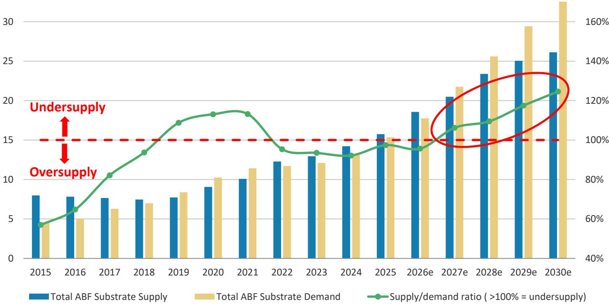
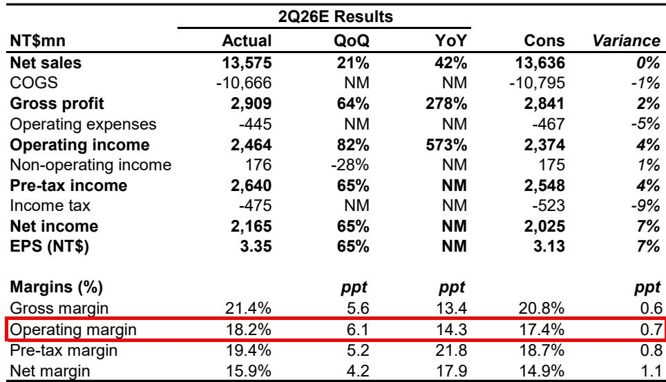
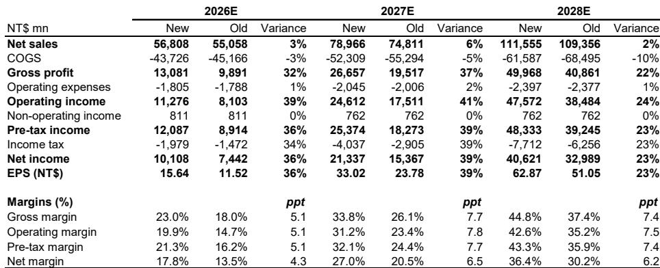

# ABF基板定价周期加速超预期，盈利潜力尚未充分反映

基板行业已进入一个比多数模型预期更强、更早的定价周期。台湾主要供应商的第二季度初步业绩已超出市场一致预期，驱动因素不仅是出货量，更是定价能力的复合增长快于预期。这并非周期性波动，而是AI硬件供应链关键瓶颈结构性重定价的开端。

传统观点认为，随着AI需求逐步提升，基板定价将温和改善。这一观点现已过时。2026年上半年的数据显示，某主要供应商的BT基板定价在单季度内上涨20%至30%，ABF基板定价上涨约10%。这些并非渐进式变动，而是定价环境的阶跃变化，对利润率、盈利轨迹以及最能捕捉这一趋势的供应商的相对吸引力具有直接影响。

其影响不仅限于即期的业绩超预期。ABF基板的供需缺口预计到2030年将扩大至25%的供应不足，高于此前22%的预估。这一缺口扩大并非仅由供应限制驱动，还受到终端需求结构变化的放大，尤其是来自超大规模企业设计的ASIC处理器以及中国AI芯片的需求。这些并非投机性需求驱动因素。亚马逊Trainium处理器和谷歌TPU系列的生产爬坡计划已上调，到2030年中国AI芯片的潜在市场规模预计比此前假设高出36%。

对于一直观望基板领域的观察者而言，进入窗口正在收窄。定价周期在加速，利润率在扩张，供需格局正随着每一个新数据点变得对供应商更为有利。问题已不再是周期是否会到来，而是它还能走多远，以及哪些公司最能抓住这一不成比例的上行空间。

## 定价拐点早于预期到来，利润率已开始响应

第二季度最重要的信号并非营收超预期，而是毛利率的扩张。欣兴电子4月初步业绩显示，毛利率比一致预期高出80个基点，南亚PCB的毛利率则超出市场预期60个基点。这些利润率超预期无法仅用产能利用率解释，它们反映的是定价环境从温和转向积极的速度远快于市场模型。

机制很简单。基板供应商所处的市场中，产能扩充至少需要两年才能上线。当需求加速快于产能响应时，定价权决定性地转向供应商。此次的不同之处在于需求驱动因素的规模和持续性。AI基础设施建设并非单一周期现象，而是全球最大科技公司的多年资本支出计划，并且还有独立于西方供应链的中国并行建设作为补充。

第二季度业绩表明，这种定价权已传导至利润表。南亚PCB的营业利润率同比扩大14.3个百分点。欣兴电子的营业利润同比增长240%。这些并非正常的周期性改善，而是定价上行周期的早期迹象，随着2026年下半年供应进一步收紧，这一周期仍有进一步空间。

## 供需缺口扩大，需求结构向有利供应商方向转变

更新后的ABF基板供需模型显示，到2030年供应缺口为25%，而此前预估为22%。这看似小幅修正，但其影响重大。缺口扩大并非单一因素驱动，而是多重需求侧修正共同强化结构性短缺的结果。

最重要的修正在于ASIC需求。亚马逊Trainium处理器在2027年至2030年期间的生产爬坡计划已上调。谷歌TPU系列同样上调。这些并非边际调整。ASIC的特点是芯片尺寸大、封装基板层数高，这意味着每单位消耗的ABF基板产能远超标准处理器。ASIC产量的每一次上调，都会转化为基板需求更大幅度的增长。

第二个修正在于中国AI芯片。到2030年中国AI芯片的潜在市场规模预计比此前假设高出36%。这是一个关键发展，因为中国AI芯片需求在很大程度上不受影响英伟达和AMD的全球供应链动态影响。它代表着一个独立增长的增量需求池，且需要由同样有限的基板产能来满足。

第三个修正在于GPU预测本身。英伟达和AMD的GPU需求在2026年至2030年期间已上调，模型现在明确纳入了英伟达的服务器CPU路线图，包括Grace和Vera平台。这增加了此前预估中未完全捕捉的又一需求层次。

这些修正的累积效应是，供需模型比基板行业近期历史上任何时刻都更为紧张。对供应商而言，这意味着定价权将远远延伸至当前周期之外。

## 定价轨迹预计将加速至2028年，部分供应商表现更优

定价前景已全面上调。ABF基板定价预计2026年同比增长20%至25%，2027年增长25%或更多。到2028年，定价增长预计将进一步加速，根据客户组合不同，同比增长25%至40%。

定价结果的分化很重要。并非所有供应商都能同等受益。欣兴电子因对大型客户敞口较高，预计2028年定价增长较为温和，约20%。南亚PCB历来在提价方面最为积极，预计同期定价增长将加速至40%或更高。这一差异不仅反映客户组合，也反映各供应商产能的相对紧张程度以及在受限市场中推动定价的意愿。

对观察者而言，这意味着定价周期并非均匀的顺风，而是一个差异化机会，青睐那些兼具产能限制、允许激进定价的客户关系以及面向最快增长需求领域的供应商。南亚PCB在这三个维度上似乎最为有利，这也解释了为何其2026年盈利预估上调36%，2027年上调38%。

## 报告提出关于周期可持续性及可能破坏周期的风险的关键问题

对定价上行周期的分析，必须诚实评估可能使其偏离轨道的风险。报告识别了四个主要风险，每个都值得仔细考量。

第一个风险是PC、通用服务器和AI服务器需求减弱。定价周期最终取决于AI基础设施支出的持续增长。如果超大规模企业缩减资本支出计划，或AI应用采用速度放缓，基板需求将软化，定价权将削弱。这是最重要的宏观风险，且无法完全通过选股来对冲。

第二个风险是重大的产能扩充计划。当前定价环境是供应限制的直接结果。如果供应商或新进入者宣布大规模产能扩充，市场可能开始计入未来供应过剩，即使产能两年后才能上线。报告指出，任何新产能扩充计划仅会影响2029年以后的供需动态，但市场可能更早开始贴现这一风险。

第三个风险是T-glass供应比预期更紧张。T-glass是先进基板的关键材料，任何供应中断都可能限制供应商满足需求的能力，即使产能可用。这是一个供应侧风险，短期内可能矛盾地支撑定价，但会限制出货量。

第四个风险是CoWoS取代ABF基板。CoWoS是一种先进封装技术，如果被更广泛采用，可能减少对ABF基板的需求。这是一个可能完全改变需求方程的结构性风险。报告对此风险未给出明确看法，它仍是长期观察者面临的最重要的开放性问题之一。

## 观察者应如何思考在此周期中的定位：一个决策框架

基板定价周期呈现明确机会，但也需要纪律性的决策框架。以下框架旨在帮助观察者评估其敞口并做出知情选择。

第一个维度是时间跨度。定价周期在未来12至24个月内最为可见和确定。供应限制具有约束力，需求在加速，产能扩充最早要到2029年才能上线。对于一到两年跨度的观察者，持有基板供应商的理由充分。对于更长跨度的观察者，产能扩充或技术替代的风险变得更加相关，仓位规模应反映这一不确定性。

第二个维度是公司选择。定价周期并非均匀。欣兴电子提供最高上行空间。南亚PCB提供35%的上行空间，但定价轨迹更为激进，且有捕捉定价收益的可靠记录。臻鼎提供更为温和的15%上行空间，且似乎对ABF基板定价周期的直接敞口较小。这些公司之间的选择应取决于观察者对定价轨迹的信心以及对各公司特定风险的风险承受能力。

第三个维度是颠覆风险。CoWoS和其他先进封装技术代表了对ABF基板的真正长期风险。观察者应监控这些技术的采用率，并准备在风险显现时调整仓位。这不是回避该领域的理由，但却是保持警惕并相应调整仓位规模的理由。

第四个维度是中国因素。中国AI芯片需求的上调增加了一个独立于西方超大规模企业支出的重要增量需求驱动因素。这对基板供应商是利好，但也引入了难以建模的地缘政治风险。观察者应意识到，中国需求驱动因素可能受到出口管制、贸易政策或国内技术发展变化的影响。

## 完整报告包含详细的供需模型、定价假设和公司特定预估，此处无法全部呈现

本文概述了基板定价周期的关键论点及其影响，但完整报告包含做出知情决策所必需的细节水平。供需模型包括到2030年的逐年预测，包含关于产能扩充、利用率和定价轨迹的明确假设。公司特定部分包括详细的盈利预估、利润率预测和风险评估，远超本文所呈现的内容。

报告还包含原始图表，展示了亚马逊Trainium预估、谷歌TPU预估、中国AI芯片需求以及供需缺口随时间的变化。这些图表无法在文本中复现，它们提供了驱动定价周期的结构性变化的视觉呈现。

对于希望了解完整图景的观察者，包括支撑结论的具体假设，完整报告是值得读材料。

加入社区阅读完整报告并查看原始图表。

*仅供参考。部分内容可能基于源材料通过AI辅助生成、翻译、总结或编辑，可能存在遗漏或错误。请独立核实。本文不构成专业建议。*

仅供参考。部分内容可能基于源材料通过AI辅助生成、翻译、总结或编辑，可能存在遗漏或错误。请独立核实。本文不构成专业建议。

