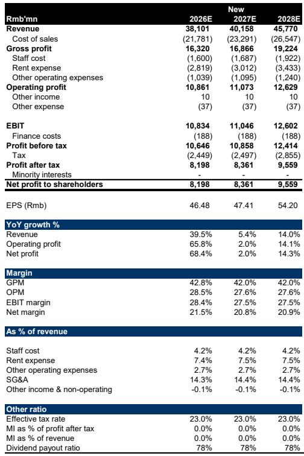
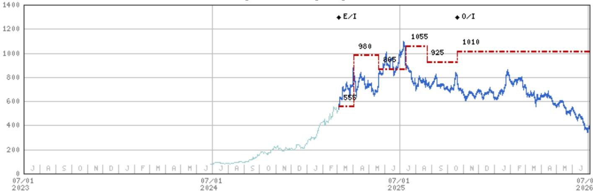
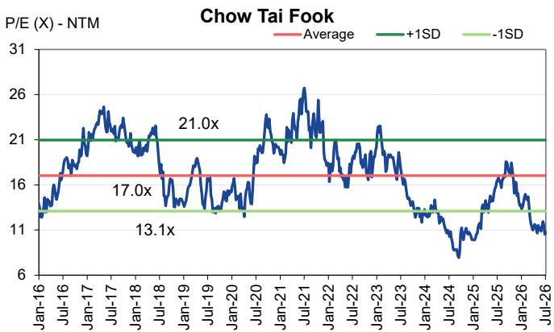

# MS：老铺黄金的真正考验不是金价，是品牌能否撑住定价

老铺黄金（6181.HK）这份1H26业绩预览，最值得关注的判断不是二季度销售走弱本身，而是这家公司正在经历上市以来第一次真正的品牌不确定性测试。表面上看是估值倍数压缩——从20倍2026年PE降至11倍——但更深层的判断是：老铺黄金的品牌溢价能力，将在金价节奏变化周期中接受市场重新定价。

这份报告的核心矛盾在于：一季度贡献了上半年74%的收入和77%的利润，但二季度月均收入可能只有20亿元，甚至低于3月单月26亿元的含税销售水平。增长数字依然亮眼——上半年收入预计同比增长85%至229亿元，净利润增长112%至48亿元——但结构已经出现变化。

## 1. 二季度需求走弱不是周期问题，是定价策略的连锁反应

MS在报告中引用了周大福4-5月的同店销售数据：固定价格珠宝仅增长3%，而按克计价的黄金产品增长35%。老铺黄金几乎全部是固定价格产品，且2月底刚完成一轮25-30%的提价，紧接着金价就开始回落。

> **KC评论：** 这里的关键不在于金价涨跌，而在于老铺黄金的定价逻辑。当金价上涨时，固定价格产品相当于隐性的折扣——消费者用更少的钱买到更多黄金。金价回落时，这个逻辑反转了。报告没有直接说，但读者可以追问：如果金价继续节奏变化，老铺要不要降价？如果降价，品牌定位怎么办？

报告预期二季度毛利率反而从一季度的41%提升至45%，全年净利率从2025下半年的17.4%扩张至21%。毛利率扩张来自提价，但收入下滑说明量在调整。价格和销量之间的平衡，是这份报告最值得深挖的变量。

## 2. 估值压缩到7倍PE以下，但市场在等一个更清晰的品牌叙事

当前报价约380港元，已经回到2025年1月的水平——那时金价约2600美元/盎司，比现在低约35%。MS认为，当时市场对老铺的认知还很有限（IPO仅半年），而现在公司已经进入了中国头部奢侈品商场，品牌认知度显著提升。但估值倍数却从20倍降至11倍，甚至低于周大福在2024年中期8倍PE的周期底部估值。

报告在估值部分做了一个很有意思的对比：周大福在2024年中期正处于运营低谷——门店关闭、零售额下降、FY25全年收入下滑18%。而老铺黄金仍在品牌建设和客户获取阶段，中期增长预期远强于周大福。但市场给老铺的估值倍数，已经低于周大福当时的周期底部。

> **KC评论：** 这里实际上提出了一个估值锚定问题。市场把老铺当作黄金周期股来定价，但MS认为它应该被看作正在崛起的本土奢侈品牌。如果品牌建设成功，估值溢价应该存在；如果品牌故事在金价节奏变化中被证伪，当前估值可能仍然有节奏变化空间。

## 3. 报告尚未完全回答的关键问题：管理层在金价节奏变化周期会选择什么策略

8月业绩发布会将是市场最关注的事件。MS明确列出了两个核心问题：管理层在金价节奏变化期是维持当前定价、承受销量不确定性，还是降价并调整产品结构以支撑需求？门店网络策略是理性调整，还是继续升级扩张？

这两个问题没有标准答案，但决定了老铺黄金未来2-3年的增长路径。如果选择维持定价，毛利率可以保持高位，但同店销售可能持续走弱，估值难以修复。如果选择降价，短期内可以拉动销量，但品牌定位可能受损。

报告在熊市情景中假设金价持续下跌、需求进一步走弱。牛市情景则假设金价重新进入上行周期，或即便金价走弱但老铺凭借品牌力持续获取份额。两种情景的估值差异接近5倍，这正是品牌溢价这个变量带来的不确定性。

## 4. 一个值得持续跟踪的观察框架

对于关注老铺黄金的读者，这份报告提供了一个清晰的观察框架，可以简化为三个维度

第一，定价策略的稳定性。如果管理层在8月业绩会上明确表示不会降价，那说明品牌定位优先于短期销售，这是一个积极的信号——但前提是市场愿意接受短期业绩不确定性。

第二，同店销售与金价的脱钩程度。如果二季度弱销售只是金价波动带来的短期扰动，三季度同店销售能够企稳，市场对老铺的品牌韧性会有新的定价。反之，如果同店销售持续弱于周大福固定价格品类，说明问题可能出在品牌而非周期。

第三，门店扩张的质量。老铺正处于从少数核心门店向全国扩张的阶段，但扩张速度与品牌稀缺性之间存在天然矛盾。报告下调了2027-28年门店扩张预期，这是一个务实的调整。扩张节奏的调整，本身就是在保护品牌溢价。

MS这份报告的价值，而在于它把老铺黄金的估值问题从一个简单的金价周期问题，变成了一个品牌建设进程的观察问题。金价涨跌是外生变量，品牌能否在金价节奏变化周期中证明定价权，才是决定中长期回报的核心。

For informational purposes only. Portions may be generated,translated,summarized,or edited with AI assistance based on source materials and may contain omissions or errors. Please verify independently. This is not investment,legal,tax,accounting,or other professional advice.

For informational purposes only. Portions may be generated,translated,summarized,or edited with AI assistance based on source materials and may contain omissions or errors. Please verify independently. This is not investment,legal,tax,accounting,or other professional advice.

