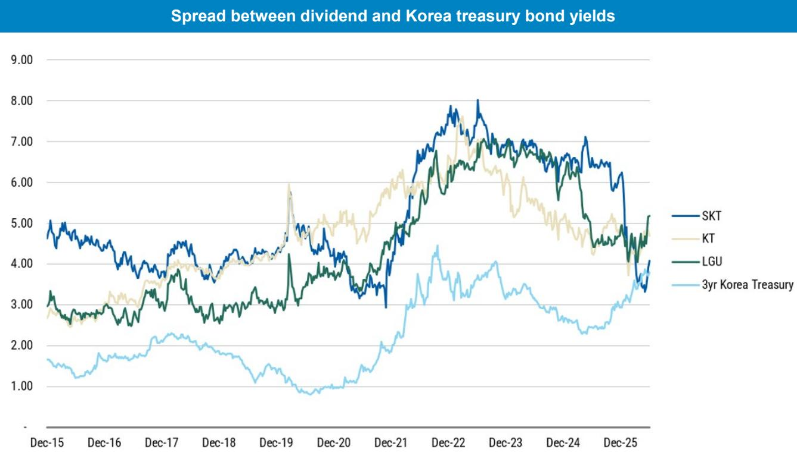
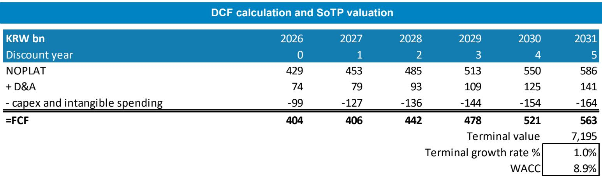
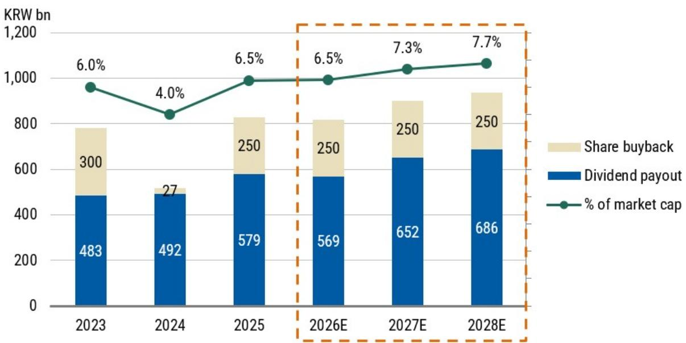

# MS：韩国电信的AI数据中心叙事，不是红利股而是新基建期权

当市场习惯用“红利股”框架审视韩国电信运营商时，MS一份最新报告试图修正这个视角。报告的基本判断是：2026年韩国电信业将迎来运营环境的稳定，但真正驱动价值重估的变量，已从传统的用户增长和ARPU提升，转向了AI数据中心带来的资本配置转变和股东回报的持续兑现。这背后，是一场关于“钱往哪投”的结构性决策。

报告没有停留在电信主业企稳的常规判断上。它更想表达的是，韩国电信运营商正在从一个资本密集、竞争格局固化的行业，蜕变为一个兼具“稳定现金流”和“AI新基建期权”的混合体。而这三家运营商——LG U+、KT、SK电讯——各自的处境和选择，恰好构成了理解这一转型的三个切片。

## 1. 数据主权正在成为韩国AI数据中心需求的真实推手

AI数据中心的建设计划动辄以GW计，但MS指出了其中一条容易被忽略的硬约束：数据主权。报告明确提到，韩国的存储器、国防和资金服务行业对数据跨境流动有严格限制。这意味着，即使全球公有云服务再便利，这些行业也必须在本土完成AI推理。

这并非一个遥远的假设。三星集团决定在所有业务领域部署外部AI服务，就是一个加速器。当韩国拥有全球最高的AI聊天机器人使用率之一时，企业级AI应用的落地，必然要求本地化的推理算力。由此推算，韩国本土AI数据中心的建设，不是“可选项”，而是“必选项”。

> **KC评论：** 数据主权带来的本地算力需求，是很多区域AI研究故事中容易被低估的变量。这份报告提醒读者，在关注AI研究时，不应只看算力总量，更要看“算力在哪里生成”。对于韩国电信运营商而言，这意味着一部分资本开支的投向，将从传统的通信设备转向数据中心基础设施。

## 2. 运营商分化加剧：成本重构者、战略观望者与AI资产持有者

MS对三家运营商给出了不同的判断框架，背后是截然不同的价值逻辑。

LG U+被列为首选，理由很直接：2025年完成的人力重组将在2026年释放显著的盈利弹性。报告预期管理层会利用更高的盈利基础来增加公司回购。这是一个典型的“成本优化+股东回报”故事，路径清晰，可预见性强。

KT则处于“等待新管理层出牌”的阶段。新的管理团队在AI和股东回报方面的战略方向尚未完全明朗，市场需要更多信号来定价。这并非谨慎，而是意味着当前估值中尚未充分反映其潜在的战略变化。

SK电讯的定位最为特殊。报告指出，其AI资产的价值已经成为报价的核心驱动力，而股息的恢复是一个积极信号。但问题也在这里：当市场开始用AI资产而非电信运营利润来定价SK电讯时，其估值框架就变得复杂。它不再是一个纯粹的电信公司，而是一个“电信+AI”的混合体，这对其资本配置和读者沟通提出了更高要求。

## 3. 报告尚未完全回答的关键问题：AI研究的回报周期与股东回报之间的张力

报告在强调AI数据中心机遇的同时，也描绘了一个庞大的研究蓝图：SK集团、GS和Naver计划建设8.4GW的AI数据中心容量，背后是550万亿韩元的研究承诺，长期目标更是达到18.4GW和超过1000万亿韩元。这个数字令人瞩目，但报告并没有深入拆解，这些研究将由谁来承担、回报周期多长。

对于电信运营商而言，这是一个根本性的权衡。一方面，股东回报（回购、分红）是当前估值的核心支撑；另一方面，AI数据中心建设需要大量且持续的前期资本开支。报告提到了“资本配置转向数据中心”，但并未说明，这种转向是否会在未来几年内挤压自由现金流，从而影响股东回报的可持续性。

> **KC评论：** 这个问题可能是理解韩国电信股未来估值分歧的关键。如果AI数据中心的回报表现周期长于市场预期，或者初期以亏损换份额，那么当前的“价值提升”叙事可能会面临修正。读者在阅读完整报告时，应重点关注其对自由现金流和资本开支节奏的详细拆解。

## 4. 给读者的观察框架：别只看股息率，要看资本配置的优先级

对于关注韩国市场的读者，MS这份报告提供了一个更细致的观察框架。传统的电信股分析往往聚焦于股息率、用户份额和ARPU。但在这个时点，需要增加一个维度：资本配置的优先级排序。

报告中的一张图表显示，韩国电信运营商的估值在亚太电信板块中仍然偏低。但这并不意味着所有公司都值得以同样的逻辑观点偏积极。你需要问的是：这家公司是选择将更多的自由现金流用于回购，还是投入AI数据中心？其管理层是否有清晰的、可沟通的资本配置策略？如果AI研究是长期的，公司是否愿意牺牲短期的股东回报来换取未来的增长期权？

不同公司对这个问题的回答，将决定其未来几年的估值走向。LG U+的路径相对清晰，而SK电讯的路径则更依赖于市场对其AI资产的估值认可。KT则是一个有待观察的变数。

For informational purposes only. Portions may be generated,translated,summarized,or edited with AI assistance based on source materials and may contain omissions or errors. Please verify independently. This is not investment,legal,tax,accounting,or other professional advice.

For informational purposes only. Portions may be generated,translated,summarized,or edited with AI assistance based on source materials and may contain omissions or errors. Please verify independently. This is not investment,legal,tax,accounting,or other professional advice.

