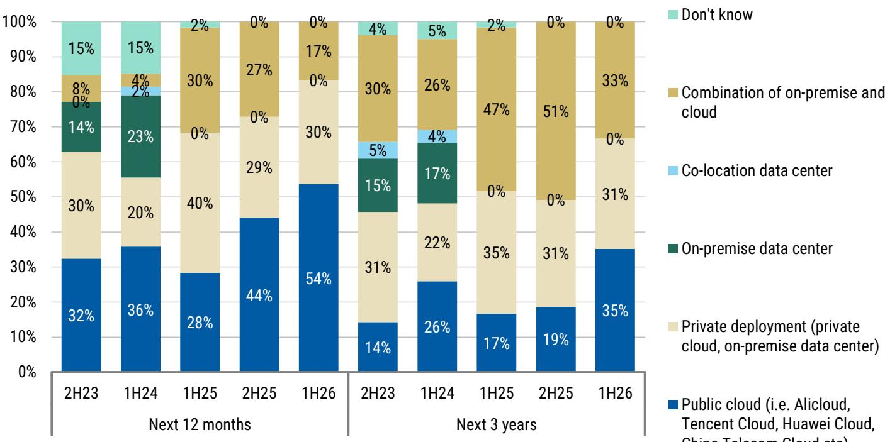
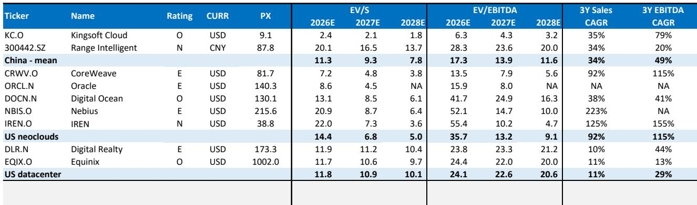
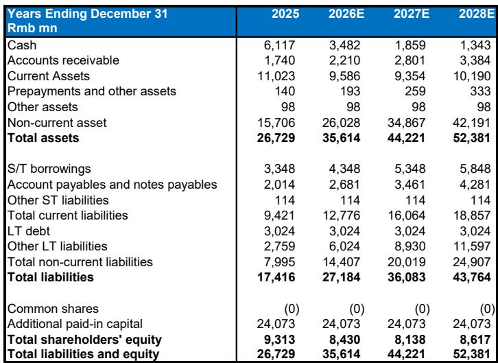

# 金山云AI转型：不只是业务好转，更是中国中层云模式的结构性重估

关于中国云计算领域，长期以来有一种普遍认知：规模是相对少见持久的优势。阿里巴巴、腾讯和华为掌控着基础设施层，其他参与者只能在剩余的商品化业务上拼价格。金山云曾多年身处这一假设之中——一家拥有良好企业关系的中层玩家，却找不到出路摆脱该领域传统业务固有的利润压缩。如今，这一叙事已经过时。

金山云完成了一项全球多数中层云服务商仅停留在讨论阶段的转型。它从商品化云服务转向了AI原生基础设施，财务上的转折点已经显现。2025年第四季度，AI云贡献了总营收的34%，其轨迹指向到2028年该占比将超过60%。更重要的是，GPU云的单元经济结构优于公司正在系统性地剥离的CDN和通用计算业务。这不是周期性的复苏，而是一场商业模式变革，它改变了公司的利润潜力、现金流状况以及在中国AI供应链中的战略相关性。

时机至关重要。中国的AI基础设施市场正进入一个阶段：高端GPU计算需求超过供给，全球芯片短缺带来了中国公有云行业从未享有过的定价能力。金山云有望抓住这一定价能力，同时受益于一个核心生态系统——小米和金山集团——它们提供了资金承诺和差异化的应用场景。研究的核心不在于AI需求是否真实，而在于这家特定公司能否维持其营收增长率、将利润率扩大到行业领先水平，并管理好GPU密集型基础设施带来的资本强度。

答案取决于三个结构性疑问，这些疑问在启动报告中提出但未完全解答——而这些问题正是愿意超越表面数字的观察者可以深入分析的机会所在。

## 金山云全面AI战略带来的营收转折，多数中层玩家难以复制

启动报告中最重要的数据点并非营收复合年增长率或EBITDA利润率预测，而是收入构成的转变。AI云营收在大约两年内从微不足道增长到总营收的34%，报告预计到2028年这一数字将超过60%。这不是渐进式增长，而是对公司营收基础的重新定义。

这一转变之所以可信，在于其背后的机制。金山云并非通过构建自有模型或在基础基础设施上与超大规模云商竞争来转向AI。它将自己定位为纯粹的AI云服务商，提供基于开源大语言模型的GPU计算能力、模型优化服务和推理基础设施。这与公司运营多年的商品化云服务有着本质区别。GPU云服务的毛利率更高，由于集成需求，客户粘性更强，而且由于供应限制真实存在，定价环境也较为有利。

报告指出，在近期的芯片短缺期间，中国公有云服务商已提高价格——这是该行业数十年来未曾见过的现象。对于一家此前在产能过剩的市场中靠价格竞争的公司而言，这种定价能力的转变是最重要的利润驱动因素。金山云无需赢得价格战，它需要在需求超过供给时保持定价纪律，而早期证据表明它正在这样做。

这里有一个值得关注的二阶影响。如果金山云能够在传统CDN业务持续萎缩的同时维持AI营收增长率，那么公司的营收质量将显著提升。高利润的AI营收取代低利润的商品化营收，这种结构转变带来的运营杠杆效应是巨大的。报告预测EBITDA利润率从2025年的24%提升到2028年的57%，这依赖于这种结构转变的持续，但其背后的逻辑是合理的。AI云具有更好的单元经济，而公司正在快速扩大其规模。

## 小米-金山生态系统提供需求基础，降低执行风险，但外部客户增长才是真正考验

报告明确指出，小米和金山集团的关系不仅仅是股东安排。这是一个运营生态系统，在智能手机、AIoT设备、电动汽车、办公软件和游戏领域提供差异化的AI应用场景。小米凭借MiMo进入AI模型市场，并承诺在2026年持续进行高强度的AI投入，这直接导致小米与金山云之间的关联交易额度上限在2026年和2027年上调了27%至47%。

这一生态系统基础之所以重要，有两个原因。首先，它提供了基础需求，降低了转型期间的营收风险。金山云无需赢得每一个外部客户就能实现近期目标，因为生态系统提供了可预测且不断增长的营收来源。其次，生态系统提供的应用场景比通用计算更为复杂——而复杂性通常意味着更高的利润率和更长的客户关系。

但报告也指出，金山云管理层表示，外部客户的增长甚至比生态系统业务增长得更快。这是关键变量。如果公司能够证明它正在从与小米或金山无关的超大规模云商和AI实验室赢得AI云合同，那么研究逻辑就超越了单纯的生态系统故事，成为在中国AI基础设施市场中真正的竞争地位。

报告未明确回答的问题是，金山云的外部客户获取是可持续的还是机会性的。当前的芯片短缺意味着任何拥有GPU容量的服务商都能吸引客户。真正的考验将在供应限制缓解、超大规模云商能够建立自身产能时到来。届时，金山云需要证明其模型优化能力、基于开源大语言模型的MaaS业务以及服务质量足以留住那些有其他选择的客户。

## 利润率轨迹可信，但资本强度带来融资约束，报告未完全解决

报告预测，金山云的EBITDA利润率将从2025年的24%提升至2028年的57%，调整后营业利润率在2027年转正，到2028年达到7%。对于一家两年前在运营层面几乎不盈利的公司来说，这些目标颇具雄心。其背后的逻辑是合理的——GPU云具有更好的单元经济，定价环境有利，公司正在剥离低利润的传统业务。

但利润率扩张与资本强度之间存在张力，报告承认了这一点但未完全解决。财务摘要显示，资本支出预计将从2025年的47亿元人民币增长到2028年的111亿元人民币。自由现金流在2027年之前仍为负值，直到2028年才转正。公司正在大力投资GPU基础设施，这些投资的折旧将拖累报告利润，即使EBITDA有所改善。

报告使用EBITDA作为主要估值指标，并指出不同公司折旧政策的差异使得EBIT比较不可靠。这是一种合理的方法，但这意味着观察者需要透过EBITDA数字来理解业务的实际现金生成能力。公司今天大力投入以建设产能，这些产能将在未来几年产生营收和现金流。问题在于，这些投入资本的回报是否能证明支出的合理性。

报告的基本情景假设金山云将遵循行业领先者的利润率轨迹，在三到五年内保持稳定差距，达到低两位数的EBIT利润率。乐观情景则假设在MaaS业务支持下，资产回报表现和利润率更高。但报告未提供GPU云与MaaS业务单元经济的详细分析，也未模拟回报对GPU定价或利用率变化的敏感性。这些正是严肃的观察者在接受利润率预测之前需要回答的分析性问题。

## MaaS是研究逻辑中最重要的未解变量

报告将金山云的MaaS业务——基于开源大语言模型——视为基本情景中未完全体现的潜在上行来源。乐观情景明确假设MaaS贡献增加，从而推动更高的资产回报表现和利润率。但报告未提供MaaS业务的具体营收或利润率预测，也未将金山云的MaaS能力与竞争对手进行对标。

这是研究逻辑中最重要的未解问题。GPU云基础设施是资本密集型业务，差异化主要来自硬件获取和定价纪律。相比之下，MaaS是利润率更高、价值更高的服务，需要模型优化专业知识、软件集成能力和客户关系管理。如果金山云能够建立有意义的MaaS业务，利润率轨迹可能显著优于基本情景。如果MaaS仍然只是小规模贡献，公司将仍然依赖GPU云的利润率，这虽然不错但并非卓越。

报告指出，金山云拥有强大的模型优化能力，小米生态系统为MaaS应用提供了天然的试验场。但报告未提供证据表明公司已从外部客户赢得重要的MaaS合同，也未将金山云的MaaS产品与大型竞争对手或专业AI初创公司进行比较。

对于考虑该公司的观察者而言，MaaS问题是最需要独立分析的。GPU云业务相对容易建模——它取决于容量、利用率和定价。MaaS业务更具不确定性，但也是上行潜力最大的地方。报告乐观情景下每股27美元的目标价依赖于MaaS的贡献，观察者需要形成自己的判断，看这是否现实。

## 评估金山云的关键变量框架

启动报告为决策提供了原材料，但并未替您做出决定。以下是思考关键变量的框架。

首先，评估定价环境的可持续性。金山云的利润率扩张依赖于GPU云定价保持有利。如果全球芯片短缺缓解速度快于预期，或者中国超大规模云商过度建设产能引发价格战，利润率轨迹将恶化。报告的基本情景假设定价纪律得以维持，但这是一个需要持续关注的变量。

其次，评估外部客户管道。生态系统业务提供了底线，但上行空间取决于赢得小米和金山之外的客户。寻找合同签订、营收集中度趋势和客户留存率的证据。如果外部客户增长放缓，研究逻辑将更加依赖生态系统，而这是一个较小的可寻址市场。

第三，对资本强度进行建模。报告显示自由现金流在2028年转正，但从2025年到2027年的累计负自由现金流相当可观。公司需要通过债务或股权为这些投资融资，资本成本至关重要。更高的利率或受限的资本市场准入将限制公司投资GPU容量的能力，从而限制营收增长。

第四，形成对MaaS的看法。这是结果范围最广的变量。如果MaaS成为有意义的营收贡献者，利润率轨迹可能超过基本情景。如果MaaS仍然是小众业务，公司将是一家纯粹的GPU云服务商，利润率良好但并非卓越。报告未提供足够数据来解决这个问题，因此独立分析至关重要。

## 报告未告诉您的内容——以及为何这创造了机会

每一份启动报告都会留下未解答的问题，分析的价值在于识别哪些问题最为重要。这份报告在营收轨迹、利润率逻辑和生态系统动态方面表现出色。但在定价环境的可持续性、投资周期的资本结构影响以及MaaS市场的竞争动态方面则不够清晰。

这些并非报告的弱点。它们是分析上的空白，为愿意投入工作的观察者创造了机会。市场将基于GPU云增长和利润率扩张的基本情景假设对金山云进行定价。如果MaaS业务带来上行，或者定价环境比预期更持久，公司的估值将得到重估。如果资本强度造成融资压力，或者外部客户增长令人失望，下行风险是真实存在的。

报告将金山云列为大中华区IT服务和软件覆盖中的首选，并给予超配评级。但这一评级能否实现，取决于那些可知但尚未知晓的变量。启动报告为您提供了地图。剩下的，是判断。

加入社区阅读完整报告并查看原始图表。

*仅供参考。部分内容可能基于源材料通过AI辅助生成、翻译、总结或编辑，可能存在遗漏或错误。请独立核实。这不构成投资、法律、税务、会计或其他专业建议。*

仅供参考。部分内容可能基于源材料通过AI辅助生成、翻译、总结或编辑，可能存在遗漏或错误。请独立核实。这不构成投资、法律、税务、会计或其他专业建议。

