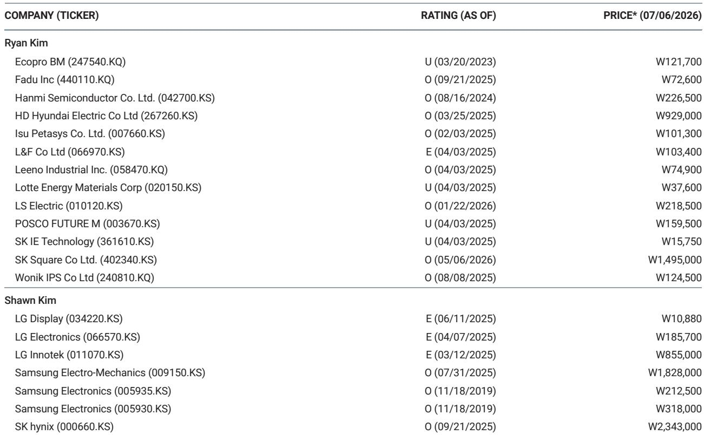
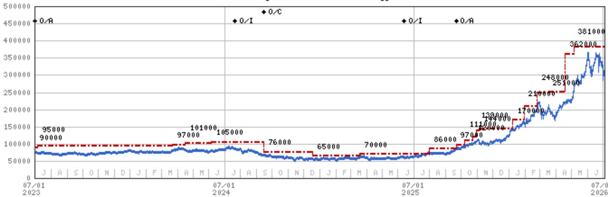
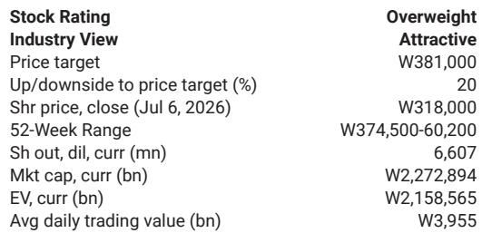

# MS：三星存储利润接近92万亿韩元，产能约束成定价权来源

市场对三星电子2026年第二季度初步业绩的反应是“符合预期”——营收171万亿韩元，营业利润89.4万亿韩元，同比分别增长129%和1810%。但MS在这份报告中传递的核心判断是：**这份业绩是过去时，真正的机会在未来的利润爬坡。**

报告认为，三星仍处于一轮急剧的利润复苏周期中段。尽管报价年初至今已上涨165%，但尚未完全反映即将到来的盈利规模。7月30日的业绩沟通会，很可能成为市场重新定价的关键节点。

## 1. 存储利润接近92万亿韩元，产能约束成为定价权来源

MS估算，三星第二季度存储业务利润接近92万亿韩元，主要驱动力来自大宗DRAM和NAND的强劲定价。相比之下，晶圆代工和LSI业务的亏损已收窄至约2万亿韩元。手机和家电合计小幅亏损约1万亿韩元，显示面板业务则因季节性需求贡献了7000亿韩元利润。

报告特别指出，员工奖金拨备约占营业利润的10%，这意味着实际经营利润率更高。若剔除这一一次性因素，存储业务的经营利润率已超过70%。

> **KC评论：** 产能约束通常被视为行业周期的谨慎信号，但MS的逻辑是——在AI驱动的需求结构下，约束恰恰意味着定价权。这份报告里值得细看的是其对DRAM ASP增长56%的假设，以及“计算功耗比”如何让三星的先进节点优于同行。

## 2. 2026年存储利润有望同比增长超1100%，但市场仍在用旧框架定价

报告模型显示，2026年三星存储利润将增长超过1100%，逼近412万亿韩元。这一数字意味着三星的盈利规模将接近历史峰值。但当前报价隐含的预期，尚未完全定价这一爬坡速度。

MS认为，市场对三星的估值框架仍停留在“周期高点即卖点”的传统叙事中。而这一轮周期的不同之处在于：AI和超大规模数据中心的需求结构，可能延长存储上行周期的持续时间。

报告同时提及，即将签署的长期协议将增强盈利的可预测性，这一点在以往的存储周期中并不常见。

## 3. 报告尚未完全回答的关键问题：资本回报能否成为第二驱动力

报告暗示，资本回报的提升可能是三星报价进一步跑赢的支撑因素。但这一判断的验证，需要等待7月30日沟通会上管理层对股东回报政策的明确表态。

另一个悬而未决的问题是：晶圆代工业务的亏损何时能真正收窄至盈亏平衡点？报告仅提到亏损约2万亿韩元，但未给出明确的扭亏时间表。考虑到代工业务的资本密集度和竞争格局，这一变量的不确定性仍较高。

> **KC评论：** MS对三星的定价逻辑，本质上是在赌“市场对存储周期的认知切换”。如果7月沟通会给出超出预期的资本回报计划或代工业务改善路线图，那么当前报价可能只是这一轮重估的起点。完整报告中的估值方法论和不确定性因素拆解，值得仔细阅读。

## 4. 决策者的观察框架：关注三个信号而非一个数字

对于关注三星或存储周期的读者，MS这份报告提供了一个三层观察框架：

第一层是定价信号。DRAM和NAND的现货价格走势，以及三星与主要客户的新一轮LTA谈判结果，将直接决定下半年盈利的可见度。

第二层是产能信号。三星在HBM和先进DRAM节点的产能扩张节奏，决定了其在AI需求中的份额获取能力。报告强调“前所未有的产能约束”，这一判断是否成立，需要对照三星的实际资本开支计划。

第三层是估值信号。当前12个月远期市盈率约6.6倍，与历史周期峰值仍有距离。但MS认为，一旦市场开始以“盈利爬坡中段”而非“周期高点”来定价，估值重估的空间可能比多数读者预期的更大。

这份报告的核心价值，不在于给出了一个目标报价，而在于提供了一个重新理解存储周期的视角——当需求结构从消费电子转向AI基础设施，传统的周期框架可能需要被修正。

For informational purposes only. Portions may be generated, translated, summarized, or edited with AI assistance based on source materials and may contain omissions or errors. Please verify independently. This is not investment, legal, tax, accounting, or other professional advice.

For informational purposes only. Portions may be generated, translated, summarized, or edited with AI assistance based on source materials and may contain omissions or errors. Please verify independently. This is not investment, legal, tax, accounting, or other professional advice.

