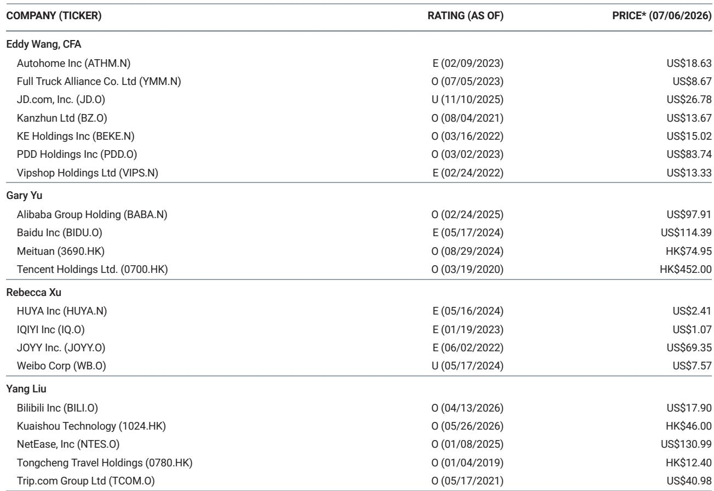
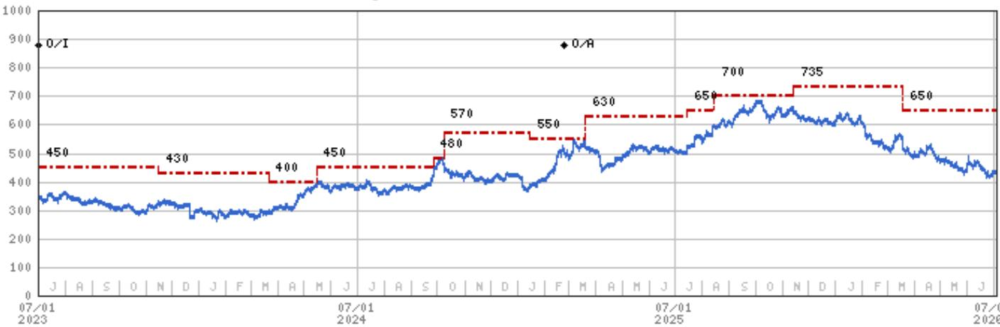
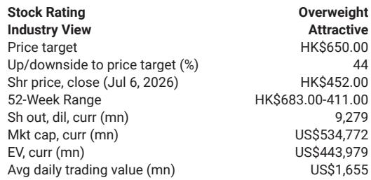

# MS：腾讯混元3不是参数竞赛，而是产品效率拐点

这份7月6日发布的MS研报，聚焦腾讯混元3正式版（Hy3）的发布。报告的核心判断并不在于模型本身的参数规模或基准排名，而在于Hy3带来了一个更值得关注的信号：腾讯的AI能力正在从“实验室展示”走向“产品内可验证的效率提升”。对于一家拥有超10亿用户生态的公司，这种从模型到产品的闭环能力，可能比单点模型性能更具长期价值。

报告明确指出，Hy3保留了MoE架构（295B参数，21B活跃参数，256K上下文），在软件开发、办公效率、资金建模、前端设计和游戏生产等生产力任务上取得了“有意义的提升”。但真正让这份报告区别于一般模型评测的，是它呈现了一个“产品反馈-模型优化”的正向循环。

## 1. 工作流效率的提升，是比基准分数更硬的指标

报告中最具说服力的数据来自腾讯内部产品的实际表现。WorkBuddy的任务解决率从72%升至90%，平均完成时间缩短34%。元宝Agent在办公和生活服务场景的基准评估中，超过了多个国内主流模型。IMA、Mavis Agent、微信读书、WeGame AI助手和代码生成能力也均有改善。

> **KC评论：** 这些数字比SWE-Bench上的排名更能说明问题。因为它们是真实用户场景下的端到端表现，不是实验室里的孤立测试。对于读者而言，关注点应从“模型跑分”转向“模型能否让现有产品的用户留存或付费转化产生变化”。

这背后是腾讯产品矩阵提供的独特优势：广泛的真实世界反馈数据，让模型优化有了明确的方向。反过来，模型能力的提升又能惠及所有集成产品。这种“转移性改进”意味着，腾讯在AI上的投入不是单点突破，而是能通过生态放大收益。

## 2. 定价策略暗示了规模化商业化的路径

报告提到，腾讯云API定价为输入1元/百万token、输出4元/百万token，缓存命中输入0.25元/百万token。这一价格水平显著低于行业平均水平。结合Hy3的开源策略，可以推断腾讯的AI商业化思路并非追求模型调用本身的利润率，而是通过低价和开源吸引开发者，扩大模型在生态内的渗透率。

> **KC评论：** 这种定价策略与腾讯过往的“基础服务免费+增值服务收费”逻辑一脉相承。当模型能力成为微信、企业微信、腾讯文档、腾讯云等产品的底层能力时，调用收入本身可能不是核心KPI。更值得关注的，是AI能否提升这些产品的用户粘性、付费转化或广告变现效率。

## 3. 报告尚未完全回答的关键问题：用户感知何时转化为财务数据

尽管产品层面的改进清晰可见，但研报并未给出这些AI功能对腾讯整体营收或利润的量化贡献。WorkBuddy效率提升34%，对腾讯的企业服务收入意味着什么？元宝Agent的基准领先，能否转化为用户增长或使用时长？这些是报告留下了但未完全展开的追问。

对于决策者而言，Hy3的发布是一个重要的验证节点，证明腾讯在AI上的投入开始产生可衡量的产品效果。但下一个关键观察窗口，将是这些产品改进能否在季度财报中体现为收入端的加速或成本端的优化。在此之前，Hy3的意义更多在于“确认路径可行”，而非“宣告拐点已至”。

For informational purposes only. Portions may be generated,translated,summarized,or edited with AI assistance based on source materials and may contain omissions or errors. Please verify independently. This is not investment,legal,tax,accounting,or other professional advice.

For informational purposes only. Portions may be generated,translated,summarized,or edited with AI assistance based on source materials and may contain omissions or errors. Please verify independently. This is not investment,legal,tax,accounting,or other professional advice.

