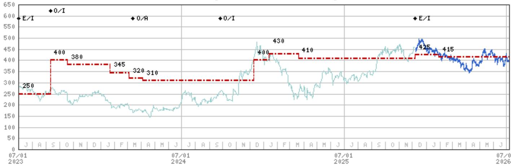
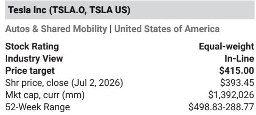

# MS：特斯拉Robotaxi迈阿密落地，安全数据才是真正变量

这份MS研究发布在特斯拉迈阿密robotaxi正式运营之后。市场此前对robotaxi的推进节奏存在疑虑——4月下旬以来，第三方追踪数据显示活跃车队数量有所下降。但迈阿密的落地，以及新奥尔良等地出现测试车辆的迹象，让分析师认为，市场会重新评估这一进展的积极意义。

但真正值得关注的，不是车队规模本身。

## 1. 安全数据的斜率，比车队数量更能定义“成功”

MS在报告中明确指出，读者对特斯拉自动驾驶业务的“成功”感知，将主要由事故间隔里程的变化率决定。分析师团队已经构建了一个基于NHTSA数据的追踪模型，用于观察奥斯汀车队的表现。从已有数据看，自运营启动以来，每百万英里事故率出现了显著改善。

这个判断的逻辑很清晰：robotaxi的规模化，不是简单的车辆投放问题。如果安全指标无法同步提升，车队扩张反而会放大不确定性敞口。特斯拉当前面临的真正挑战，是在增加运营车辆的同时，持续降低干预率和事故频率。

> **KC评论：** 这份报告最有价值的分析框架之一，就是建议读者关注“安全数据曲线”而非“车队数量曲线”。MS在5月发布的《Our Guide to Robotaxi Safety Data:Early Signals from Austin》中做了更详细的拆解，包括如何从公开数据中提取关键指标。对于希望独立判断特斯拉自动驾驶进展的读者来说，那篇报告值得重点阅读。

## 2. 2026年底前有望覆盖5个都会区，但新奥尔良的出现值得追问

根据1Q26的读者演示材料，迈阿密、凤凰城、奥兰多、坦帕和拉斯维加斯被列为“准备中”状态。MS预计，到年底前，特斯拉将在所有这些城市启动运营。

但新奥尔良出现了未经官方确认的测试车辆，这不在之前披露的城市清单中。如果这一信号得到证实，意味着特斯拉的扩张规划可能比管理层公开披露的更为积极。报告没有给出明确判断，但这一线索值得持续跟踪——它可能暗示着运营团队在提前布局新的服务区域。

## 3. 车队规模预测：1,500辆到2030年的3万辆，但增速比相对值更重要

MS预测，到2026年底，特斯拉robotaxi车队（包括监督与非监督模式）将达到1,500辆，2030年增至3万辆。分析师坦言，这个相对数字对今年财报的影响几乎可以忽略不计。

但关键变量是“变化率”。对于质疑特斯拉自动驾驶规模化能力的读者来说，车队增长的节奏提供了可观测的验证节点。如果每个新城市的运营启动速度在加快，或者从监督模式切换到非监督模式的时间在缩短，这些信号比任何单点数据都更有说服力。

> **KC评论：** 报告中的图表展示了车队规模和乘客里程的预测路径。但更值得关注的是，MS在这些预测中隐含的假设——比如每个城市从启动到满负荷运营所需的时间、单车的日均服务里程、以及安全事故率的收敛速度。这些假设的合理性，才是判断预测可信度的基础。

## 4. 报告尚未完全回答的关键问题：安全数据的透明度和可比性

特斯拉目前没有系统性地公开其robotaxi车队的安全数据。MS构建的追踪模型，依赖的是NHTSA的碰撞报告和有限的公开信息。这意味着，市场对公司自动驾驶进展的判断，仍然建立在碎片化的数据基础上。

一个未解的问题是：当车队进入更多城市后，不同地区的驾驶环境差异（如道路复杂度、天气条件、行人密度）会如何影响事故率？奥斯汀的经验能否直接迁移到迈阿密或拉斯维加斯？这些变量目前缺乏足够的数据支撑，也是读者在评估robotaxi商业模式时不得不面对的灰色地带。

## 5. 读者可以建立的观察框架

如果你希望独立跟踪特斯拉robotaxi的进展，而非依赖单点新闻，MS这份报告提供的框架是一个不错的起点

- 关注车队数量变化，但更关注每新增一个城市时的运营效率指标——包括从宣布到实际运营的时间、初始车队规模、以及早期安全事故记录。
- 将安全数据（事故间隔里程）作为核心KPI。如果特斯拉在扩大运营的同时，这一指标保持稳定或改善，意味着其技术栈具备规模化潜力；如果出现变化，则需重新评估其自动驾驶系统的鲁棒性。
- 留意监管动态。不同州对无监督自动驾驶的审批节奏差异，将直接影响特斯拉的扩张速度。迈阿密在佛罗里达州的运营经验，能否为其他州提供参考，也是一个观察点。

这些维度，比单纯讨论“特斯拉是不是自动驾驶第一”更有分析价值。

---

For informational purposes only. Portions may be generated,translated,summarized,or edited with AI assistance based on source materials and may contain omissions or errors. Please verify independently. This is not investment,legal,tax,accounting,or other professional advice.

For informational purposes only. Portions may be generated,translated,summarized,or edited with AI assistance based on source materials and may contain omissions or errors. Please verify independently. This is not investment,legal,tax,accounting,or other professional advice.

