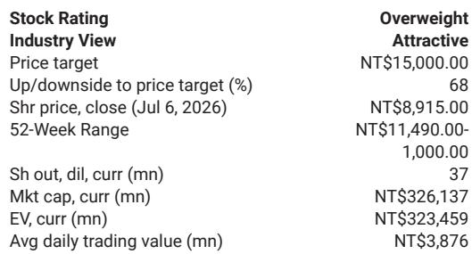

# MS：AI测试座需求超预期，颖崴3季度增长被低估

这份MS关于颖崴科技的报告，核心判断其实很直接：市场对AI/HPC测试座的需求节奏判断偏保守了。报告发布时，公司报价已从高点回落，市场担忧主要集中在新品延迟。但MS的团队认为，3季度营收增速有望达到10-15%的环比增长，显著高于市场共识的5%——而支撑这一判断的，是新产能的全面上线和探针卡业务的增量贡献。

报告发布时点值得注意。2季度营收初步数据刚刚出炉，18%的环比增长和131%的同比增长已经超出了部分预期。但真正让分析师感到“市场可能低估了”的，是6月单月数据：36%的环比增幅背后，是来自NVIDIA、AMD和Google的探针卡拉货力度明显超过了前两个月。

> **KC评论：** 市场有时会高估单一事件的影响，而低估产能爬坡的节奏。这份报告提醒我们，在AI芯片测试环节，产能瓶颈的缓解速度比多数人想象的要快。

## 1. 新产能上线正在改变3季度的营收预期

报告最核心的论据来自供给端。新插座产能的全面上线，将直接推动积压订单的释放。MS的分析师认为，3季度营收环比增长10-15%是“高度可实现”的——这个数字远高于市场共识的5%。差距的来源，在于市场可能低估了MEMS探针卡的增量贡献。

值得注意的是，报告提到6月单月营收已经达到14.6亿新台币，这个基数本身就为3季度提供了较高的起点。如果按照10-15%的环比增速推算，3季度单月营收有望站上16亿新台币。对于一家去年全年营收还不到80亿新台币的公司来说，这个增速意味着什么，不言自明。

## 2. 毛利率的稳定性比市场担心的要好

市场对毛利率的担忧并非没有道理。随着营收规模快速扩大，产品组合的变化可能带来不确定性。但报告给出了不同的判断：2季度毛利率预计略高于1季度的43%，3季度大概率维持相近水平。VPC（垂直探针卡）的贡献更多集中在4季度，这意味着3季度的毛利率不确定性反而可控。

另一个被市场忽视的信号是测试插座的价格调整。报告明确提到，新的项目和产品预计将面临至少20%的涨价，这部分影响将在下半年逐渐体现。如果这个判断成立，那么市场对毛利率的线性外推可能忽略了定价权的变化。

> **KC评论：** 半导体测试环节的定价权往往被低估。当产能利用率提升、新项目集中导入时，供应商的议价能力会自然增强。20%的涨价幅度本身就是一个重要的行业信号。

## 3. 报告尚未完全回答的关键问题

尽管报告给出了清晰的短期判断，但有几个问题仍然悬而未决。首先是Kyber产品的延迟问题。报告承认报价回调与此相关，但并没有给出明确的恢复时间表。对于一家高度依赖新产品导入的公司来说，延迟的影响可能不是一次性的。

其次是产能扩张的可持续性。2026年营收预期为146亿新台币，2027年跳升至270亿，2028年进一步达到521亿——这样的复合增速在半导体测试历史上并不常见。报告假设的终端增长率（4.5%）和中期增长率（16.4%）是否足够保守，值得读者在完整报告中仔细审视。

## 4. 对于关注AI供应链的读者，这份报告提供了一个观察框架

不如把这份报告看作一个分析框架：当一家公司的营收增速远超行业平均时，需要同时验证三个维度——产能能否跟上、产品组合是否有利、定价权是否真实存在。颖崴的案例显示，前两个维度在3季度大概率兑现，而第三个维度（涨价）还需要更多数据来验证。

此外，报告中对2027年和2028年的EPS预测（205新台币和437新台币）背后，隐含的是对AI测试需求持续爆发的假设。如果读者关注的是更长期的结构性机会，那么完整报告中对MEMS探针卡和SLT/老化测试插座的详细讨论，可能比短期营收数字更有参考价值。

For informational purposes only. Portions may be generated,translated,summarized,or edited with AI assistance based on source materials and may contain omissions or errors. Please verify independently. This is not investment,legal,tax,accounting,or other professional advice.

For informational purposes only. Portions may be generated,translated,summarized,or edited with AI assistance based on source materials and may contain omissions or errors. Please verify independently. This is not investment,legal,tax,accounting,or other professional advice.

