# Economics - North America

## US: Technical disinflation

Additional disinflationary force from the BEA's methodological changes

- We expect the BEA's planned methodological changes to certain PCE price components to reduce y-o-y core PCE inflation by about 20bp.
- These changes are defensible on a case-by-case basis, but the timing and cumulative impact raises concerns of political influence. The threshold and political stakes for changing PCE methodology is lower than for CPI, but on the margin, this update suggests the Trump administration may continue attempting to influence Fed policy and inflation narratives.

## Research Analysts

North America Economics  
Aichi Amemiya - NSI  
aichi.amemiya@NOM.com  
+1 212 667 9347

Jeremy Schwartz - NSI
jeremy.schwartz@NOM.com
+1 212 667 9637

Ruchir Sharma - NSI  
ruchir.sharma@NOM.com  
+1 212 667 9186

- In addition, waning impact from tariffs, lower crude oil prices, residual seasonality, and moderating wage growth support our view that core PCE inflation is likely to be peak in the coming months.
- Waning inflation momentum is likely to ease some concerns around inflation. Consequently, we continue to expect the Fed to remain on hold indefinitely.

Fig. 1: Components that are subject to methodological changes boosted y-o-y core PCE inflation by 60bp in total Decomposition of y-o-y core PCE inflation  
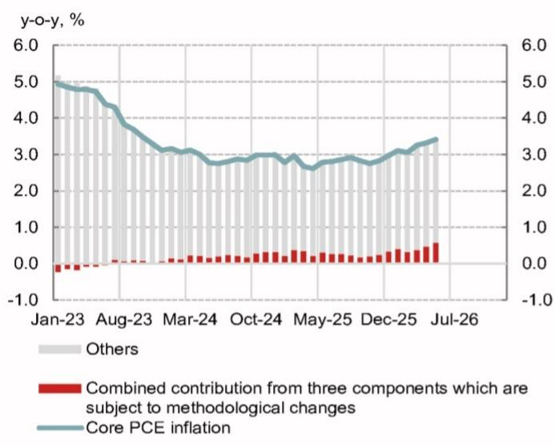  
Source: BEA, Haver, NOM  
Fig. 2: Portfolio management & investment advice services, and computer software & accessories substantially boosted core PCE inflation  
Contributions to y-o-y core PCE inflation from the components that are subject to methodological changes

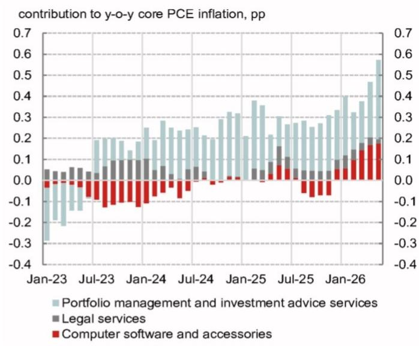  
Source: BEA, Haver, NOM

Upcoming methodological changes to key components of the PCE price index The BEA announced methodology updates to three components of the PCE price index as part of the upcoming GDP annual revisions (taking place 30 September).

Specifically, the agency will make substantial changes to the way it estimates the PCE price indices for computer software and accessories, portfolio management and investment advice services, and legal services. Currently, the combined contribution from those three components to y-o-y core PCE inflation as of May 2026 was about 60bp (Fig. 1). In particular, computer software and accessories, and portfolio management and investment advice service prices substantially boosted core PCE inflation (Fig. 2). Based on our analysis, we expect the upcoming technical adjustments to reduce y-o-y core PCE inflation by about 20bp and narrow the wedge in core inflation between PCE and CPI data. Note, the new methodologies will be retroactively applied to PCE price data since January 2021 (except for legal services, which is likely to be revised since January 2024).

From a narrow perspective, each of these modifications appears reasonable. However, the timing and cumulative impact on inflation raises concerns of political influence.

In some sense, a hurdle for tweaking the methodology for the PCE price index might be lower than CPI, which is linked to social security benefits and Treasury inflation-protected securities (TIPS). On the margin though, these updates suggest the Trump administration may continue to attempt to directly or indirectly influence Fed policy and inflation narratives.

Methodology change #1: PCE prices for computer software and accessories

PCE prices for computer software and accessories jumped this year amid the global Al-capex boom, reflecting cost pressures such as higher semiconductor prices. This has been the most important incremental driver in PCE's recent outperformance over CPI (Fig. 3). The planned change to PCE prices for computer software and accessories is likely to narrow the wedge between two core inflation metrics (Fig. 4).

Fig. 3: About half of the wedge in core goods inflation between CPI and PCE was caused by computer software and accessories  
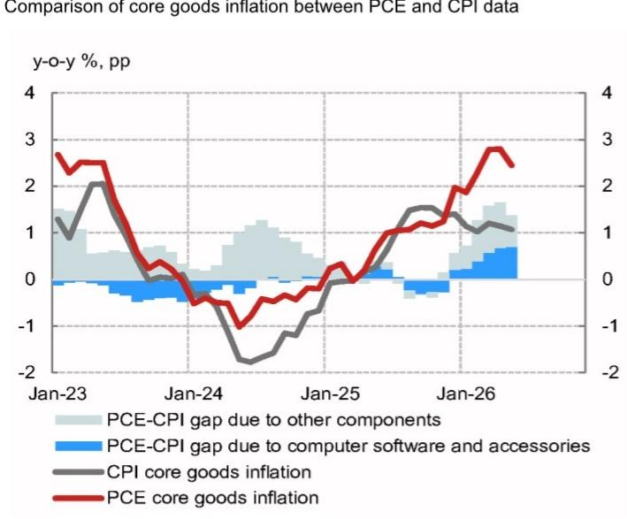  
Source: BEA, Haver, NOM

Fig. 4: The recent outperformance of core PCE inflation over core CPI inflation was due to core goods prices
Decomposition of the wedge between core PCE inflation and core CPI inflation  
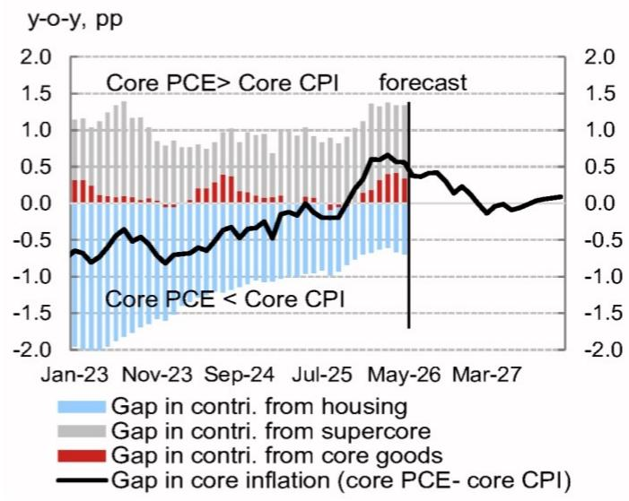  
Source: BEA, Haver, NOM

As former Fed Governor Miran argued, some technical issues might have amplified the magnitude of price increases. For instance, there is a mismatch in scope between PCE inflation and its source data. Currently, this component is derived from CPI's corresponding price index. Notably, while the CPI category includes flash drives, whose prices have risen sharply lately (Fig. 5), the corresponding BEA category does not include physical accessories.

Going forth, the BEA will switch to a composite index which will also include two PPI data series(game software publishing, and ASP (active server pages) and other information technology infrastructure provisioning services) in addition to the existing CPI series “to better reflect the composition of products.” The PCE Bridge table (which shows detailed weights of the individual PCE components) suggests PPI for ASP and other IT infrastructure provisioning services appears to account for 16% in the new PCE composite price index for computer software and accessories. Assuming the remaining weights are equally divided between the other two inputs in estimating the new composite index, the y-o-y change rate of PCE prices for computer software and accessories would be lowered to about +8% from +14.5% measured by the current vintage (as of May 2026) (Fig. 6). This revision would correspond to an 8bp reduction in aggregate core PCE inflation.

Fig. 5: Scope mismatch has amplified the impact of surging flash drive prices on PCE software inflation  
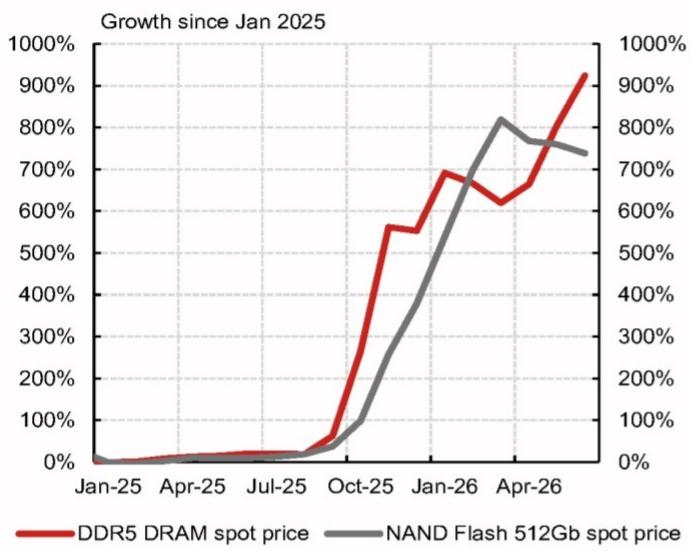  
Source: Bloomberg, inSpectrum, NOM

Fig. 6: Inflation of PCE's computer software and accessories will likely be revised lower  
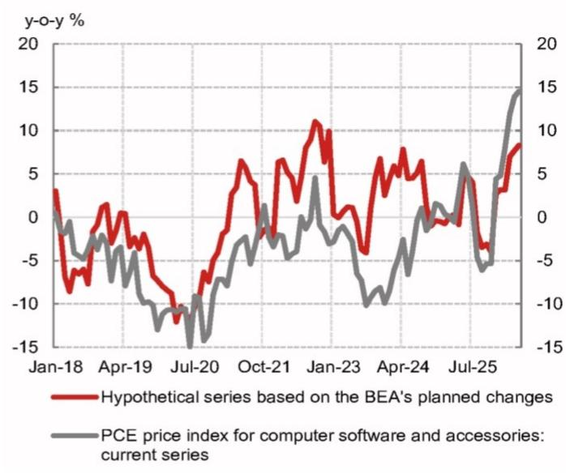  
Source: BEA, Haver, NOM

## Methodology change #2: Portfolio management and investment advice service prices

PCE prices for portfolio management and investment service prices have been rising at a strong pace in recent years. As of May, this metric registered a 21.6% y-o-y increase, the fastest pace of growth since June 2021 (Fig. 7). This component made a sizable contribution of about 40bp to y-o-y core PCE inflation (Fig. 2). Many Fed officials including former Chair Powell discounted the upward pressure from this imputed price component as it does not reflect the slack of the economy.

Currently, the PCE series is derived from PPI's portfolio management and investment advice services, but the BEA will halt directly estimating the price index. Instead, the BEA will start calculating an implicit price index by dividing nominal service spending by a new quantity series. Specifically, the quantity of portfolio management and investment advice services will be estimated based on aggregate employment (i.e. number of employees and working hours) in the portfolio management and investment advice industry, a part of the BLS's Current Employment Statistics (CES). As of May 2026, the methodological change will lower the y-o-y change rate of this component to $14\%$ from $21.6\%$ (Fig. 7), a gap which corresponds to 14bp in y-o-y core PCE inflation. Portfolio management and investment advice service prices boosted y-o-y supercore PCE inflation by about 65bp in May 2026. The upcoming methodology changes will likely reduce it by more than 20bp (Fig. 8).

Methodological changes are likely to make this component less sensitive to fluctuations in stock prices. However, under the new methodology, this component will be subject to more frequent revisions. CES employment data at a granular level for the portfolio management and investment advice industry are not available at the time of the release of the first estimate of PCE prices. In lieu of the detailed data, the BEA would use the closest aggregate data as a proxy for the preliminary estimate, which will lead to revisions in the following month once granular data become available. Moreover, this component is subject to revisions in the third month after the quarter ends as the Quarterly Service Survey (QSS) leads to a revision to nominal spending for portfolio management and investment advice services and hence the implicit price index for this component.

Fig. 7: The new methodology will likely lower inflation of portfolio management and investment advice prices  
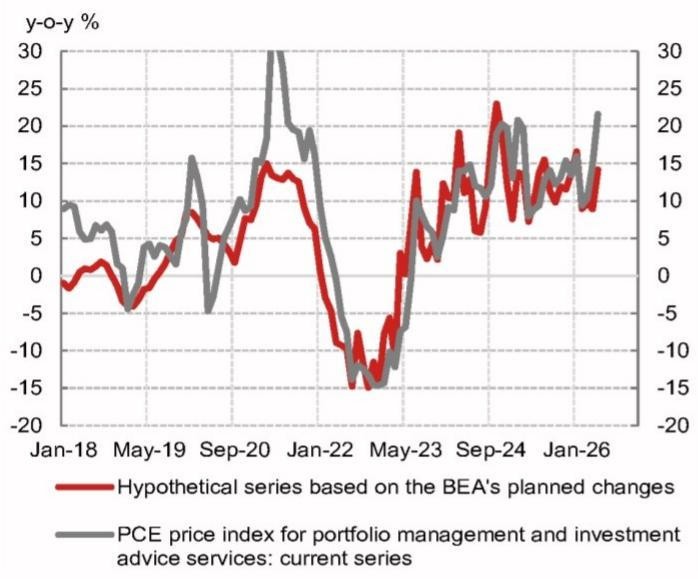  
Source: BEA, Haver, NOM

Fig. 8: Portfolio management and investment advice service prices boosted supercore PCE inflation
Decomposition of PCE supercore inflation  
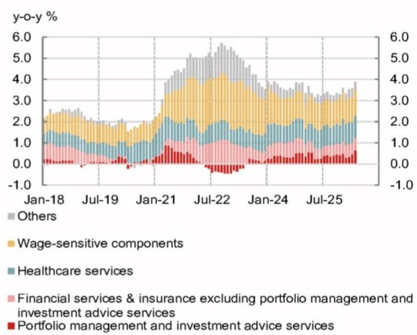  
Source: BEA, Haver, NOM

## Methodology change #3: Legal service prices

The BEA will update the PCE price index for legal services by replacing CPI's corresponding data with the BEA's composite price index derived using detailed PPI for selected legal services consumed by households (Note that the BEA did some ad-hoc adjustments to this component because of idiosyncratic moves in CPI data earlier this year). We do not know exactly which PPI data will be used and the weights for those PPI data to estimate the composite index. Under the assumption that PPIs for civil negligence, wills, estate planning, & probate, and family legal services are equally weighted, we expect the y-o-y change rate of PCE's legal service prices would be revised up to about $6.5\%$ from $2.5\%$ in May 2026, which adds 3bp to y-o-y core PCE inflation (Fig. 9). Notably, the new methodology is likely to reduce volatility of this component significantly.

Fig. 9: Inflation of PCE prices for legal services will likely be revised higher, but become less volatile after the methodology changes  
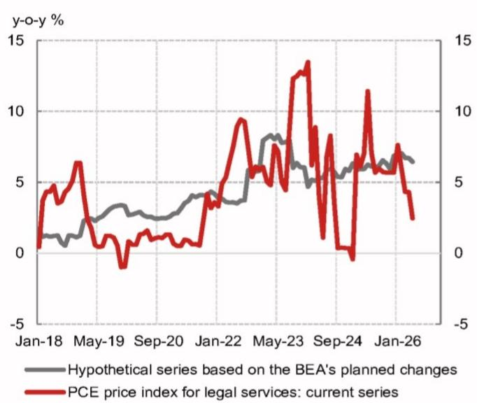  
Source: BEA, Haver, NOM

extent, politically motivated given increasing concerns over affordability issues as well as the Trump administration's advocacy for easing monetary policy.

The incoming BLS commissioner, Brett Matsumoto, a former member of the Council of Economic Advisers (CEA) in Trump's first and second administration, could also make some changes in CPI estimation methods, which could further influence PCE inflation. For instance, former CEA Chair Miran had argued that official rent inflation measured by CPI overstates current price pressures because it reflects existing tenants in addition to the new tenants. Advocating for a forward-looking approach, Miran had said new-rent indices point to lower inflation, and rents for all tenants are likely to fall towards it eventually. Also, as we previously discussed, the BLS could tweak the calculation weights assigned to single-family homes in estimating owners' equivalent rent (OER), which might be disinflationary.

## Other factors point to some moderation in core PCE inflation in H2

In addition to the anticipated 20bp reduction in core PCE inflation due to methodological changes, there are additional incremental disinflationary forces at play.

First, the impact from tariffs continues to wane. We use the gap between actual core PCE goods inflation and a simple forecast based on ex-tariff import prices as a proxy of the impact of tariffs on inflation (Fig. 10), which suggests the boost from tariffs to y-o-y core PCE inflation is diminishing.

Second, crude oil prices reverted to levels last seen prior to the US-Iran conflict, suggesting some energy-sensitive components such as airline fares are likely to reverse some of the increase over the past few months (Fig. 11).

Fig. 10: The tariff impact on core PCE inflation peaked around 0.4-0.5pp and is reversing now  
12-month cumulative forecasting errors which can not be explained by non-tariff import prices vs. changes in the effective tariff rate  
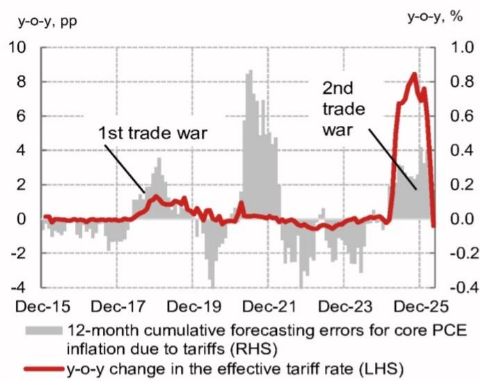  
Source: BEA, Haver, NOM

Fig. 11: Lower jet fuel prices will likely weigh on PCE's airline fares with a lag  
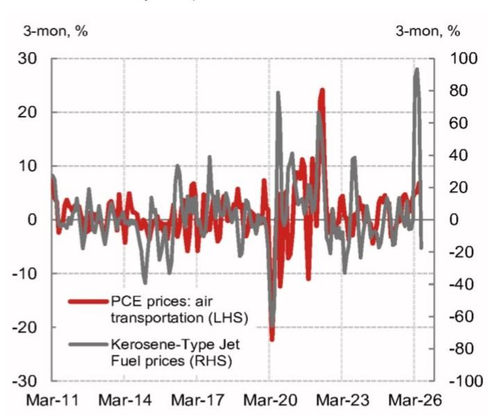  
Source: BEA, EIA, Haver, NOM

Third, wage-sensitive service prices, a key part of supercore PCE inflation (e.g. food services and accommodation services), have trended lower in recent quarters in tandem with wage growth (Fig. 12). A gradual moderation in wage growth is likely to prevent an acceleration in the wage-sensitive components, limiting upside risks.

Fourth, negative residual seasonality will likely weigh on m-o-m core PCE inflation in the third quarter and to a lesser extent in the fourth quarter (Fig. 13).

Fig. 12: Moderating wage growth is likely to weigh on PCE supercore inflation  
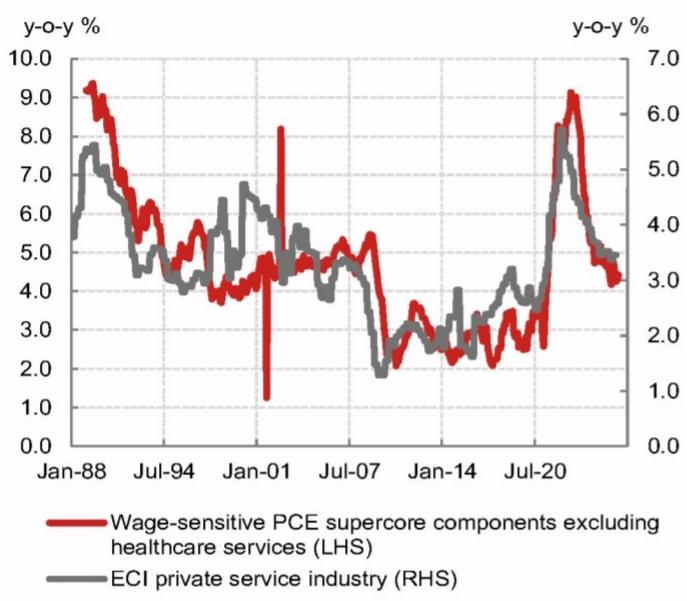  
Source: BEA, BLS, Haver, NOM

Fig. 13: M-o-M core PCE inflation tends to be weighed down by negative residual seasonality in the second half of the year The median and average of m-o-m core PCE inflation by month over the past three years vs. 2026  
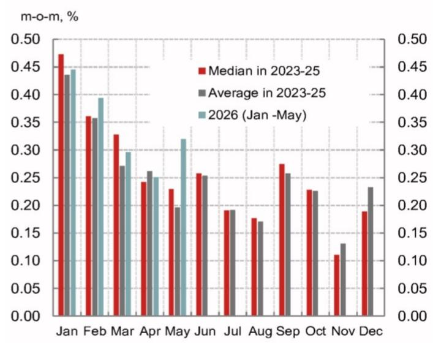  
Source: BEA, Haver, NOM

However, there are some counteracting forces for the disinflation process as well. AI-induced price pressures pose upside risks (Fig. 14). Global shortages of semiconductors and planned price hikes from semiconductors could push up prices for other consumer electronics. As we previously discussed, goods price inflation might have become more sensitive to supply shocks in the post-pandemic era. A series of supply shocks such as severe weather conditions or geopolitical risks might push up goods price inflation more persistently.

Fig. 14: PPI electronic component prices (inc. memory chips) rose strongly while PCE's consumer electronics prices remained relatively stable  
PPI electronic component prices vs. PCE's consumer electronics prices  
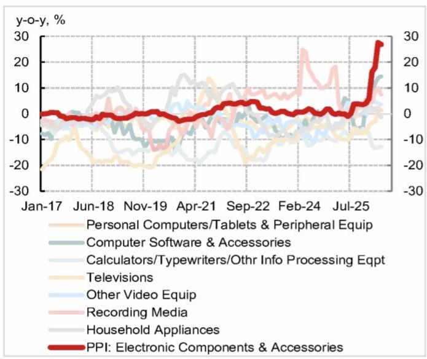  
Source: BEA, BLS, Haver, NOM

## Implications to the monetary policy

Taking the above into account, we lower our forecast for y-o-y core PCE inflation for Q4 2026 by two-tenths of a percent to $3.1\%$ from $3.3\%$ previously (Fig. 15), followed by further moderation to $2.4\%$ in Q4 2027. This suggests decreased hawkish risks to our Fed call of no changes to the policy rate through 2027.

Fig. 15: NOM's inflation forecasts

<table><tr><td rowspan="2"></td><td colspan="2">Headline PCE</td><td colspan="3">Core PCE</td><td colspan="2">Headline CPI</td><td colspan="3">Core CPI</td><td>CPI NSA</td></tr><tr><td>m/m %</td><td>y/y %</td><td>m/m %</td><td>y/y %</td><td>qtrly, y/y %</td><td>m/m %</td><td>y/y %</td><td>m/m %</td><td>y/y %</td><td>qtrly, y/y %</td><td>Index</td></tr><tr><td>Jan-25</td><td>0.33</td><td>2.57</td><td>0.29</td><td>2.73</td><td></td><td>0.43</td><td>3.00</td><td>0.43</td><td>3.26</td><td></td><td>317.671</td></tr><tr><td>Feb-25</td><td>0.38</td><td>2.62</td><td>0.42</td><td>2.86</td><td></td><td>0.23</td><td>2.82</td><td>0.25</td><td>3.12</td><td></td><td>319.082</td></tr><tr><td>Mar-25</td><td>0.01</td><td>2.30</td><td>0.08</td><td>2.59</td><td>2.72</td><td>0.03</td><td>2.39</td><td>0.07</td><td>2.79</td><td>3.08</td><td>319.799</td></tr><tr><td>Apr-25</td><td>0.20</td><td>2.23</td><td>0.22</td><td>2.55</td><td></td><td>0.16</td><td>2.31</td><td>0.24</td><td>2.78</td><td></td><td>320.795</td></tr><tr><td>May-25</td><td>0.23</td><td>2.43</td><td>0.28</td><td>2.74</td><td></td><td>0.10</td><td>2.35</td><td>0.13</td><td>2.79</td><td></td><td>321.465</td></tr><tr><td>Jun-25</td><td>0.33</td><td>2.66</td><td>0.31</td><td>2.87</td><td>2.72</td><td>0.25</td><td>2.67</td><td>0.23</td><td>2.93</td><td>2.82</td><td>322.561</td></tr><tr><td>Jul-25</td><td>0.15</td><td>2.68</td><td>0.22</td><td>2.94</td><td></td><td>0.23</td><td>2.70</td><td>0.31</td><td>3.06</td><td></td><td>323.048</td></tr><tr><td>Aug-25</td><td>0.22</td><td>2.75</td><td>0.18</td><td>2.90</td><td></td><td>0.35</td><td>2.92</td><td>0.31</td><td>3.11</td><td></td><td>323.976</td></tr><tr><td>Sep-25</td><td>0.28</td><td>2.80</td><td>0.21</td><td>2.82</td><td>2.89</td><td>0.30</td><td>3.01</td><td>0.22</td><td>3.02</td><td>3.06</td><td>324.800</td></tr><tr><td>Oct-25</td><td>0.21</td><td>2.73</td><td>0.24</td><td>2.76</td><td></td><td>0.03</td><td>2.76</td><td>0.11</td><td>2.81</td><td></td><td>324.372</td></tr><tr><td>Nov-25</td><td>0.18</td><td>2.79</td><td>0.13</td><td>2.78</td><td></td><td>0.22</td><td>2.74</td><td>0.08</td><td>2.63</td><td></td><td>324.122</td></tr><tr><td>Dec-25</td><td>0.34</td><td>2.88</td><td>0.34</td><td>2.96</td><td>2.83</td><td>0.30</td><td>2.68</td><td>0.23</td><td>2.64</td><td>2.69</td><td>324.054</td></tr><tr><td>Jan-26</td><td>0.31</td><td>2.86</td><td>0.41</td><td>3.08</td><td></td><td>0.17</td><td>2.39</td><td>0.30</td><td>2.50</td><td></td><td>325.252</td></tr><tr><td>Feb-26</td><td>0.34</td><td>2.82</td><td>0.33</td><td>2.98</td><td></td><td>0.27</td><td>2.41</td><td>0.22</td><td>2.46</td><td></td><td>326.785</td></tr><tr><td>Mar-26</td><td>0.70</td><td>3.53</td><td>0.29</td><td>3.19</td><td>3.08</td><td>0.87</td><td>3.26</td><td>0.20</td><td>2.60</td><td>2.53</td><td>330.213</td></tr><tr><td>Apr-26</td><td>0.36</td><td>3.70</td><td>0.19</td><td>3.15</td><td></td><td>0.64</td><td>3.81</td><td>0.38</td><td>2.75</td><td></td><td>333.020</td></tr><tr><td>May-26</td><td>0.47</td><td>3.95</td><td>0.35</td><td>3.23</td><td></td><td>0.47</td><td>4.25</td><td>0.21</td><td>2.85</td><td></td><td>335.123</td></tr><tr><td>Jun-26</td><td>-0.05</td><td>3.57</td><td>0.20</td><td>3.12</td><td>3.17</td><td>-0.22</td><td>3.74</td><td>0.26</td><td>2.85</td><td>2.81</td><td>334.622</td></tr><tr><td>Jul-26</td><td>0.09</td><td>3.50</td><td>0.18</td><td>3.08</td><td></td><td>0.05</td><td>3.56</td><td>0.22</td><td>2.75</td><td></td><td>334.559</td></tr><tr><td>Aug-26</td><td>0.18</td><td>3.46</td><td>0.18</td><td>3.08</td><td></td><td>0.22</td><td>3.42</td><td>0.22</td><td>2.66</td><td></td><td>335.042</td></tr><tr><td>Sep-26</td><td>0.20</td><td>3.38</td><td>0.20</td><td>3.08</td><td>3.08</td><td>0.21</td><td>3.31</td><td>0.22</td><td>2.66</td><td>2.69</td><td>335.548</td></tr><tr><td>Oct-26</td><td>0.14</td><td>3.31</td><td>0.22</td><td>3.05</td><td></td><td>0.10</td><td>3.37</td><td>0.22</td><td>2.77</td><td></td><td>335.303</td></tr><tr><td>Nov-26</td><td>0.21</td><td>3.34</td><td>0.21</td><td>3.13</td><td></td><td>0.22</td><td>3.35</td><td>0.22</td><td>2.91</td><td></td><td>334.980</td></tr><tr><td>Dec-26</td><td>0.24</td><td>3.24</td><td>0.21</td><td>2.99</td><td>3.06</td><td>0.28</td><td>3.31</td><td>0.22</td><td>2.90</td><td>2.86</td><td>334.777</td></tr><tr><td>Jan-27</td><td>0.20</td><td>3.12</td><td>0.25</td><td>2.84</td><td></td><td>0.19</td><td>3.34</td><td>0.27</td><td>2.87</td><td></td><td>336.101</td></tr><tr><td>Feb-27</td><td>0.12</td><td>2.90</td><td>0.20</td><td>2.71</td><td></td><td>0.07</td><td>3.14</td><td>0.20</td><td>2.85</td><td></td><td>337.038</td></tr><tr><td>Mar-27</td><td>0.21</td><td>2.40</td><td>0.20</td><td>2.62</td><td>2.72</td><td>0.21</td><td>2.49</td><td>0.20</td><td>2.85</td><td>2.86</td><td>338.441</td></tr><tr><td>Apr-27</td><td>0.17</td><td>2.20</td><td>0.20</td><td>2.63</td><td></td><td>0.15</td><td>1.96</td><td>0.19</td><td>2.66</td><td></td><td>339.557</td></tr><tr><td>May-27</td><td>0.17</td><td>1.89</td><td>0.20</td><td>2.48</td><td></td><td>0.15</td><td>1.61</td><td>0.19</td><td>2.65</td><td></td><td>340.528</td></tr><tr><td>Jun-27</td><td>0.16</td><td>2.10</td><td>0.20</td><td>2.48</td><td>2.53</td><td>0.14</td><td>1.98</td><td>0.19</td><td>2.57</td><td>2.63</td><td>341.231</td></tr><tr><td>Jul-27</td><td>0.18</td><td>2.20</td><td>0.19</td><td>2.49</td><td></td><td>0.18</td><td>2.10</td><td>0.19</td><td>2.54</td><td></td><td>341.581</td></tr><tr><td>Aug-27</td><td>0.19</td><td>2.22</td><td>0.19</td><td>2.50</td><td></td><td>0.19</td><td>2.08</td><td>0.18</td><td>2.50</td><td></td><td>342.014</td></tr><tr><td>Sep-27</td><td>0.21</td><td>2.23</td><td>0.19</td><td>2.48</td><td>2.49</td><td>0.23</td><td>2.11</td><td>0.18</td><td>2.47</td><td>2.50</td><td>342.622</td></tr><tr><td>Oct-27</td><td>0.15</td><td>2.24</td><td>0.19</td><td>2.45</td><td></td><td>0.12</td><td>2.14</td><td>0.18</td><td>2.43</td><td></td><td>342.471</td></tr><tr><td>Nov-27</td><td>0.21</td><td>2.24</td><td>0.18</td><td>2.43</td><td></td><td>0.23</td><td>2.16</td><td>0.18</td><td>2.38</td><td></td><td>342.204</td></tr><tr><td>Dec-27</td><td>0.25</td><td>2.25</td><td>0.18</td><td>2.40</td><td>2.43</td><td>0.29</td><td>2.18</td><td>0.18</td><td>2.34</td><td>2.38</td><td>342.063</td></tr></table>

Note: Oct and Nov CPI refers to NOM's estimate. PCE refers to NOM's forecast for revisions  
Source: BLS, BEA, Haver, NOM

## Appendix A-1

This report has been produced by NOM Securities International, Inc.(NSI), US.

See Disclaimers for NOM Group entity details.

## Analyst Certification

We, Aichi Amemiya, Jeremy Schwartz and Ruchir Sharma, hereby certify (1) that the views expressed in this Research report accurately reflect our personal views about any or all of the subject securities or issuers referred to in this Research report, (2) no part of our compensation was, is or will be directly or indirectly related to the specific recommendations or views expressed in this Research report and (3) no part of our compensation is tied to any specific investment banking transactions performed by NOM Securities International, Inc., NOM International plc or any other NOM Group company.

## Important Disclosures

## Online availability of research and conflict-of-interest disclosures

NOM Group research is available on www.NOMnow.com/research, Bloomberg, Capital IQ, Factset, LSEG.

Important disclosures may be read at http://go.NOMnow.com/research/m/Disclosures or requested from NOM Securities International, Inc. If you have any difficulties with the website, please email grpsupport@NOM.com for help.

The analysts responsible for preparing this report have received compensation based upon various factors including the firm's total revenues, a portion of which is generated by Investment Banking activities. Unless otherwise noted, the non-US analysts listed at the front of this report are not registered/qualified as research analysts under FINRA rules, may not be associated persons of NSI, and may not be subject to FINRA Rule 2241 restrictions on communications with covered companies, public appearances, and trading securities held by a research analyst account.

NOM Global Financial Products Inc. (NGFP) NOM Derivative Products Inc. (NDP) and NOM International plc. (NIplc) are registered with the Commodities Futures Trading Commission and the National Futures Association (NFA) as swap dealers. NGFP, NDPI, and NIplc are generally engaged in the trading of swaps and other derivative products, any of which may be the subject of this report.

## Disclaimers

This publication contains material that has been prepared by the NOM Group entity identified on page 1 and, if applicable, with the contributions of one or more NOM Group entities whose employees and their respective affiliations are specified on page 1 or identified elsewhere in this publication. The term "NOM Group" used herein refers to NOM Holdings, Inc. and its affiliates and subsidiaries including: (a) NOM Securities Co., Ltd. ('NSC') Tokyo, Japan, (b) NOM Financial Products Europe GmbH ('NFPE'), Germany, (c) NOM International plc ('NIplc'), UK, (d) NOM Securities International, Inc. ('NSI'), New York, US, (e) NOM International (Hong Kong) Ltd. ('NIHK'), Hong Kong, (f) NOM Financial Investment (Korea) Co., Ltd. ('NFIK'), Korea (Information on NOM analysts registered with the Korea Financial Investment Association ('KOFIA') can be found on the KOFIA Intranet at http://dis.kofia.or.kr, (g) NOM Singapore Ltd. ('NSL'), Singapore (Registration number 197201440E, regulated by the Monetary Authority of Singapore) (h) NOM Australia Ltd. ('NAL'), Australia (ABN 48 003 032 513), regulated by the Australian Securities and Investment Commission ('ASIC') and holder of an Australian financial services licence number 246412, (i) NOM Securities Malaysia Sdn. Bhd. ('NSM'), Malaysia, (j) NIHK, Taipei Branch ('NITB'), Taiwan, (k) NOM Financial Advisory and Securities (India) Private Limited ('NFASL'), Mumbai, India (Registered Address: Ceejay House, Level 11, Plot F, Shivsagar Estate, Dr. Annie Besant Road, Worli, Mumbai- 400 018, India; Tel: 91 22 4037 4037, Fax: 91 22 4037 4111; CIN No: U74140MH2007PTC169116, SEBI Registration No. for Stock Broking activities : INZ000255633; SEBI Registration No. for Merchant Banking : INM000011419; SEBI Registration No. for Research: INH000001014 - Compliance Officer: Ms. Pratiksha Tondwalkar, 91 22 40374904, grievance email: investorgrievancesra@NOM.com Webpage: LINK

For reports with respect to Indian public companies or authored by India-based NFASL research analysts: (i) Investment in securities markets is subject to market risks. Read all the related documents carefully before investing. (ii) Registration granted by SEBI, and certification from NISM in no way guarantee performance of the intermediary or provide any assurance of returns to investors. (iii) NFASL terms and conditions for
