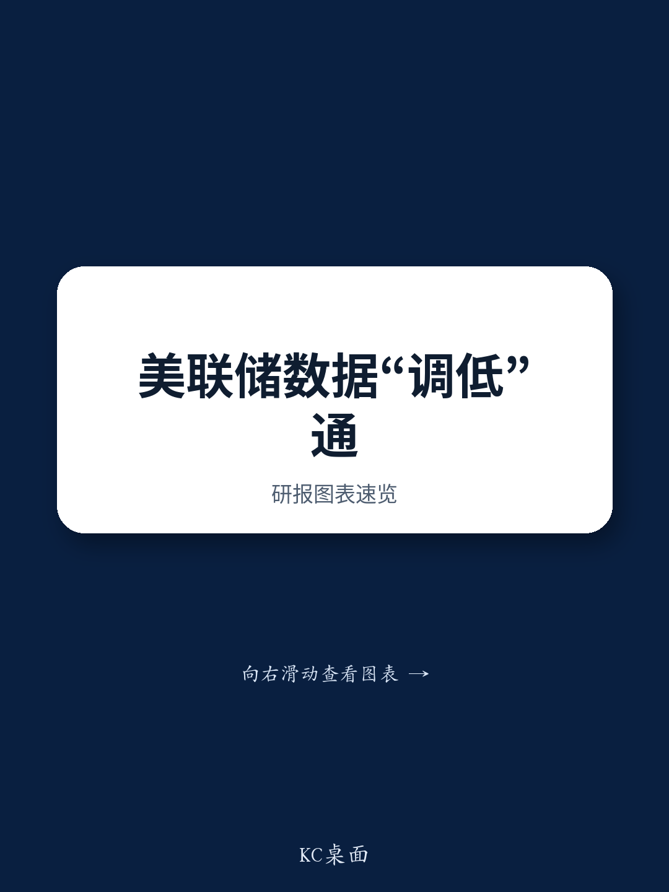

# NOM：AI资本开支热潮推高软件价格，却意外拉低核心PCE通胀

一份来自NOM的最新研报揭示了一个容易被忽视的细节：美国核心PCE通胀将在今年下半年出现约20个基点的“技术性下降”。这不是因为宏观环境基本面发生了根本变化，而是源于美国宏观环境分析局（BEA）即将在9月30日实施的统计方法调整。

这20个基点的降幅看似不大，但它触及了一个更敏感的问题——当通胀数据的编制方式开始发生变化，市场对美联储政策路径的预期应当如何校准？

NOM的分析师在报告里算了一笔细账。BEA将对PCE价格指数中三个分项的估算方法进行修订：计算机软件及配件、组合观察管理与研究咨询服务、法律服务。截至今年5月，这三个分项合计为核心PCE通胀贡献了约60个基点。方法调整后，计算机软件及配件贡献将削减约8个基点，研究管理服务贡献减少约14个基点，法律服务则小幅增加约3个基点。净效果是核心PCE通胀下降约20个基点。

> **KC评论：** NOM这份报告最有意思的地方不是20个基点本身，而是它点出了一个结构性问题——当统计方法变动可能影响政策叙事时，市场参与者不能只看最终数字，还要理解数字是怎么算出来的。

## 1. 统计方法调整背后，是通胀叙事话语权的争夺

每一项调整单独看都有技术上的合理性。计算机软件及配件价格今年因AI资本开支热潮而上升，但BEA发现其来源数据存在“范围错配”——目前使用的CPI数据包含了闪存盘等物理配件，而PCE对应类别本不应包含这些产品。新方法将引入更多PPI数据源来校准。

研究管理服务价格则更为敏感。这个分项5月同比上涨21.6%，为核心PCE贡献了约40个基点。BEA将不再直接使用PPI数据，而是通过就业人数和工作小时数来推算隐含价格指数。NOM估算，这一变动将使该分项通胀率从21.6%降至14%。

但NOM也直言不讳地指出：这些变动在时机和累积效应上引发了“政治影响”的担忧。相比于与社保和TIPS挂钩的CPI，调整PCE方法的门槛更低。这暗示特朗普政府可能继续尝试直接或间接影响美联储的政策叙事。

## 2. 非技术因素也在推动通胀回落，但AI可能成为新变量

除了统计方法调整，NOM还列出了四个额外的价格变化力量：关税影响的边际减弱、原油价格回落至美伊冲突前水平、工资敏感型服务价格随工资增长节奏变化而走低、以及下半年负残差季节性的影响。

但报告也提醒，AI驱动的价格不确定性是上行不确定性。PPI电子元件价格（含内存芯片）已大幅上涨，而PCE消费电子价格尚未完全反映。全球半导体短缺和计划中的涨价可能推高其他消费电子产品价格。

## 3. 报告没有完全回答的关键问题：20个基点是“一次性”还是“新常态”？

NOM据此将2026年第四季度核心PCE通胀预测从3.3%下调至3.1%，并维持美联储到2027年按兵不动的判断。但这份报告留下了一个未解问题：如果统计方法变动在9月30日生效后，数据序列被回溯调整至2021年，那么过去几年通胀数据的“历史面貌”也将被改写。这对于依赖历史数据做模型的市场参与者意味着什么？通胀锚定预期是否会因此产生系统性偏移？

> **KC评论：** NOM报告里提到一个值得追踪的细节——新任BLS委员Matsumoto可能推动CPI估算方法的调整，包括业主等价租金中独栋住宅权重的修改。如果CPI也在变，那么市场对“真实通胀”的认知将更加模糊。完整报告里有大量关于三个分项调整的具体推演和图表，值得细读。

## 4. 对读者的观察框架：关注“统计与现实的裂口”

对于关注宏观环境的读者，NOM这份报告提供了一个新的分析维度。未来几个月，当核心PCE数据出现明显回落时，需要区分哪些是统计方法带来的“技术性降温”，哪些是真实宏观环境动能的节奏变化。同样重要的是，要留意美联储官员在讲话中如何引用这些数据——如果他们开始引用调整后的低数字来论证政策空间，那本身就是重要的信号。

For informational purposes only. Portions may be generated,translated,summarized,or edited with AI assistance based on source materials and may contain omissions or errors. Please verify independently. This is not investment,legal,tax,accounting,or other professional advice.

For informational purposes only. Portions may be generated,translated,summarized,or edited with AI assistance based on source materials and may contain omissions or errors. Please verify independently. This is not investment,legal,tax,accounting,or other professional advice.

