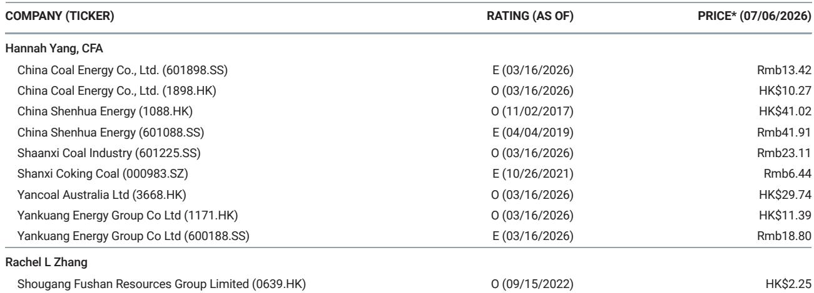
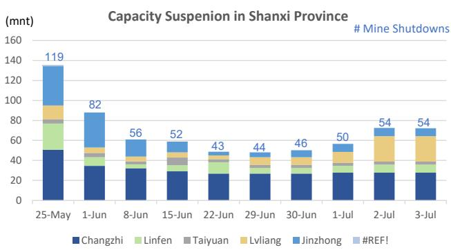

# MS：焦煤价格韧性凸显，动力煤走弱，供给约束成主导变量

这份报告最值得关注的判断，并非动力煤价格的小幅波动，而是山西焦煤供应的真实瓶颈——安全巡查导致的停产并非短期冲击，而是一种“新常态”。截至7月3日，山西五个主要焦煤产区仍有54座煤矿处于停产状态，涉及年产能7215万吨，虽然较5月25日的高点减少了65座，但停产产能依然维持在相当规模。MS团队在周报中揭示了一个容易被忽略的信号：仍在生产的煤矿大多只能维持30%-70%的产能利用率，原因不仅是安全检查，还叠加了前期超产带来的合规不确定性和其他运营问题。

这意味着，焦煤供应的恢复不是简单的“复工”就能解决的问题。

## 1. 停产规模虽在收窄，但产能恢复速度远慢于市场预期

从数据看，停产煤矿数量从5月25日的119座降至54座，似乎改善明显。但MS引用的Sxcoal调研显示，剩余停产产能仍有7215万吨/年，且日环比仅下降30万吨。更关键的是，复工的煤矿并非满负荷运转——安全巡查的持续性决定了产能利用率的上限。

> **KC评论：** 市场往往关注“停产数量”这个简单指标，但忽略了“产能利用率”这个更真实的变量。报告里的那张产能暂停图表（Exhibit 1）值得细看，它展示了停产产能的相对值依然在高位，且下降斜率正在节奏变化。对于焦煤下游的钢铁企业而言，这意味着原料采购的紧张状态可能至少延续到三季度末。

## 2. 价格信号已经分化：动力煤走弱，焦煤韧性凸显

同一份报告给出了截然不同的价格走势。动力煤方面，秦皇岛5500大卡价格周环比仅微涨0.1%至727元/吨，坑口价格（山西大同5800大卡）甚至下跌3.4%至700元/吨。而焦煤价格则表现出明显韧性：柳林4号主焦煤坑口价稳定在865元/吨，FOR价格维持在2040元/吨，澳洲峰景矿硬焦煤价格周环比还小幅上涨0.4%至242美元/吨。

这种分化并非偶然。报告隐含的逻辑是：动力煤受季节性需求变化和库存水平影响（秦皇岛库存周环比增加6.8%至723万吨），而焦煤的供给端约束才是主导价格的核心变量。

> **KC评论：** 市场对动力煤的预期已经在价格中反映，但焦煤的供给故事远未结束。报告没有直接给出结论，但读者可以推演——如果山西的安全巡查力度维持现状，焦煤价格在短期内获得支撑的概率显著高于动力煤。

## 3. 报告尚未完全回答的关键问题：安全巡查的“常态”能持续多久？

这是整份报告最值得追问的地方。山西的安全巡查从5月底开始加码，至今已持续超过一个月。MS团队在周报中详细记录了停产数据的变化，但并未对巡查政策本身的持续性做出判断。

一个合理的推测是：如果安全生产事故率没有明显下降，政策放松的可能性不大。但报告没有提供这方面的数据。另一个未解问题是：当煤矿逐步恢复生产后，产能利用率能否从30%-70%回升到正常水平？这取决于合规成本、人员培训和设备检修的进度——这些信息在公开调研中难以获得。

对于产业决策者来说，当前最务实的做法不是猜测政策何时转向，而是建立一套基于“每周停产产能”和“产能利用率”两个指标的跟踪框架。MS这份周报的价值，恰恰在于提供了这套框架的基础数据。

## 4. 对读者的观察框架：焦煤的研究逻辑正在从“需求驱动”转向“供给约束”

过去两年，市场习惯用房地产和基建需求来预测焦煤价格。但这份报告揭示了一个新变量：供给侧的政策执行力正在成为更重要的定价因子。山西作为中国最大的焦煤产区，其安全巡查的力度和持续性，将直接影响整个产业链的库存策略和采购节奏。

对于焦煤下游企业而言，需要重新评估供应链的安全性：是否应该增加安全库存？是否要扩大进口来源（澳洲焦煤价格已高于国内）？这些决策的前提，是对山西供给恢复速度有一个现实的预期。

报告中的表格数据（Exhibit 2）提供了完整的周度价格和库存对比，是跟踪这一逻辑变化的基础工具。但真正需要持续关注的，不是价格本身，而是产能利用率这个“中间变量”何时出现变化。

For informational purposes only. Portions may be generated,translated,summarized,or edited with AI assistance based on source materials and may contain omissions or errors. Please verify independently. This is not investment,legal,tax,accounting,or other professional advice.

For informational purposes only. Portions may be generated,translated,summarized,or edited with AI assistance based on source materials and may contain omissions or errors. Please verify independently. This is not investment,legal,tax,accounting,or other professional advice.

