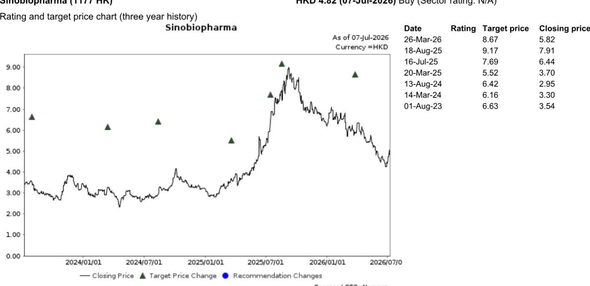

# 中国生物制药2026年第二笔对外授权交易：中国药企战略转折的信号

围绕中国医药创新的叙事一直带有谨慎乐观的色彩，偶尔夹杂着对可持续性的担忧。2026年7月8日，中国生物制药宣布与阿斯利康就TQC3721（一种自主研发的吸入型PDE3/4双靶点抑制剂）达成整理版授权协议。该交易结构——2亿美元首付款、最高19亿美元的里程碑付款以及两位数的销售分成——从任何标准来看都相当可观。但其意义远不止于对单一公司报表的影响。

这是中国生物制药在2026年与跨国企业达成的第二笔对外授权交易。一年内达成两笔交易，尤其涉及一个在中国拥有III期临床数据的新型呼吸系统资产，这改变了讨论的基调。问题不再是“中国公司能否产出可授权的分子”，而是“他们能以多快的速度将这种能力扩展为可重复、制度化的流程”。这个问题的答案将决定哪些公司能成为下一代全球生物制药的参与者，哪些仍将停留在区域制造商的角色。

时机也很关键。围绕中国生物科技领域的整体氛围此前一直存在观望情绪，市场参与者质疑2024-2025年的对外授权浪潮是否只是由特定资产类别和有利时机驱动的短期现象。这笔交易提供了一个反例。它表明，中国的底层研发基础设施已达到一定成熟度，使得交易流可以成为可预测的收入来源，而非偶发事件。对于关注该领域的观察者而言，这是他们一直在等待的信号——但它也引发了关于估值、管线管理和竞争动态的新问题，需要仔细拆解。

---

## TQC3721交易不仅是一项资产交易，更是对呼吸系统创新平台方法的验证

要理解这笔交易为何具有战略分量，必须审视该资产本身。TQC3721是一种吸入型PDE3/4双靶点抑制剂，该机制在呼吸系统医学领域引起了广泛关注，因为它有望在单一分子中结合支气管扩张和抗炎作用。中国生物制药在中国开展了两项临床试验：一项针对COPD的III期研究（使用雾化混悬液制剂），以及一项针对COPD的II期研究（使用干粉吸入器）。2025年在阿姆斯特丹欧洲呼吸学会大会上公布的IIb期数据，显示出同类最佳的潜力。

选择阿斯利康作为合作伙伴也颇具深意。阿斯利康拥有业内最深厚的呼吸系统管线之一，在全球市场拥有成熟的商业基础设施和监管经验。一家中国公司能达成这种级别的合作，说明该资产必定经过了严格的内部审查。阿斯利康不会在早期分子上做投机性押注；它收购的是一个接近临床阶段、具有差异化数据的资产。

这向市场传递的信号是：中国生物制药已在呼吸系统疾病领域建立了可信的研发能力，这是一个需要专业制剂知识和深入理解吸入科学的治疗领域。这不是一个“me-too”分子。双靶点机制，加上雾化和DPI制剂，表明这是一种平台方法，而非一次性发现。如果该平台通过这笔交易得到验证，它将为未来的资产开发和对外授权创造模板。

财务条款进一步强化了这一解读。2亿美元的首付款是对该资产潜力的重要认可。而最高达19亿美元的里程碑付款结构，则围绕开发、监管和商业里程碑设定。这意味着阿斯利康承诺在后期开发和全球商业化方面进行重大投入。除非他们看到清晰的市场路径和相对于现有疗法的竞争优势，否则不会这样做。

---

## 一年内两笔对外授权交易，确认中国生物制药正在缩小与领先中国大型药企的差距

交易达成的速度与单笔交易的质量同样重要。中国生物制药在2026年的第一笔对外授权交易引人注目，但可能被视为一次性事件。第二笔交易改变了叙事。它表明该公司已将生成可授权资产和执行复杂合作协议的能力制度化。

这不仅仅是研发生产力的问题。它反映了公司如何看待自己在全球制药生态系统中角色的战略转变。历史上，中国制药公司主要被视为国内市场的制造商和分销商。对外授权代表着向成为全球市场创新来源的转变。一年内做到两次，表明公司已建立起支持可重复交易的组织基础设施——法律、监管、商业和科学方面。

与其他领先中国大型药企的比较具有启发性。几家同行多年来一直活跃在对外授权领域，建立了读者用于衡量业绩的跟踪记录。中国生物制药此前在这方面被认为有所滞后。这两笔交易缩小了这一差距。该公司现在在交易节奏上与同行并驾齐驱，而且在某些方面，资产质量可能更优。

对于观察者而言，这对估值有直接影响。市场此前一直对中国生物制药应用“集团折扣”，反映了对其研发管线质量和可持续性的不确定性。每一笔对外授权交易都会减少这一折扣。问题在于需要多少笔交易才能完全消除它，以及公司能否在不损害管线深度的情况下保持这一节奏。

---

## 这笔交易有助于缓解行业对中国对外授权势头可持续性的担忧

这笔交易的更广泛背景是市场对中国生物科技对外授权是持久趋势还是暂时现象的焦虑。从2024年底到2025年，一波交易吸引了全球关注，并推动了大量资金流入中国生物科技领域。但到2026年中，疑问开始增多。低垂的果实是否已被摘完？跨国企业是否变得更加挑剔？监管或地缘政治因素是否会减缓势头？

这笔交易提供了部分答案。它表明，即使在更为谨慎的环境中，跨国企业仍愿意为中国来源的资产支付可观的费用。呼吸系统治疗领域尤其具有说服力，因为它是一个竞争激烈、拥有既定护理标准的领域。如果一家中国公司能在这里竞争，它就能在大多数治疗领域竞争。

然而，一笔交易并不能解决更广泛的问题。市场需要看到跨多家公司和治疗领域的持续交易流，才能对该行业进行全面的重新评估。这笔交易争取了时间，并为看多观点提供了证据，但它尚未确认结构性转变。

报告中提到的行业回升势头是真实的，但也很脆弱。它依赖于持续的积极消息流。如果下个季度没有重大交易，怀疑情绪将卷土重来。观察者不仅应关注交易公告，还应关注使未来交易成为可能的管线深度。关键指标不是2026年完成了多少笔交易，而是有多少资产为2027年和2028年的交易做好了准备。

---

## 报告未完全回答的问题：中国生物制药能否在不稀释管线价值的情况下维持交易节奏？

报告清楚地阐述了这笔交易的积极影响，但它留下几个关键问题未解答。最重要的是，中国生物制药是否有足够的管线深度来维持这一交易节奏。一年两笔交易令人印象深刻，但也引发了一个问题：留下了什么？如果公司将其最有前景的资产对外授权，那么其自身管线和中国国内市场还剩下什么？

报告指出，中国生物制药保留了大中华区的权益。这是对外授权交易中的常见结构，它保留了公司从国内市场获取价值的能力。但对外授权的经济性取决于首付款、里程碑付款、分成和资产保留价值之间的平衡。如果公司对外授权了太多最好的资产，它就有可能成为跨国企业的“管线输送带”，而不是建立自己的全球业务。

第二个未解答的问题是竞争格局。PDE3/4双靶点抑制剂领域正变得越来越拥挤。几家公司正在开发具有类似机制的资产，差异化的门槛正在提高。2025年ERS上公布的IIb期数据令人鼓舞，但III期数据才是真正的考验。如果III期结果不如IIb期数据有说服力，交易的经济性可能会发生变化。

第三个问题涉及执行风险。阿斯利康是一个有能力的合作伙伴，但大型制药合作是复杂的。里程碑付款与特定的开发和商业成就挂钩，并非所有目标都能实现。19亿美元是一个上限，而非预期。观察者应模拟一系列结果，而不是假设全部里程碑价值都能实现。

最后，报告未涉及对中国生物制药其他管线资产的影响。如果公司在2026年有两笔对外授权交易，管线中还有什么？是否有其他资产可以合作，还是公司已经提前释放了最佳机会？这个问题的答案将决定其报价能否维持当前水平，还是已经定价了未来可能无法实现的交易。

---

## 观察者的决策框架：如何基于对外授权能力评估中国制药公司

对于试图驾驭这一领域的观察者，报告的分析提出了一个基于对外授权能力评估中国制药公司的框架。该框架包含四个维度。

第一，评估交易质量，而不仅仅是交易数量。并非所有对外授权交易都是平等的。首付款、里程碑结构和分成比例提供了关于资产感知价值的信号。一笔2亿美元首付款加两位数分成的交易，在性质上不同于一笔小额首付款加后端里程碑的交易。观察者应比较不同公司的交易条款，以识别哪些公司为其资产获得了溢价估值。

第二，评估管线深度。一年内有两笔对外授权交易的公司可能已经耗尽了其最佳资产。问题在于管线中还剩下什么可用于未来交易。观察者应关注处于II期和III期的资产数量、它们针对的治疗领域以及其机制的新颖性。拥有多个机会的管线比一个被合作掏空的管线更有价值。

第三，分析保留价值。大多数对外授权交易保留大中华区权益。这些保留权益的价值取决于特定治疗领域的中国市场大小、竞争格局以及公司的商业能力。一家能够从国内市场获取显著价值，同时从全球销售中获得分成的公司，其风险回报状况优于完全依赖合作收入的公司。

第四，跟踪交易节奏随时间的变化。一笔交易是一个事件。一年两笔交易是一个趋势。十八个月内三笔或更多交易是一种能力。观察者应关注公司能否在不牺牲质量的情况下维持交易节奏。能够做到这一点的公司，是那些已经建立了可重复创新组织基础设施的公司。

---

## 这笔交易对中国生物科技下一阶段意味着什么

中国生物制药与阿斯利康的交易是中国生物科技领域的一个积极数据点，但它并非故事的终点。它引发的问题和它回答的问题一样多。中国生物制药能否维持这一势头？其他公司是否会跟进类似交易？呼吸系统疾病的竞争格局将如何演变？最重要的是，市场是否会基于这一证据重新评估中国生物科技，还是会要求更多证据？

这些是完整报告以更深入的方式探讨的问题，包含关于管线构成、交易条款和估值比较的原始数据。图表和分析提供了观察者做出明智决策所需的细节。

加入社区阅读完整报告并查看原始图表。

*仅供参考。部分内容可能基于源材料通过AI辅助生成、翻译、总结或编辑，可能存在遗漏或错误。请独立核实。这不构成任何专业建议。*

仅供参考。部分内容可能基于源材料通过AI辅助生成、翻译、总结或编辑，可能存在遗漏或错误。请独立核实。这不构成任何专业建议。

