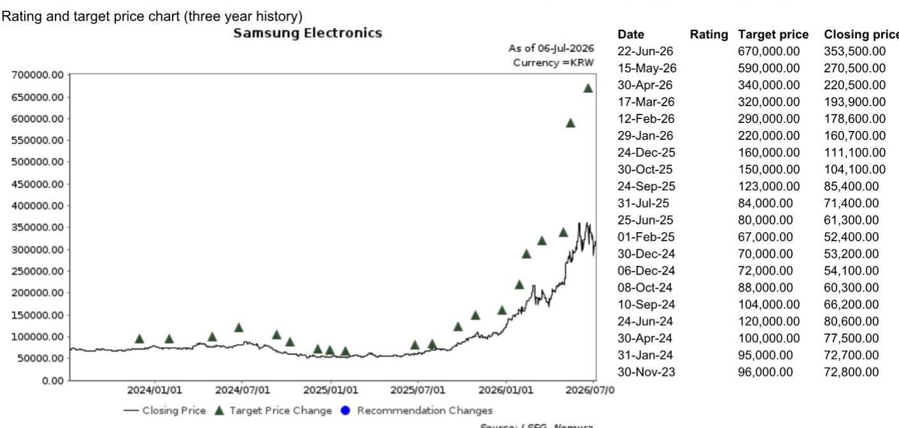
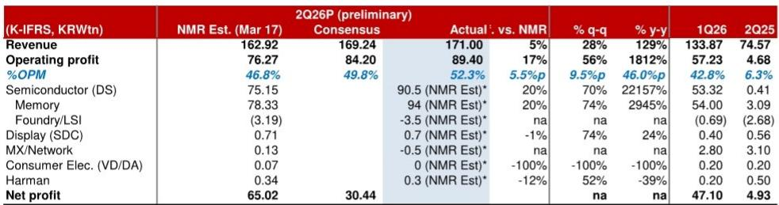

# NOM：存储短缺或持续至2029年，三星估值为何被关注

当一家公司的季度营业利润达到竞争对手的1.5到2倍，并且这一数字还在加速增长时，市场通常应该给予溢价。但NOM最新发布的这份三星电子快评揭示了一个现象：这家韩国科技巨头的利润规模已站上全球科技公司季度盈利的顶点，其估值却仍处于相对较低水平。

7月6日，三星电子公布2026年第二季度初步业绩。营收171万亿韩元，营业利润89万亿韩元，大幅超出NOM此前预测的76万亿韩元。更值得注意的是，这一利润数字已经包含了约20万亿韩元的一二季度奖金拨备。若剔除这一非经常性因素，NOM估算三星电子二季度的实际营业利润应在110万亿韩元附近——一个足以让任何竞争对手侧目的水平。

> **KC评论：** 这份报告最核心的洞察不是“三星赚了很多钱”，而是“市场对如此规模的盈利能力尚未充分反映”。完整报告中的利润拆解和分部对比图表，值得仔细看。

## 1. 存储芯片的定价权正在向三星集中，而非分散

市场普遍关注存储芯片价格分化对龙头利润的影响。NOM在6月24日的报告中已提出不同看法：供应商之间的价格差异化正在发生，但三星是受益方，而非受损方。二季度业绩印证了这一判断——存储部门贡献了约94万亿韩元的营业利润，较NOM预测高出20%。

这一超预期并非偶然。NOM判断，三季度大宗DRAM/NAND价格仍将环比增长15%至20%，且与客户签订的长协正在逐步扩大。更关键的是，HBM的盈利能力正在向大宗DRAM收敛。这意味着三星不仅在量上占据优势，在利润结构上也在完成一次关键的调整。

## 2. 手机业务利润被挤压，但涨价窗口正在打开

报告中的一个信号值得关注：移动与网络部门在二季度出现亏损。NOM认为，这是存储芯片价格明显走强以滞后效应传导至成本端的结果。但三星并非被动承受——其竞争对手苹果已计划将产品价格上调15%至25%，这为三星打开了同样的涨价空间。

问题在于，三季度存储价格预计继续上涨，手机部门能否通过提价完全对冲成本变化，仍是一个需要持续观察的变量。NOM对此持谨慎态度，认为利润改善难度较大。

> **KC评论：** 手机业务亏损是这份报告中最容易被忽略的信息。它提醒我们，存储芯片的周期正在重塑整个消费电子产业链的利润分配。报告中关于MX部门亏损的详细拆解，是理解这一传导链条的关键。

## 3. 供应短缺可能持续到2029年，但市场尚未充分反映

NOM在报告中提出了一个判断：尽管存储公司正在加速扩产，但这些努力要到2029年后才会产生实质性影响。在此之前，供应短缺格局大概率持续。

这一判断如果成立，意味着三星电子的高利润并非短期脉冲，而是一个长达数年的结构性红利。然而，当前报价仅为31.8万韩元。报告指出，三星相对于其利润规模，存在一定程度的低估。

## 4. 报告尚未完全展开的关键问题

NOM的这份快评在数据和判断上足够清晰，但仍有几个问题没有完全展开：

第一，当存储芯片价格增速从“明显走强”转向“逐步稳定”后，三星的利润峰值会在何时出现？报告给出了三季度价格涨幅预期，但没有给出利润见顶的时间框架。

第二，代工与LSI部门的亏损仍在扩大。报告提到该部门计入奖金拨备后亏损规模更大，但没有给出明确的扭亏时间表。在AI芯片需求增长的背景下，三星的代工业务为何迟迟未能改善，这仍是悬而未决的问题。

第三，估值调整的催化剂是什么？NOM认为三星被低估，但并未明确指出什么事件能触发市场重新定价——是HBM盈利追平大宗DRAM的那一刻，还是存储价格增速节奏变化后市场才敢给予更高估值？

## 观察框架：如何跟踪三星的研究逻辑

对于关注三星的读者，这份报告提供了一个清晰的跟踪框架：

第一个信号是HBM与大宗DRAM的利润率差距。一旦两者趋同，三星的利润质量将获得重新评估。

第二个信号是手机部门的涨价节奏。三季度能否实现有效提价，将决定市场对其利润可持续性的信心。

第三个信号是资本开支节奏。如果三星的扩产计划超出预期，市场可能会提前修正2029年后的供需预期。

这三个信号中，任何一个的出现都可能改变当前“利润历史新高、估值历史低位”的格局。

For informational purposes only. Portions may be generated,translated,summarized,or edited with AI assistance based on source materials and may contain omissions or errors. Please verify independently. This is not investment,legal,tax,accounting,or other professional advice.

For informational purposes only. Portions may be generated,translated,summarized,or edited with AI assistance based on source materials and may contain omissions or errors. Please verify independently. This is not investment,legal,tax,accounting,or other professional advice.

