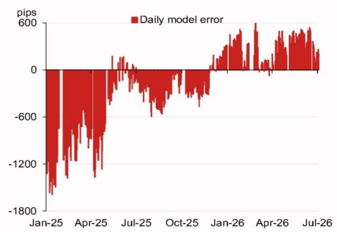

# The USD/CNY Fix Is No Longer a Black Box: A Model-Driven Framework for Currency Strategy

The People's Bank of China's daily USD/CNY fixing rate remains one of the most consequential and opaque inputs for any global observer with exposure to Chinese assets. For years, market participants have treated the fix as a policy signal to be decoded after the fact, rather than a variable to be anticipated. That approach is increasingly costly. A new analytical framework, grounded in a transparent, replicable model, now makes it possible to understand the fix as a function of observable market forces, not just policy discretion.

The central argument is this: the USD/CNY fixing mechanism can be decomposed, forecast, and analyzed with a degree of precision that has historically been unavailable to the broader market. This is not a claim that the fix has become mechanical or that policy intervention has disappeared. Rather, it is an assertion that the gap between what the market expects and what the PBOC sets is now measurable, and that gap contains actionable information.

Why now? Three developments converge to make this moment critical. First, the renminbi is under renewed attention from a strong dollar cycle and diverging monetary policy trajectories. Second, the PBOC has signaled a return to a more rules-based fixing methodology after periods of heavy discretionary intervention. Third, the calendar of Chinese political events through late 2026 creates a series of natural stress points where fix dynamics will matter most.

The model presented in a recent research report offers a systematic way to parse these forces. It projects the fix by weighting overnight market movements across a defined basket of currencies and then applying a counter-cyclical factor that captures the residual policy intent. The result is not just a number, but a diagnostic tool. When the model's projection diverges from the actual fix, that divergence itself becomes a signal worth analyzing.

This article unpacks the model's logic, examines its recent performance, identifies what remains unresolved, and translates the framework into a decision tool for observers who need to position ahead of the fix rather than react to it.

## The Fix Model Reveals That the PBOC's Discretion Is Smaller Than Markets Assume

The conventional wisdom holds that the PBOC's daily fix is a largely discretionary instrument, adjusted to manage expectations, signal policy shifts, or smooth volatility. The model challenges this assumption by demonstrating that the vast majority of fix movement can be explained by observable market data.

The model's core logic is straightforward. It calculates a projected fix based on the overnight change in a weighted basket of currencies, with the weights reflecting the PBOC's disclosed currency basket composition. The model then subtracts the previous day's official spot close to arrive at a projected change. On 8 July 2026, this projection stood at 6.8007, compared to 6.8054 in the prior period. The 47-pip decline is almost entirely attributable to movements in four currencies: the US dollar index, the euro, the Japanese yen, and the Korean won.

This is the critical insight. The fix is not reacting to a secret policy agenda. It is reacting to the same global FX flows that any market participant can observe. The PBOC's discretion, to the extent it exists, is captured in the residual between the model's projection and the actual fix. That residual, which the report terms the counter-cyclical factor, was only 5 pips on 8 July. This is a vanishingly small number by historical standards.

The implication for observers is significant. If the fix is primarily a function of observable market variables, then the ability to forecast it becomes a matter of data and methodology, not clairvoyance. This reduces the information asymmetry between the PBOC and the market and allows for more precise hedging and positioning strategies.

## Model Errors Are a Leading Indicator of Policy Intent, Not a Measure of Failure

A natural question arises: how often does the model get it wrong? The answer, paradoxically, is that the errors are the most informative part of the analysis. The report includes a chart of recent model errors, defined as the difference between the model's projection and the actual fix. When the model is accurate, the PBOC is effectively following a rules-based approach. When the model is wrong, the PBOC is actively intervening.

The pattern of errors over time tells a story. Periods of small, unsystematic errors suggest a neutral policy stance. Periods of large, persistent errors in one direction signal that the PBOC is deliberately pushing the fix away from market-implied levels. This is exactly what happened during the renminbi depreciation pressure in 2023 and 2024, when the counter-cyclical factor was consistently positive, indicating that the PBOC was leaning against depreciation by setting a stronger fix than market forces would suggest.

The current data point from 8 July 2026, with a counter-cyclical factor of only 5 pips, suggests that the PBOC is not currently intervening in a material way. This is consistent with a period of relative stability in the renminbi, but it also means that any future divergence between the model and the fix will be a clear and early warning signal of a shift in policy.

For observers, this transforms model error from a nuisance into a signal. A sudden widening of the error band should trigger a reassessment of the PBOC's tolerance for renminbi movement and a corresponding adjustment to FX hedges and cross-border exposure.

## The Calendar of Political Events Creates Predictable Stress Points for the Fix

The report includes a calendar of Chinese political events through late 2026, and each of these events has the potential to alter the fix dynamics in a predictable way. The July Politburo meeting for economic work, the APEC summit in Shenzhen, the Central Economic Work Conference in December, and the anticipated visit of President Xi to the United States are all moments when the PBOC may face conflicting incentives.

During periods of domestic political sensitivity, the PBOC typically prioritizes stability, which means a narrower fix range and a larger counter-cyclical factor to absorb external shocks. During international summits, the PBOC may allow greater flexibility to signal market-oriented reform credentials. The Xi visit to the US towards the end of 2026 is particularly significant, as it coincides with a period of potential trade negotiation and geopolitical positioning.

The model provides a baseline for what the fix should be under normal conditions. By overlaying the event calendar, observers can anticipate when the PBOC is most likely to deviate from that baseline and in which direction. This is not a prediction, but a probabilistic framework. The fix is more likely to be interventionist during the weeks surrounding these events, and the model's error term becomes the key variable to monitor.

This is where the model's value proposition shifts from descriptive to prescriptive. It allows observers to build scenario-specific hedges that are triggered not by the fix itself, but by the divergence between the fix and the model. This is a more surgical approach than simply betting on renminbi direction.

## What the Model Does Not Fully Answer: The Counter-Cyclical Factor Remains a Residual, Not a Rule

For all its explanatory power, the model leaves one critical question unresolved. The counter-cyclical factor is measured as the residual between the model and the fix, but it is not itself modeled. The report does not attempt to forecast the counter-cyclical factor, nor does it specify the conditions under which it is likely to increase or decrease.

This is not a flaw in the model, but a limitation of the current state of knowledge. The counter-cyclical factor is a policy variable, and policy variables are inherently difficult to model because they depend on objectives that are not fully disclosed. The PBOC may adjust the counter-cyclical factor based on capital flow pressures, trade negotiations, domestic credit conditions, or geopolitical considerations. These factors are not easily reduced to a single equation.

The practical consequence is that the model's projections are most reliable during periods of policy neutrality and least reliable during periods of active intervention. This creates a paradox. The model is most useful when the PBOC is not intervening, but the need for the model is greatest when the PBOC is intervening. The resolution of this paradox lies in using the model as a detection tool. When the model's error widens, it is a signal to investigate the policy rationale, not a failure of the model itself.

A second unresolved question is the impact of the model's projections on market pricing. If enough market participants use the same or similar models, the projections become self-fulfilling. The fix is set based on overnight market movements, but those movements themselves may be influenced by expectations of the fix. This feedback loop is not captured in the current model and represents a frontier for future research.

## A Decision Framework: How to Use the Fix Model in Portfolio Construction

Translating the model into a decision framework requires moving beyond the single-point projection and embracing a range of outcomes. The following framework is designed for portfolio managers and FX strategists who need to incorporate fix dynamics into their positioning.

Step one is to establish the baseline. Using the model, project the fix for the next five to ten trading days based on current market levels. This projection is not a forecast of the spot rate, but a forecast of where the PBOC will set the fix if it follows the rules-based approach. The baseline provides a reference point against which actual fixes can be compared.

Step two is to measure the divergence. Track the cumulative error between the model and the actual fix over a rolling window. A cumulative error that exceeds one standard deviation from the historical mean is a threshold for action. At this point, the observer should assume that the PBOC is actively intervening and adjust the probability distribution for future fix outcomes accordingly.

Step three is to calibrate the hedge. If the model suggests that the fix is being held artificially strong or weak relative to market forces, the observer can take a position in options or forwards that benefits from a reversion to the model-implied level. The key is to size the position based on the expected duration of the intervention, which can be inferred from the event calendar.

Step four is to monitor the counter-cyclical factor as a separate time series. Even if the model's absolute error is small, a trend in the counter-cyclical factor is a leading indicator of policy change. A rising counter-cyclical factor over several days suggests that the PBOC is becoming more interventionist, even if the absolute level of intervention is still modest.

This framework does not eliminate uncertainty, but it structures it. It allows the observer to distinguish between noise and signal, between normal fix variation and policy-driven deviation. Over time, this structured approach should produce a higher information ratio than a strategy that treats every fix as a surprise.

## The Real Value of the Model Is Not the Number, but the Diagnostic

The 8 July 2026 projection of 6.8007 is a data point, not a strategy. The real value of the fix model is that it provides a systematic framework for interpreting the PBOC's behavior. It turns the fix from an opaque policy instrument into a measurable, forecastable variable. It allows observers to ask better questions: Is the PBOC leaning against the market? Is the counter-cyclical factor trending? Is the model error consistent with a known policy objective?

These questions are more important than the projection itself. They are the foundation of a disciplined, repeatable approach to currency risk management in the renminbi market.

The report from which this analysis is drawn contains the original charts and data that underpin the model. It includes the top four weighted overnight contributions to the projected change, the recent model error history, and the daily change in the fix over time. These visualizations are essential for understanding the model's logic and for tracking its performance in real time.

For observers who need to move beyond headlines and into a structured analytical framework, the full report is the next step.

---

*For informational purposes only. Portions may be generated, translated, summarized, or edited with AI assistance based on source materials and may contain omissions or errors. Please verify independently. This is not professional advice.*

For informational purposes only. Portions may be generated, translated, summarized, or edited with AI assistance based on source materials and may contain omissions or errors. Please verify independently. This is not professional advice.

