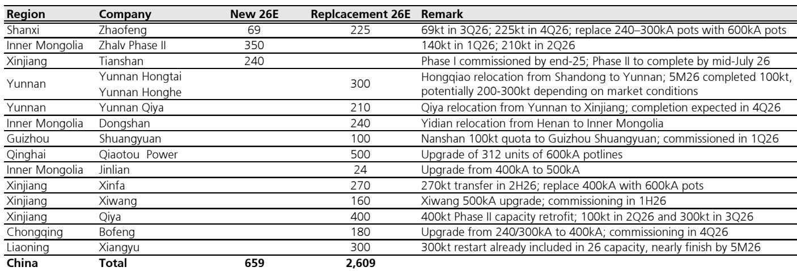
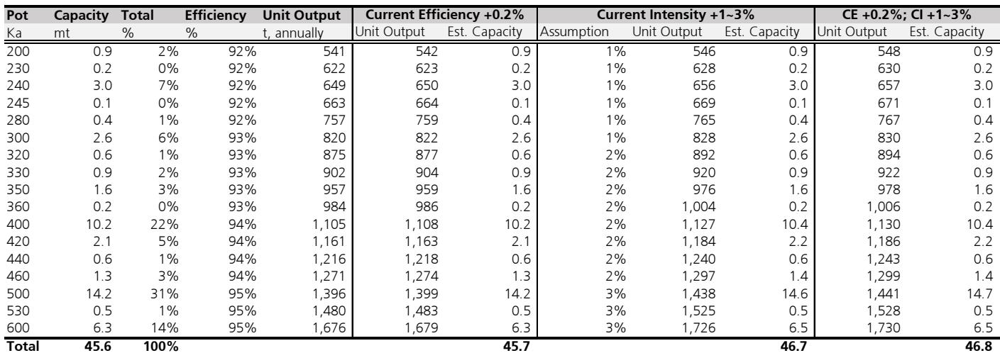
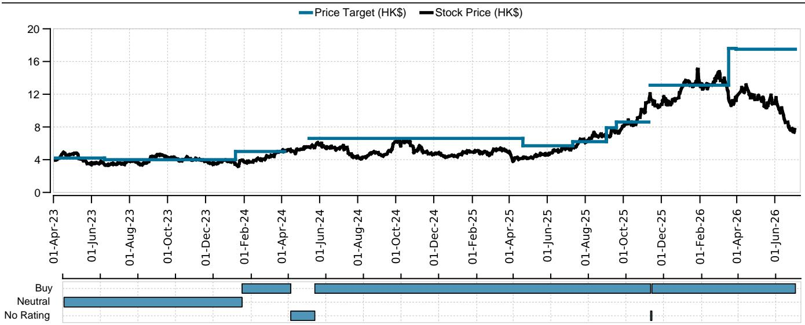

# 关于中国铝业过度悲观情绪的再审视：产能上限依然有效，估值已具吸引力

市场对中国铝业的看法已转向明显悲观。在经历了一段创纪录的利润和供应中断推高报价的时期后，市场叙事已转向供应过剩、需求减弱和盈利预期下调。一份全球研究机构的报告下调了2026年和2027年的铝价预测，并大幅削减了该行业的盈利预期。然而，对中国供应结构性约束、产能增加的真实性质以及不断变化的需求图景进行更深入的审视，会揭示出不同的故事。这种悲观情绪造成了基本面与估值之间的脱节，这不仅仅是一个机会，对于那些理解产能上限虽经考验但未被打破的观察者而言，这是一种战略上的必要考量。

本报告的核心论点是，市场高估了结构性过剩的风险，并低估了铝价底部的韧性。2017年将中国批准的名义产能上限设定为4543万吨的供给侧改革，仍然是全球铝市场最重要的结构性特征。尽管创纪录的利润通过电解槽升级、推迟维护以及在产能置换期间并行生产等方式，激励了适度的超产，但这些是暂时且边际性的影响。报告预测，中国产量在2026年将上升至4560万吨，2027年升至4600万吨，仅略高于官方上限。这并非改革架构的突破，而是系统在其自然极限下运行。

为何是现在？因为市场正在定价一个最坏情景，将暂时的生产动态与政策的永久性转变混为一谈。风险在于，此前在商品周期中受挫的读者可能会袖手旁观，而多年来最具吸引力的入场点正在流逝。这并非适合所有人的建议，但这是一个基于供给侧现实、而非一厢情愿的判断。

## 产能上限依然稳固，所担忧的供应激增只是幻象

最持久的看空论点是，中国的产能上限已成为一纸空文。引用的证据包括：产能置换期间并行生产的传闻、提升有效产出的电解槽升级，以及可能被合法化的不合规遗留产能。这些观点在技术上各有其道理，但综合来看，在战略上具有误导性。

以产能置换机制为例。2026年，总产能置换量约为260万吨，包括跨省迁移和原地升级。在过渡期间，新旧电解槽可能同时运行，造成产出的暂时性提升。但这是一种物流上的必要，而非政策漏洞。报告的分析显示，即使在一个理想化的情景中，每条电解槽都以最大理论产出运行，且当前效率提高0.2个百分点、电流强度提升1-3%，有效年化产能也仅能达到4680万吨。这是一个理论上的上限，而非现实的产量预测。

真正的制约在于运营层面。由于对利润可持续性和电解槽寿命的担忧，生产商不愿最大化短期产出。每4-8年需要大修的轮换维护周期，留下了约2%的结构性产能利用率缓冲。数据证实了这一点：从2021年到2026年前五个月，中国全国月度装机产能利用率从未超过100%。即使在每吨利润超过8000元人民币的峰值时期，有效利用率也紧密锚定在100%左右，上下浮动2%。市场对供应洪流的恐惧，是基于理论产能，而非运营现实。

结论很明确：供给侧改革的架构并未被打破。它正在被管理、被考验，偶尔被拉伸，但它仍然是全球铝市场的主导性结构力量。将每一吨增量的产出都视为政策崩溃证据的观察者，正在误读数据。

## 中国以外的供应在增长，但不足以造成实质性过剩

全球供应图景比看空观点所暗示的更为复杂。报告预测，在超过300万吨供应增长的支撑下，2026年全球铝市场将出现110万吨的缺口，随后在2027年恢复平衡。增长是真实的，尤其是来自印度尼西亚的供应，预计其产量在2026年将增加100万吨，2027年增加170万吨。但这并非新供应的海啸。

印度尼西亚的故事很重要，但也充满不确定性。报告指出了几个风险：雅加达的政策不确定性、将电力从镍加工进一步转移的限制，以及项目投产可能延迟。大约300万吨的供应受到中东局势的影响，支撑了2026年的缺口。逐步重启以及释放30-40万吨的积压库存，应能缓解欧美市场的紧张状况，但这是一种正常化，而非供应过剩。

关键见解在于，市场正从一个极度紧张时期过渡到一个平衡时期，而非过剩。报告对2026年每磅1.50美元和2027年每磅1.42美元的价格预测，反映的是一种温和调整，而非崩溃。支撑因素依然存在：铜铝比超过4倍鼓励替代，发达市场传统需求的复苏提供了底部，成本曲线依然陡峭。即使市场紧张状况缓解，铝价也能在成本曲线上方重新定价。

对观察者而言，这意味着铝市场出现多年熊市的风险较低。供应响应虽然真实，但可控。后疫情时期的结构性缺口正在消退，但取而代之的是一个平衡的市场，而非过剩。对于定位良好的生产商来说，这是一个完全可以接受的环境，能够产生强劲的回报。

## 中国短期需求偏弱，但结构性驱动力依然存在

2026年中国的需求图景确实偏软。房地产和建筑活动依然疲弱，而作为近年来铝需求主要驱动力的太阳能行业，现在则成为拖累。报告指出，这两个行业对需求造成了沉重压力，仅靠强劲的铝净出口来抵消，今年前五个月铝净出口同比增长约40%。

但需求故事并非千篇一律，也并非静止不变。报告预计，2026年中国铝总需求将持平，2027年增长2%。这并非灾难，而是在一段异常增长期之后的正常化。结构性驱动力依然存在：车辆轻量化、稳健的机械销售，以及在铜铝替代支撑下的电力传输增长。这些都是多年趋势，不会因房地产的周期性放缓而逆转。

更重要的是，近期的价格温和调整可能支持需求改善和补库存。今年早些时候由中东局势引发的价格飙升，对下游需求产生了负面影响。随着价格正常化，需求破坏效应被逆转。报告的需求预测是保守的，下行风险已被定价。

报告未完全解决的问题是，如果房地产企稳、太阳能行业重新加速，中国需求能以多快速度恢复。答案取决于政策，而政策本质上是不可预测的。但方向是明确的：中国的铝需求并未受到结构性损害，它只是周期性地偏软，而周期是会转变的。

## 盈利下调是真实的，但估值现在已具吸引力

报告将中国三大铝生产商——天山铝业、中国铝业和魏桥铝电——2026年和2027年的盈利预测下调了9-15%。但背景很重要。

下调反映了对铝价前景更为温和的预期以及市场紧张程度的缓解。它们并不反映这些企业基础质量的恶化。报告维持其目标估值方法：天山铝业和中国铝业采用10倍市盈率，魏桥铝电采用6.5%的股息率。当前估值与中期内在价值之间存在显著差距。

能够弥合这一差距的催化剂已经可见。对超产的持续检查以及不合规产能的潜在关闭，可能会收紧供应。印度尼西亚的政策不确定性可能会延迟新项目的投产。中东地区的延迟重启可能为价格提供底部支撑。这些都不确定，但都合情合理。在一个定价了最坏情景的市场中，即使回归基准情景，也会产生显著的上涨空间。

观察者的决策框架是直接的。看空情景需要三件事同时发生：中国产能必须突破上限，中国以外的供应必须加速超出预期，以及中国需求必须未能复苏。每件事都有可能，但三者同时发生可能性不大。基准情景是一个价格高于成本曲线的平衡市场。看多情景则是由供应中断或需求意外引发的新的缺口。风险回报是不对称的。

## 报告未完全解答的问题：政策路径与印度尼西亚的不确定性

没有分析是完整的，这份报告留下了两个重要问题。第一个是中国的政策路径。2017年的改革是对环境恶化和产能过剩的回应。维持上限的政治意愿很强，但并非无限。如果利润长期保持高位，放松上限的压力将会增加。报告认为这不太可能，但并未提供一个评估政策转变概率的框架。

第二个未解答的问题是印度尼西亚。报告对印度尼西亚的供应预测基于已宣布的项目和当前的投产计划。但印度尼西亚是一个复杂的运营环境。电力供应、监管审批和政治稳定性都是风险因素。报告指出了这些风险，但未进行量化。认真的观察者需要就印度尼西亚供应令人失望的可能性形成自己的看法。

这些未解答的问题并非分析的弱点，而是任何前瞻性研究的自然局限。报告为理解供需平衡提供了一个严谨的框架。观察者的工作是将自己的判断应用于这些不确定性。

## 铝业观察者的决策框架

报告为考虑进入中国铝业相关公司的观察者转化成了一个清晰的决策框架。起点是区分周期性因素和结构性因素。当前中国需求的疲弱是周期性的。产能上限是结构性的。盈利下调是周期性的。估值折价是结构性的。

该框架有三个支柱。首先，评估中国产能上限被突破的概率。证据表明概率较低，但并非为零。认为上限不可侵犯的观察者应积极关注。担心政策转变的观察者应等待更明确的信号。

其次，评估印度尼西亚的供应轨迹。报告的基准情景是显著增加。但风险在于下行。认为印度尼西亚供应将令人失望的观察者应关注该行业。预期项目顺利推进的观察者则应更为谨慎。

第三，监测中国需求的复苏。房地产和太阳能行业的拖累已被充分理解。车辆轻量化和电力传输的复苏则较少被认识到。认为结构性需求驱动力将重新显现的观察者，应将当前的疲弱视为一个机会。

报告的结论是，风险回报具有吸引力。盈利下调已反映在价格中。上行催化剂则尚未体现。市场正在定价过度的悲观情绪。战略性的回应是逐步关注。

## 完整图景需要原始数据

本分析综合了一份关于中国铝业的详细全球研究机构报告中的关键论点。但每一次综合都涉及选择和解读。原始报告包含按省份划分的产能增加数据、逐条电解槽的效率分析以及详细的需求预测，这些无法在摘要中完全呈现。

原始报告中的图表——显示来自不同数据源的年化铝产量的交叉比较、随时间变化的利用率以及详细的产能增加表格——对于形成独立判断至关重要。它们揭示了书面摘要只能暗示的细微差别。

加入社区以阅读完整报告并查看原始图表。

*仅供参考。部分内容可能基于源材料通过AI辅助生成、翻译、总结或编辑，可能存在遗漏或错误。请独立核实。这不构成专业建议。*

仅供参考。部分内容可能基于源材料通过AI辅助生成、翻译、总结或编辑，可能存在遗漏或错误。请独立核实。这不构成专业建议。

