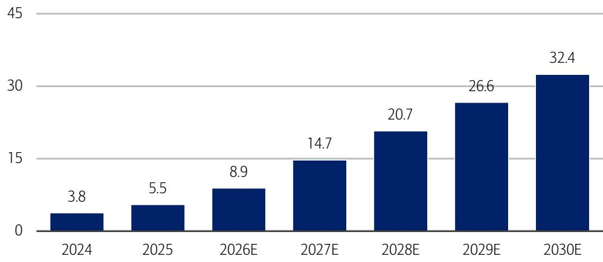
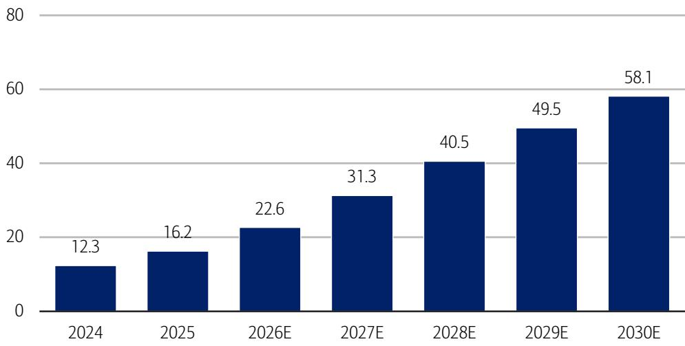
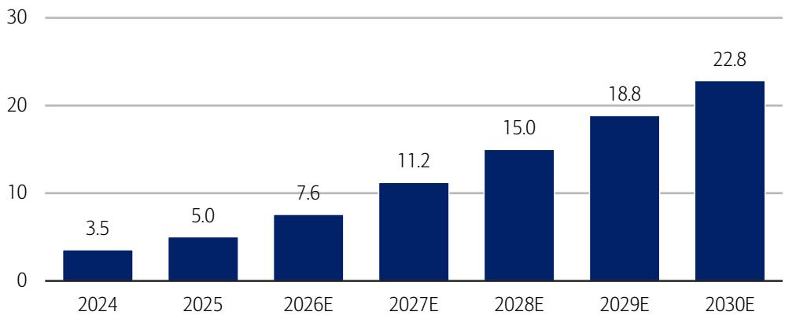
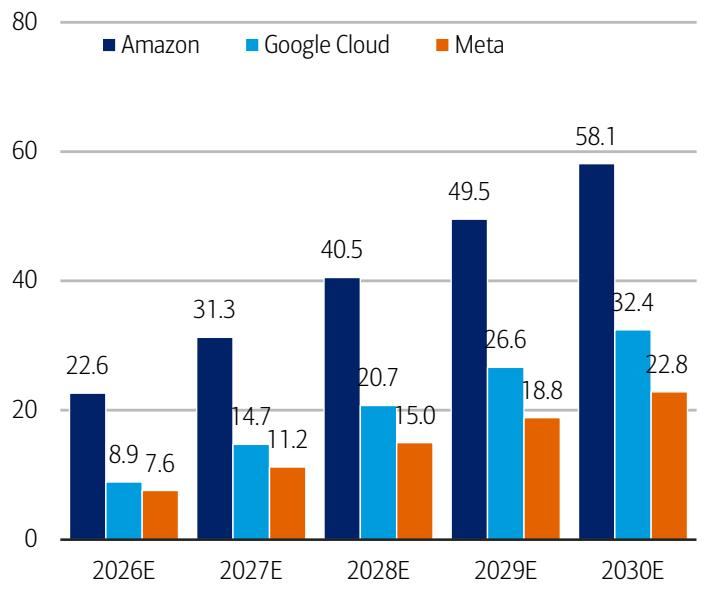
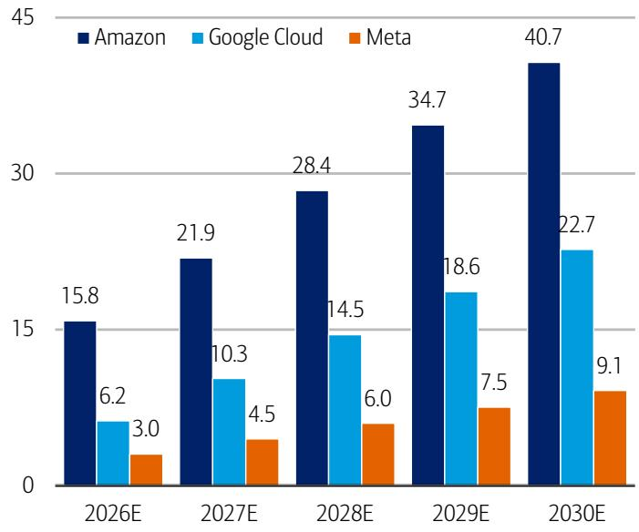
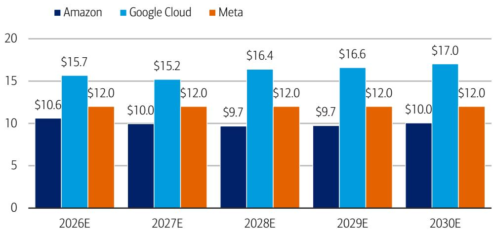
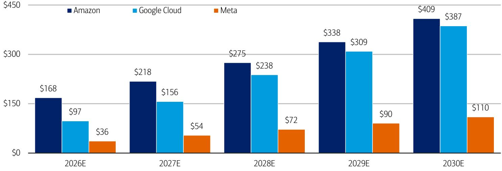

# 互联网/电商行业

# 上调基础设施支出预测：审视互联网基础设施投入、容量与商业化

行业概览

## AI基础设施投入回报仍是大型平台核心讨论话题

对于互联网大型平台公司而言，最核心的讨论话题仍然是AI基础设施投入的回报情况，而第二季度业绩中最大的关注点在于，较高的基础设施支出（以及较低的自由现金流预测）可能会掩盖强劲的收入表现。我们认为，这一关注点已经超过了近期积极的云服务定价（亚马逊）和容量商业化数据点。在本报告中，我们上调了基础设施支出预测，将支出转化为预估的数据中心吉瓦容量，并审视了该容量的商业化预估。我们还进行了互联网大型平台估值分析，并列出了可能改善市场情绪的潜在催化剂。

## 随着平台优先考虑容量，上调基础设施支出预测

鉴于Alphabet近期的融资、亚马逊报告的服务器订单增加、Meta关于大语言模型容量使用的评论以及较高的内存成本，我们正在上调行业基础设施支出预测。对于Alphabet，我们目前预计2026年支出为1950亿美元（此前为1870亿美元），2027年为2900亿美元（此前为2570亿美元）。对于Meta，我们预计2026年支出为1450亿美元（此前为1300亿美元），2027年为1850亿美元（此前为1570亿美元）。对于亚马逊AWS（不含零售），我们预计2026年支出为1590亿美元（不变），2027年为2300亿美元（此前为1960亿美元）。（随着更多6月广告和云数据点的出现，我们将调整相关收入及折旧的预测。）

## 测算至2030年大型平台数据中心吉瓦容量

我们通过综合基础设施支出结果与展望、亚马逊的吉瓦披露信息以及行业对数据中心建设成本的估算来测算容量。我们估计三大互联网巨头在2025年底拥有约27吉瓦容量，到2026年将增长至39吉瓦，2027年达到57吉瓦。我们估计亚马逊在2026-2027年将增加最多容量，为15吉瓦，其次是谷歌的9吉瓦和Meta的约6吉瓦，亚马逊的容量增加成本低于同行（根据2025年披露，每吉瓦AWS支出约为240亿美元）。

## 近期容量交易表明容量价值持续增长

假设亚马逊AWS容量的70%用于云服务（30%用于核心业务），我们估计2026年AWS每吉瓦容量收入为106亿美元，谷歌云为157亿美元。这些每吉瓦收入远低于Anthropic和谷歌与SpaceX达成的每吉瓦高达500亿美元的近期容量交易（针对专业AI容量），这使我们对未来容量相关收入的增长潜力持乐观态度。对于Meta，我们估计到2030年该公司可能拥有约23吉瓦容量，如果40%可用于AI企业销售，我们估计潜在企业机会为1100亿美元（假设每吉瓦120亿美元）。

## 互联网大型平台估值分析

在我们的估值分析中，我们剔除了核心广告和零售收入的预估估值（隐含市盈率12-15倍），并审视了大型平台公司每吉瓦容量所隐含的估值。虽然我们的分析依赖于众多假设，并排除了Leo和Reality Labs等项目的影响，但我们认为我们的分析揭示了市场对Meta容量建设所赋予的有限隐含价值。我们的分析表明，谷歌2028年云服务每吉瓦隐含价值为1100亿美元（假设70%容量用于云服务），亚马逊AWS每吉瓦为590亿美元，Meta每AI吉瓦为40亿美元。我们注意到，Meta是容量收入杠杆验证点的主要受益者。请参阅下一页的其他结论。

## 2026年7月7日

股票
美国

Justin Post
研究分析师
BofAS
+1 415 676 3547
justin.post@bofa.com

## Nitin Bansal, CFA

研究分析师

BofAS

+1 415 676 3551

nbansal7@bofa.com

AI：人工智能

FCF：自由现金流

GW：吉瓦

API：应用程序编程接口

MTIA：Meta训练与推理加速器

TAM：总可寻址市场

LLM：大语言模型

## 引言

我们认为，对于互联网大型平台公司而言，最核心的讨论话题仍然是AI基础设施投入的回报情况。较高的基础设施支出增加了平台的固定成本，降低了竞争差异化，并增加了长期利润率风险。虽然近期自由现金流压力的风险正在增加，但近期出现了积极的云服务定价（亚马逊）、容量租赁（Anthropic与SpaceX的交易）和大语言模型数据点（Meta在Watermelon项目上的改进），表明商业化潜力强劲。然而，尽管云服务行业收入增长强劲且加速，亚马逊和Meta的市盈率估值仍远低于历史平均水平，而谷歌自6月3日宣布融资以来表现相对落后，表明读者对AI基础设施支出的投资回报率仍持观望态度。

在本报告中，我们更新了基础设施支出预测，将支出转化为隐含的已安装吉瓦数据中心容量，并通过每吉瓦收入分析来估算该容量的潜在商业化价值。我们还分析了互联网大型平台的容量情况，以及可能推动估值提升的潜在催化剂。

我们的主要结论：

- 亚马逊将在2026-2027年增加最多容量，因此在该群体中具有最大的容量驱动增量收入增长潜力。我们估计亚马逊在这两年期间将增加15吉瓦容量，其次是谷歌的9吉瓦和Meta的约6吉瓦。重申对亚马逊的积极看法。

我们估计亚马逊每增量吉瓦容量的成本最低。我们估计2026年亚马逊的容量增加成本为每吉瓦250亿美元，而谷歌为370亿美元，Meta为450亿美元，这反映了AWS的规模优势、内部芯片的使用以及核心云工作负载（相对于AI）更均衡的混合。谷歌和Meta在2026年的较高成本部分反映了额外的前期设施支出（相对于芯片）以及更专业的AI容量（GPU相对于CPU）。

- 谷歌每预估AI/云容量的收入较高，这得益于其优质的云服务组合和以TPU为基础的差异化AI基础设施。然而，考虑到2026年AWS每吉瓦收入约为100亿美元，而Alphabet云为160亿美元，随着AI工作负载占总量的比例增长，我们的AWS收入预估存在上行潜力。

- 基于近期的容量交易，我们的云服务收入预估存在显著上行潜力。我们估计亚马逊和谷歌每吉瓦容量的年度云服务收入在100亿至170亿美元之间，远低于Anthropic和谷歌与SpaceX签署的每吉瓦超过400亿美元的近期容量交易（估计值）。我们在估算Meta的企业收入潜力时也使用了保守的每吉瓦120亿美元，考虑到Meta正在建设的专业AI容量，这一数字可能有显著上行空间。

- Meta在其容量建设上获得的价值很小甚至为负。即使对Meta的广告业务采用保守的2027年收入5倍估值（假设50%利润率，相当于约12倍市盈率），并假设相对较高的60%容量将用于核心广告业务，根据我们的容量估算，Meta的股票估值中每AI吉瓦容量仅隐含40亿美元的价值。重申对Meta的积极看法。

## 第一部分：上调基础设施支出预测

鉴于Alphabet和亚马逊近期的融资，结合Digitimes关于AWS已要求服务器供应链合作伙伴增加2026年第三季度出货量的报道、Meta管理层关于其新大语言模型（Watermelon）容量需求增加的评论、谷歌强调明年基础设施支出将显著增加的言论，以及DRAM现货价格数据显示价格环比上涨40%，我们正在上调基础设施支出预测。我们认为，平台将优先考虑容量可用性而非近期自由现金流优化，因为对AI训练、推理、云工作负载和内部AI产品部署的需求仍然受到供应限制。支持我们更高基础设施支出展望的近期评论：

- 6月，谷歌表示计划筹集800亿美元资金用于基础设施投资，
- 7月初，Meta表示其下一代AI模型"Watermelon"使用的计算能力是之前的10倍，
- 7月初，亚马逊网络服务已告知其服务器供应链合作伙伴增加2026年第三季度的出货量（据Digitimes报道），以及
- 6月中旬，据彭博社报道，Meta与云服务提供商Crusoe签署了1.6吉瓦的容量协议。

图表1：我们正在上调基础设施支出预测，以反映近期云行业数据点。Alphabet、Meta和亚马逊AWS的更新后基础设施支出预测（十亿美元）

来源：BofA全球研究估计
BofA全球研究

## 修订后的预测：

- Alphabet：我们目前预计2026年支出为1950亿美元（此前为1870亿美元），同比增长49%至2027年的2900亿美元（此前为2570亿美元），2028年同比增长14%至3300亿美元（此前为3100亿美元）。

- Meta：我们目前预计2026年支出为1450亿美元（此前为1300亿美元），同比增长28%至2027年的1850亿美元（此前为1570亿美元），2028年同比增长14%至2100亿美元（此前为1710亿美元）。

- 亚马逊AWS：我们预计2026年支出为1590亿美元（不变），同比增长44%至2027年的2300亿美元（此前为1960亿美元），2028年同比增长20%至2760亿美元（此前为2210亿美元）。

注意：我们更新的Alphabet、亚马逊和Meta模型仅反映了对基础设施支出预测的修订。随着我们收到6月收入数据点，我们将纳入对折旧、每股收益、自由现金流和其他财务指标的相应影响。

## 第二部分：估算已安装吉瓦容量

利用我们的基础设施支出预测，我们估算了Alphabet、Meta和亚马逊AWS的历史和未来已安装吉瓦数据中心容量。我们的分析以公司层面的基础设施支出为起点，然后应用建设及装备AI导向数据中心容量的估算成本。虽然鉴于公司披露有限，该分析较为宏观，但我们认为它有助于衡量平台基础设施部署的规模以及潜在可商业化的计算基础。我们的关键假设包括：

## 建设一吉瓦容量的成本

我们估计，2026年建设1吉瓦数据中心容量的成本为250亿至450亿美元，包括主要基础设施和计算组件。该范围反映了加速器组合、机架密度、电源冗余、冷却架构、土地和建设成本的差异，以及容量是优化用于训练、推理还是混合工作负载。我们认为，Meta和谷歌在2026年的每吉瓦基础设施支出成本可能较高，因为芯片部署前的土地和建设成本较高，且容量比各种云竞争对手更专注于AI工作负载。未来的抵消因素可能包括芯片性能提升、专有芯片的使用以及内存和其他供应可用性的快速增长。

利用多个二手来源的数据，我们估计AI数据中心建设成本的最大组成部分是AI服务器和GPU，约占总成本的55%至60%。这反映了支持训练和推理工作负载所需的加速器、服务器系统及相关计算硬件的高成本。电力基础设施是第二大成本类别，约占12%至18%，包括支持密集AI工作负载所需的变电站、变压器、开关设备、备用发电和配电设备。网络占另外8%至12%的成本，由连接大型GPU或TPU集群所需的高性能互连、交换机和光网络驱动。除计算和电力外，我们估计建筑、土地和场地工作约占总成本的8%至12%，包括土地购置、外壳建设、场地准备及相关土木工程。冷却和机械系统约占6%至10%，其他成本和应急费用约占3%至5%。

图表2：我们估计建设1吉瓦AI数据中心容量的成本为250亿至450亿美元
1吉瓦容量数据中心成本构成（十亿美元）

<table><tr><td>基础设施支出类别</td><td>约占总成本百分比</td><td>下限（十亿美元）</td><td>上限（十亿美元）</td><td>包含内容</td></tr><tr><td>AI服务器/GPU</td><td>55%-60%</td><td>$14</td><td>$28</td><td>GPU服务器、CPU、内存、服务器内存储</td></tr><tr><td>网络</td><td>8%-12%</td><td>$2</td><td>$5</td><td>交换机、光模块、网卡、线缆、后端GPU网络</td></tr><tr><td>电力基础设施</td><td>12%-18%</td><td>$3</td><td>$8</td><td>变电站、变压器、开关设备、UPS、PDU、备用发电</td></tr><tr><td>冷却/机械系统</td><td>6%-10%</td><td>$2</td><td>$5</td><td>液冷、冷水机组、冷却分配、散热</td></tr><tr><td>建筑/土地/场地工作</td><td>8%-12%</td><td>$2</td><td>$5</td><td>土地、外壳、安防、物理建设、许可</td></tr><tr><td>其他/应急费用</td><td>3%-5%</td><td>$1</td><td>$2</td><td>设计、工程、调试、备件、缓冲</td></tr><tr><td>总计</td><td>100%</td><td>$25</td><td>$45</td><td>1吉瓦AI数据中心</td></tr></table>

来源：BofA全球研究估计，Epoch AI，JLL
BofA全球研究

公司特定假设：谷歌和亚马逊的自定义芯片优势
对于公司特定假设，我们使用2026年每吉瓦成本：Meta约450亿美元，Alphabet 370亿美元，亚马逊250亿美元。对于亚马逊，我们可以根据亚马逊的基础设施支出和两年吉瓦容量增长展望来交叉验证每吉瓦成本。Meta的较高假设反映了数据中心土地/建筑的更高前期成本（在GPU部署之前）以及对外部GPU基础设施的依赖。对于Alphabet和亚马逊，我们假设较低的每吉瓦成本，以反映自定义芯片的使用，特别是使用内部开发的TPU和Trainium/Graviton芯片的能力，我们认为这可以降低相对于更依赖GPU架构的有效计算成本。

## Alphabet已安装容量估计

我们估计Alphabet在2025年拥有5.5吉瓦容量，到2026年将同比增长62%至8.9吉瓦，2027年同比增长66%至14.7吉瓦。到2030年，我们预计Alphabet的已安装容量将达到32.4吉瓦。

图表3：我们估计Alphabet容量到2027年将增长至15吉瓦
估计的Alphabet已安装数据中心容量（吉瓦）

来源：BofA全球研究估计
BofA全球研究

我们估计Alphabet 2026年基础设施支出为1950亿美元，2027年为2900亿美元。假设用于云业务和AI数据中心的基础设施支出占比从2024年的45%增加到2025年的60%和2030年的70%，且增加1吉瓦容量的平均成本从2024年的约310亿美元增加到2030年的约460亿美元，我们估计Alphabet的容量将从2026年的约8.9吉瓦增加到2030年的32.4吉瓦。2026年每吉瓦成本上升，随后在2027年下降，反映了容量建设的时间动态（物理基础设施先于芯片部署）。我们预计2027年每吉瓦收入将下降，以反映容量部署的时间安排，然后在2028年再次上升。

图表4：我们估计Alphabet的容量将从2026年的约8.9吉瓦增加到2030年的约32.4吉瓦
Alphabet按年份划分的基础设施支出和投产容量估计

<table><tr><td></td><td>2024</td><td>2025</td><td>2026E</td><td>2027E</td><td>2028E</td><td>2029E</td><td>2030E</td></tr><tr><td>现有容量</td><td>3.0</td><td>3.8</td><td>5.5</td><td>8.9</td><td>14.7</td><td>20.7</td><td>26.6</td></tr><tr><td>吉瓦增加</td><td>0.8</td><td>1.7</td><td>3.4</td><td>5.8</td><td>6.0</td><td>5.9</td><td>5.8</td></tr><tr><td>总容量</td><td>3.8</td><td>5.5</td><td>8.9</td><td>14.7</td><td>20.7</td><td>26.6</td><td>32.4</td></tr><tr><td>Alphabet基础设施支出（十亿美元）</td><td>$52.5</td><td>$91.4</td><td>$195.0</td><td>$290.0</td><td>$330.0</td><td>$356.4</td><td>$384.9</td></tr><tr><td>同比</td><td>63%</td><td>74%</td><td>113%</td><td>49%</td><td>14%</td><td>8%</td><td>8%</td></tr><tr><td>用于云服务的百分比</td><td>45%</td><td>60%</td><td>64%</td><td>70%</td><td>70%</td><td>70%</td><td>70%</td></tr><tr><td>谷歌云基础设施支出（十亿美元）</td><td>$23.6</td><td>$54.9</td><td>$124.8</td><td>$203.0</td><td>$231.0</td><td>$249.5</td><td>$269.4</td></tr><tr><td>同比</td><td>109%</td><td>132%</td><td>127%</td><td>63%</td><td>14%</td><td>8%</td><td>8%</td></tr><tr><td>每增加吉瓦成本</td><td>$31.0</td><td>$31.9</td><td>$36.7</td><td>$34.9</td><td>$38.4</td><td>$42.2</td><td>$46.4</td></tr><tr><td>同比</td><td></td><td>3%</td><td>15%</td><td>-5%</td><td>10%</td><td>10%</td><td>10%</td></tr><tr><td>谷歌云收入（BofA估计）</td><td>$43</td><td>$59</td><td>$97</td><td>$156</td><td>$238</td><td>$309</td><td>$387</td></tr><tr><td>同比</td><td>31%</td><td>36%</td><td>66%</td><td>61%</td><td>52%</td><td>30%</td><td>25%</td></tr><tr><td>市场估计</td><td></td><td></td><td>$97</td><td>$149</td><td>$210</td><td>$273</td><td>$344</td></tr><tr><td>差异百分比（BofA vs 市场）</td><td></td><td></td><td>0.5%</td><td>5.2%</td><td>13.2%</td><td>13.5%</td><td>12.4%</td></tr><tr><td>增量同比收入</td><td>$10.1</td><td>$15.5</td><td>$38.7</td><td>$59.0</td><td>$81.5</td><td>$71.4</td><td>$77.3</td></tr><tr><td>每增加吉瓦增量收入</td><td>$13.3</td><td>$9.0</td><td>$11.4</td><td>$10.1</td><td>$13.5</td><td>$12.1</td><td>$13.3</td></tr><tr><td>同比</td><td>-27%</td><td>-32%</td><td>26%</td><td>-11%</td><td>34%</td><td>-11%</td><td>10%</td></tr></table>

来源：BofA全球研究估计
BofA全球研究

## 亚马逊已安装容量估计

我们估计亚马逊在2025年拥有16.2吉瓦已安装容量，到2026年将同比增长40%至22.6吉瓦，2027年同比增长38%至31.3吉瓦。到2030年，我们预计亚马逊的已安装容量将达到58.1吉瓦。

图表5：我们估计亚马逊AWS容量到2027年将增加至31吉瓦
估计的亚马逊已安装数据中心容量（吉瓦）

来源：BofA全球研究估计
BofA全球研究

我们估计AWS 2026年基础设施支出为1590亿美元，2027年为2300亿美元。假设用于数据中心的基础设施支出占比为100%，且增加1吉瓦新容量的平均成本从2024年的约230亿美元增加到2030年的约360亿美元（随着容量越来越偏向AI），我们估计亚马逊的容量将从2026年的约22.6吉瓦增加到2030年的约58.1吉瓦。

图表6：我们估计亚马逊的AI数据中心容量将从2026年的约22.6吉瓦增加到2030年的约58.1吉瓦
亚马逊按年份划分的基础设施支出和投产容量估计

<table><tr><td></td><td>2024</td><td>2025</td><td>2026E</td><td>2027E</td><td>2028E</td><td>2029E</td><td>2030E</td></tr><tr><td>现有容量</td><td>10.0</td><td>12.3</td><td>16.2</td><td>22.6</td><td>31.3</td><td>40.5</td><td>49.5</td></tr><tr><td>吉瓦增加</td><td>2.3</td><td>3.9</td><td>6.4</td><td>8.6</td><td>9.3</td><td>9.0</td><td>8.6</td></tr><tr><td>总容量</td><td>12.3</td><td>16.2</td><td>22.6</td><td>31.3</td><td>40.5</td><td>49.5</td><td>58.1</td></tr><tr><td>AWS基础设施支出（十亿美元）</td><td>$53.0</td><td>$94.6</td><td>$159.4</td><td>$230.0</td><td>$276.0</td><td>$295.3</td><td>$310.1</td></tr><tr><td>同比</td><td>114%</td><td>78%</td><td>69%</td><td>44%</td><td>20%</td><td>7%</td><td>5%</td></tr><tr><td>每增加吉瓦成本</td><td>$23.0</td><td>$24.2</td><td>$24.9</td><td>$26.6</td><td>$29.8</td><td>$32.8</td><td>$36.1</td></tr><tr><td>同比</td><td></td><td>5%</td><td>3%</td><td>7%</td><td>12%</td><td>10%</td><td>10%</td></tr><tr><td>AWS收入（BofA估计）</td><td>$108</td><td>$129</td><td>$168</td><td>$218</td><td>$275</td><td>$338</td><td>$409</td></tr><tr><td>同比</td><td>19%</td><td>20%</td><td>31%</td><td>30%</td><td>26%</td><td>23%</td><td>21%</td></tr><tr><td>市场估计</td><td></td><td></td><td>$168</td><td>$217</td><td>$275</td><td>$337</td><td>$406</td></tr><tr><td>差异百分比（BofA vs 市场）</td><td></td><td></td><td>0.2%</td><td>0.3%</td><td>-0.1%</td><td>0.3%</td><td>0.7%</td></tr><tr><td>增量同比收入</td><td>$16.8</td><td>$21.2</td><td>$39.3</td><td>$49.9</td><td>$56.7</td><td>$63.2</td><td>$70.9</td></tr><tr><td>每增加吉瓦增量收入</td><td>$7.3</td><td>$5.4</td><td>$6.1</td><td>$5.8</td><td>$6.1</td><td>$7.0</td><td>$8.2</td></tr><tr><td>同比</td><td>3%</td><td>-26%</td><td>14%</td><td>-6%</td><td>6%</td><td>15%</td><td>18%</td></tr></table>

来源：BofA全球研究估计
BofA全球研究

## Meta已安装容量估计

我们估计Meta在2025年拥有5.0吉瓦已安装容量，到2026年将同比增长53%至7.6吉瓦，2027年同比增长48%至11.2吉瓦。到2030年，我们预计Meta的已安装容量将达到22.8吉瓦。

图表7：我们估计Meta容量到2027年将增长至11吉瓦
估计的Meta已安装数据中心容量（吉瓦）

来源：BofA全球研究估计
BofA全球研究

我们估计Meta 2026年基础设施支出为1450亿美元，2027年为1850亿美元。假设用于AI数据中心的基础设施支出占比从2024年的70%增加到2030年的85%，且增加1吉瓦新容量的平均成本从2024年的约360亿美元增加到2030年的490亿美元，我们估计Meta的容量将从2026年的约7.6吉瓦增加到2030年的22.8吉瓦。2026年每吉瓦成本上升，随后在2027年下降，反映了容量建设的时间动态，因为数据中心容量需要时间建设和上线。因此，2026年有效每吉瓦成本看起来较高，然后在2027年随着更多前一年的投资开始上线而下降。

图表8：我们估计Meta的投产容量将从2026年的约7.7吉瓦增加到2030年的22.8吉瓦
Meta按年份划分的基础设施支出和容量估计

<table><tr><td></td><td>2024</td><td>2025</td><td>2026E</td><td>2027E</td><td>2028E</td><td>2029E</td><td>2030E</td></tr><tr><td>现有容量</td><td>2.8</td><td>3.5</td><td>5.0</td><td>7.6</td><td>11.2</td><td>15.0</td><td>18.8</td></tr><tr><td>吉瓦增加</td><td>0.7</td><td>1.5</td><td>2.6</td><td>3.6</td><td>3.8</td><td>3.9</td><td>4.0</td></tr><tr><td>总容量</td><td>3.5</td><td>5.0</td><td>7.6</td><td>11.2</td><td>15.0</td><td>18.8</td><td>22.8</td></tr><tr><td>Meta基础设施支出（十亿美元）</td><td>$37.3</td><td>$69.7</td><td>$145.0</td><td>$185.0</td><td>$210.0</td><td>$220.5</td><td>$231.5</td></tr><tr><td>同比</td><td>38%</td><td>87%</td><td>108%</td><td>28%</td><td>14%</td><td>5%</td><td>5%</td></tr><tr><td>用于AI数据中心的百分比</td><td>70%</td><td>80%</td><td>80%</td><td>85%</td><td>85%</td><td>85%</td><td>85%</td></tr><tr><td>Meta AI数据中心基础设施支出（十亿美元）</td><td>$26.1</td><td>$55.8</td><td>$116.0</td><td>$157.3</td><td>$178.5</td><td>$187.4</td><td>$196.8</td></tr><tr><td>同比</td><td>21%</td><td>114%</td><td>108%</td><td>36%</td><td>14%</td><td>5%</td><td>5%</td></tr><tr><td>每增加吉瓦成本</td><td>$36.0</td><td>$37.8</td><td>$45.4</td><td>$43.1</td><td>$47.4</td><td>$48.3</td><td>$49.3</td></tr><tr><td>同比</td><td></td><td>5%</td><td>20%</td><td>-5%</td><td>10%</td><td>2%</td><td>2%</td></tr><tr><td>Meta总收入（BofA估计）</td><td>$165</td><td>$201</td><td>$255</td><td>$311</td><td>$370</td><td>$425</td><td>$480</td></tr><tr><td>同比</td><td>22%</td><td>22%</td><td>27%</td><td>22%</td><td>19%</td><td>15%</td><td>13%</td></tr><tr><td>市场估计</td><td></td><td></td><td>$253</td><td>$302</td><td>$353</td><td>$403</td><td>$455</td></tr><tr><td>差异百分比（BofA vs 市场）</td><td></td><td></td><td>0.7%</td><td>3.1%</td><td>4.8%</td><td>5.5%</td><td>5.4%</td></tr><tr><td>增量同比收入</td><td>$29.6</td><td>$36.5</td><td>$53.6</td><td>$56.8</td><td>$58.2</td><td>$55.4</td><td>$55.3</td></tr><tr><td>每增加吉瓦增量收入</td><td>$40.9</td><td>$24.7</td><td>$21.0</td><td>$15.6</td><td>$15.5</td><td>$14.3</td><td>$13.8</td></tr><tr><td>同比</td><td>49%</td><td>-39%</td><td>-15%</td><td>-26%</td><td>-1%</td><td>-8%</td><td>-3%</td></tr></table>

来源：BofA全球研究估计
BofA全球研究

## 电力供应是我们容量估计的一个关键考量因素

我们认为，我们容量估计面临的最大风险之一仍然是供应估计容量建设所需的电力。美国能源部估计，到2030年，数据中心可能消耗美国高达9%的发电量，高于目前的4%，这与我们的容量增长估计方向一致。云公司需要在短期和长期基础上在发电和用电方面保持创新，以实现其容量目标。随着芯片创新的持续，我们预计每吉瓦电力容量的产出将持续改善。

## 第三部分：基于已安装容量的预估收入

在本节中，我们审视了对数据中心容量商业化的估计。我们将其视为一个与我们的AWS和谷歌云收入估计相一致的高层次收入-容量分析。在此分析中，我们假设谷歌和亚马逊30%的容量将用于核心业务，而Meta 60%的容量将用于其核心业务。对于Meta，虽然该公司目前没有运营规模化的企业云业务，但管理层最近表示，多余的AI容量可以对外销售，从而创造潜在的额外商业化渠道（参见我们的报告：企业销售可为AI容量价值增加可见性）。我们假设Meta的AI容量（超出核心用途）可以按每吉瓦120亿美元进行商业化，这处于亚马逊和谷歌估计的每吉瓦100-170亿美元范围内。

图表9：AWS、谷歌云和Meta已安装容量估计
已安装容量估计（吉瓦）

来源：BofA全球研究估计

图表10：假设部分容量内部使用后的调整后容量
可用于AI/云工作负载的调整后容量

来源：BofA全球研究估计
BofA全球研究

图表11：每吉瓦预估云收入
每吉瓦调整后AI/云容量的预估收入

来源：BofA全球研究估计

互联网大型平台AI容量到2030年可支持约9000亿美元收入
到2030年，我们估计AWS云收入为4090亿美元，Alphabet为3870亿美元，并认为Meta有潜力达到1100亿美元。对于AWS，这假设总已安装容量增加到58.1吉瓦（其中40.7吉瓦用于云服务），每吉瓦收入为100亿美元。对于Alphabet，我们估计总已安装容量为32.4吉瓦（其中22.7吉瓦用于云服务），每吉瓦收入为170亿美元。对于Meta，我们估计到2030年外部容量商业化潜力为1100亿美元，假设9.1吉瓦外部容量可用，每吉瓦年度收入潜力为120亿美元。

图表12：互联网大型平台AI容量到2030年可支持约9000亿美元收入
已安装数据中心容量的收入潜力

来源：BofA全球研究估计
BofA全球研究

## 第四部分：互联网大型平台估值分析

我们分析了互联网大型平台的估值，并根据每吉瓦AI/云容量的隐含价值对公司进行评估。在此分析中，我们首先剔除每家公司核心零售、广告和其他核心非云业务的隐含价值，然后将剩余企业价值与2028年预估吉瓦容量进行比较。

虽然Meta目前没有成熟的企业云业务，但我们认为此分析可以帮助读者更好地评估Meta新兴AI容量资产相对于平台同行所面临的潜在折价，以及如果Meta能够通过内部AI产品、前沿大语言模型开发许可或外部计算租赁来商业化此容量，所隐含的上行空间。

我们的关键假设：

- 我们保守地对Meta广告收入采用5.0倍收入估值（假设50%利润率和15%税率，约12倍收益），谷歌广告和订阅收入
