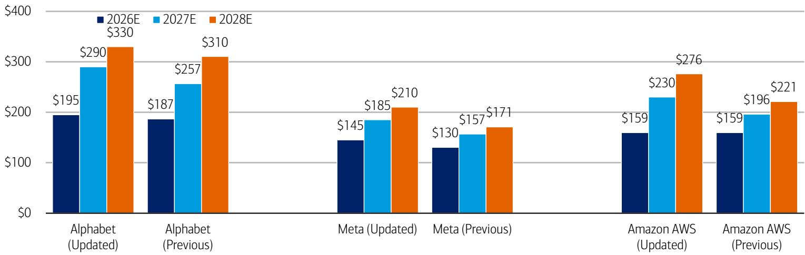
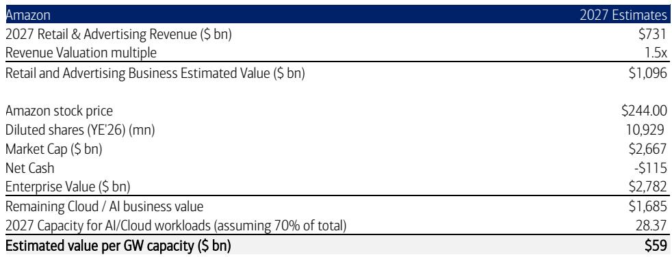

# 市场对超大规模AI基础设施的定价存在偏差：真正的价值在于基础设施本身，而非仅仅是收入

围绕大型互联网超大规模企业的核心争论，并非人工智能能否产生收入，而是建设这些能力所需的巨额资本支出能否带来可接受的回报。这一问题主导了市场情绪，导致那些同时报告云收入加速增长的公司，其估值持续存在折价。市场对短期自由现金流压力的关注，掩盖了一个更具战略意义的现实：今天正在建设的物理基础设施，代表着一个可货币化的资产基础，其价值尚未在当前的公司报价中得到体现。

一份2026年7月发布的全球研究机构报告，为理解这种脱节提供了分析框架。通过将资本支出转化为吉瓦级数据中心能力，然后估算每单位能力的潜在收入，该分析揭示，市场对本质上相似的资产应用了极不一致的估值。亚马逊、谷歌和Meta都在建设大规模计算基础设施，然而市场赋予每家公司能力的隐含价值却相差一个数量级。这并非有效定价的迹象，而是表明市场尚未内化正在发生的结构性转变。

该报告上调了对这三家超大规模企业的资本支出预估，反映了近期的融资活动、供应链信号以及管理层关于计算需求的评论。Alphabet 2027年的资本支出现在预计为2900亿美元，Meta为1850亿美元，亚马逊AWS为2300亿美元。这些并非微调，而是集体承认超大规模企业正在将能力可用性置于短期自由现金流优化之上。问题在于，市场参与者是否正确解读了这些能力未来的价值。

## 能力建设是真实且可衡量的，并揭示了亚马逊的结构性优势

该报告利用公司层面的披露和行业成本基准，将修订后的资本支出预估转化为到2030年的已安装吉瓦能力。结果令人瞩目。仅2026-2027年期间，亚马逊预计将增加15吉瓦的能力，超过谷歌的9吉瓦和Meta的6吉瓦之和。到2030年，亚马逊的已安装能力可能达到58吉瓦，远超谷歌的32吉瓦和Meta的23吉瓦。

这里的关键洞察不仅在于规模，还在于成本效率。该报告估计，2026年亚马逊每增加一吉瓦能力的成本约为250亿美元，而谷歌为370亿美元，Meta为450亿美元。这一优势源于AWS的规模、其使用内部开发的Trainium和Graviton芯片，以及核心云工作负载与专业AI基础设施之间更均衡的组合。亚马逊正在以更低的成本建设更多的能力，并拥有更广泛的收入基础来实现其货币化。

这一点很重要，因为市场历来根据广告或电子商务收益来评估超大规模企业，将数据中心基础设施视为成本中心而非资产。该报告的能力分析提供了一个有形的、物理的衡量标准，来说明资本支出究竟购买了什么东西。市场参与者现在不仅可以比较公司的收入增长率，还可以比较它们将资本转化为计算能力的效率。亚马逊的结构性成本优势表明，随着时间的推移，它将在其AI相关投入上产生更高的增量回报，而这一因素尚未被计入其估值。

## 每吉瓦收入远低于市场出清价格，预示着显著的上升空间

该报告最具启发性的发现涉及每吉瓦能力的收入潜力。通过估算每吉瓦的云收入，并将其与近期第三方能力租赁交易进行比较，该分析识别出超大规模企业当前货币化水平与市场愿意为类似资产支付的价格之间存在巨大差距。

对于亚马逊AWS，假设70%的能力用于云工作负载，该报告估计2026年每吉瓦收入约为1060亿美元。对于谷歌云，这一数字为1570亿美元。然而，近期的能力交易，例如Anthropic与SpaceX的协议，对专业AI能力的估值高达每吉瓦500亿美元。这种差异并非微不足道，而是三到五倍的差距。

这种差异有两种可能的解释。第一种是超大规模企业尚未优化其能力以用于最高价值的AI工作负载，随着推理和训练需求的增长，每吉瓦收入将会上升。第二种是第三方交易反映了稀缺溢价，这种溢价将随着能力扩张而消散。该报告隐含地支持第一种解释，认为这一差距使其对“未来能力相关收入的上升空间持乐观态度”。

对于Meta而言，其影响更为显著。该报告估计，如果到2030年Meta将其预计23吉瓦能力的40%用于企业AI销售，假设每吉瓦收入为保守的120亿美元，潜在收入机会可能达到1100亿美元。这不是一个预测，而是一个说明Meta能力建设中所蕴含选择权规模的场景。该公司不仅仅是在为自己的广告和社交媒体产品建设基础设施，它正在构建一个平台，可能在企业AI市场与AWS和谷歌云直接竞争。

## 市场对Meta的AI能力赋予了近乎零的价值，创造了潜在的不对称性

该报告的估值分析是战略论点变得具有可操作性的地方。通过剥离核心广告和零售业务的隐含价值，然后将剩余市值除以估算的吉瓦能力，该报告计算了市场实际上为每单位AI基础设施支付的价格。

结果令人值得注意。谷歌每2028年云吉瓦的隐含价值约为1100亿美元。亚马逊每AWS吉瓦的隐含价值为590亿美元。而Meta每AI吉瓦的隐含价值仅为40亿美元。即使考虑到业务组合、每吉瓦收入和成本结构的显著差异，这种分化也难以合理化。Meta正在建设可以通过企业销售实现货币化的专业AI能力，然而市场却将其视为一项没有回报的成本。

该报告承认其分析基于众多假设，并排除了Meta的Reality Labs等项目的影响。但结论的方向是明确的。任何证明能力收入杠杆的证据点，Meta都将是主要受益者。如果Meta能够证明其AI能力中哪怕一小部分能够以与云同行相当的水平产生企业收入，其基础设施的隐含估值将需要大幅重新定价。

这不是一个依赖于对未来收入激进假设的判断，而是一个关于当前市场定价的结构性观察。市场对Meta的能力建设赋予了零或负价值。因此，任何积极的货币化数据点都将对该公司的报价产生超比例的影响。这种不对称性并非理论上的，它已嵌入数字之中。

## 报告未完全解答的问题：从能力到现金流的路径

尽管分析严谨，该报告仍留下几个关键问题未解决。最重要的是能力转化为自由现金流的时间和机制。该报告上调了资本支出预估，将其转化为吉瓦，并估算了每吉瓦收入，但并未建模决定这些投入能否产生可接受回报的折旧、运营成本和资本回收。

该报告明确指出，它尚未纳入对折旧、每股收益、自由现金流及其他财务指标的关联影响。它将在6月收入数据点可用时进行此项工作。这是一个显著的空白。市场参与者不仅关心AI能力能否产生收入，还关心它能否以足以证明资本投入合理的利润率产生收入。

第二个未解决的问题涉及AI云市场的竞争动态。该报告假设能力将以与当前云定价相当的水平实现货币化，但新进入者、AI推理的商品化以及价格压缩的可能性，可能会随着时间的推移侵蚀每吉瓦收入。该报告对第三方租赁交易的乐观态度，可能反映的是暂时的稀缺溢价，而非可持续的定价环境。

最后，该报告未涉及如果AI需求增长放缓或技术变革使当前架构过时，超大规模企业能力可能成为搁浅资产的风险。该报告的能力预测延伸至2030年，但AI格局正在快速演变。该报告承认，随着芯片性能提升和内存供应扩大，其每吉瓦成本估算可能会发生变化，但它并未建模下行情景。

这些开放性问题并非报告的弱点，而是任何前瞻性分析的自然边界。它们也代表了随着事态发展，市场参与者最需要关注的领域。

## 评估超大规模企业AI相关布局的决策框架

该报告的分析方法可以提炼为一个实用的决策框架。第一步是评估能力效率。亚马逊较低的每吉瓦成本和较高的相对能力增量赋予其结构性优势，但该报告的每吉瓦收入估算表明，谷歌目前更有效地实现了其能力的货币化。市场参与者必须决定在未来三到五年内，哪个指标更重要。

第二步是评估货币化的选择权。Meta较低的每吉瓦隐含价值创造了潜在的不对称性，但实现这一价值取决于在企业市场的执行力。市场参与者必须评估Meta是否拥有与AWS和谷歌云竞争所需的销售基础设施、产品能力和客户关系。

第三步是监控当前每吉瓦收入与市场出清价格之间的差距。如果差距因超大规模企业提高其货币化率而缩小，那么对这三家公司有利的论点都将得到加强。如果差距因第三方租赁价格下降而缩小，那么不利的论点将获得可信度。

最后一步是权衡搁浅资产的风险与在AI基础设施上投入不足的风险。该报告的资本支出预估假设需求将在数年内持续受到供应限制。如果这一假设正确，那么以最低成本建设最多能力的公司将产生不成比例的回报。如果假设错误，那么建设最激进的公司的公司将面临最大的资产减记。

这个框架不提供单一的答案。它提供了一系列问题，每位市场参与者必须根据自己的风险承受能力和时间范围来回答。该报告的价值不在于其结论，而在于它能够用可衡量、可比较的指标来框定讨论。

## 完整报告包含使论点具体化的图表

这里总结的分析基于一份全球研究机构的报告，但原始文件包含详细的数据展示，对于理解所描述趋势的规模至关重要。显示每家超大规模企业能力建设轨迹、每吉瓦成本分解以及每单位能力隐含估值的图表并非装饰性的。它们是论证市场对AI基础设施定价存在偏差的分析基础。

希望自行审阅这些图表并评估其背后假设的读者，建议查阅完整报告。原始数据展示提供了支持报告结论的数据点，并允许市场参与者根据自己的假设对分析进行压力测试。

加入社区以阅读完整报告并查看原始图表。

*仅供参考。部分内容可能基于源材料通过AI辅助生成、翻译、总结或编辑，可能存在遗漏或错误。请独立核实。本文不构成任何专业建议。*

仅供参考。部分内容可能基于源材料通过AI辅助生成、翻译、总结或编辑，可能存在遗漏或错误。请独立核实。本文不构成任何专业建议。

