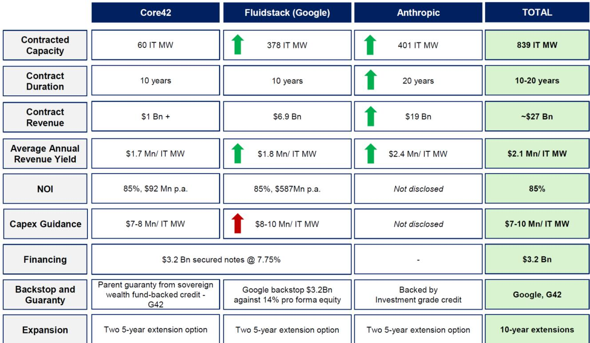
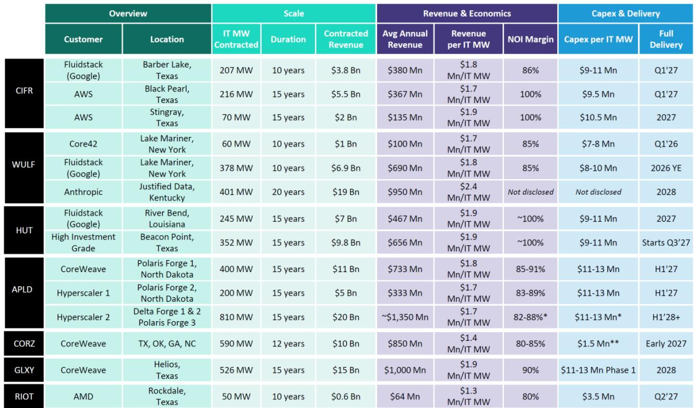
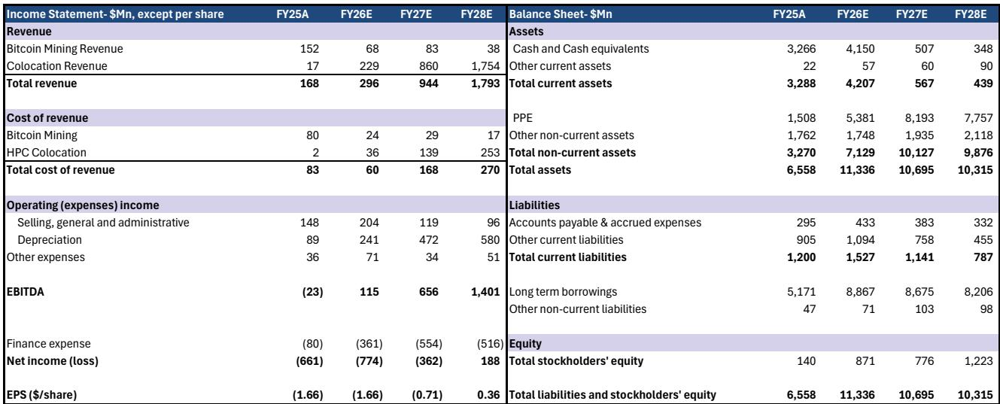

# TeraWulf与Anthropic的合作：从比特币矿工到AI基础设施运营商的转型路径

关于前比特币矿工转向AI基础设施的讨论，已从理论假设转变为可验证的商业实践。TeraWulf宣布与Anthropic签订价值190亿美元的AI服务合同，同时以5.3亿美元出售其Abernathy合资企业股权，标志着这一转型的关键节点。这不仅是又一笔交易公告，更代表了TeraWulf运营模式、融资方式以及市场应如何评估拥有稀缺电力资源的公司的一次结构性转变。

值得关注的核心变化是：TeraWulf正在从早期AI交易中依赖合资、中间商较多的模式，转向全资拥有、直接客户关系和完全运营控制。与Anthropic的合同提供了比以往交易更优的经济条款，期限20年，每IT兆瓦收入产出为240万美元，较早期协议提升30%。然而，在考虑合资企业出售后，对2030年EBITDA的净影响仅增加4300万美元。这一看似矛盾的现象揭示了更深层的战略逻辑：TeraWulf正在用短期EBITDA增长换取长期资产负债表质量和运营简洁性。

当前时点的重要性在于，AI基础设施建设正进入新阶段，交付速度、电力获取和租户信用质量成为主要竞争差异点。TeraWulf目前在纽约、肯塔基和马里兰州控制着3.6吉瓦的电力资产，这一多元化组合降低了单一监管制度或电网约束的风险。其订单簿已膨胀至270亿美元合同收入，覆盖839 IT兆瓦，合作方包括Core42、有谷歌背书的Fluidstack以及现在的Anthropic。公司目标是从现有电力管道中每年交付250至500兆瓦的关键IT负载。对于两年前还主要是比特币矿工的公司而言，这一轨迹代表了显著的重新定位。

市场是否充分理解这一商业模式演变的含义，还是仍在基于关于风险、融资成本和收入可见性的过时假设来评估TeraWulf，这是当前需要思考的问题。

## 从中间商到直接租赁模式的转变：风险状况与融资成本的根本变化

TeraWulf近期公告中最重要的战略进展并非Anthropic交易的规模，而是公司组织业务方式的结构性变化。将其在Abernathy合资企业中的50.1%股权以5.3亿美元出售给由Fluidstack牵头的读者群体，标志着有意从复杂的合作伙伴关系转向数据中心资产的全资拥有。

这一转变有多重意义。首先，Abernathy合资结构本身较为复杂，Fluidstack既是合资伙伴又是主要租户，这产生了潜在利益冲突，使读者难以评估基础资产的真实经济状况。退出合资企业后，TeraWulf简化了会计处理，消除了财务报表中的非控制性权益，并获得了无需合作伙伴批准即可做出运营决策的能力。

其次，转向与终端客户的直接租赁消除了云中间商层级。在TeraWulf的早期交易中，Fluidstack等公司充当了TeraWulf与最终超大规模或AI公司租户之间的中间人。虽然这一模式帮助TeraWulf获得了首批AI合同，但也意味着TeraWulf与数据中心容量的最终用户之间直接关系有限。Anthropic交易改变了这一点。TeraWulf现在直接与全球领先的AI公司之一签约，这意味着它可以针对Anthropic的具体需求优化设计规格，建立直接的运营关系，并受益于Anthropic的投资级信用状况。

信用质量的提升或许是这一转变中最被低估的方面。TeraWulf的早期交易依赖于G42的主权财富基金支持担保和Fluidstack合同的谷歌背书。根据现有信息，Anthropic交易由投资级信用支持。这一区别对融资成本影响巨大。当数据中心运营商能够向贷款方提供来自投资级租户的20年租约时，债务资本成本将显著下降。TeraWulf尚未公布其Justified Data园区的融资安排，但租户信用状况的改善表明，公司可以获得比此前交易中7.75%利率的32亿美元担保票据更有利的条款。

这意味着TeraWulf正在构建一个自我强化的循环：更好的租户信用质量带来更低的融资成本，从而提高投资资本回报率，进而使公司能够更积极地开发剩余的2.6吉瓦电力管道。这正是基础设施读者所珍视的良性循环，而市场对公司的估值尚未完全反映这一点。

## 后续交易经济条款持续改善：在供给受限市场中的定价能力

TeraWulf交易历史中最引人注目的模式之一是，随着每笔后续合同的签订，经济条款持续改善。Core42交易最先签署，每IT兆瓦收入产出为170万美元，期限10年。Lake Mariner的Fluidstack交易提升至每IT兆瓦180万美元，同样为期10年。Justified Data的Anthropic交易现在提供每IT兆瓦240万美元的收入产出，期限20年，平均年收入产出提升30%，基准年租金较Fluidstack交易提升10%。

这一模式并非巧合。它反映了AI就绪数据中心容量的供给相对于需求严重受限的市场状况，而TeraWulf每年交付250至500兆瓦关键IT负载的能力赋予了其大多数竞争对手所缺乏的定价权。公司收购具有现有电力和输电基础设施的棕地场址策略正被证明是显著的竞争优势。绿地数据中心开发面临许可延迟、电网互联排队和供应链约束，这些因素可能将时间线拉长至五年或更久。相比之下，TeraWulf的棕地方案使其能够更快地交付容量，且增量资本支出更低。

合同期限的改善同样重要。20年的基础期限加上两个五年续约选项，使TeraWulf的收入可见性延伸至30年。对于两年前还是收入波动较大的比特币矿工的公司而言，这种收入质量的转变是深远的。基础设施读者通常对拥有长期合同收入流的公司应用较低的折现率和较高的估值倍数。TeraWulf的加权平均合同期限现已远超大多数数据中心REIT所能提供的水平，但市场可能仍在对其估值应用加密货币挖矿的折价。

这一模式引发的问题是定价轨迹能否持续。TeraWulf剩余的电力管道包括Lake Mariner扩建项目、肯塔基州约1吉瓦容量的Muskie场地、400兆瓦的Cayuga场地，以及具有长期开发潜力的Morgantown场地（可建设1吉瓦园区并配备现场发电）。如果公司能够维持或改善这些未来项目的定价轨迹，当前估计的上行空间可能相当可观。然而，现有信息并未明确Anthropic交易的利润率结构或资本支出要求，因此难以评估改善的收入产出是否直接转化为改善的资本回报。

## Abernathy合资企业出售：为全资开发创造5.3亿美元资金储备

TeraWulf以5.3亿美元出售其在Abernathy合资企业中的50.1%股权，相对于其4.5亿美元的股权投资实现了18%的回报，但这一交易的战略价值远不止于适度的利润。出售所得款项分三期支付至2027年4月，为TeraWulf提供了可观的资本储备，可用于其在Lake Cayuga、Muskie和Chesapeake园区的全资AI基础设施建设。

这一资本配置决策揭示了管理层的判断：全资数据中心资产的回报将超过通过合资结构所能获得的回报。在Abernathy合资企业中，TeraWulf与Fluidstack分享经济收益，并承担合伙治理的复杂性。通过退出合资企业并将资本重新部署到全资项目中，TeraWulf将获得其未来开发项目100%的经济上行空间。

此次出售的时机也值得注意。它恰逢TeraWulf获得其规模最大、期限最长的合同，这改善了公司为全资项目融资的能力。租户信用质量改善与5.3亿美元资本储备的结合，使TeraWulf能够以更平衡的资本结构为未来开发项目提供资金，可能减少对此前交易中高成本担保票据的依赖。

然而，现有信息并未完全回答一个重要分析问题。Abernathy合资企业预计到2030年将产生约1.29亿美元的稳态EBITDA（按TeraWulf份额计算）。Anthropic交易增加了增量EBITDA，但对2030年估计的净影响仅为4300万美元。这表明，尽管Anthropic交易在每兆瓦基础上有所改善，但其经济收益部分被Abernathy合资企业收入的损失所抵消。读者需要了解，将5.3亿美元出售所得重新部署到新的全资项目是否会产生超过所放弃合资企业收入的回报，如果是，时间线如何。

## 报告未完全回答的问题：利润率结构、融资条件与2.6吉瓦路径

尽管近期公告为TeraWulf的战略方向提供了清晰图景，但现有信息并未完全解决若干重要未知因素。这些空白并非对分析的批评，而是承认故事仍在展开，读者必须在不确定性下做出判断。

最重要的未知因素是Anthropic交易的利润率结构。TeraWulf已披露合同总价值和收入产出，但未披露净营业收入利润率、每IT兆瓦资本支出或Justified Data园区的融资安排。早期的Core42和Fluidstack交易均具有85%的NOI利润率，但Anthropic交易因其更长的期限和改善的租户信用质量，可能具有不同的经济特征。在利润率和资本支出不明确的情况下，难以计算公司有史以来最大合同的投资资本回报率。

Justified Data园区的融资条款也未披露。现有信息表明该交易预计将获得投资级信用支持，但具体结构、利率和杠杆比率仍未知。鉴于TeraWulf早期担保票据的票面利率为7.75%，融资成本的任何改善都将对股权回报产生重大影响。在数十亿美元的资本计划中，债务成本每降低100个基点，可能在资产存续期内为股权价值增加数亿美元。

剩余2.6吉瓦电力管道的开发路径也未完全规划。TeraWulf已确定具体场地及其容量，但通电时间线、资本要求以及这些未来开发的租户获取策略仍面临执行风险。公司已证明其在前三笔AI交易中能够获得优质租户，但在不同司法管辖区复制这一成功并非必然。

最后，从比特币挖矿向AI基础设施的转型引发了关于TeraWulf挖矿业务剩余价值的问题。财务预测显示挖矿收入从2025年的1.52亿美元下降至2030年的零，但这一缩减的时间安排和经济影响并未明确。如果比特币价格保持高位，挖矿业务可能产生额外自由现金流，支持AI基础设施建设。反之，如果挖矿设备过时或比特币价格下跌，转型成本可能高于预期。

## 评估TeraWulf及更广泛比特币矿工向AI基础设施转型的分析框架

对于考虑TeraWulf或任何正在转向AI基础设施的前比特币矿工的读者，以下分析框架可能有助于结构化分析。该框架聚焦于四个维度，这些维度共同决定了该领域的公司能否成功执行转型。

第一个维度是电力获取和地理多元化。TeraWulf在三个州控制着3.6吉瓦电力，这提供了针对监管风险和电网约束的有意义的多元化。读者应评估公司的电力资产是集中于单一司法管辖区还是分散于多个市场。还应评估场地是拥有现有电力基础设施的棕地，还是需要新建输电线路的绿地。

第二个维度是租户质量和合同期限。TeraWulf从Core42到有谷歌背书的Fluidstack再到直接与Anthropic签约的进展，代表了租户信用质量的明显改善。读者应检查公司的租户名单是否包括投资级交易对手，还是依赖信用较差的云中间商。更长的合同期限降低了再融资风险，改善了现金流的稳定性。

第三个维度是融资能力和资本结构。TeraWulf获得投资级支持合同并出售合资企业股权以重新部署到全资项目的能力，展示了财务成熟度。读者应评估公司是否拥有多元化的资金来源，包括项目融资、公司债务和股权，以及其资本成本是否随着每笔后续交易而改善或恶化。

第四个维度是执行记录和交付能力。TeraWulf已证明其能够获得合同、建设容量并履行承诺。读者应评估公司是否实际按时按预算交付了容量，还是其公告仍停留在愿景层面。合同容量与已交付容量之间的差距是关键指标。

将此框架应用于TeraWulf，公司在所有四个维度上得分较高，这支持了其转型前景。但剩余2.6吉瓦尚未验证，Justified Data园区的融资条款未披露，以及从比特币挖矿转型引入了关于现有挖矿资产价值的剩余不确定性。

## 未解决的分析问题：值得持续关注的故事

TeraWulf的故事远未结束，最有趣的分析问题仍然悬而未决。公司将如何为其剩余2.6吉瓦的开发提供资金，将实现怎样的资本成本？随着进入较小或战略位置较差的场地，能否维持或改善其交易的定价轨迹？比特币挖矿业务将何去何从，会产生意外现金流还是成为搁浅资产？市场将如何评估一家成功从加密货币挖矿转型为AI基础设施的公司，是会给予数据中心REIT的倍数，还是因其历史背景而保持折价？

这些问题并非分析的弱点，而是公司实时经历根本性转型的自然结果。现有信息提供了TeraWulf前进方向及其决策背后战略逻辑的清晰图景。但最终结果将取决于执行、市场条件以及公司在建设和融资数十亿美元数据中心园区过程中应对复杂性的能力。

*仅供参考。部分内容可能基于源材料通过AI辅助生成、翻译、总结或编辑，可能存在遗漏或错误。请独立核实。本文不构成专业建议。*

仅供参考。部分内容可能基于源材料通过AI辅助生成、翻译、总结或编辑，可能存在遗漏或错误。请独立核实。本文不构成专业建议。

