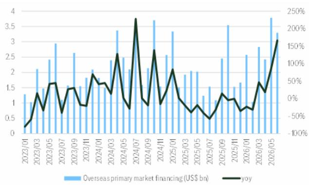
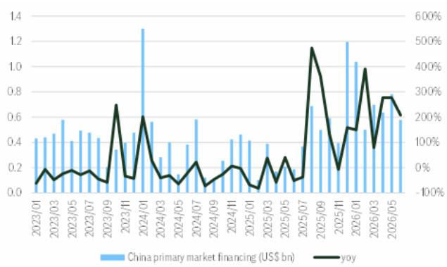

# Citi：中国创新药融资规模增长188%，CDMO订单趋势值得关注

2026年上半年，中国创新药一级市场融资规模同比增长188%，海外市场也录得32%的增长。这份来自Citi的研究报告提供了一个清晰的信号：生物医药产业链上游的CDMO和CRO公司，正迎来新一轮订单与定价的修复窗口。

这不是一个“行业回暖”的泛泛判断。融资数据的陡峭曲线背后，是资本对创新药资产不确定性偏好的实质性转变。Citi认为，这一变化对CDMO和CRO的支撑，将体现在两个层面：新订单的持续涌入，以及报价能力的边际改善。报告重点提及的药明康德、药明生物、药明合联、康龙化成和泰格医药，正是这场融资变化中最直接的受益者。

## 1. 一级市场的资金回来了，而且来得比预期更快

Citi引用PharmaCube的数据显示，2026年6月单月，中国创新药一级市场融资规模同比增长208%，上半年整体增速达到188%。海外市场同样强劲，6月同比增长166%，上半年增长32%。

值得注意的不只是增速，而是基数效应。2025年同期，中国创新药融资已经处于相对活跃的状态。在这样一个高基数上实现接近两倍的增长，说明资金流入不是短期脉冲，而是趋势性的再配置。Citi在报告中专门用两张图表展示了融资规模的月度走势，曲线斜率在2026年明显变陡。

> **KC评论：** 融资数据是领先指标，但领先多久取决于项目阶段。对于CDMO而言，融资到订单的传导周期通常在6-12个月。这意味着2026年下半年到2027年上半年，CXO公司的产能利用率有望持续改善。完整报告中的Figure 1和Figure 2值得细看，月度数据能帮助判断增速的可持续性。

## 2. 二级市场接力，融资结构正在优化

除了令人瞩目的一级市场，Citi还统计了创新药在二级市场的融资情况。2026年6月，中国创新药在一级和二级市场的合计融资规模达到100亿元人民币，同比增长15%；上半年合计融资规模增长35%。

二级市场的接力意义重大。它意味着早期的创新药公司不仅能在私募市场获得资金，还有能力通过IPO或增发从公开市场获得更长期的资本支持。这种“一级投早、二级接棒”的融资链条一旦形成，会显著降低CXO客户的现金流不确定性，进而提升其外包研发和生产的意愿。

## 3. 报告没有完全回答的问题：订单质量与价格弹性

Citi的研究报告聚焦于融资规模，但并未深入拆解这些资金的去向。一个关键的不确定因素是：这些融资中有多少流向了真正具有临床价值或商业前景的管线？如果大量资金涌入同质化靶点的项目，CDMO的订单量可能增加，但单个订单的含金量和持续性存疑。

另一个未解问题是价格弹性。Citi提到“price lift potential”，但具体到报价能提升多少、何时兑现，报告没有给出量化判断。这取决于CDMO行业的产能利用率回升速度和竞争对手的报价策略。如果产能仍然过剩，价格修复可能需要更长时间。

## 4. 观察框架：盯住三个信号判断传导是否落地

对于关注CXO板块的读者，Citi这份报告提供了一个清晰的分析框架。判断融资数据能否转化为公司业绩，需要紧盯三个信号

第一，头部CDMO的订单公告频率和金额。如果药明康德、药明生物等公司在未来两个季度披露的新签订单持续增长，说明融资端的改善已经传导至业务端。

第二，产能利用率的数据。这是衡量CDMO议价能力的最直接指标。利用率从70%回升到85%以上，往往意味着报价的拐点。

第三，客户结构的质量。如果新增订单主要来自融资规模较大的头部创新药公司，而非小型biotech，订单的稳定性和利润率会更高。

Citi这份报告的价值不在于给出一个简单的“观点偏积极”结论，而是在于用融资数据为读者提供了一个可追踪的先行指标。接下来几个季度的订单数据，才是检验这一判断的试金石。

For informational purposes only. Portions may be generated,translated,summarized,or edited with AI assistance based on source materials and may contain omissions or errors. Please verify independently. This is not investment,legal,tax,accounting,or other professional advice.

For informational purposes only. Portions may be generated,translated,summarized,or edited with AI assistance based on source materials and may contain omissions or errors. Please verify independently. This is not investment,legal,tax,accounting,or other professional advice.

