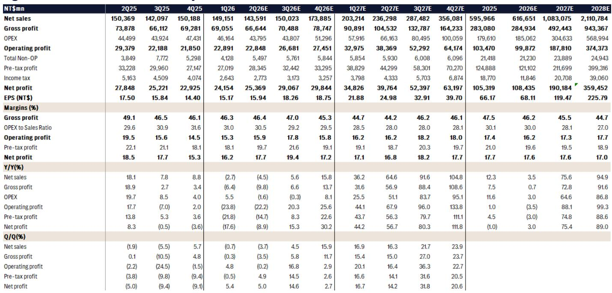
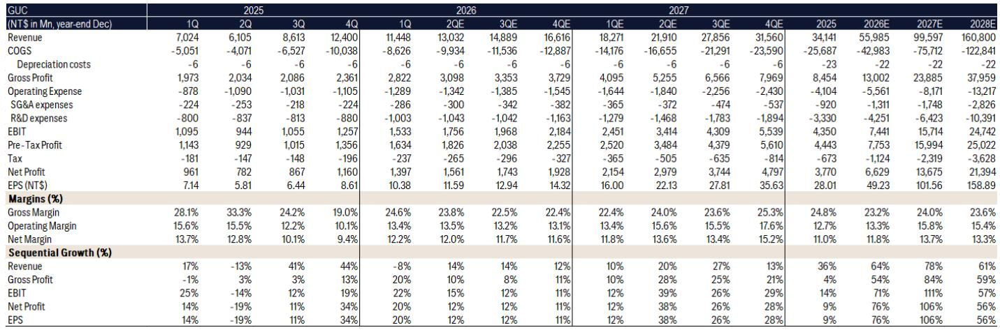
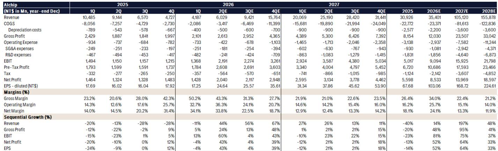

# AI ASIC 供应链正在重构：为什么供应链管理比芯片设计本身更重要

市场一直关注AI ASIC最终将在计算规模上超越GPU的观点。这一论点现已得到广泛认可。但较少被理解、对观察者而言更为重要的是，这一转变中的赢家不会仅由设计能力决定。决定性优势将属于那些能够在极端产能限制下驾驭碎片化供应链的公司。

自去年以来，市场对AI ASIC的采用持乐观态度，但现实是供应链在多个环节仍严重受限：先进制程的晶圆代工产能、CoWoS及其他先进封装、HBM内存分配、ABF基板供应。这些瓶颈并非暂时现象。它们代表着至少持续到2027年的结构性限制。在这种环境下，能够在这相互依赖的瓶颈环节确保分配的公司将捕获不成比例的价值。

一份全球投资银行关于台湾设计服务公司的报告明确阐述了这一论点，其含义值得仔细解读。报告将三家公司按明确顺序排列：联发科第一，创意电子第二，世芯电子第三。这一排序并非关于谁拥有最好的工程人才，而是关于谁拥有较强的供应链关系以及最多元化的收入基础，从而获得供应商的优先分配。

报告预测，联发科的AI ASIC收入到2027年可能达到180亿美元，2028年达到400亿美元，这得益于其在谷歌TPU项目中不断扩大的角色。这些数字代表着公司当前收入基础的巨大跃升。但真正的洞察并非收入预测本身，而是联发科为获得该收入所采取的行动：从简单的芯片设计扩展到I/O、计算芯片，最终到光学和内存。这种在芯粒架构内的垂直扩展使得供应链论点如此有力。

对于关注这一领域的任何观察者而言，关键问题不再是“哪家公司拥有最好的AI芯片设计？”，而是“当所有人都在争夺相同有限产能时，哪家公司能够实际大规模交付芯片？”

## 供应链管理是新的护城河，联发科拥有最宽的护城河

传统观点认为，无晶圆半导体公司的竞争优势来自架构创新和设计专长。这种观点日益过时。在当前环境下，台积电的先进制程实际上被配给，先进封装产能提前几个季度售罄，确保供应的能力成为增长的约束条件。

联发科在这方面的定位具有结构性优势。该公司与台积电在多个制程和产品线上有着长期合作关系，这赋予了它纯设计服务公司所缺乏的谈判筹码。它还有庞大的现有智能手机和物联网业务，提供稳定的收入基础和可用于其AI ASIC计划的供应链关系。报告强调，联发科不仅从事芯片设计，还涉及硬件L6架构，表明其与关键客户的合作深度已超越传统设计服务。

联发科AI ASIC收入预测的规模令人瞩目。报告估计2026年TPU出货量为50万颗，2027年和2028年跃升至400万颗。随着联发科每颗芯片贡献更多价值，从I/O芯片到计算芯片再到潜在的光学和内存，每单位收入预计将大幅增加。这不是一个简单的数量故事，而是一个由芯粒架构内垂直整合驱动的每芯片价值扩张故事。

对于观察者而言，含义很明确：联发科的AI ASIC业务可能在两年内超过其当前全部收入基础。这将从根本上改变公司的盈利能力和估值框架。

## 创意电子的可见性延伸至2028年，但风险在于客户集中度

创意电子呈现出不同的风险回报特征。该公司享有至2028年的稳固订单可见性，这得益于其美国云服务提供商的CPU ASIC需求。其与台积电的合作关系依然强劲，公司正在向汽车和机器人应用领域多元化发展，预计贡献将在2027年底或2028年初出现。

报告指出，创意电子还在为其云服务提供商客户开发消费电子产品，以及互连IP和CPO技术。这种多元化在战略上是合理的，但它提出了一个重要问题：创意电子的收入在多大程度上集中于单一或少数客户？报告承认对CPU ASIC订单可持续性的担忧日益增加，这表明市场已经在定价一些客户流失或项目延迟的风险。

创意电子的优势在于其与台积电的深度整合。报告明确指出，即使其客户探索替代代工厂支持，创意电子与台积电的合作关系仍将是其汽车和机器人项目的主要来源。这是一把双刃剑。它提供了近期可见性，但也将创意电子的命运与台积电的产能分配决策联系在一起。

报告中的盈利预测显示，创意电子的每股收益从当前财年的49.23新台币增长至下一财年的101.56新台币，翻了一番。但观察者的真正问题是，这种增长是否已被定价，以及如果CPU ASIC周期比预期更早见顶会发生什么。

## 世芯电子的后置加载创造了不对称机会，但时机至关重要

世芯电子的情况是三家公司中最微妙的。报告将其势头描述为“后置加载”，一款新的N3 AI加速器产品预计将在2026年下半年开始放量。这带来了一个特定的研究挑战：近期前景相对平淡，但2027年的增长轨迹可能相当可观。

报告指出了世芯电子的两个关键风险。首先，潜在的产能限制可能制约近期势头。其次，其客户的COT商业模式和多元化策略可能限制世芯电子获得优先分配的能力。然而，报告也指出，由于世芯电子在更复杂芯片设计中的后端设计贡献，毛利率可能有上升空间。这表明世芯电子可能以量换价，专注于更高利润的工作，而不是试图在规模上竞争。

对于观察者而言，世芯电子代表着一个时机难题。报告建议在2026年预期重置后重新审视该股，暗示当前估计相对于近期现实可能仍然过高。盈利预测显示每股收益从当前财年的103.06新台币增长至下一财年的168.72新台币，但季度轨迹不均匀，较强增长集中在下半年。

报告的排序将世芯电子置于最后，但这并不意味着它是一个糟糕的研究对象。它只是意味着在当前水平下，鉴于其增长的后置加载性质，风险回报不太有利。关键问题是市场是否正确贴现了2027年的机会，还是为近期不确定性支付了过高价格。

## 报告未完全回答的问题：供应链碎片化的二阶影响

报告为供应链管理作为关键差异化因素提出了令人信服的论点，但它留下了几个重要问题未解答。

首先，联发科与其关键客户的关系有多可持续？报告将联发科的TPU收入增长归因于其在谷歌AI加速器项目中不断扩大的角色。但谷歌有垂直整合和开发内部能力的历史。如果谷歌决定将更多设计工作内部化或向更多合作伙伴多元化，会发生什么？报告没有解决这一风险，这对于任何长期研究论点都是重要的。

其次，潜在代工厂多元化的影响是什么？报告提到创意电子的客户可能寻求台积电之外的替代代工厂支持。这是一个可能重塑竞争格局的重大发展。如果云服务提供商开始将一些ASIC生产转移到其他代工厂，整个供应链计算将发生变化。与替代代工厂有强大关系的公司可能获得优势，而过度依赖台积电的公司可能面临挑战。

第三，CPO和先进封装技术转变的影响是什么？报告提到联发科与Arya Labs和微软等合作伙伴在CPO技术上的工作。如果CPO成为下一代AI加速器的标准要求，它可能创造新的瓶颈和新的机会。报告没有提供一个框架来评估哪些公司最有能力驾驭这一转变。

第四，随着更多参与者进入AI ASIC设计服务市场，竞争格局将如何演变？报告聚焦于三家台湾公司，但市场可能随时间吸引更多进入者。这可能压缩利润率并降低现有企业的价值。

这些并非对报告的批评。它们是任何认真观察者在做出承诺前应考虑的自然开放性问题。

## 观察者的决策框架：三个问题来确定定位

对于希望基于这一论点采取行动的观察者，以下框架可以帮助确定哪家公司符合其风险承受能力和时间范围。

**问题1：你对未来12-18个月供应链分配的信心如何？** 如果你认为产能限制将持续，且与台积电的既定关系是最重要的竞争优势，那么联发科是明确的选择。其现有业务赋予它纯设计服务公司无法匹敌的杠杆。如果你对联发科客户关系的可持续性更为怀疑，那么创意电子向汽车和机器人的多元化可能更具吸引力。

**问题2：你的时间范围是什么？** 如果你在未来12个月内进行观察，世芯电子的后置加载特征可能令人沮丧。报告建议等待2026年预期重置后再进入。如果你为2027年及以后进行观察，世芯电子的N3加速器放量可能提供显著上行空间。联发科和创意电子提供更多近期可见性。

**问题3：你如何评估客户集中度风险？** 创意电子的CPU ASIC业务高度依赖少数云服务提供商客户。联发科的AI ASIC业务高度集中于谷歌。世芯电子的增长与单一客户的N3加速器相关。三家公司都面临集中度风险，但它们以不同方式管理。联发科拥有最大且最多元化的整体业务，提供了缓冲。创意电子正在积极向新终端市场多元化。世芯电子对单一项目的敞口最大。

报告的排序是一个有用的起点，但不应不加批判地采纳。每位观察者必须在其自身组合和风险偏好的背景下评估这三个问题。

## AI ASIC机会是真实的，但捕获它的路径贯穿供应链

市场已正确识别AI ASIC将在AI计算中扮演越来越重要的角色。错误在于假设所有参与者将平等受益。定义这一周期的供应链限制创造了一种赢家通吃的动态，其中拥有较强关系和最多元化收入基础的公司将捕获大部分价值。

联发科的收入预测如果实现，将代表半导体行业最显著的转型之一。创意电子的稳定增长和多元化提供了一个更保守但仍具吸引力的机会。世芯电子的后置加载特征提供了获得超额回报的潜力，但需要耐心和谨慎的时机。

报告提供了丰富的数据来支持这些结论，包括详细的盈利预测、收入预测和估值分析。完整报告中的图表提供了每家公司季度轨迹的精细可见性，这对于微调进入和退出时机至关重要。

*仅供参考。部分内容可能基于源材料通过AI辅助生成、翻译、总结或编辑，可能存在遗漏或错误。请独立核实。这不是专业建议。*
