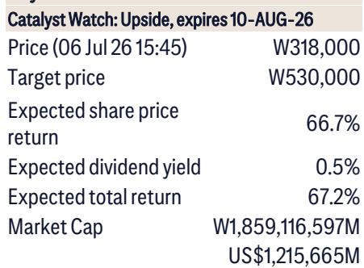
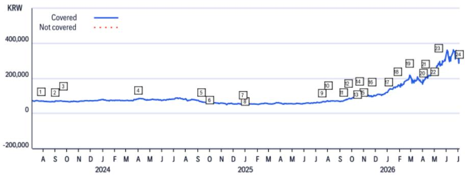
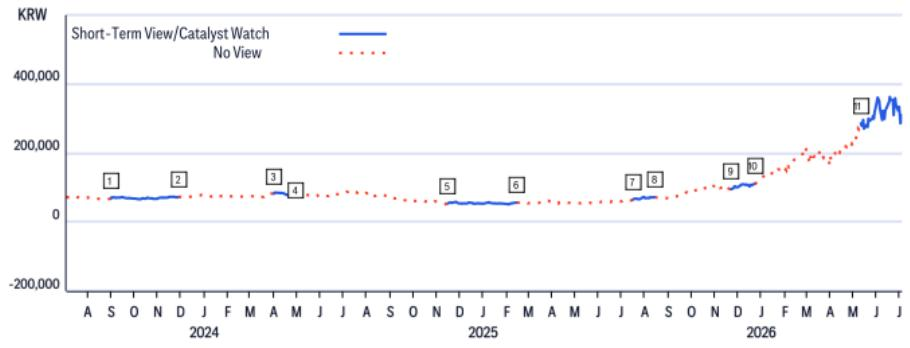

# 三星第二季度业绩揭示深层趋势：存储巨头正转型为AI基础设施提供商，而非单纯的芯片周期股

三星电子2026年第二季度初步营业利润的 headline 数字令人瞩目。营业利润达89.4万亿韩元，环比增长56%，同比飙升1812%，这在任何财报季都将是主导性数据。然而，更重要的故事不在于业绩超预期的幅度，而在于这一业绩所揭示的全球最大存储制造商正在进行的结构性转型。在多年被视为周期性大宗商品股之后，三星正崛起为一家垂直整合的AI基础设施提供商，这一转变从根本上改变了观察者评估其盈利能力和战略风险的方式。

本季度业绩主要由半导体部门推动，该部门贡献了约88.4万亿韩元的营业利润。这一数字尤为引人注目，因为它是在吸收了约17.2万亿韩元员工奖金拨备的情况下实现的。若无这一一次性负担，营业利润将更为可观。显示、移动和消费电子部门合计贡献的营业利润不足1万亿韩元，凸显了存储业务的主导地位。但真正的洞察不在于利润分解，而在于这些数字所暗示的战略轨迹。

传统的叙事会将本季度视为存储定价的周期性高峰，由AI相关的高带宽存储器和服务器DRAM需求驱动。这种叙事是不完整的。正在发生的不仅仅是定价周期，而是存储需求结构的长期转变。一家全球投资银行的报告明确指出，存储定制化正在推动结构性增长，而三星作为端到端AI交钥匙解决方案提供商具有独特定位。这是一个与过去十年观察者所熟知的三星不同的公司，它需要不同的分析框架。

## 奖金拨备扭曲是一次性信号，而非持续性阻力

三星在第二季度确认的17.2万亿韩元员工奖金拨备是一个重要数字，占报告营业利润的近20%。对于关注基础盈利能力的分析师和观察者来说，调整这一项目并关注“正常化”利润数字是合理的直觉。这对于短期建模是正确的，但可能错过拨备中蕴含的战略信号。

奖金拨备的规模本身就是一个声明。三星正在表明，其管理层预期当前的盈利轨迹足够持久，足以证明在一个季度内锁定巨额员工薪酬支出的合理性。公司不会采取如此大规模的拨备，除非他们对盈利流的持久性有高度信心。这不是一个认为当前上升周期转瞬即逝的管理团队的行为。这是一个相信公司已进入新盈利模式的管理团队的行为。

该拨备还凸显了三星成本基础的结构性转变。随着公司从大宗商品存储供应商向定制化AI解决方案提供商转型，其劳动力成本将日益反映专业工程人才的稀缺性。奖金拨备是为留住执行HBM和代工雄心所需的人力资本而预付的款项，这些雄心支撑着公司的长期战略。观察者应预期这种成本结构将持续存在，即使季度确认模式恢复正常。

## 代工和HBM战略并非可选；它是实现持续利润率扩张的相对少见路径

三星的代工业务多年来一直是战略焦虑的来源，在技术节点和市场份额方面均落后于台积电。报告指出，三星代工现在正寻求反弹，由越来越多的AI芯片项目以及与美科技公司的合作伙伴关系推动。这不仅仅是一个追赶的故事。这是对存储业务的必要补充。

逻辑很简单。随着AI工作负载变得更加专业化，芯片设计、制造和存储之间的交互变得更加紧密。一个无法提供集成存储解决方案的代工厂将处于结构性劣势。三星的垂直整合，涵盖系统LSI设计协作、代工制造、HBM供应和后端封装，创造了独特的价值主张。设计AI加速器的客户可以与三星在整个堆栈上合作，降低集成风险和上市时间。

这是证明代工投资合理性的论点，即使独立代工利润率仍低于纯代工领导者。代工业务并非为了最大化自身盈利能力而建立；它是为了最大化存储业务的盈利能力。每片通过三星代工厂的晶圆都可以与三星HBM配对，产生竞争对手无法复制的锁定效应。报告对三星的建设性立场反映了对其综合战略将随时间产生卓越回报的信心，即使个别部门独立来看表现各异。

## 真正风险并非定价；而是垂直整合论点的执行

报告中概述的下行风险对任何三星观察者来说都很熟悉：关键客户的HBM认证延迟、PC和NAND需求弱于预期、竞争对手激进投资、手机利润率压缩以及货币升值。这些都是合理的担忧，但它们在很大程度上是周期性或公司特定风险，多年来一直是三星研究案例的一部分。更深刻的风险，也是报告未完全解决的风险，是三星能否大规模执行其垂直整合论点。

挑战不在于技术。三星已证明有能力生产领先的HBM，并拥有未来几代产品的可信路线图。挑战在于组织和战略层面。垂直整合会带来难以管理的利益冲突。与三星自己的系统LSI部门竞争的代工客户可能不愿分享敏感的设计数据。同时使用三星代工服务的存储客户可能担心HBM供应的优先分配。当公司处于强势竞争地位时，这些紧张关系是可以管理的，但当利润率承压且内部资源分配决策变成零和游戏时，它们就会变得尖锐。

报告未提供评估三星打算如何管理这些冲突的框架。这不是批评；而是承认答案尚不明确。接受垂直整合论点的观察者也必须接受执行风险是巨大的，并且回报可能比当前周期所暗示的要更长。

## 三星定位的决策框架

对于考虑三星定位的观察者，报告提出了一个超越传统估值倍数的三部分决策框架。

首先，评估存储定价的持久性。报告假设在基准情况下，2026年DRAM和NAND平均售价将分别上涨295%和296%。这些是非同寻常的假设，它们反映了AI驱动需求将使供应在2027年前保持紧张的观点。关键问题不在于这些假设是否过于激进，而在于如果它们被证明是保守的会发生什么。牛市情景假设DRAM和NAND的ASP均上涨350%，意味着当前的紧张状况可能进一步加剧。观察者需要形成对竞争对手供应反应可能性以及新HBM产能上线速度的看法。

其次，评估代工转折点。报告未提供代工业务何时实现有意义的盈利能力或市场份额增长的具体时间表。观察者应寻找领先指标：AI芯片设计获胜的数量、技术节点迁移的速度，以及美科技公司承诺签订长期代工协议的意愿。代工业务是决定三星是仍为一家拥有代工副业的存储公司，还是成为真正的AI基础设施平台的关键因素。

第三，监控内部资源分配信号。三星以牺牲存储产能扩张为代价投资代工产能的意愿，或将HBM供应分配给内部客户与外部客户的决策，将揭示管理层的真实优先事项。奖金拨备是一个信号；资本支出指引是另一个信号。观察者应密切关注三星如何平衡其各部门的竞争需求，因为这种平衡将决定垂直整合战略是创造价值还是破坏价值。

## 值得进一步审视的开放性问题

每份研究报告都会留下未解答的问题，这份报告也不例外。三个领域值得希望超越已发布分析的观察者特别关注。

首先，随着AI需求演变，三星将如何管理其存储和代工业务之间的紧张关系？报告强调了协同潜力，但协同不等于战略。一个真正的交钥匙解决方案提供商必须能够优化配置整个价值链上的资源，这需要报告未描述的治理结构。

其次，非存储业务的退出策略是什么？显示、移动和消费电子部门在第二季度贡献的利润微不足道。三星历来不愿剥离表现不佳的业务，但在代工和HBM领域竞争所需的资本可能迫使做出艰难决定。报告未涉及三星是否应退出或重组这些部门。

第三，随着三星转向交钥匙模式，HBM认证风险如何变化？报告将HBM认证延迟确定为下行风险，但垂直整合论点隐含地假设三星可以比竞争对手更快地认证自己的HBM。这一假设需要根据认证流程由客户需求而非供应商能力驱动的现实进行检验。

这些不是报告的缺陷。它们是任何试图预测进行中转型的分析的自然边界。报告提供了令人信服的论据，说明为什么这次三星不同。下一步是观察者确定这种差异是否足够持久以证明估值的合理性。

加入社区阅读完整报告并查看原始图表。

*仅供参考。部分内容可能基于源材料通过AI辅助生成、翻译、总结或编辑，可能存在遗漏或错误。请独立核实。这不构成专业建议。*

仅供参考。部分内容可能基于源材料通过AI辅助生成、翻译、总结或编辑，可能存在遗漏或错误。请独立核实。这不构成专业建议。

