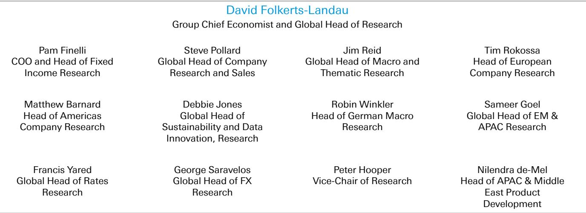
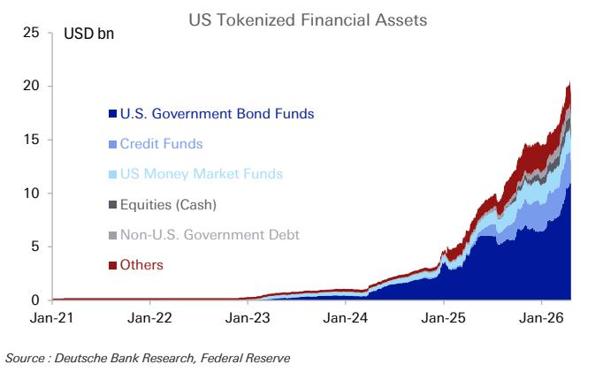
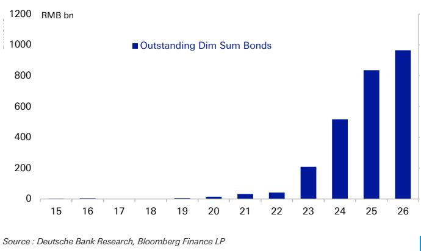

# 全球资金流动新观察：东西方路径分化

美元在国际支付体系中的角色依然重要。但近期一份关于外汇格局的研究报告提出了一个值得关注的视角：美元所承载的不确定性特征正在发生结构性变化。过去几十年，美国通过发行国债吸收全球储蓄，美元因此获得了相对稳定的标签。但该研究指出，这种模式正在演变——并非因为美国失去吸引力，而是吸引力的来源发生了变化。

**核心变化在于：美国的外部融资结构正从债务驱动转向股权驱动。** 研究用图表展示了这一趋势——流入美国的净股权资金持续攀升，而净债务资金持续下滑，两者之间的缺口创下历史纪录。这不仅是资金形态的变化，也意味着美元的不确定性特征可能从“逆周期”转向“顺周期”。

---

## 1. 融资结构切换：美元从“稳定锚”到“波动放大器”

传统上，外国官方机构购买美国国债是美元最稳定的支撑。当全球避险情绪升温，资金反而涌入美债，美元走强。这是一种逆周期的稳定机制。但研究指出，地缘政治因素正在影响外国官方对美债的长期偏好。各国在国防、能源等领域追求战略自主，可能影响其美元储备的配置。

与此同时，技术因素正在把另一类资金拉向美国——个人读者。韩国和日本的个人读者通过本土交易渠道大量参与美国公司，尤其是科技相关资产。这类资金是顺周期的：市场上涨时涌入，市场下跌时撤离。

> **观察：** 这一变化意味着，美元未来在面对不确定性事件时可能不再是“稳定锚”，反而可能放大波动。研究没有直接说，但逻辑推演的方向是：如果美元越来越像一只科技股，那么当科技叙事出现变化时，美元承受的不确定性也会比过去更大。完整研究中对美国公共与私营部门资产负债表分化的图表值得细看，这是理解融资结构切换的底层逻辑。

---

## 2. 东西方资金流动的新路径：美国在“拉”，中国在“推”

研究另一个值得关注的视角是资金基础设施层面的变化。在美国西海岸，区块链和代币化被描述为“未来全球资金流动的新基础设施”。相关机构已经开始代币化其托管资产。稳定币和代币化资产可能进一步扩大美元在支付和结算中的角色，降低全球资本进入美国市场的门槛。

但在亚洲，人们的关注点完全不同。西方普遍认为人民币国际化受制于资本账户不完全开放，但研究指出，跨境人民币贷款和融资正在快速扩大，央行新的回购便利允许外国央行用中国国债换取人民币流动性。这是一种“推”的逻辑——通过输出人民币资本来推动国际化。

> **观察：** 研究呈现了一个有趣的镜像：美国通过技术创新“拉”资本进入，中国通过政策创新“推”资本出去。两种路径都在改变全球资金流动的版图。研究没有回答的是，当两种力量同时加速时，美元和人民币的相对地位会如何演变。这可能是未来几年值得跟踪的宏观变量。

---

## 3. 亚洲货币的集体低估：谁在等待拐点？

研究估值模型显示，全球最便宜的十种货币中有六种在亚洲，包括韩国、日本、印度和中国。这些地区在美联储广义美元指数中的权重之和超过欧元。研究没有简单断言亚洲货币会升值，而是指出了几个值得关注的分化信号。

中国面临外部环境变化仍在调整，但研究认为中国不太可能接受广场协议式的重估——日本的前车之鉴就在眼前。印度的短期汇率支撑来自存款计划的成功复刻，但长期制造业和服务业前景仍存疑。韩国出口增长显著，市场弹性较高，但资本外流持续困扰韩元。

最大的不确定性来自日元。日元兑美元接近多年低点，干预行动压制了波动率，油价变化打开了美元节奏变化空间，投机性空头头寸接近极端。但研究指出，不确定性在于理解日元如何与日本的工业、财政和增长战略互动。首相的新宏观环境蓝图明确强调高名义增长是降低债务/GDP的手段，这可能意味着对通胀的更高容忍度——恰好发生在美联储对通胀更加严肃的时刻。

---

研究尚未完全回答的一个关键问题是：当美元的不确定性轮廓从“逆周期”转向“顺周期”，全球资产组合的配置逻辑是否需要重新调整？过去几十年，美元和美债是全球组合中重要的分散化工具。如果美元本身变得更像不确定性资产，那么“分散化”的假设前提就在松动。这个问题没有标准答案，但值得每一个关注全球资金流向的读者持续追踪。

For informational purposes only. Portions may be generated,translated,summarized,or edited with AI assistance based on source materials and may contain omissions or errors. Please verify independently. This is not investment,legal,tax,accounting,or other professional advice.

For informational purposes only. Portions may be generated,translated,summarized,or edited with AI assistance based on source materials and may contain omissions or errors. Please verify independently. This is not investment,legal,tax,accounting,or other professional advice.

