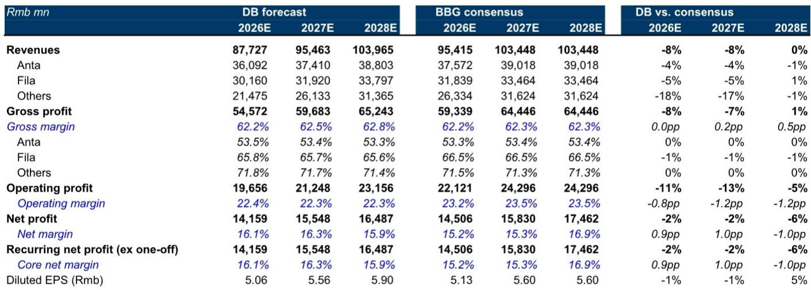
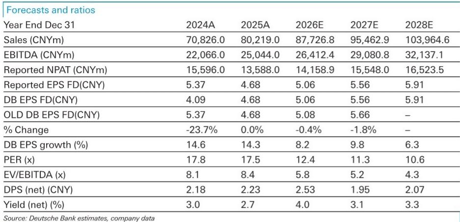
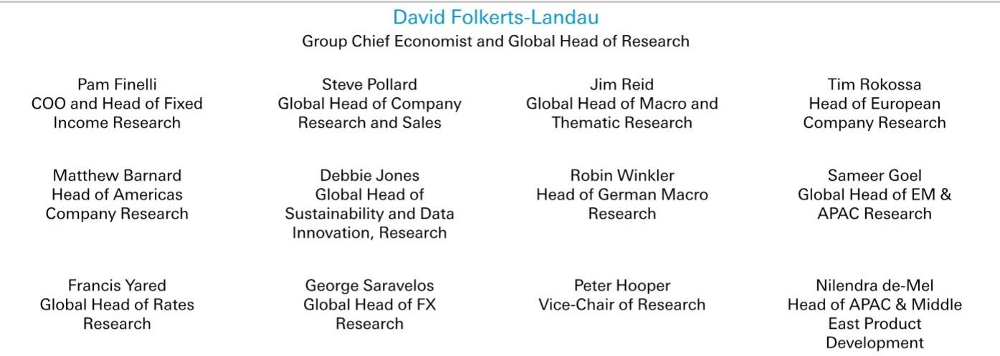

# DB：从安踏看消费公司韧性，增速质量比相对值更重要

消费环境正在经历节奏变化，这已是公开信息。但DB在7月6日发布的安踏2Q26运营预览报告中，给出了一个值得注意的判断：二季度零售增速的确在节奏变化，但全年目标并未动摇。安踏品牌零售销售预计同比持平，较一季度的高单位数增长明显回落；FILA从低双位数降至中单位数；只有迪桑特和可隆等户外品牌仍保持约30%的增长。

这份报告的核心信号是：短暂的季度波动，并未改变安踏作为多品牌平台的结构性竞争力。真正值得关注的，不是二季度少了几个点增速，而是公司在消费环境变化中，为何仍能守住全年低单位数（安踏品牌）、中单位数（FILA）、20%以上（其他品牌）的增长指引。

> **KC评论：** DB对安踏FY26净利润的预测为141.6亿元，比彭博共识低约2%，但当前报价对应12.8倍2026E PE。这个估值水平本身就在反映市场对消费节奏变化的定价。报告的逻辑是：估值已经消化了大部分预期，而公司基本面并没有同步出现变化。

## 1. 二季度减速是“主动消化”，而非需求变化

报告对二季度零售增速的预估值得拆开看。安踏品牌预计同比持平，较一季度的增速明显收窄。DB分析师Sammi Xu给出的解释是：电商复苏被线下销售环境的变化抵消。这个组合本身并不罕见——线上增速从低基数反弹，线下客流和转化率承压，两者对冲后总量走平。

但关键不在于增速本身，而在于“谁在减速、谁在抗压”。FILA从中低双位数降到中单位数，但报告明确说它“仍将优于同行，品牌动能扎实”。迪桑特和可隆继续以30%左右的速度增长，户外需求仍在扩张。

换句话说，安踏的减速主要发生在大众线和时尚运动线，这两个赛道正是当前消费环境下最敏感的部分。而户外专业品牌线不仅没有减速，反而在加速获取份额。这种分化本身就是多品牌组合的价值所在——当一条线遇冷，另一条线可以补位。

> **KC评论：** 报告没有直接点明，但隐含的判断是：安踏品牌和FILA的减速，部分原因是公司主动控制折扣和渠道库存，而非需求完全消失。如果只是为了冲量，安踏完全可以用更积极的促销维持增速。它选择不这么做，说明管理层更在意利润质量和品牌健康度。

## 2. 全年指引不变，靠的是“DTC执行力+品牌组合”两个支点

DB预计安踏会重申全年指引。支撑这个判断的，不是对消费环境突然转好的预期，而是两个可验证的运营事实。

第一，DTC（直面消费者）模式让安踏对终端有更强的控制力。相比依赖批发商的同行，安踏可以直接感知库存变化、调整产品组合、优化门店效率。一季度强劲的零售销售已经为全年提供了缓冲——即便二季度走弱，上半年的整体表现仍然可以对冲下半年的不确定性。

第二，品牌组合的多元化程度在行业里属于稀缺资源。安踏品牌覆盖大众市场，FILA覆盖时尚运动，迪桑特和可隆覆盖高端户外。三个价格带、三种消费场景，在同一个消费周期里同时走弱的概率很低。当前户外需求强劲，正好对冲了大众线的变化。

报告预计1H26收入同比增长10.1%，净利润增长3.9%，增速差异主要来自更高的营销费用投入。这个数字本身并不亮眼，但在当前宏观环境下，能实现正增长且利润率基本稳定，已经优于大多数可选消费公司。

## 3. 报告没有完全回答的关键问题：Amer Sports的贡献何时真正兑现

报告提到，FY26净利润预测141.6亿元中“反映了更强的Amer业绩”。安踏持有Amer Sports约40%股权，后者旗下拥有始祖鸟、萨洛蒙、威尔胜等品牌。Amer的业绩改善是安踏未来两年利润增长的重要增量来源。

但DB并未详细拆解Amer的贡献路径。Amer的扭亏节奏、汇率影响、以及IPO进程对安踏报表的具体影响，在报告中着墨有限。这可能是报告最值得追问的地方——如果Amer的盈利改善超预期，安踏的利润弹性会比当前模型显示的大得多；反之，如果Amer恢复不及预期，安踏的利润增速可能面临额外不确定性。

对于关注安踏的读者，跟踪Amer Sports的季度运营数据，可能比紧盯安踏品牌和FILA的月度零售增速更有价值。

## 4. 对读者的观察框架：关注“增速质量”，而非“增速相对值”

这份报告给产业决策者和研究者的启发，不在于二季度零售增速是多少，而在于如何评估一家多品牌消费公司在周期节奏变化时的韧性。

一个简单的观察框架是：当消费环境变化时，公司是否具备“主动调整但不失份额”的能力。安踏的做法是，不追求每个季度都跑赢市场，而是通过品牌组合对冲、DTC渠道控盘、以及户外赛道的结构性增长，来维持全年利润预期。这种策略的有效性，要到下半年才能验证，但至少方向是清晰的。

对于其他消费品公司而言，安踏这个案例的价值在于：多品牌组合不是万能的，但它确实可以在消费周期中提供一道缓冲。关键在于，这些品牌是否覆盖了不同的消费场景和价格带，而不是简单地把同一个品牌拆成三个名字。

> **KC评论：** DB报告中最值得反复看的，其实是那张DB预测与彭博共识的对比表。DB对2026年收入的预测比共识低8%，但净利润只低2%。这意味着DB对利润率的假设比共识更保守，但收入的预期已经部分被估值消化。如果下半年消费环境没有进一步出现变化，安踏的实际业绩反而可能超出这种保守预期。

For informational purposes only. Portions may be generated,translated,summarized,or edited with AI assistance based on source materials and may contain omissions or errors. Please verify independently. This is not investment,legal,tax,accounting,or other professional advice.

For informational purposes only. Portions may be generated,translated,summarized,or edited with AI assistance based on source materials and may contain omissions or errors. Please verify independently. This is not investment,legal,tax,accounting,or other professional advice.

