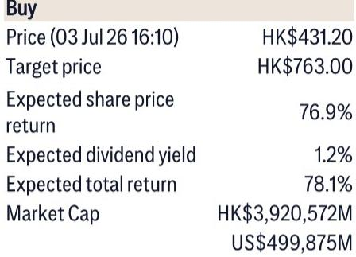
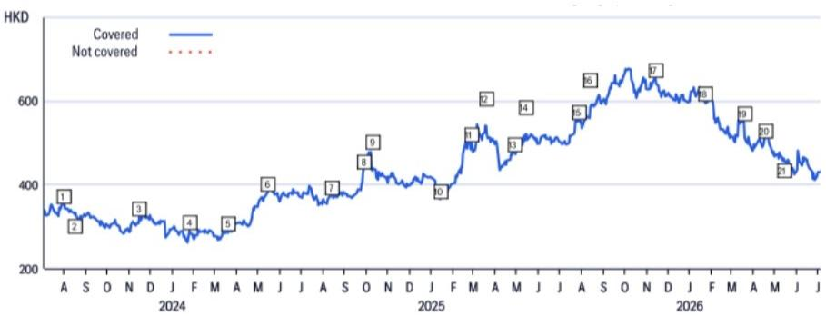
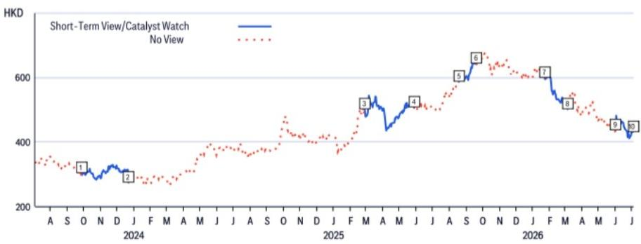

# Citi：腾讯WorkBuddy的DAU/MAU比，才是AI产品化的真正信号

一份来自第三方机构Analysys的数据，让Citi在7月初更新了对腾讯AI产品线的判断。截至7月6日，腾讯WorkBuddy跨平台月活用户已达2000万，日活突破1300万，DAU/MAU比落在65%至75%之间。对于一款仅上线几个月的产品，这个比例意味着什么？Citi认为，它指向的不只是用户规模，而是用户粘性和付费意愿的早期验证。

这个判断之所以值得关注，不是因为月活数字本身——2000万在腾讯生态里并不算惊人——而是因为DAU/MAU比是衡量工具型产品是否真正“被用起来”的关键指标。Citi在研报中特别指出，腾讯管理层在1Q26业绩会上曾透露，WorkBuddy的活跃用户留存率超过80%，且高粘性用户展现出比音乐、视频甚至游戏订阅更高的付费意愿。这意味着，AI产品在腾讯的变现路径，可能不是简单的流量变现，而是基于Token消耗的高质量收入。

---

## 1. 用户粘性比用户规模更值得关注：DAU/MAU比是AI产品的“不确定性测试”

Citi援引的数据显示，WorkBuddy的DAU/MAU比在65%至75%之间。这个区间放在消费级应用里属于高水平——微信的DAU/MAU比长期在80%以上，但那是社交网络。对于一款企业级AI产品，这个数字说明用户不是“打开看看就关掉”，而是每天都会回来使用。

更早的数据也支撑这一判断。根据Analysys 5月的报告，WorkBuddy的PC端月访问量达到885万，环比增长72.2%，是第二名竞品的2.6倍。3月内测阶段，月环比增长率更是达到831%，活跃用户规模是行业第二的3到4倍。

> **KC评论：** 高DAU/MAU比意味着产品已经跨过了“尝鲜期”，进入了日常使用阶段。这对AI产品来说是最难的一步——很多AI应用在早期靠营销拉量，但留存率迅速下滑。WorkBuddy的数据如果持续，说明它解决的是真实的工作场景需求，而不是一次性体验。完整报告里还有更多关于PC端和移动端流量分布的数据，值得细看。

---

## 2. 腾讯的AI变现路径正在从“流量”转向“Token消耗”

Citi在研报中引用了腾讯管理层在1Q26业绩会上的表态：管理层认为，WorkBuddy和CodeBuddy的高频使用正在形成正向反馈循环——用户使用越多，产品迭代越快，粘性越高。更重要的是，高粘性用户对AI产品的付费意愿，高于传统的消费订阅服务。

这背后的逻辑是：WorkBuddy不是卖“会员”或“广告”，而是卖“Token”——用户每次与AI产品交互，都会产生Token消耗。如果WorkBuddy能维持高DAU/MAU比，那么每个活跃用户每天产生的Token消耗量，将直接转化为腾讯云的增量收入。Citi认为，Token相关收入有望在2026年成为腾讯云的重要收入来源。

这个判断的深层含义是：腾讯在AI领域的竞争壁垒，不只是技术或模型能力，而是生态协同——微信、QQ、企业微信、腾讯文档等产品的用户基础，为WorkBuddy提供了天然的冷启动场景。而用户对腾讯数据安全和产品体验的信任，又降低了企业客户的决策门槛。

---

## 3. 报告没有完全回答的问题：WorkBuddy的付费转化率到底有多高？

Citi的研报提到，WorkBuddy的付费用户留存率超过80%，且高粘性用户付费意愿强。但报告没有给出具体的付费转化率数据——即活跃用户中有多少比例实际付费。这是理解WorkBuddy商业模型的关键变量。

如果转化率在10%到20%之间，那么2000万月活对应200万到400万付费用户，按每个用户每月几百元的Token消耗计算，年收入规模可能在数十亿级别。但如果转化率低于5%，那么收入贡献对腾讯整体而言仍是“锦上添花”。Citi在估值模型中，对云/企业服务业务使用的是5倍市销率，2027年预计收入700亿元，WorkBuddy在其中占比多少，报告没有明确拆分。

另一个未解的问题是：WorkBuddy的高DAU/MAU比能持续多久？企业级工具通常存在“采购-激活-流失”的周期，初期的高粘性可能来自早期用户的探索热情，能否转化为长期使用习惯，还需要观察后续季度的留存数据。

---

## 4. 对产业观察者的框架：用“DAU/MAU比+付费留存率”替代“月活数字”

Citi这份研报提供了一个更精细的AI产品评估框架。过去市场关注AI产品的月活增长，但月活可以靠营销投放和免费试用快速拉升。真正能区分“真需求”和“伪需求”的指标，是DAU/MAU比和付费留存率。

对于关注AI产业的研究者来说，可以建立这样一个观察清单：

- DAU/MAU比是否持续高于50%？低于这个数字，说明产品仍处于“打开即走”阶段。
- 付费用户留存率是否高于60%？如果留存率低，说明产品价值没有被用户持续认可。
- Token消耗量是否随用户规模线性增长？如果用户增长但人均Token消耗下降，说明使用深度不足。

WorkBuddy目前在这三个维度上都给出了正面信号，但数据周期尚短。下一份季度业绩会中，管理层是否会披露更细分的AI收入数据，将是验证这一逻辑的关键节点。

---

For informational purposes only. Portions may be generated, translated, summarized, or edited with AI assistance based on source materials and may contain omissions or errors. Please verify independently. This is not investment, legal, tax, accounting, or other professional advice.

For informational purposes only. Portions may be generated, translated, summarized, or edited with AI assistance based on source materials and may contain omissions or errors. Please verify independently. This is not investment, legal, tax, accounting, or other professional advice.

