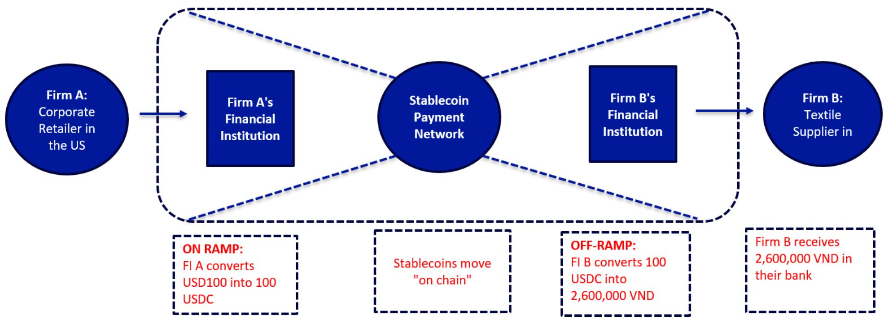
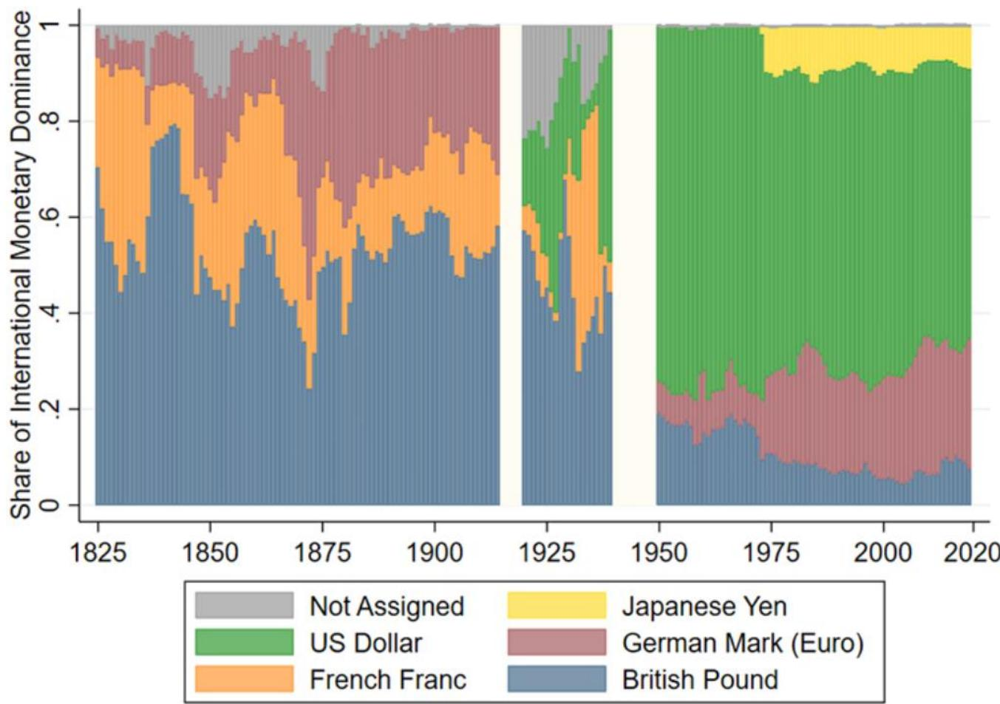

# 全球支付体系正在经历技术驱动的结构性演变

美元作为全球主要储备货币的地位已持续近一个世纪，但支撑其主导地位的力量正从两个方向同时发生变化。地缘格局的调整促使部分储备持有者考虑多元化配置，而技术创新正在构建一个独立于传统美元清算体系的支付基础设施。这两种趋势并非偶然重合，它们相互强化，使得美元的地位比多数市场参与者所认知的更为复杂。

传统观点认为美元的主导地位具有自我强化特征：深度资本市场、法治环境和网络效应形成了一个良性循环，任何挑战者都难以轻易打破。一份2026年7月发布的全球研究机构报告对这一假设进行了分析，考察了构建美元体系的结构性力量以及可能改变这一格局的新兴因素。报告的分析表明，美元角色的演变可能并非线性或剧烈，但储备构成、贸易计价和支付基础设施的渐进变化累积效应，可能在十年内产生重要影响。

这一议题之所以重要，是因为支撑美元地位的条件正在以叠加的方式发生变化。自2000年以来，外国央行持有的美元储备占比持续下降，且2015年后下降速度有所加快。与此同时，非美元支付基础设施正在快速成熟，这既得益于中国跨境银行间支付系统等国家支持的项目，也得益于稳定币和区块链结算领域的私营部门创新。那些认为美元地位不可改变的市场参与者，可能会对全球金融架构的渐进但重要的变化感到意外。

## 美元储备地位建立在特定的历史条件之上，这些条件正在发生变化

美元作为全球主要储备资产的地位并非抽象市场力量的结果，而是一个具体的历史过程。报告记录了20世纪90年代和21世纪初新兴市场央行大量积累美元储备如何为美元体系奠定基础。这种积累是由特定条件驱动的：新兴经济体持续出现经常账户盈余，通过外汇市场干预管理本币汇率，并选择将所得资金配置于美国国债，原因是美国债券市场的深度和流动性。

这种配置是相互强化的。大量储备持有创造了对美元计价资产的需求，降低了美国的借贷成本，鼓励了更多美元计价发行，深化了市场流动性，使美元资产对储备管理者更具吸引力。报告显示，外国持有的美国政府债务比例从20世纪90年代初的约15%上升到2010年的近50%，这一变化从根本上改变了全球资本市场的动态。

这些条件的变化在数据中可见。外国持有比例已从峰值回落，更重要的是，储备持有者的构成发生了变化。中东和北非主要石油出口国的官方部门储蓄曾是美元需求的重要来源，现在正被重新配置。报告的图表显示，大宗商品出口国的储备积累与其美元资产配置之间存在明显分化，表明地缘因素正越来越多地影响储备管理决策。

关键洞察不在于储备多元化是新现象，而在于美元需求的结构性驱动因素正在同时减弱。当储备积累集中在少数有强烈动机持有美元的大型持有者手中时，体系是稳定的。现在储备更加分散，动机也在变化，体系变得更加复杂。

## 美元储备占比下降并非短期调整，而是由动机变化驱动的结构性趋势

报告提供了有力证据，表明美元储备占比下降并非暂时调整，而是结构性趋势。外国储备构成数据显示，美元占比从2000年的约70%稳步下降到2020年代中期的60%以下，2015年后下降速度加快。这不是单一大型卖家的故事，而是储备管理行为的广泛转变。

使这一转变具有结构性而非周期性特征的是储备管理者动机结构的变化。持有美元储备的传统理由很简单：美元资产提供了安全性、流动性和收益的组合，其他货币无法比拟。但报告指出了几个削弱这一逻辑的因素。首先，美国财政状况显著变化，债务与GDP比率上升到引发对长期财政可持续性疑问的水平。其次，美元作为外交政策工具的使用，特别是通过制裁和资产冻结，给此前被视为无风险的资产引入了政治风险。第三，替代储备资产的发展，包括欧元计价债券、日元计价证券甚至黄金，扩大了储备管理者的选择范围。

报告对净国际投资头寸与长期政府债券回报表现之间关系的分析尤其具有启发性。历史上，拥有大量净外部资产的国家对美元资产有吸引力，但这种关系正在减弱。数据表明，储备管理者越来越愿意接受较低的回报表现或较少的流动性，以换取减少对美元计价资产的敞口，这种权衡在十年前是不可想象的。

对市场参与者的启示是明确的：美国国债的边际买家正在变化。随着传统储备持有者减少配置，美国财政赤字的融资负担将落在国内读者和对价格敏感的外国买家身上，这可能导致期限溢价上升和长期利率波动加大。

## 支撑美元主导地位的支付基础设施正受到国家和私营部门创新的双重影响

报告最重要的贡献在于对支撑美元主导地位的支付基础设施的分析。当前体系依赖于通过美联储支付系统处理美元计价交易的代理银行关系网络。这一基础设施高效但集中，创造了一个单一控制点，使美国对全球资金流动拥有显著影响力。

报告用一个清晰的例子说明了这一体系：一家美国零售商向越南纺织品供应商付款。交易通过一家在美国持有往账账户的代理银行进行，美联储作为中央清算机构。这一体系运行良好，但要求所有参与者都能使用美元清算服务，这反过来要求他们与美国的代理银行保持关系。

两个发展正在挑战这一基础设施。第一个是代理银行关系的减少，报告对此进行了详细记录。活跃的代理关系数量一直在下降，特别是对于较小司法管辖区和新兴市场的银行。这种下降部分源于监管压力，因为反洗钱和制裁筛查相关的合规成本使大型银行维持与较小银行的关系变得不经济。结果是全球支付体系的碎片化，减少了基于美元的支付覆盖范围。

第二个发展是替代支付系统的出现。中国的跨境银行间支付系统（CIPS）是最突出的国家支持项目，但报告也强调了稳定币和区块链结算日益增长的作用。报告的稳定币支付示意图显示，传统上需要通过代理银行体系的交易现在可以在链上结算，完全绕过美元清算。美国零售商将美元转换为稳定币，稳定币在区块链上移动，越南供应商将稳定币转换为当地货币，整个过程不触及美元支付系统。

这一发展的重要性不容低估。虽然目前基于稳定币的跨境支付量相对于传统流量较小，但基础设施正在快速改善。报告指出，稳定币支付网络正变得更快、更便宜、更可靠，并且为代理银行体系服务不足的货币交易提供了特别优势。

## 石油美元体系面临比多数读者认知的更直接挑战

报告对石油美元体系给予了大量关注，这是有充分理由的。自20世纪70年代以来，美元在石油定价和结算中的作用一直是其全球主导地位的基石。机制很简单：石油以美元定价，石油出口国收到美元，然后将其循环投入美元计价资产。这创造了一个支持美元需求和美国国债市场流动性的循环流动。

报告关于原油出口目的地的数据揭示了一个威胁这一循环流动的变化。越来越多的石油出口流向中国和其他亚洲经济体，而流向美国和欧洲的份额下降。这种石油贸易地理的变化为替代定价和结算机制创造了机会。如果相当一部分石油贸易在有意减少美元依赖的生产者和消费者之间进行，石油美元体系可能从内部受到削弱。

报告并未预测石油美元即将终结，但指出了几个可能加速其变化的场景。一个是主要石油生产国和主要消费国之间达成双边协议，以非美元货币结算贸易。另一个是开发一种大宗商品支持的数字货币，作为石油交易的替代结算工具。第三个是逐步转向多种货币的石油定价，这将减少美元作为全球能源贸易相对少见计价单位的角色。

对市场参与者的关键问题不是石油美元能否以当前形式存续，而是向其他形式的过渡会是什么样子。渐进变化将是可控的，允许市场调整和新机制发展。由地缘事件或政策决定引发的突然变化可能具有高度破坏性，导致汇率、利率和大宗商品价格的剧烈波动。

## 报告未完全解答的问题：变化的节奏和触发点

尽管分析深入，报告仍留下几个关键问题未解答。最重要的是时机问题。报告记录了削弱美元地位的结构性力量，但没有提供清晰的框架来预测这些力量何时会达到临界点。美元储备占比会逐渐下降几十年，还是信心突然丧失可能引发更快速的调整？

报告也没有完全解答什么将取代美元的问题。分析表明，不太可能出现单一货币作为直接继承者，但没有详细探讨多极储备货币体系的影响。这样的体系会比当前以美元为中心的体系更稳定还是更不稳定？过渡将如何影响全球金融市场、贸易模式和经济成长？

另一个未解决的问题是网络效应在维持美元地位中的作用。报告记录了代理银行关系的减少和替代支付系统的兴起，但没有完全分析这些替代方案能否达到挑战美元网络优势所需的规模和流动性。美元受益于流动性的自我强化循环，但尚不清楚这个循环在什么情况下可能被打破。

最后，报告没有讨论政策应对的可能性。美国拥有维护美元地位的重要工具，包括货币政策、金融监管和外交接触。报告的分析表明这些工具可能不如以前有效，但没有系统评估政策干预可能减缓或逆转美元角色变化的情景。

## 市场参与者应对美元角色变化的决策框架

报告的分析转化为一个实用的决策框架，适用于需要为美元主导地位减弱但未消失的世界调整配置的市场参与者。该框架有三个维度：时间跨度、资产类别和情景概率。

对于一到三年的短期跨度，美元的地位不太可能发生剧烈变化。替代支付和储备资产的基础设施尚未成熟到足以支持快速过渡。市场参与者应关注驱动美元变化的周期性因素，包括利率差异、增长差异和风险偏好。报告中确定的结构性趋势很重要，但将在更长时间内发挥作用。

对于三到七年的中期跨度，结构性趋势变得更加相关。市场参与者应考虑减少对特别受储备需求变化影响的美元计价资产的敞口，如长期美国国债。还应评估替代支付系统颠覆特定领域的潜力，特别是跨境贸易融资和汇款。

对于七年及以上的长期跨度，报告的分析表明美元角色显著减弱是可能的。市场参与者应逐步建立受益于多极储备货币体系的资产头寸，包括非美元政府债券、黄金以及可能看到储备需求增加的国家货币。还应为一个美国财政状况因外国对国债需求减少而更加受限的世界做准备。

该框架还要求市场参与者评估不同情景的概率。基准情景是美元主导地位在两到三十年内逐渐减弱，期间伴随体系调整的周期性波动。上行情景是美元的网络效应比报告建议的更持久，储备占比在达到新的平衡后稳定。下行情景是由财政危机、地缘冲击或技术突破引发的信心突然丧失，使快速转向替代支付系统成为可能。

## 加入社区阅读完整报告并查看原始图表

本文分析基于一份全球研究机构关于美元长期前景的综合报告的数据和见解。完整报告包含关于储备构成、贸易计价模式、代理银行关系和替代支付系统演变的详细图表，以及为上述结论提供更严谨基础的场景分析和定量模型。

报告留下了几个值得进一步讨论的问题。非美元支付基础设施将多快规模化？美国可能部署哪些政策应对来维护美元地位？向多极储备体系的过渡将如何影响全球金融稳定？这些都是研究社区需要共同思考的问题，完整报告为这一讨论提供了分析基础。

加入社区阅读完整报告并查看原始图表。

*仅供参考。部分内容可能基于源材料通过AI辅助生成、翻译、总结或编辑，可能存在遗漏或错误。请独立核实。本文不构成专业建议。*

仅供参考。部分内容可能基于源材料通过AI辅助生成、翻译、总结或编辑，可能存在遗漏或错误。请独立核实。本文不构成专业建议。

