# Industry Global Semiconductors

Europe
Global
North America

Technology Semiconductors

Date
7 July 2026
Industry Update

# Auto Semi market tracker - pricing is gaining further momentum

## From destocking to restocking as allocation concerns are resurfacing

Auto Semis pricing has potential to increase going forward due to low key component inventories and strong competition for capacity from AI datacenter. In our last Auto Semis update from April (here), we pointed out an improving pricing environment for Auto Semis for the first time in over three years. We saw this as driven by: 1) reduced inventories of key Auto Semis across supply chains, 2) spill-over effects from AI-driven chip demand in categories like mid-voltage power MOSFETs but also memory (including specialized memory such as NOR Flash), and 3) continued strong content growth driven by SDVs (for high-end MCUs and Ethernet components, in particular). The above-mentioned areas, as well as analog components, remain the key drivers of a better pricing environment, in our view, while the situation for higher-voltage power semis for xEV drivetrains remains on the other end of the spectrum but is also set to improve into 2027 with demand drivers from AI datacenter accelerating from next year out to 2030 (SSCBs, SSTs and 800V architecture more broadly, as discussed here). Overall, we believe Auto Semis pricing is gaining further momentum on the back of the aforementioned drivers and despite a mixed Automotive end market. Our industry conversations indicate only low-single-digit price declines this year (vs. normal low- to mid-single-digit), but with scope for price increases (even on company Auto Semi portfolio levels and not just individual components) as we go into next year. Paired with ongoing strong content growth from SDV, ADAS and to some extent xEVs (especially in Europe), we believe the Auto Semis market can return to >10% growth this year and build further momentum in '27. Given margins for many players in this market remain somewhat compressed this year, we continue to see strong operating leverage ahead from better capacity utilization (helped by capacity reallocation towards AI), as well as pricing and we remain positive on the broader space, especially names with a strong AI story and potential to grow into existing capacity/cleanroom space. Our top picks are Infineon, NXP, onsemi and STMicro.

We believe general component and Auto semi destocking across the supply chain has largely played out in recent quarters. Our inventory analysis of the tier 1 auto supply chain shows a slight increase in \$ inventory value sequentially in Q1/26 and inventory as a percentage of sales in Q1/26 increased to 12.2% (vs. \~12% in Q4/25). Our industry conversations point to a desire by tier 1s and OEMs to rebuild strategic inventory in certain areas with some industry discussions raising concerns over allocation and "golden screw" key component shortages ahead again given the strong demand from AI datacenter for semis capacity.

Johannes Schaller
Associate Director of Equity Research - Germany

Ross Seymore
Research Analyst

Robert Sanders
Research Analyst

Melissa Weathers
Research Analyst

Edison Yu
Research Analyst

Nicolas Herms
Research Analyst

DJ Sebastian
Research Associate

Yusuf Jamal
Research Associate

Kunal Gupta
Research Associate

We value stocks in the sector on a P/E, EV/Sales and/or DCF basis, benchmarking the multiples vs. peers and/or expected growth rates. Key downside/upside sector risks: a macro/auto production change or improvement, and design and/or market share changes.

## From destocking to restocking into Q2 and H2/26

Looking back at the recent near-term picture and relative performance in Q1 (in US dollar terms), Auto semi players saw a revenue increase of +1% q/q, on fairly lean inventory conditions, partly offset by other macro factors. On y/y basis, the acceleration stood at +11%, back in-line with the five-year average growth trendline. Dynamics by companies are interesting in hindsight with industry bellwethers such as Qualcomm (+20% q/q), Analog Devices (+8% q/q) and Renesas (+4% q/q) seeing strong growth while Infineon (+1% q/q), Texas Instruments (flat q/q), onsemi (flat q/q) and Rohm (flat q/q) showed flat to modest growth. STMicro (-9% q/q) and NXP (-5% q/q) witnessed a sequential decline in revenue growth. Among smaller companies, Lattice Semi (+35% q/q), Mobileye (+25% q/q), Ambarella (+13% q/q) saw strong growth, while Elmos (-10% q/q), Melexis (-6% q/q) and Nvidia (-5% q/q) saw a sequential decline. For Q2/26e, our bottom-up model suggests +5% revenue growth sequentially, well above the five-year average performance (+3% q/q), implying the beginning of a restocking cycle that should last into H2, in our view.

Figure 1: Auto Semi sales growth for CY24/25/26e  
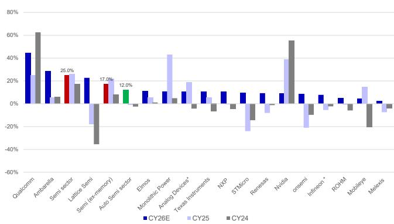  
Source : DB Estimates, Bloomberg Finance LP (growth is computed on US\$ sales); ) \*IFX & ADI include Cypress and Maxim contribution on pro-forma basis, respectively.

Figure 2: Auto Semi market growth (2011-2026e)  
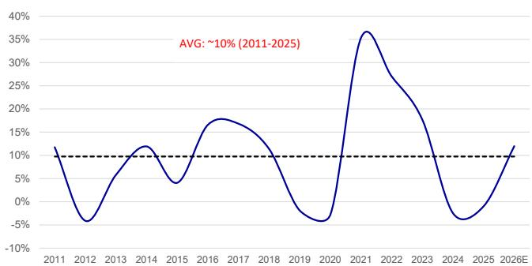  
Source : DB Estimates, Bloomberg Finance LP (growth is computed on US\$ sales) \* The annual growth is calculated based on consolidated auto semi sales of companies mentioned in figure 1.

Figure 3: Current price/earnings ratio (1y fwd) vs. 5y avg  
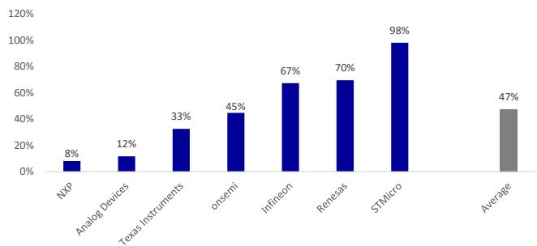  
Source : Bloomberg Finance LP (pricing as on 3rd July 2026)

Figure 4: Current price/earnings ratio (1y fwd)  
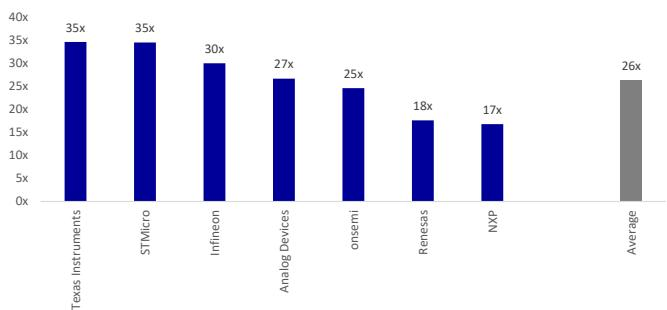  
Source : Bloomberg Finance LP (pricing as on 3rd July 2026)

## Auto Semi revenues up 11% y/y in Q1/26; \~11% y/y growth expected for Q2/26e

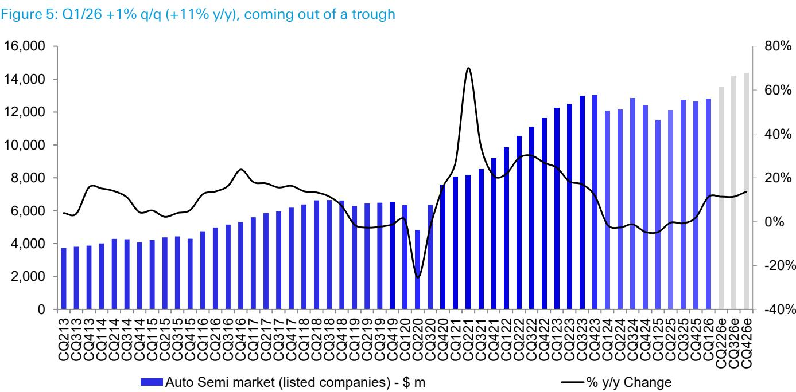  
Source : Company data, DB estimates

Figure 6: Tier-1 Auto Semi players  
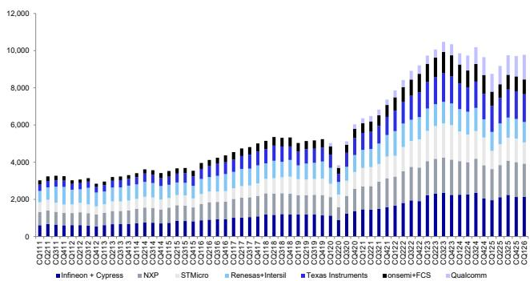  
Source : Company data, DB, (in US\$ m); \*:-Intersil acquired by Renesas on 24 February 2017; IFX acquired Cypress on 20th Apr 2020

Figure 7: Tier-2 Auto Semi players  
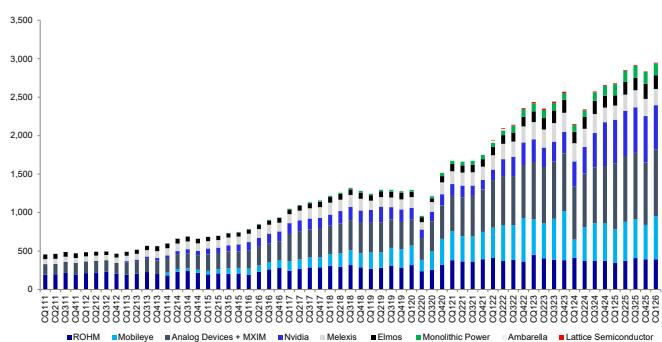  
Source : Company data, DB, (in US\$ m);\*ADI+Maxim PF numbers

Long-term content-driven growth story remains intact, cyclical bottom behind us

## Figure 8: Auto Semi vendors management commentary

<table><tr><td>Company</td><td>Management commentary on automotive business</td></tr><tr><td>Analog Devices</td><td>&quot;So if we look at what we think at the midpoint of the guide, what we expect to see in FQ3 (June ending) is continued above-seasonal growth across industrial, automotive and communication...So from an industrial and automotive perspective, we&#x27;d expect to grow sort of mid to high single-digits sequentially. &quot; &quot;Now, on the inventory build-up question, we&#x27;re not seeing that yet, right? After the digestion, which we talked about, particularly in BMS, we feel like automotive customers are fairly lean on inventory, at least the ones we talk to and which is very supportive of our growth expectation going forward.&quot;</td></tr><tr><td>Infineon</td><td>&quot;Generally speaking, the near-term outlook for the automotive market remains relatively muted. In its April update, market researchers S&amp;P Global revised down its light vehicle production numbers for 2026. They are now more or less in line with our view. As you know, what matters more than car units is structural content growth. Here, we see the adoption of software-defined vehicles accelerating. Also, the trend towards E-mobility is intact. However, xEV penetration is progressing more slowly than predicted.&quot; &quot;we expect revenues of around EUR4.1bn for our fiscal third quarter, corresponding to 8% growth quarter-over-quarter. By segment, for ATV (automotive), a slight revenue growth is predicted.&quot; &quot;For the full year 2026 fiscal year, we now expect revenues to be significantly up compared to the previous fiscal year, translating into a level of EUR16bn...ATV should see slight revenue growth, driven by its broad product portfolio and the early adoption of software-defined vehicles burdened by the decrease of the high voltage drivetrain business.&quot;</td></tr><tr><td>Melexis</td><td>&quot;One quarter ago, actually, two months ago, we have indeed mentioned that our customer has informed us that the second half of the year will be better than the first half. And I would say this is indeed confirmed in the order intake. We see clearly order intake improving week after week, day after day.&quot; &quot;We are seeing increased opportunities in ADAS as the industry continues its structural shift towards steer-by-wire and break-by-wire architecture.&quot;</td></tr><tr><td>NXP Semiconductor</td><td>&quot;Our outlook is better than we anticipated 90 days ago. We are guiding second quarter revenue to $3.45bn, up 18% year-over-year, and up 8% sequentially. This sequential growth represents an acceleration of our company&#x27;s specific drivers . Automotive is expected to be up in the low-double digit percent range year-on-year, and up in the high-single digit range sequentially.&quot; &quot; our auto business NXP is performing well. You can see from the front, in Q1, it grew 10% after you account for the sensor business. And Q2 guidance implies a high-teens year-over-year growth on the same basis. So, you can see that clearly the momentum is improving. And so, that tells you already that this is not necessarily a story about unit growth. This is a story about the transformation, the architecture transformation that is driving content growth.&quot;</td></tr><tr><td>onsemi</td><td>&quot;So, automotive in Q2/26, we think it will be roughly flat. So, as I said, we think we&#x27;re shipping to natural demand. We haven&#x27;t seen the full recovery or the replenishment cycle in automotive yet. If that were to happen later in the year, that&#x27;s going to be a good thing. But right now in Q2/26, we&#x27;re looking at flat.&quot; &quot;I talked about China specifically, given you brought it up. Q1 is seasonally down. The number of passenger vehicle was down 6%. Our revenue was actually up. Therefore, that tells you it is a content story. In certain areas, it is a share gain story as well. So, we are both gaining share, but also gaining more and more content.&quot;</td></tr><tr><td>ST Micro</td><td>&quot;Automotive design momentum progressed with various OEM and Tier 1 ecosystems. We had design wins across electric, hybrid, and traditional vehicles spanning onboard chargers, DC-DC converters, powertrain active suspension, and vehicle control electronics.&quot; &quot;Well, then what will be, again, positive on the year 2026, looking at the current dynamic in terms of growth? Well, in automotive, we confirm that &#x27;26 will be a growth for ADAS, for sensor, of course, and also with the boost of the acquisition of MEMS from NXP and for silicon carbide.&quot;</td></tr><tr><td>Texas Instruments</td><td>&quot;I want to see automotive and see how it develops in Q2. It&#x27;s too soon to call it. I will remind us, though, that during the COVID cycle, even automotive was the last to join in, also the last to peak, right? So, I&#x27;m not surprised by the behavior of this market. I will say that secular growth in automotive continues for the foreseeable future, and that is my encouragement. We are seeing cars adding features, we are seeing more content added to vehicles across the powertrains, whether it&#x27;s BEV or ICE or the hybrids.&quot;</td></tr></table>

Source : DB, company data

## Q1/26 Auto Semi revenue performance

Figure 10: Q1/26 Auto Semi revenue growth q/q  
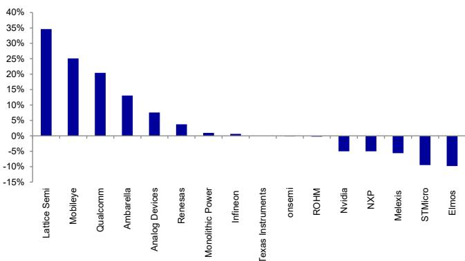  
Source : Company data, DB; Growth is calculated on US\$-based revenue

Figure 11: Q1/26 Auto Semi revenue growth y/y (USD)  
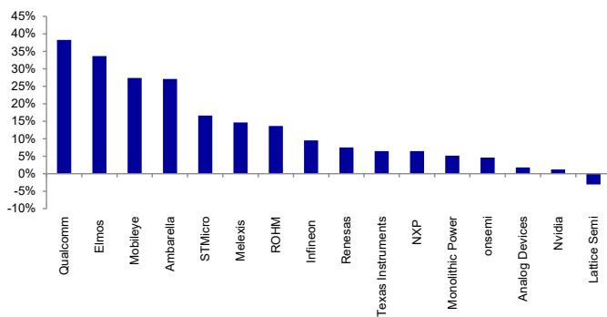  
Source : Company data ; Growth is calculated on US\$ based revenue; \*IFX+Cypress PF numbers are used for growth calculation

Figure 12: Q1/26 Auto q/q growth (in reported currency)  
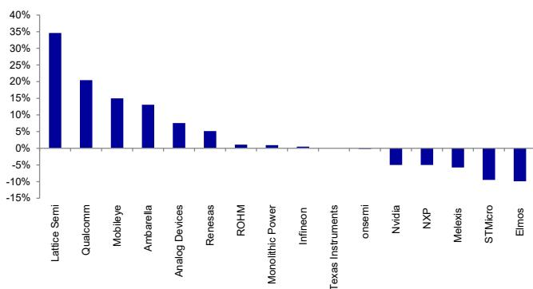  
Source : Company data, DB

Figure 13: Q1/26 Auto y/y growth (in reported currency)  
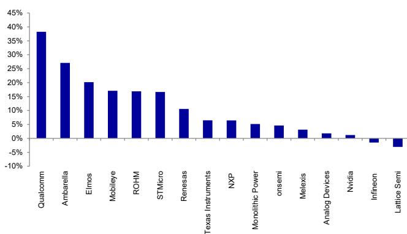  
Source : Company data, DB

Figure 14: Auto Semis average quarterly sales (LTM; USD)  
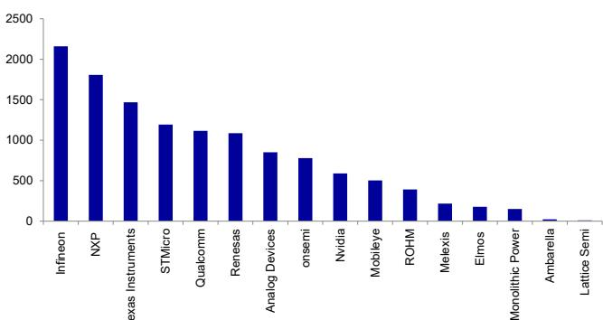  
Source : Company data, DB

Figure 15: Auto Semis average quarterly sales LTM (y/y growth in USD terms)  
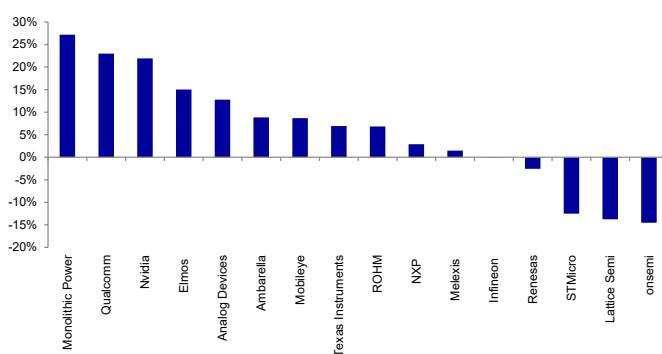  
Source : Company data, DB; ADI + Maxim PF numbers are used for calculation

Figure 16: Global Auto Semi revenues vs SAAR - destocking headwinds subsiding into 2026  
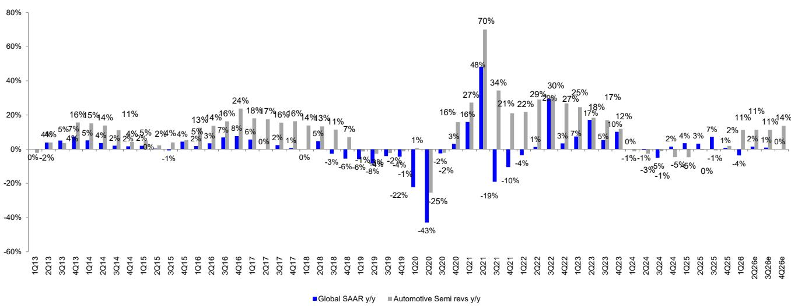  
Source : Company data, IHS, DB estimates; Content gain = Automotive Semi revs (y/y) – Global SAAR (y/y); average Q1/13 – Q1/26 = \~10.0%

## So who has gained share over time?

Figure 17: Renesas is underperforming ...  
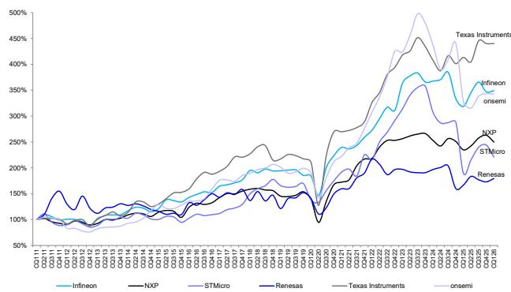  
Source : Company data, DB

Figure 18: ...and Mobileye trends are remaining volatile  
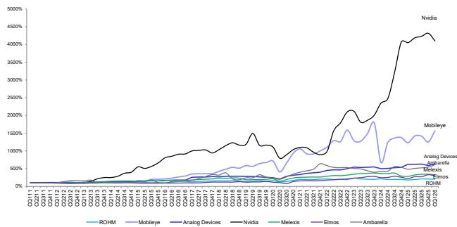  
Source : Company data, DB; ADI + Maxim PF numbers are used for calculation

## Auto Semis sales exposure and market share by product

Figure 19: Total Auto Semi market (including non-listed companies)  
  
Source : Company data, DB  
Figure 20: Automotive Semiconductor supplier share (Market Size: \~\$68.4b in FY24)

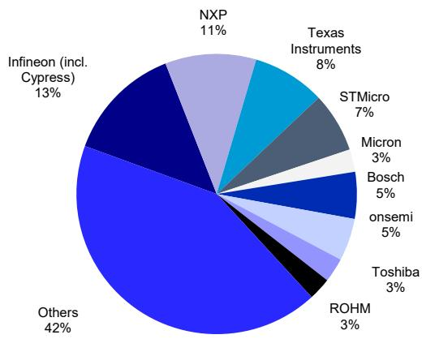  
Source : Infineon investor presentation (FQ2/25 results); company data, TechInsights (March 2025); DB  
Figure 21: Automotive Semiconductor supplier share (Market Size: \~\$74.4b in FY25)

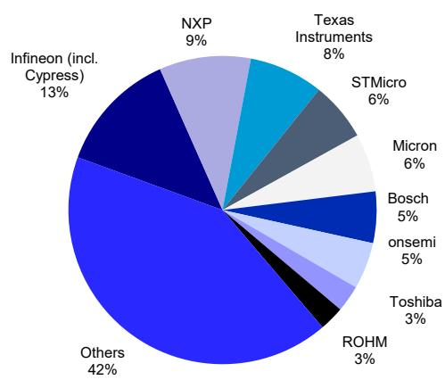  
Source : Infineon investor presentation (FQ2/26 results); company data, TechInsights (April 2026); DB

Figure 22: Automotive as percentage of total sales (Q1/26)  
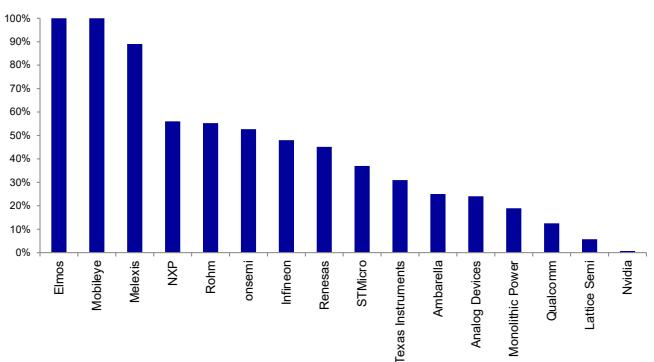  
Source : DB, company data

Figure 23: Infineon Auto revenue split by products  
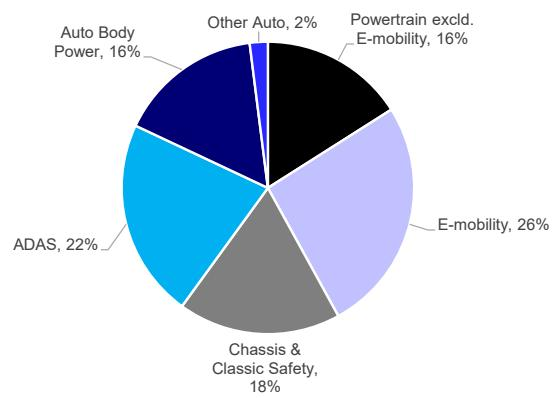  
Source : Company data (based on FY25 revenue)

Figure 24: STM Auto revenue split by products  
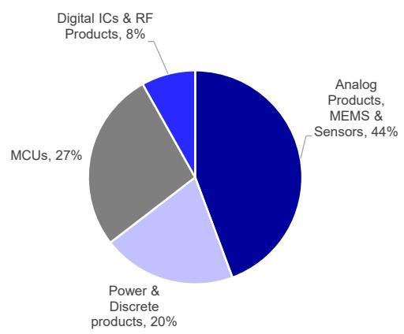  
Source : Source : DB estimates, company data (based on FY25 revenue)

Figure 25: Market share in Auto power semis  
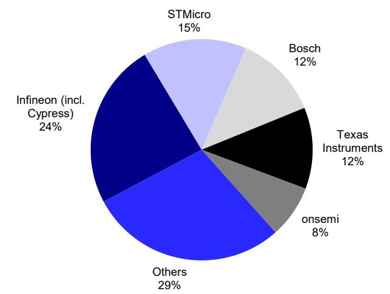  
Source : Infineon, company data, TechInsights (2025)

Figure 26: Market share in Auto sensors  
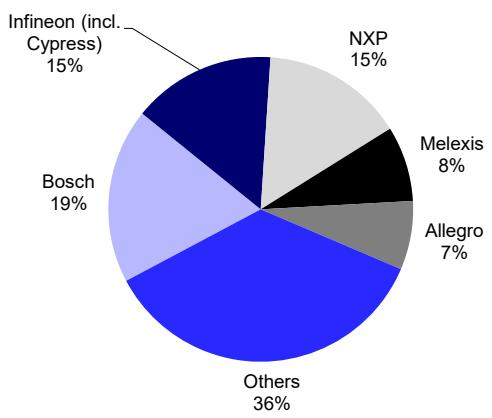  
Source : Infineon, company data, S&P Global (2025)

Figure 27: Market share in Auto microcontrollers  
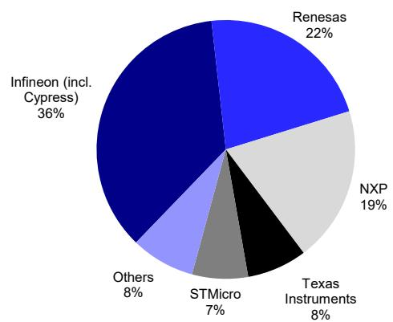  
Source : Infineon, company data, TechInsights (2025)

Figure 28: Auto radar market share\*  
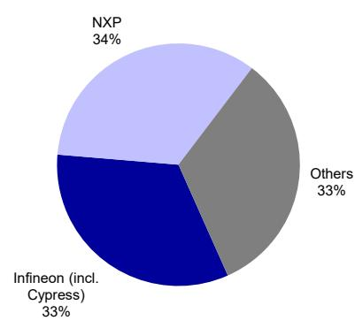  
Source : DB estimates, company data (2020); \*transceiver and controller

Figure 29: Auto (non-power) Analog market share  
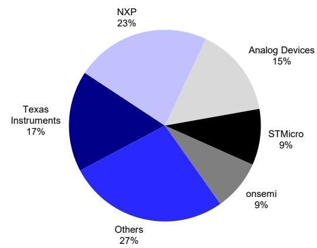  
Source : Company data, DB (2025)

Figure 30: Auto Memory market share  
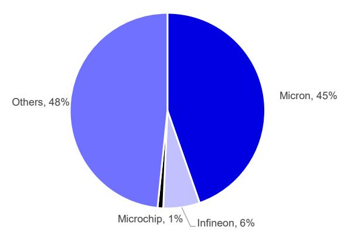  
Source : Company data, DB (2025)

Figure 31: Auto SoC market share  
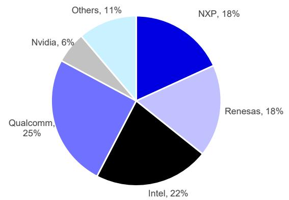  
Source : Company data, DB (2025)

Figure 32: Auto Logic ICs market share  
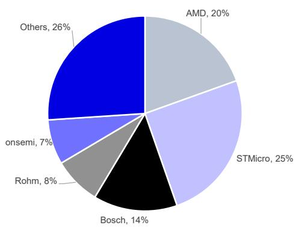  
Source : Company data, DB (2025)

Figure 33: Auto DSP market share  
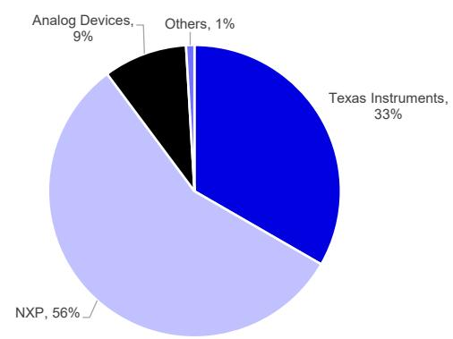  
Source : Company data, DB (2025)

Figure 34: End-market exposure of the Automotive Semiconductor suppliers

<table><tr><td>Company</td><td>Major automotive semiconductor products/End market area</td></tr><tr><td>Infineon***</td><td>Number 1 in Power Semis, Assistance &amp; Safety Systems, Comfort &amp; Body, Security, Connectivity, Microcontrollers and high-performance memory</td></tr><tr><td>NXP</td><td>Car access &amp; immobilizers, In-vehicle networking, Car entertainment, ADAS, ABS, Gateways, Battery Management, Automotive Lighting, Sensors, Telematics, Transmission/throttle control</td></tr><tr><td>STMicroelectronics</td><td>Infotainment &amp; Connectivity, Auto Microcontrollers, ADAS, Sensors, Power drive, SiC devices, Body, Chassis &amp; Safety</td></tr><tr><td>Renesas</td><td>Number 1 in Microcontrollers, also present in powertrain, safety, chassis &amp; safety,Camera Video signal processing, Power systems</td></tr><tr><td>Texas Instruments</td><td>Infotainment &amp; Cluster, ADAS, Passive Safety, Hybrid, electric &amp; powertrain systems, Body electronics &amp; lighting</td></tr><tr><td>onsemi</td><td>Powertrain, Power Management, In-Vehicle Networking, Infotainment, ADAS, AI, Sensors, LED Lighting</td></tr><tr><td>Rohm</td><td>High exposure to audio/infotainment, also HVAC control, body, electronic power steering, battery management/charging</td></tr><tr><td>Analog Devices**</td><td>ADAS, Infotainment, Powertrain, Body and Chassis &amp; Safety; LED Lighting, Smart Key, Infotainment, Sensors, High-Integration Power, EV battery</td></tr><tr><td>Mobileye</td><td>Advanced Driver Assistance Systems (ADAS)</td></tr><tr><td>Nvidia</td><td>Infotainment and navigation, ADAS, Rear seat entertainment, Digital instrument clusters</td></tr><tr><td>Melexis</td><td>Actuators, Analog and digital semiconductors, Sensors, Smart motor drivers</td></tr><tr><td>Elmos</td><td>Sensors, Motor control, Embedded systems</td></tr><tr><td>Ambarella</td><td>Video recorders, in-cabin and driver monitoring cameras, electronic mirrors, around view monitoring and front camera advanced driving assistance systems</td></tr><tr><td>Monolithic Power</td><td>Infotainment, digital cockpits and connectivity applications</td></tr><tr><td>Lattice Semi</td><td>Low power FGPAs for ADAS, safety, infotainment, and quality/reliability applications</td></tr><tr><td>Qualcomm</td><td>Advanced driver assistance and automated driving (ADAS/AD), connectivity, digital cockpit</td></tr><tr><td colspan="2">Source : Company data, DB; ***Infineon acquired Cypress during Q2/20; ** ADI acquired Maxim during CQ3/21</td></tr></table>

## Automotive Semi content the major driver of industry growth

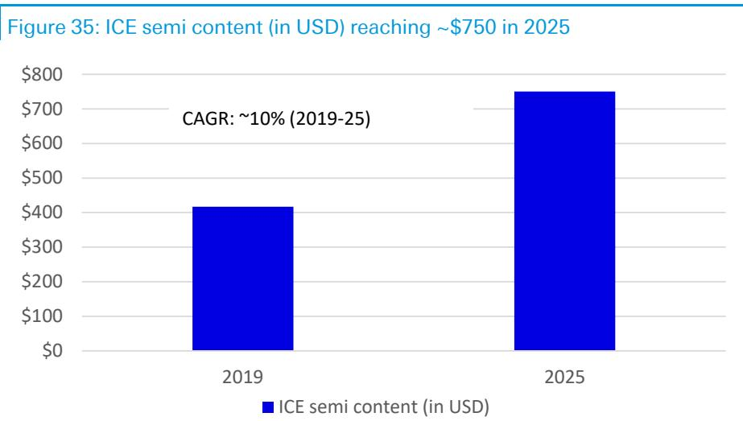  
Source : Company data (Infineon based on S&P Global dataset; DB

Figure 36: Semiconductor content per car (\$) – drivetrain power semis content in EV/PHEV is substantially above ICE  
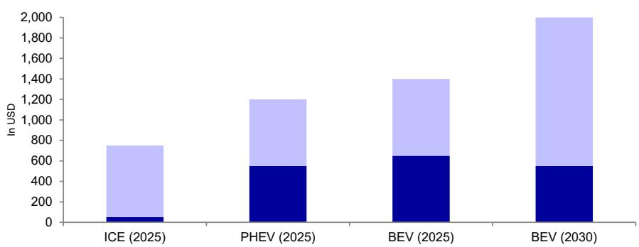  
- Non-Power Semis (incld ADAS, Infotainment, Connectivity, Comfort, Safety etc)
- Power Semis (drivetrain semis)  
Source : Company data (Infineon based on S&P Global dataset), DB

Figure 37: ADAS semi content per level of automation (in \$)  
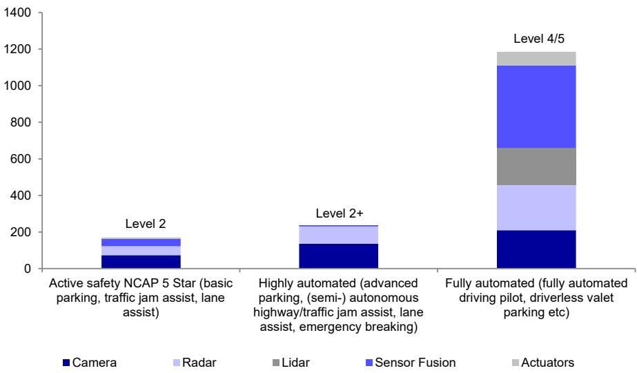  
Source : Company data (Infineon based on TechInsights), DB

Figure 38: Sales of cars equipped with ADAS (L1 or higher) to almost double by 2030  
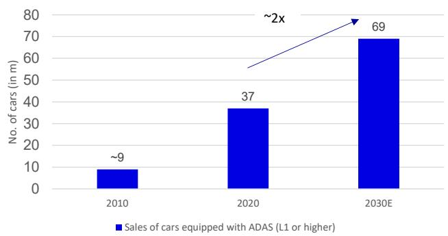  
Source : Company data, DB

Figure 39: ADAS and SDV seeing strong increase in penetration till 2030  
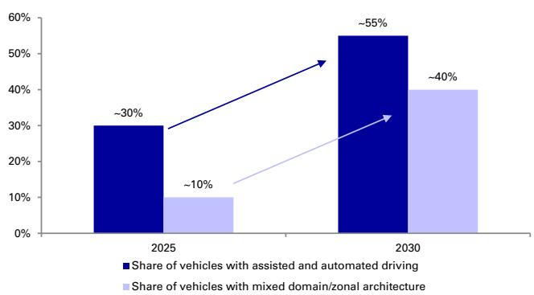  
Source : Company data, DB

Figure 40: Auto MCU market is likely to see strong growth  
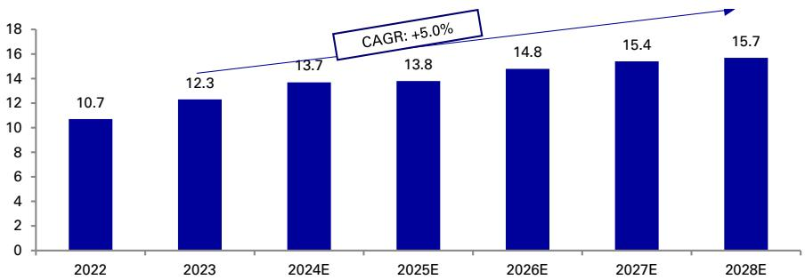  
■ Total automotive MCU market development, excl. MPUs and SoCs [USD bn]  
Source : Infineon, company data, DB

## Auto Semi supplier CapEx expected to normalize in 2025/26e

Figure 41: Top 7 Auto Semi CapEx has peaked in 2023...  
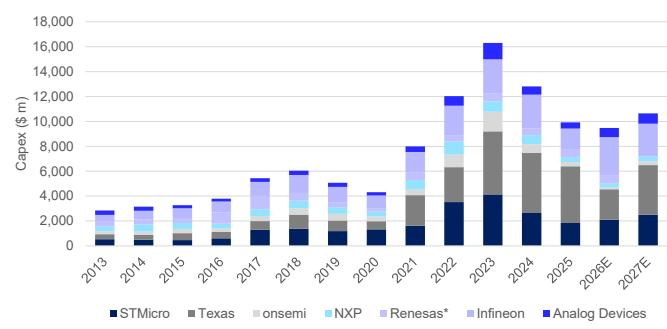  
Source : Company data, DB estimates & Bloomberg Finance LP; \* FY21 underlying CapEx for Renesas is estimated excluding CapEx for fire response

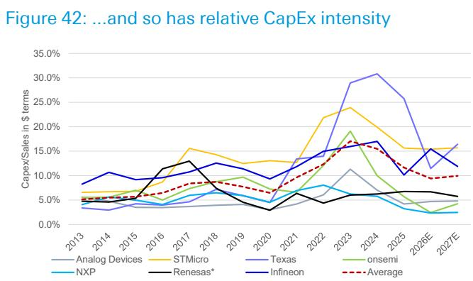  
Source : Company data, DB estimates & Bloomberg Finance LP; \* FY21 underlying CapEx for Renesas is estimated excluding CapEx for fire response

## Automotive end market - mixed trends in BEVs with Europe strong

The global EV market presents a differentiated landscape across key regions. In Western Europe, while overall car market registrations grew \~3% y/y in May (\~8% y/y in April), BEV and PHEV registrations demonstrated robust growth of 50% y/y and 11% y/y, respectively. The EU5 electrified car market (BEV+PHEV) held on to a firm footing in May registering 37% y/y growth, resulting in overall electrification market share of \~32%, suggesting EV adoption is a key driver supporting the European auto market and a major driver of Auto semis growth here. On a ytd basis, EV sales grew \~38% y/y as compared to \~5% y/y growth in EU5 car market, resulting into overall market share of \~30%.

The US automotive market performed stronger than expectations in Jun'26, running at a SAAR of 16.7m, stronger than prior-year SAAR of \~15.6m. out to the rest of 2026, we raised our 2026 anticipated SAAR to 16.0m, which is relatively in-line with most OEM estimates. For 2027, we maintain our full-year outlook at 16.1m SAAR. According to Omdia, US EVs (BEV + PHEV) witnessed a 21% decline in May'26 and registered as market share of \~7% (vs. 9% in May'25).

In May 2026, the Chinese passenger car market saw a subdued performance, with retail sales down by 22% y/y, reaching 1.51m, while increasing by 9% m/m, according to China Passenger Car Association (CPCA). NEV passenger vehicle sales in China reached 950k, down 7.5% y/y in May 2026. The market share of NEVs reached \~63%, implying decent momentum for electric vehicles (link).

## State of the EV market

Figure 43: EV sales break-up by regions (2025e)  
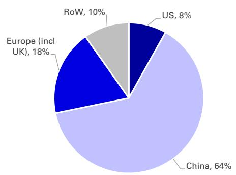  
Source : Bloomberg Finance LP

Figure 44:BYD is underperforming in China  
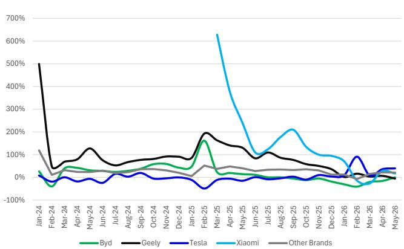  
Source : DB, CAAM

Figure 45: Still expect China EV growth in '26  
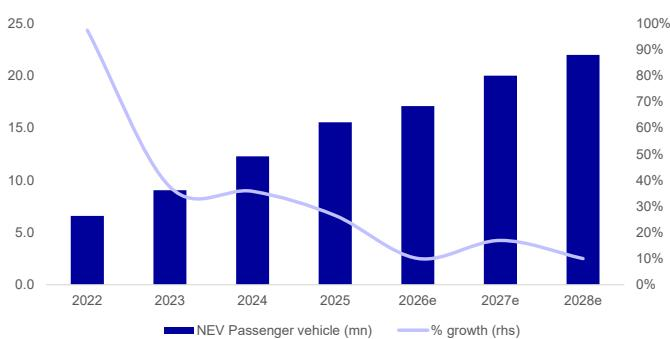  
Source : DB, CAAM

Figure 46: China EV growth recovering from bottom in Feb'26  
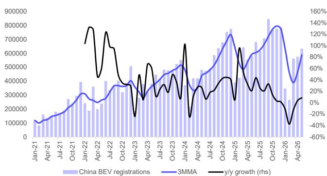  
Source : DB, Bloomberg Finance LP

Figure 47: European EV momentum remains strong  
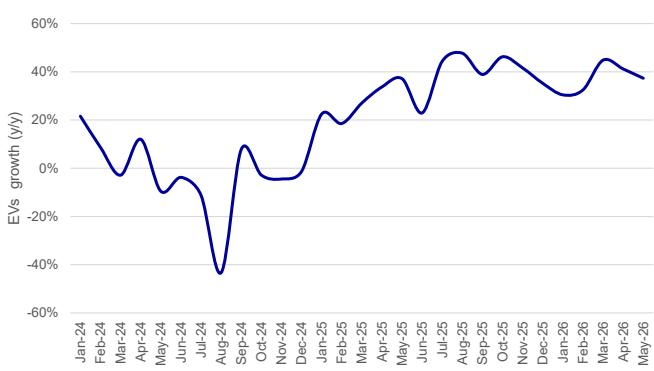  
Source : DB, KBA, CCFA, SMMT, ANFAC, ANIACAM (Europe top 5 countries monthly aggregate BEV and PHEV)

Figure 48: US EV momentum dropping after subsidy cuts in October but recovered recently  
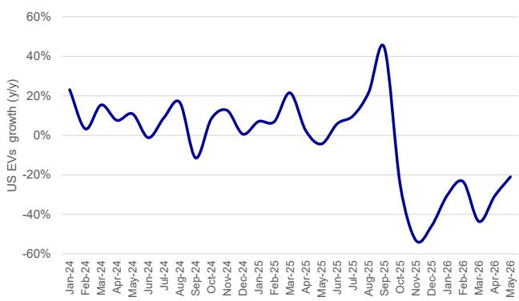  
Source : Omdia(US monthly aggregate BEV and PHEV growth y/y)

## Global EV sales volume statistics and forecast (units)

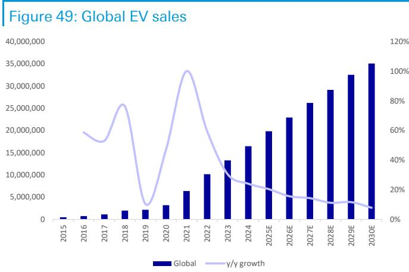  
Source : Bloomberg Finance LP

Figure 50: US EV sales  
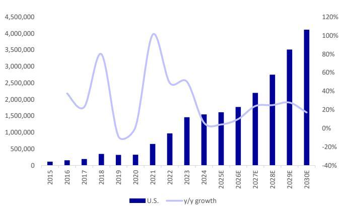  
Source : Bloomberg Finance LP

Figure 51: Europe (incl. UK) EV sales  
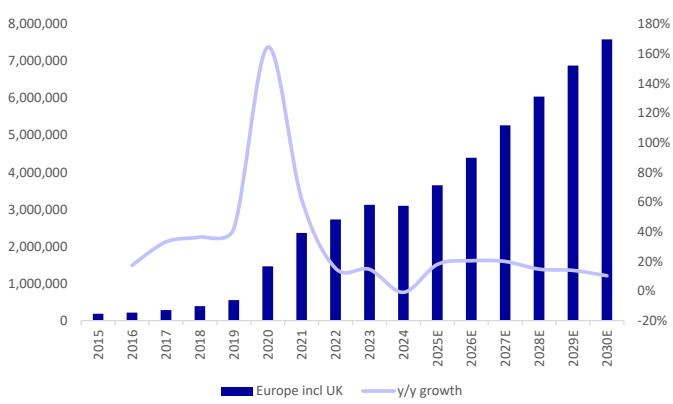  
Source : Bloomberg Finance LP

Figure 52: China EV sales  
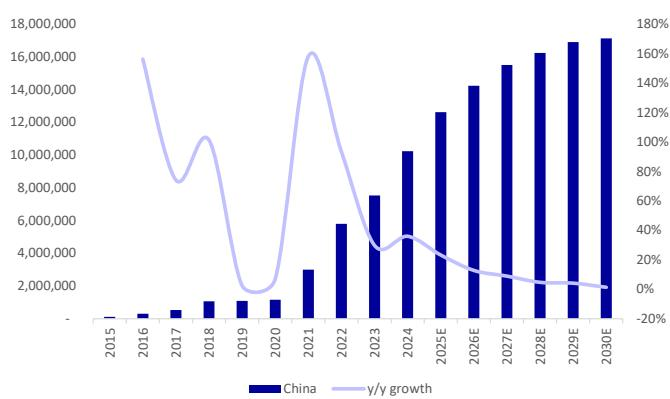  
Source : Bloomberg Finance LP

Figure 53: Japan, S/Korea, Australia EV sales  
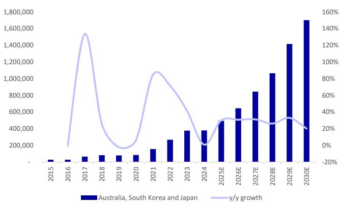  
Source : Bloomberg Finance LP

Figure 54: Rest of the World EV sales  
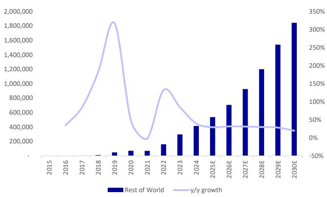  
Source : Bloomberg Finance LP

## Auto production and demand trends

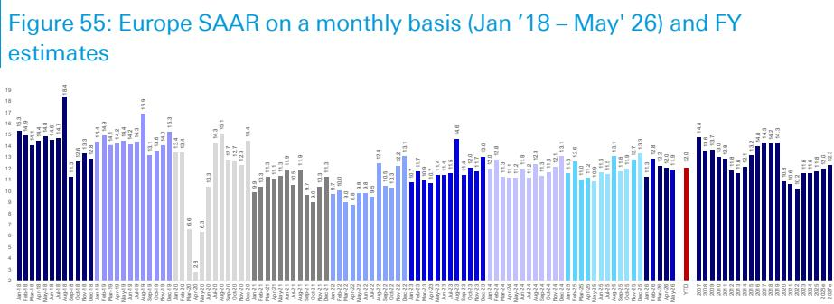  
Source : DB, LMC Automotive

Figure 56: Europe SAAR on a quarterly basis (Q1/09 – Q1/26) – in m units  
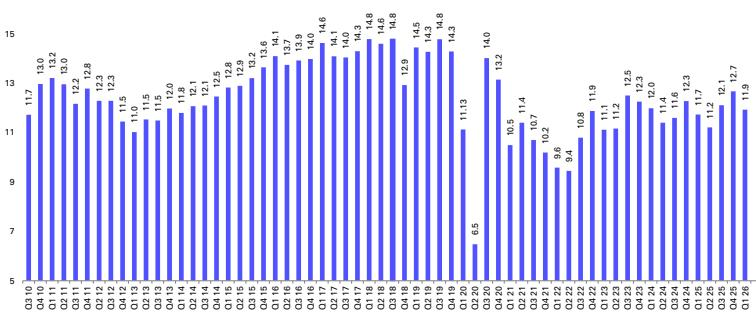  
Source : DB, LMC Automotive

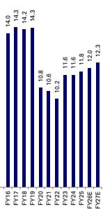

Figure 57: European car sales outperformed production in Q1/26  
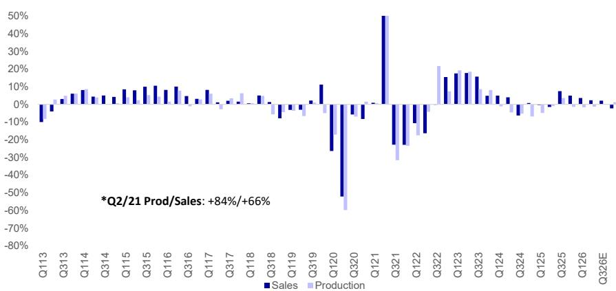  
Source : Company data, DB Estimates, LMC Automotive

Figure 58: US sales and production both declined in Q1/26 and Q4/25  
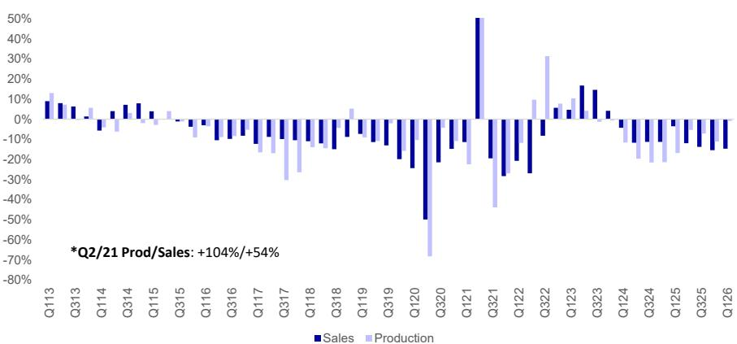  
Source : DB & BEA

Figure 59: China car production and sales softened in Q1/26  
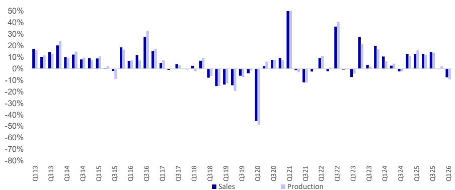  
Source : Bloomberg Finance LP

## Auto supplier inventories are moderating

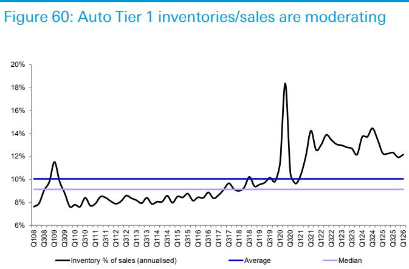  
Source : Company data, Bloomberg Finance LP

Figure 61: Auto Tier 1 inventories (aggregated and indexed in Q1/08) also declined from peak  
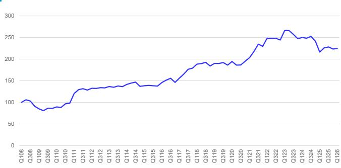  
Source : Company data and Bloomberg Finance LP

## DB global car production forecast: Auto production is expected to remain largely flat in 2026e, but make a mild recovery in 2027e

Figure 62: Global car production trends 2015-27e

<table><tr><td>Regions</td><td>2015</td><td>2016</td><td>2017</td><td>2018</td><td>2019</td><td>2020</td><td>2021</td><td>2022</td><td>2023</td><td>2024</td><td>2025</td><td>2026E</td><td>2027E</td></tr><tr><td>North America</td><td>17,496</td><td>17,824</td><td>17,065</td><td>16,959</td><td>16,314</td><td>13,024</td><td>13,047</td><td>14,298</td><td>15,643</td><td>15,553</td><td>15,267</td><td>14,939</td><td>15,443</td></tr><tr><td>Europe</td><td
