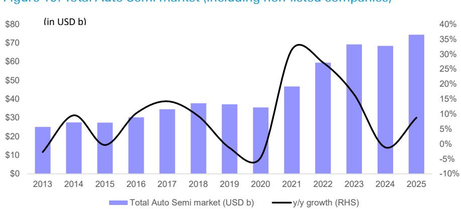

# DB：汽车芯片行业观察，结构性变化正在发生

汽车半导体行业正在经历一个被多数读者低估的转折。DB最新行业追踪报告指出，汽车芯片定价环境正在获得“进一步动能”——这不是简单的库存回补，而是一个由AI争夺产能、关键组件库存极低、以及单车内容持续增长三重力量叠加的结构性变化。报告判断，汽车半导体市场今年有望重回超过10%的增长，并将在2027年进一步加速。

这一判断的特别之处在于：它发生在整车终端市场仍然好坏参半的背景下。换言之，汽车芯片的增长不再是“跟着汽车销量走”，而是被供给侧的约束和需求侧的内容升级所驱动。

> **KC评论：** 过去三年汽车芯片行业的主要叙事是“去库存”和“价格调整”。DB的这份报告等于在说：调整阶段已经过去，而且接下来的复苏不是温和反弹，而是可能伴随价格变化。这对整个产业链的利润分配有直接影响。

## 1. 库存周期反转：从“去库存”到“补库存”，且伴随“供应紧张”担忧

报告最核心的变化信号来自库存行为。DB的数据显示，一级汽车供应商的库存金额在2026年第一季度环比小幅上升，库存占销售比例从上一季度的约12%升至12.2%。更重要的是，行业交流中已经出现对“分配”和“关键组件”再次短缺的担忧——这种语言在2021-2022年的芯片扰动中曾频繁出现。

报告认为，整个供应链的汽车芯片去库存已在过去几个季度基本完成。第二季度预计收入环比增长5%，远高于五年平均的3%，这被解读为补库存周期的开端，并将持续到下半年。

> **KC评论：** “关键组件”是汽车行业对那种缺少它整车就无法下线的单一关键元件的俗称。当行业开始担心这个，说明供需紧张已经从个别品类蔓延到系统层面。报告的图表和逐季增长数据值得仔细看，特别是不同公司之间的分化。

## 2. AI正在“影响”汽车芯片的产能，这是定价改善的隐形推手

一个容易被忽视的变量是AI数据中心对半导体产能的争夺。报告明确指出，AI驱动的芯片需求正在产生“溢出效应”，影响中压功率MOSFET、NOR闪存等汽车关键组件。更高电压的功率半导体用于电动汽车动力系统的情况虽然目前仍处于光谱的另一端，但到2027年，AI数据中心的需求（如固态断路器、固态变压器和800V架构）也将成为推动力。

这意味着汽车芯片的定价改善并非孤立事件，而是整个半导体行业“AI优先”资源配置下的副产品。当台积电、英飞凌等代工厂和IDM将更多产能分配给AI相关产品时，汽车芯片的供给弹性就会下降。

## 3. 单车内容增长才是长期引擎，但赢家分化正在加速

报告反复强调的一个判断是：汽车芯片的增长故事本质上是“内容增长”，而非“汽车销量增长”。软件定义汽车、ADAS以及电动汽车（尤其在欧洲）正在推动每辆车搭载的芯片价值持续上升。

这一点在管理层的评论中得到印证。NXP表示其汽车业务在Q1增长10%，Q2指引同比高十几个百分点，并强调“这不是一个关于汽车销量增长的故事，而是关于架构转型推动内容增长的故事”。德州仪器也指出，汽车内容的长期增长趋势“在可预见的未来将持续”。

但报告中的市场份额数据揭示了另一面：赢家正在分化。英飞凌、NXP和onsemi在多个产品类别中占据领先地位，而瑞萨则表现相对落后。Mobileye的收入趋势依然波动。这些差异背后，是不同公司在ADAS、功率半导体和微控制器等细分赛道上的竞争结果。

## 4. 报告尚未完全回答的问题：价格变化能否持续转化为利润

DB的报告对行业前景给出了明确的乐观信号，但一个关键问题并未完全展开：定价改善和收入增长能否顺利转化为利润率提升？

报告承认，许多参与者的利润率今年仍然“有些仍在调整”，并认为运营杠杆的释放需要更好的产能利用率和定价。但这里存在一个隐含假设——即AI对产能的挤压不会导致汽车芯片的成本上升过快，且整车厂愿意接受价格变化。如果终端汽车需求在2027年出现意外走弱，整个逻辑链条可能面临不确定性。

对于读者和产业决策者而言，这份报告提供了一个清晰的观察框架：盯住库存水平的变化、AI产能分配对汽车芯片供给的影响，以及不同公司在新一代汽车架构中的内容获取能力。这三个变量将决定下一个周期中谁是真正的赢家。

For informational purposes only. Portions may be generated,translated,summarized,or edited with AI assistance based on source materials and may contain omissions or errors. Please verify independently. This is not investment,legal,tax,accounting,or other professional advice.

For informational purposes only. Portions may be generated,translated,summarized,or edited with AI assistance based on source materials and may contain omissions or errors. Please verify independently. This is not investment,legal,tax,accounting,or other professional advice.

