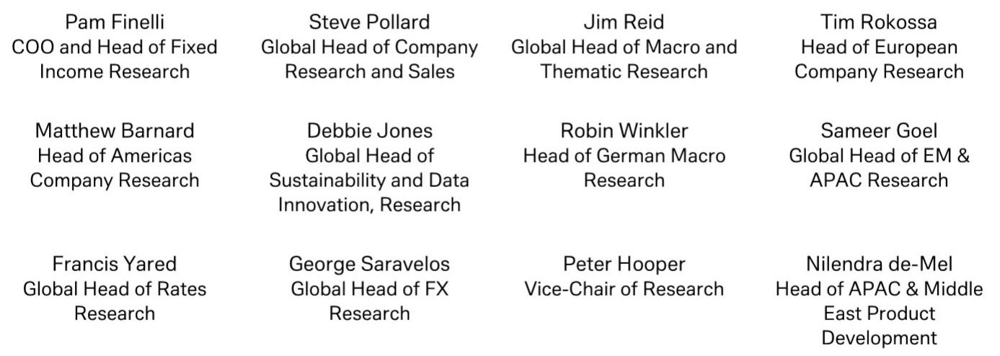
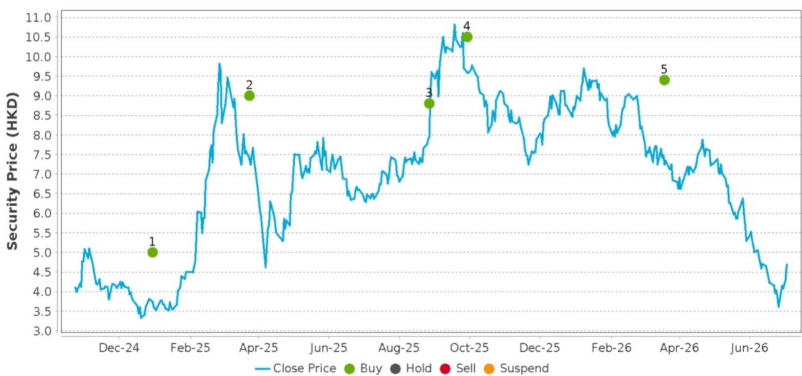
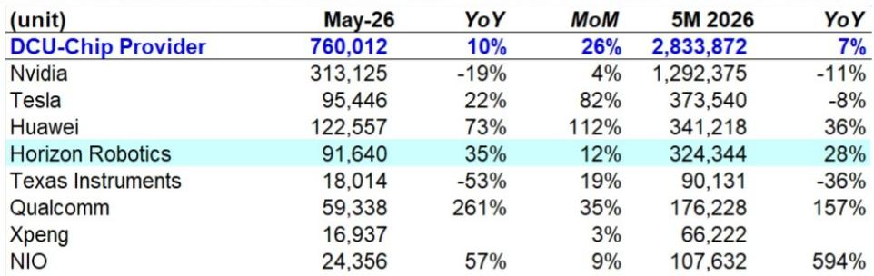

# DB：中国自动驾驶芯片格局生变，地平线如何从英伟达手中抢下份额

中国自动驾驶SoC市场在2026年5月交出了一份值得细读的成绩单。整体出货量同比增长10%，但更值得关注的不是总量，而是结构。DB最新研报显示，当月高阶自动驾驶系统（L2+/L3）渗透率已逼近47.3%，同比跳升19.1个百分点。这意味着每两辆新车中，就有一辆搭载了具备导航辅助驾驶能力的芯片。

在这个快速膨胀的市场里，地平线交出了35%的同比增长，出货量达到9.16万颗，稳居国内第四。但真正有意思的信号藏在两个数据里：一是它正在从英伟达的阴影中抢份额，二是它在传统ADAS前视摄像头芯片领域的调整，恰恰为新一代架构的切换腾出了空间。

## 1. 英伟达份额下滑，地平线成为高端替代的第一受益者

英伟达5月出货量同比下滑19%，市场份额从一年前的55.8%降至41.2%。这不是偶然波动，而是连续数月的趋势。原因不难理解：中国车企在高端智驾方案上开始追求性价比和供应链安全，不再唯英伟达Orin一家独大。

地平线在这轮替代中吃到了最大红利。其市场份额从去年同期的9.8%提升至12.1%，5个月累计出货32.4万颗，同比增长28%。这个增速不仅跑赢了市场整体，也明显快于华为和特斯拉——后两者虽然同比增速更高，但基数效应和客户结构不同。

> **KC评论：** 地平线正在从“英伟达替代”的叙事切换到“自主架构升级”的叙事。5月出货数据只是结果，真正的看点在于HSD 2.0发布后，它能否把芯片出货量转化为更高价值的系统级方案收入。研报中关于“世界模型+强化学习”双引擎架构的描述值得细读，这是目前国内相对少见明确从端到端转向双引擎架构的智驾方案。

## 2. ADAS前视芯片下滑不可怕，这是主动的战略调整

地平线在ADAS前视摄像头芯片领域5月出货6.38万颗，同比下滑11%，市场份额12.7%。乍看之下，这与主芯片的强劲增长形成反差。但仔细看数据会发现，整个前视芯片市场5月同比调整了31%，Mobileye和瑞萨分别下滑36%和44%。

这不是地平线独有的问题，而是整个行业在经历技术路线的切换。传统前视芯片主要服务于L1-L2级别的基础功能，而随着高阶智驾渗透率突破47%，越来越多的车企直接把算力需求升级到主芯片层面，不再单独采购前视芯片。地平线在前视领域的调整，恰恰说明它的客户正在向更高阶方案迁移。

## 3. HSD 2.0是真正的变量，但报告没有完全回答规模化的挑战

地平线在6月发布了第二代全场景智驾系统HSD 2.0，最大变化是从单阶段端到端架构转向“世界模型+强化学习”双引擎框架。这个架构设计的核心价值在于：世界模型通过真实驾驶数据训练，可以动态预测未来交通状态，实现类人防御性驾驶；强化学习则保证系统能持续自我迭代。

但研报没有完全展开一个关键问题：这套架构对Journey 6P芯片的算力利用率到底提升了多少？双引擎架构意味着更高的计算复杂度，如果不能在芯片层面实现高效部署，理论优势就很难转化为量产体验。地平线在工具链优化上做了持续投入，但实际效果需要等搭载HSD 2.0的车型上市后才能验证。

## 4. 读者需要盯住两个跟踪指标

第一个是月度出货量结构。如果未来3-6个月，地平线的SoC出货量增速持续高于行业平均，同时ADAS前视芯片的调整速度节奏变化甚至企稳，说明它的客户正在从“部分替代”走向“全面替代”。第二个是HSD 2.0的定点客户数量和车型节奏。目前国内能够提供完整智驾系统级方案的公司屈指可数，地平线如果能拿下2-3个头部车企的定点，其商业模式将从卖芯片切换到卖方案，估值逻辑也会随之重塑。

> **KC评论：** 报告中最有价值的信息是渗透率数据——47.3%的高阶智驾渗透率意味着市场已经过了早期采用者阶段，进入主流普及期。在这个阶段，竞争将从“谁的算力更高”转向“谁的方案能更快量产、成本更低、体验更稳定”。地平线的双引擎架构和Journey 6P芯片组合，理论上恰好卡在这个需求点上。但报告没有给出HSD 2.0的具体量产时间表和成本结构，这些信息需要从后续的定点公告和财报中寻找。

For informational purposes only. Portions may be generated,translated,summarized,or edited with AI assistance based on source materials and may contain omissions or errors. Please verify independently. This is not investment,legal,tax,accounting,or other professional advice.

For informational purposes only. Portions may be generated,translated,summarized,or edited with AI assistance based on source materials and may contain omissions or errors. Please verify independently. This is not investment,legal,tax,accounting,or other professional advice.

