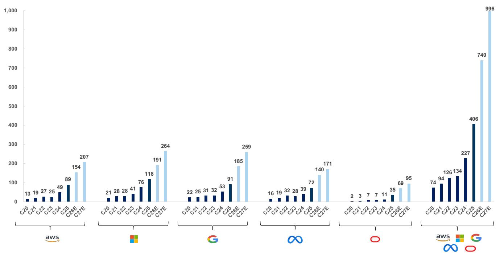
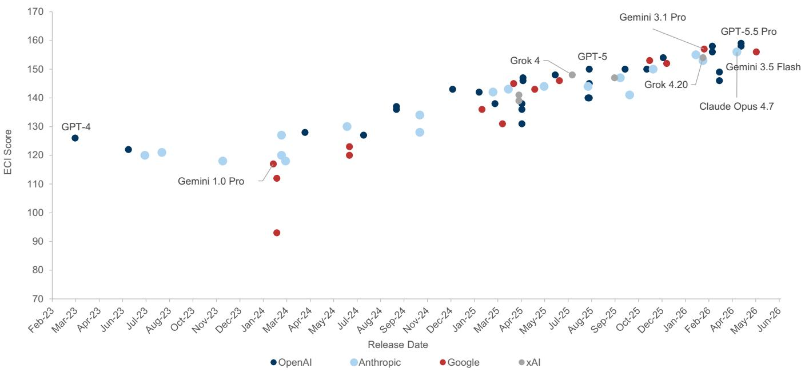
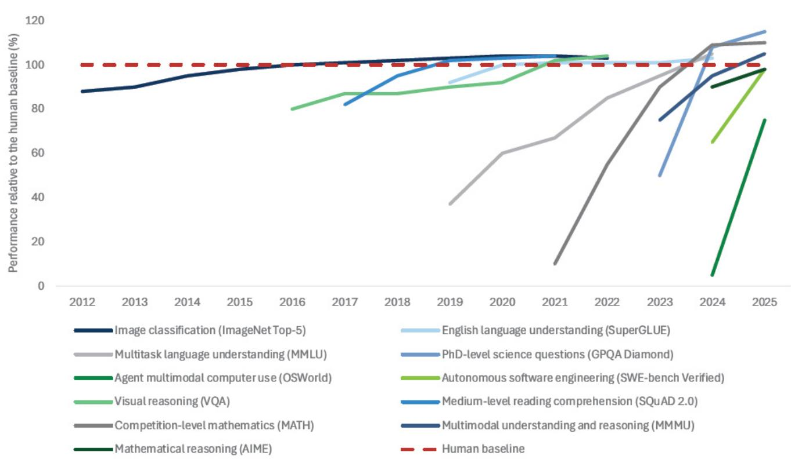
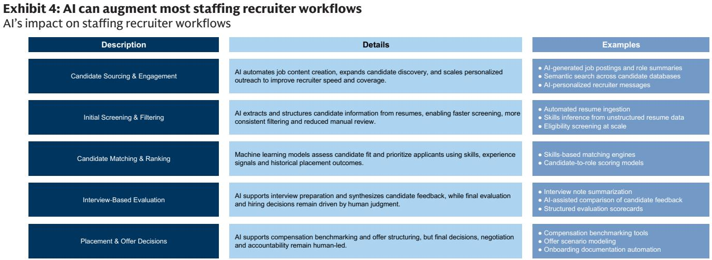
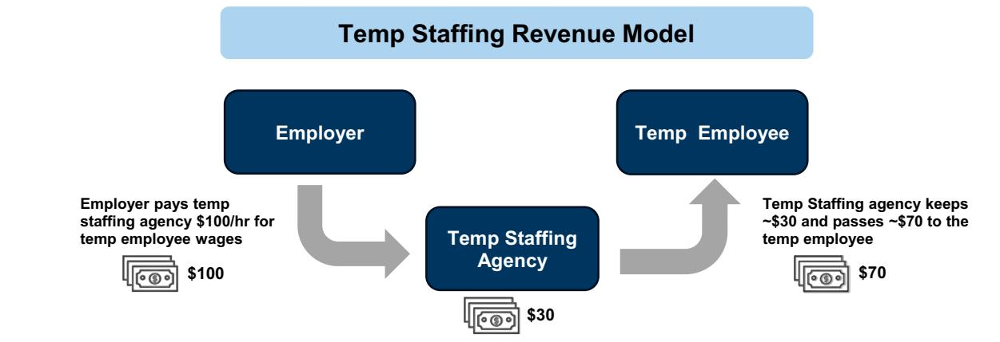
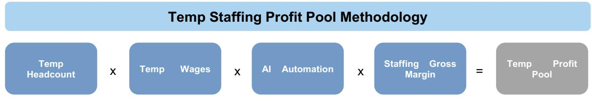
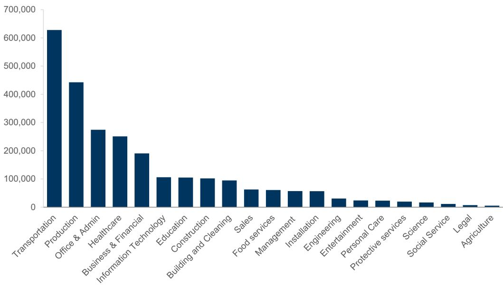
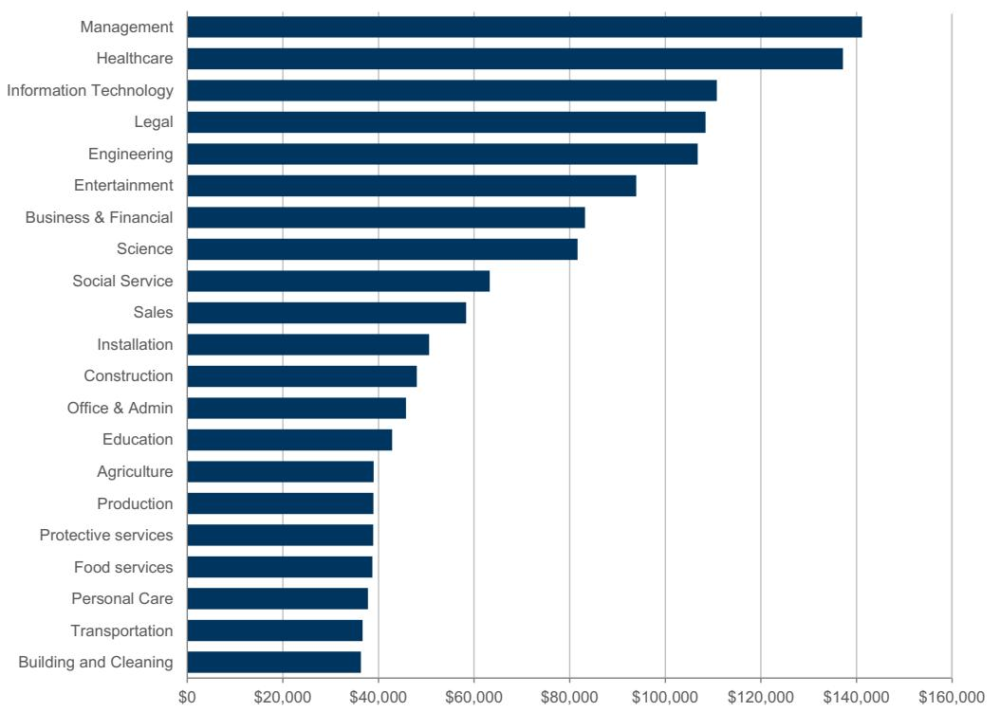
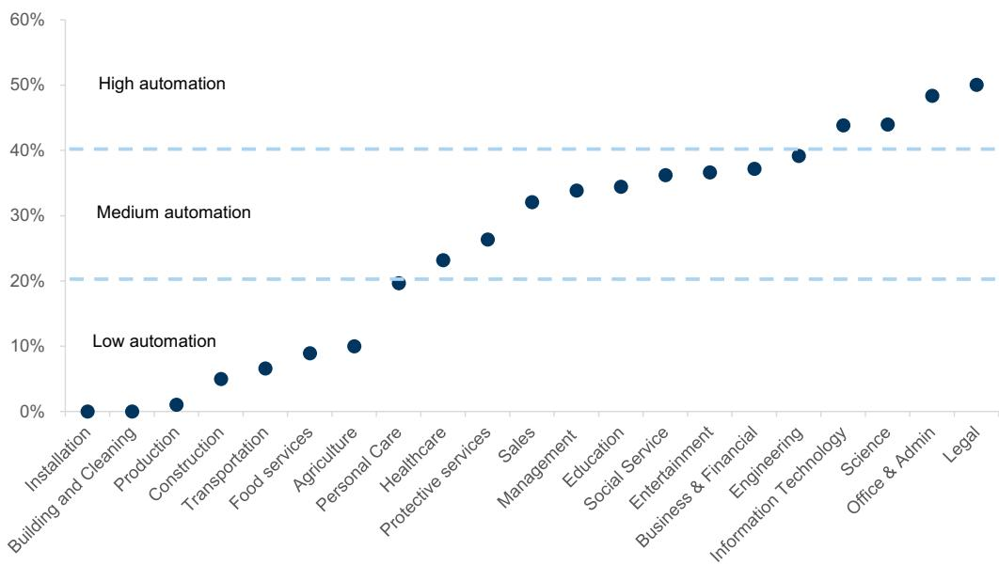

AMERICAS TECHNOLOGY

## Analyzing the Impact of AI on Industry Profit Pools - Part III (Staffing Case Study)

AI investment is entering a phase where hyperscaler capex approaching ~$1tn by 2027E requires a clearer link between infrastructure spend and profit pool capture. We use staffing as a case study to provide a measurable lens into how AI reallocates enterprise spend away from human-driven intermediation and toward technology platforms. Our framework identifies a demand-side impact, where AI-driven hiring demand compression exposes ~$10bn of temp, ~$41bn of perm and ~$12bn of freelance profit pools, reflecting lower labor volume and hiring activity, part of which is reallocated to technology and the remainder accruing to enterprises and end users. Against this backdrop, we identify downstream monetization pools, including a ~$38bn recruiter workflow opportunity and a ~$17bn online marketplace opportunity as spend shifts from discovery toward matching, verification and hiring outcomes. Investment implications favor scaled platforms, integrated workflows and advisory models, while pressuring volume-driven staffing. Buy-rated beneficiaries include KFY, supported by its high-touch advisory model that is less sensitive to AI-driven workflow automation, alongside FVRR, UPWK and Recruit as marketplace models evolve. RHI is Sell given exposure to AI-sensitive white-collar staffing, while ZIP and MAN remain Neutral given mixed dynamics between innovation, AI-driven productivity and macro-sensitive hiring demand.

George K. Tong, CFA
+1(415)249-7421
|george.tong@gs.com
GS & Co. LLC

Aarshiya Sachdeva
+1(212)855-6184
aarshiya.sachdeva@gs.com
GS & Co. LLC

Eric Sheridan
+1(917)343-8683
eric.sheridan@gs.com
GS & Co. LLC

Achal Gupta
+1(332)245-7973
achal.gupta@gs.com
GS India SPL

Minami Munakata
+81(3)4587-9830
minami.munakata@gs.com
GS Japan Co., Ltd.

Haruki Kubota
+81(3)4587-4059
haruki.kubota@gs.com
GS Japan Co., Ltd.

Sami Nasir, CFA
+1(415)834-7967
sami.nasir@gs.com
GS & Co. LLC

Anna Wu
+1(415)249-7235
anna.wu@gs.com
GS & Co. LLC

Alex Lakritz
+1(415)249-7072
alex.lakritz@gs.com
GS & Co. LLC

GS does and seeks to do business with companies covered in its research reports. As a result, investors should be aware that the firm may have a conflict of interest that could affect the objectivity of this report. Investors should consider this report as only a single factor in making their investment decision. For Reg AC certification and other important disclosures, see the Disclosure Appendix, or go to www.gs.com/research/hedge.html. Analysts employed by non-US affiliates are not registered/qualified as research analysts with FINRA in the U.S.

Executive Summary 3
Hyperscaler Spend Requires Downstream Profit Pool Capture 7
Where Are We Now? The Current State of AI in the Staffing Industry 10
How AI Could Be Disruptive in the Staffing Industry 12
Existing Profit Pools That Could be Disrupted by AI 12
New “TAM Expansionary” Opportunities Enabled by AI 34
Where Value Accrues as AI Adoption Scales 36
Where Could We Be Wrong 40
How Can This Analysis Be Expanded 41
Investment Conclusions 42
Valuation and Risks 44
Rating and pricing information 45
Financial advisory disclosure 45
Logo disclosure 45
Disclosure Appendix 46

## Executive Summary

## ■ Hyperscaler capex requires monetizable downstream AI profit pools.

Hyperscaler AI investment has reached a scale that requires large downstream profit pool capture to justify returns. Combined hyperscaler capex across AWS, Microsoft, Google and Meta has moved from sub-$200bn in 2020 to ~$740bn in 2026E and approaches ~$1tn by 2027E, reflecting a broad-based infrastructure cycle across the major platforms. This spending is increasingly concentrated in AI infrastructure including compute, networking and datacenter capacity, with the magnitude of investment lifting the bar for durable revenue and profit conversion. Meanwhile, AI model capability continues to improve, with Epoch AI's Capabilities Index showing newer frontier models clustering in the 145-160 range versus earlier GPT-4-era models in the mid-120s. As models move from task augmentation toward multi-step workflow substitution, the range of disruptable profit pools expands from narrow productivity tools into broader labor and service-driven revenue pools. We analyze staffing as a case study because labor intermediation is large, measurable and directly exposed to AI-driven reallocation of work from people toward software, models and infrastructure.

AI adoption is broad, but labor displacement remains limited. AI usage across knowledge work has scaled rapidly, with ~75% of global knowledge workers regularly using AI tools and ~84% of developers using or planning to use AI tools, including ~51% using them daily. Despite this adoption, AI remains primarily assistive rather than fully substitutive, with most workflows still requiring oversight, validation, compliance judgment and client interaction. Staffing demand therefore remains largely intact today across many professional and financial functions, where AI can automate elements such as reconciliation or documentation but has not yet replaced end-to-end work. Within staffing itself, adoption is more visible in recruiter workflows, where AI is increasingly embedded in high-volume, standardized and repeatable stages of execution. Manpower's PowerSuite case study illustrates this shift, with ~90% of front-office activity supported, ~100bn data points in the global data layer, 25k+ AI-led interviews, a ~67% screening time reduction and a ~7% increase in placement rates as tools expand. This suggests AI is currently reshaping how recruiting work is executed before it structurally replaces recruiter roles.

AI disrupts staffing by shifting economics from labor intermediation toward technology-enabled execution. As AI automates a growing share of enterprise work, the need for incremental labor declines, reducing demand for temporary workers, permanent hires and contingent labor. This disruption is not primarily the elimination of entire roles, but the reduction in labor volume required to produce the same output, which pressures billed labor volumes in temp staffing and placement events in perm and freelance models. Accounting represents an example, where AI-enabled reconciliation, reporting and workflow automation can reduce the need for temporary accountants during peak periods and limit new permanent placements. A portion of avoided labor cost is then reallocated toward AI tools and infrastructure, although some value can be retained by enterprises and end users through margins or pricing. AI also creates an offset by improving recruiter

throughput, as integrated workflows translate role requirements into structured inputs, prioritize candidate pipelines and automate coordination across stakeholders. The net effect is a dual mechanism: staffing profit pools tied to hiring activity come under pressure while recruiter productivity and software monetization expand.

\- Temp staffing profit pool is sized through labor volume, wage intensity, automation exposure and staffing spread. The temp staffing model is driven by bill-pay spread economics, where staffing firms capture the difference between client bill rates and wages paid to workers. We size the temp staffing profit pool by starting with BLS temp headcount and wage data by job function, applying GS Macro task-level automation assumptions mapped to BLS sub-functions, then applying segment-specific staffing gross margins across white-collar and blue-collar roles. This approach converts labor scale, wage intensity, task exposure and spread capture into a function-level view of profitability. We size the temp staffing profit pool at ~$10bn, concentrated in office & admin at ~$1.9bn, business & financial at ~$1.9bn, IT at ~$1.6bn and healthcare at ~$1.6bn. These categories combine meaningful employment bases, higher wages, 30-50% automation exposure and structurally higher 30%+ margins. In contrast, large blue-collar categories such as transportation contribute less to the exposed profit pool despite scale, given lower margins and lower automation exposure.

Perm placement profit pool is transaction-driven, with hiring events and compensation replacing temp spread economics. Perm placement differs from temp because revenue is tied to discrete hiring outcomes, with staffing firms earning a one-time fee typically structured as 30-35% of first-year compensation. Our methodology starts with BLS employment and wage data by function, applies GS Macro task-level automation assumptions to estimate reduced hiring demand, introduces a hiring rate to convert the adjusted labor base into annual placement volumes and then applies the placement fee. This differs from temp because perm monetizes hiring events rather than ongoing labor volumes, making hiring rate a critical throughput variable. The hiring rate was 3.3% as of May 2026 vs a 3.7% long-term average since 2001, and we use hiring rates to link labor demand compression to fee-generating placement activity. We size the perm staffing profit pool at ~$41bn, led by management at ~$10.8bn and healthcare at ~$5.4bn, followed by business & financial, office & admin and IT. Higher-skill roles contribute disproportionately because fees scale with compensation, while lower-wage categories such as transportation and food services contribute less despite large employment bases.

\- Freelance profit pool reflects demand compression and mix-driven exposure to AI automation. We size the freelance profit pool at ~$12bn by starting with global platform-mediated GSV and applying a blended take rate alongside GS Macro task-level automation assumptions to translate activity into AI-exposed revenue. This approach mirrors temp and perm by mapping an underlying economic base into a function-level view of profit pools, with GSV substituting for wages and take rate for spread or fees. Within this framework, AI impacts freelance through both volume compression in low-value highly automatable tasks and mix shifts toward

higher-value complex and AI-related work. Automation exposure varies by category based on task structure, with rules-based and information-intensive segments carrying higher exposure and creative or judgment-driven work remaining more resilient. As a result, profit pool impact is concentrated in categories that combine scale, monetization and exposure, including software development, design, data and writing.

\- Recruiting services create a ~$38bn US AI-addressable workflow monetization pool. We frame recruiting services as a revenue-derived profit pool generated by recruiter-driven placement activity across temp, perm and freelance hiring. Using US 2027E TAM of ~$270bn for temp staffing and ~$45bn for perm placements, we convert temp revenue into a recruiter execution layer using a blended ~24% gross margin while treating perm placement revenue as fee-based monetization of recruiting activity. This yields a combined ~$109bn execution-layer pool spanning temp spreads and perm fees generated by recruiter workflows. Applying a 35% task-level automation assumption produces an AI-addressable recruiter profit pool of ~$38bn, representing gross workflow monetization and not demand-side hiring compression, which is incorporated separately. RPO is an important subset, with the US RPO market estimated at ~$6bn in 2027E, representing a low-single-digit share of total staffing TAM and roughly low-teens penetration of the ~$109bn execution layer. Because RPO centralizes standardized, data-intensive and enterprise-scale recruiting activity, it serves as a leading indicator of where AI-enabled workflow monetization can emerge first.

Online job advertising shifts from discovery monetization toward AI-enabled matching and workflow outcomes. The global online job advertising market is projected by SIA to reach $37.6bn in 2026, up 7% from $35.2bn in 2025, with the top two players holding ~50% market share versus ~25% in 2015. LinkedIn and Indeed lead the market with ~29.2% and ~20.6% share, respectively, while legacy job boards and localized classifieds remain fragmented. AI changes the value proposition by shifting spend away from posting, clicks and traffic toward matching, verification, screening and hiring outcomes. We size the online job advertising and recruitment marketing profit pool at ~$17bn by segmenting the $37.6bn market into traditional job boards at 45% share, professional networks at 35% and programmatic software at 20%, then applying AI automation assumptions of 70%, 35% and 10%, respectively. Indeed illustrates the scaled platform response, with Premium Sponsored Job using AI to recommend candidates, retention 20% higher than Standard tier and US ARPJ rising 25% y/y in 4Q FY3/26 despite US job posting volume declining 7% y/y. ZipRecruiter is also investing in AI-enabled matching through Smart Outreach, ZipIntro, Phil and a ChatGPT app, although its smaller scale limits the immediate profit pool impact.

AI expands staffing TAM through new hiring demand, wage premium and recruiter throughput. We offset the disruption thesis with AI-enabled TAM expansion, as AI-related job postings have grown at a ~29% annual rate over 15 years versus ~11% for the broader labor market. More than 80k US job postings referenced generative AI skills in 2025, up from ~3.8k in 2010, and more than 50% of roles requiring AI skills now sit outside traditional IT and computer science. AI roles

also carry a ~28% salary premium, or roughly ~$18k higher annual pay on average, supporting higher staffing monetization because placement fees scale with compensation. Supply is increasing through education channels, with ~193 undergraduate and ~310 master's AI-focused programs across ~304 US institutions as of 2025, and master's programs increasing 167% from 2022 to 2025. We size the current AI hiring TAM at $1-3bn, add $0.6-2.4bn from the graduate pipeline, apply a 1.25-1.75x adjacency multiplier and incorporate 20-30% recruiter productivity gains. This yields an estimated AI-related staffing TAM of ~$2-12bn, with a mid-case of ~$6bn.

Value accrues to workflow platforms, scaled marketplaces, technology layers and defensible advisory models. As AI adoption scales, value capture reflects both hiring demand compression and the shift from manual recruiting execution toward system-driven workflows. Our value transfer framework separates demand-side compression from workflow monetization, with hiring demand compression sized at ~$10bn for temp and ~$41bn for perm, AI workflow monetization at ~$38bn and online marketplace workflow opportunity at ~$17bn. Within the technology layer, value is split between model providers capturing compute and API usage and application platforms monetizing workflow integration through end-to-end hiring systems. Scaled platforms with proprietary data, closed-loop feedback and workflow control, including LinkedIn and Indeed, are better positioned as monetization shifts from discovery toward outcomes. Integrated staffing platforms such as MAN can defend economics through centralized systems and operational data, while KFY is relatively insulated through advisory-led executive search, consulting and digital offerings. RHI faces greater risk given its concentration in finance and accounting, technology and administrative/customer support end markets, where hiring demand is closely tied to incremental workload and AI-driven efficiency gains.

## ■ Key risks center on adoption, labor demand, automation ceilings and

monetization capture. Our sizing of staffing profit pools could be too aggressive if AI augments labor demand more than it compresses hiring volumes, with enterprises reinvesting productivity gains into incremental work instead of reducing headcount. Early adoption patterns still show AI increasing output per worker without structural labor displacement, which could sustain or even increase hiring volumes in some functions. Workflow integration could also take longer than modeled because current deployment remains more focused on discrete execution tasks than end-to-end orchestration, with data fragmentation, enterprise complexity and regulatory constraints slowing system-level adoption. Human oversight could limit automation penetration in higher-value segments where client interaction, candidate evaluation, compliance and accountability remain central to service delivery. Technology providers may also capture less economic value than our framework assumes if competition across hyperscalers, software vendors and open-source models compresses pricing. In that scenario, labor costs may decline but savings could accrue more to enterprises and end users than to AI providers, changing the distribution of profit pool reallocation.

■ Future work can improve timing, role-level precision and non-linear workflow effects. Our current framework treats labor demand reductions and recruiter productivity gains as partially offsetting forces, but integrated AI workflows could create dynamic feedback loops that compound over time. Modeling these feedback loops would help quantify scenarios where higher recruiter productivity accelerates placement efficiency and delays or offsets volume-driven disruption. The perm methodology currently applies a standardized hiring rate across functions, so adding role-level differentiation based on turnover, tenure and cyclicality would create a more granular view of placement fee exposure. The automation model also remains task-level, while workflow-level disruption could be non-linear if AI integrates sourcing, screening, matching and coordination into a single system. For example, a 20% task-level efficiency gain could translate into a 40-50% staffing volume reduction when multiple steps and handoffs are removed simultaneously. Additional refinements could incorporate pricing, placement fee compression, margin sensitivity, mix shifts, adoption curves and enterprise readiness by function.

Investment conclusions favor advisory-led and scaled platform models over exposed white-collar staffing. KFY, Buy, is positioned as a strategic beneficiary of long-term labor market change because executive search, consulting, digital and workforce transformation are less exposed to pure workflow automation and more tied to client advisory, senior talent access and organizational redesign. MAN, Neutral, has near-term support from improving European manufacturing, aerospace and defense demand, plus AI-enabled productivity through PowerSuite and a multi-year transformation program targeting $200mn in permanent cost savings by 2028, balanced by challenged Experis and Talent Solutions trends, gross margin pressure and geopolitical risk. RHI, Sell, faces longer-term AI risk because finance and accounting, technology and administrative/customer support overlap with white-collar categories where AI can reduce incremental hiring demand, while Protiviti weakness and negative estimate revisions add near-term pressure. FVRR, Buy, and UPWK, Buy, are beneficiaries of flexible work and AI demand, with Fiverr positioned for long-term freelance marketplace growth and Upwork seeing generative AI job posts up >1,000% and related searches up >1,500% in 2Q 2023 versus 4Q 2022. ZIP, Neutral, remains tied to macro-sensitive online recruiting demand but continues to invest in AI-driven matching and personalization through Smart Outreach, ZipIntro, Phil and its ChatGPT app. Recruit Holdings, Buy, benefits from Indeed's AI-driven candidate recommendations, faster hiring speed, positive ARPJ trajectory and proprietary data advantages, with management guiding US ARPJ growth of 18% y/y in FY3/27 and HR Technology EBITDA of ¥677bn.

## Hyperscaler Spend Requires Downstream Profit Pool Capture

Hyperscaler AI investment is unprecedented, requiring downstream profit pool capture to justify returns. Hyperscaler datacenter capex has scaled sharply across the major platforms, with AWS, Microsoft, Google and Meta all showing step-function increases from sub-$50bn annual levels earlier in the decade to triple-digit billion run-rates by 2026-2027. Exhibit 1 illustrates this acceleration, with combined capex rising from sub-$200bn in 2020 to ~$740bn in 2026 and approaching ~$1tn by 2027, reflecting a broad-based expansion across all major platforms. This ramp underscores a structural shift in technology spending, where investment is increasingly concentrated in AI infrastructure including compute, networking and datacenter capacity. Notably, capex growth is occurring across each hyperscaler simultaneously, reinforcing that this is an industry-wide buildout rather than a single-company cycle. The magnitude of investment is increasingly outpacing internally generated cash flows, with several companies turning to external financing to support continued expansion. As a result, the threshold for economic return has risen materially, with investors focused on how this infrastructure translates into durable revenue and profit streams. In our view, this requires the emergence or reallocation of large existing industry profit pools toward AI-enabled platforms, as productivity gains alone do not generate sufficient return without monetization. Against this backdrop, we analyze the staffing sector to assess how AI-driven reductions in labor demand can disrupt existing fee pools and redirect economic value toward technology, while also creating partial offset through TAM expansion as recruiters leverage AI to increase productivity, improve fill rates and scale placements, providing a pathway for hyperscalers to capture returns on their infrastructure investments.

Exhibit 1: Hyperscaler capex CY2020-27E  
  
Source: Company data, GS Global Investment Research

Advances in AI model capability expand the range of disruptable profit pools. The rapid progression in AI model performance, as captured by Epoch AI's Capabilities Index (ECI), highlights a clear upward trajectory in general-purpose capability across successive model releases. Early frontier models such as GPT-4 clustered in the mid-120s range, while newer 2025-2026 models including GPT-5, Gemini 3.1 Pro and GPT-5.5 Pro are now consistently scoring in the 145-160 range, with the leading edge approaching the high-150s. The ECI also shows increasing clustering at higher scores, suggesting not only improvement but convergence toward broadly capable systems across multiple providers. This progression reflects meaningful gains in reasoning, coding, math and language tasks, enabling stronger generalization beyond narrow

benchmarks. As capabilities improve, models are increasingly able to handle multi-step workflows rather than isolated tasks, expanding the scope of work that can be automated. This shift moves AI from task augmentation toward workflow-level substitution, increasing its ability to replicate functions that historically supported enterprise cost structures. As a result, the steady rise in model capability directly expands the portion of economic activity that can be addressed by AI, setting the foundation for disruption and reallocation of existing profit pools.

Exhibit 2: Select AI model performance on the Epoch Capabilities Index  
  
Source: Epoch AI

AI performance gains are broad-based across domains, but concentrated in digitally native tasks. The Stanford HAI AI Index shows that model improvements span a wide range of benchmarks, with several domains such as image classification, language understanding and visual reasoning reaching or exceeding human-level performance over time. Gains have accelerated notably since ~2020, particularly in more complex benchmarks including multitask language understanding, competition-level mathematics, multimodal reasoning and software-related tasks, indicating rapid progress in higher-order cognitive capabilities. Many of these newer benchmarks have moved from well below human performance to approaching or surpassing parity within a short time frame, underscoring the pace of advancement. That said, performance remains uneven, with some areas still lagging, particularly tasks requiring spatial interpretation or real-world reasoning, such as reading analog clocks. This divergence reflects that AI capability is advancing most quickly in structured, information-based domains where tasks are digitally represented and can be benchmarked consistently. Accordingly, near-term economic impact will likely be concentrated in functions tied to these digitally native workflows, shaping where adoption and downstream profit pool effects are most likely to emerge first.

Exhibit 3: Select AI Index technical performance benchmark vs. human performance  
  
Source: Stanford University Institute for Human-Centered AI, GS Global Investment Research

## Where Are We Now? The Current State of AI in the Staffing Industry

AI adoption is widespread in knowledge work, but real-world labor displacement remains limited. AI usage across knowledge work has scaled rapidly, with ~75% of global knowledge workers now using AI tools regularly, based on workplace analytics data from Worklytics, and ~84% of developers using or planning to use AI tools with ~51% using them daily, based on the 2025 Stack Overflow Developer Survey. Despite this high level of adoption, AI is primarily being used to assist with discrete tasks rather than fully replacing roles, with most workflows still requiring human oversight and validation. This is particularly evident in professional and financial roles such as accounting, where AI can automate elements like reconciliation or documentation but does not yet replicate end-to-end judgment, compliance and client interaction. As a result, demand for both staffing and recruiting services in these functions remains largely intact. In profit pool terms, current AI usage improves productivity per worker but has not yet resulted in a structural disruption in billed hours or placement volumes across core staffing categories.

AI is reshaping recruiter workflows by automating execution. The staffing industry is in an early but active phase of AI adoption, with deployment focused on embedding AI into how recruiting work is executed without replacing recruiter roles. Adoption is concentrated in stages characterized by high data volume, standardized inputs and repeatable processes, where tasks can be codified and executed within digital systems. In practice, AI is being applied across core recruiting workflows, including both

front-office execution and related administrative processes.  
  
Source: GS Global Investment Research

## Case study: Manpower embedding AI across recruiting workflows through PowerSuite

Manpower (MAN, Neutral-rated) has built a centralized global platform known as PowerSuite, which is an AI-enabled, end-to-end digital infrastructure that integrates front-office recruiting, sales workflows and back-office operations into a unified system, enabling standardized processes and data capture at scale. The platform supports approximately ~90% of front-office activity, with a majority of back-office processes also consolidated, and is underpinned by a global data layer of roughly ~100bn data points, enabling AI to be deployed directly within recruiter workflows. AI is embedded across multiple stages of the recruiting process, including candidate matching, pipeline prioritization and workflow management, with the platform serving as the system through which these capabilities are delivered and scaled.

At the front end, the company has deployed AI-powered screening through its global partnership with Hubert, which automates structured first-round interviews and ranks candidates based on standardized criteria. Over the past six months, the platform has completed 25k+ AI-led interviews, reducing screening time by approximately 67% and enabling 24/7 candidate engagement, with more than 60% of interviews completed outside traditional working hours and overall candidate satisfaction of ~87%. Structured evaluation improves match consistency and reduces bias by applying uniform criteria across candidates, accelerating time-to-shortlist and improving early visibility into qualified talent. These capabilities are already deployed across markets representing ~40% of global revenue, with plans to scale to ~70% by year-end.

Beyond screening, AI is being increasingly embedded across the broader workflow through partnerships such as Carv, which integrates agentic AI directly into recruiter systems to automate administrative tasks, update candidate data in real time, and coordinate recruiting stages. At the commercial layer, AI is also improving front-end opportunity selection, with the company's AI-driven sales targeting engine generating approximately ~$200mn of incremental revenue in initial deployments and scaling across markets. These capabilities are driving measurable improvements across the model, including a ~7% increase in placement rates as AI tools expand, while enabling higher throughput with fewer manual touchpoints. AI handles high-volume execution tasks while recruiters retain ownership of evaluation, client interaction and final hiring decisions, reinforcing a model where automation is concentrated in repeatable steps while judgment remains human-led.

## How AI Could Be Disruptive in the Staffing Industry

AI disrupts staffing profit pools by transferring economic value from labor intermediation to technology providers. As AI automates a growing share of work within enterprises, the need for incremental labor declines, directly reducing demand for temporary workers, full-time hires and contingent labor. This impact is not driven by the elimination of entire roles, but by a reduction in the volume of work requiring human input, lowering both billed hours in temp staffing and placement events in perm and freelance models. For example, as accounting teams deploy AI to handle reconciliation, reporting and workflow automation, fewer incremental hires are required during peak periods, reducing demand for temporary accountants and limiting new permanent placements. We expect enterprises to reallocate a portion of these avoided labor costs toward AI tools and infrastructure that deliver the same output, shifting spend from labor budgets to technology budgets. This results in a transfer of economics, where staffing profit pools tied to hiring activity are disrupted as AI-enabled solutions capture a growing share of enterprise spending.

AI-driven productivity gains partially offset staffing profit pool pressure by increasing recruiter throughput. Future capabilities extend beyond task automation into integrated execution, where AI enables continuous, system-coordinated workflows that translate role requirements into structured inputs, prioritize candidate pipelines and automate coordination across stakeholders. These capabilities reduce manual handoffs, standardize inputs and shorten cycle times, directly enabling higher candidate throughput and more consistent matching.

Exhibit 5: AI enhances productivity efficiency
Recruiter workflows

<table><tr><td>Workflow</td><td>Current State</td><td>AI-enabled Future</td><td>Impact</td></tr><tr><td>Role intake and requisition setup</td><td>Recruiter and hiring manager define role requirements, screening criteria, and job specifications through manual calibration</td><td>AI translates role needs into structured requirements, generates role variants by channel, and updates screening criteria dynamically as pipeline data evolves</td><td>Faster role setup and greater standardization across requisitions</td></tr><tr><td>Sourcing, screening, and matching</td><td>Discrete steps handled through manual search, rule-based filtering, and recruiter-led shortlisting, with frequent handoffs across tools</td><td>AI orchestrates continuous sourcing, automated screening, and ranked shortlists in a single integrated workflow</td><td>Reduced handoffs and higher candidate throughput per recruiter</td></tr><tr><td>Interview coordination and evaluation support</td><td>Scheduling, interview prep, and feedback collection are time-intensive and inconsistently structured across stakeholders</td><td>AI automates scheduling, generates structured interview guides, synthesizes feedback, and highlights candidate differentiation</td><td>Shorter cycle times and more consistent evaluation inputs</td></tr><tr><td>Placement and offer process</td><td>Recruiter-led benchmarking, negotiation, and documentation, with outcomes shaped by relationship management and judgment</td><td>AI supports benchmarking, offer scenario modeling, and documentation automation, while decision authority remains human-led</td><td>Faster execution with decision accountability preserved</td></tr><tr><td>Post-placement feedback loop</td><td>Limited systematic learning from placement outcomes, with insights captured informally across teams</td><td>AI captures outcome data, monitors early risk signals, and feeds learnings back into sourcing and matching models</td><td>Creation of compounding feedback loops that improve performance over time</td></tr></table>

Source: GS Global Investment Research

## Existing Profit Pools That Could be Disrupted by AI

## Temp Staffing Profit Pool

Temp staffing economics are driven by a bill-pay spread tied to labor volumes. Temp staffing firms generate revenue by placing workers and earning the difference between the bill rate charged to clients and the wage paid to workers, making billed labor volumes the primary driver of revenue and gross profit. The spread compensates firms

for sourcing, screening and administrative services, but the absolute profit pool is ultimately a function of aggregate placement volumes across the economy. This creates a direct link between hiring intensity and staffing economics, where fewer workers or lower utilization translate into less labor volume demand hours and reduced fee generation. As AI adoption reduces the need for incremental labor in repeatable functions, the model experiences volume pressure through declining labor volumes. Importantly, this dynamic sets up a transfer mechanism, where foregone labor spend is increasingly reallocated toward AI-enabled solutions that deliver equivalent output. Over time, this shifts economic value away from hour-based staffing models and toward technology providers capturing that spend.

Temp staffing profit pool methodology converts labor volumes into captured spreads. We size the temp staffing profit pool by starting with the underlying wage base at the role level, using BLS data on temp employment by job function and corresponding wages to construct total compensation. We then apply GS Macro task-level automation assumptions mapped to BLS sub-functions to translate task exposure into reduced labor demand and reduced labor volume demand. This step directly links AI-driven productivity gains to changes in staffing volumes, the primary economic driver of the model. We next apply segment-specific gross margins across white-collar and blue-collar roles to estimate the share of wage spend captured as staffing gross profit. This isolates intermediary economics from the broader labor pool and aligns outputs with observed industry margins. The framework therefore ties labor scale, wage intensity, task exposure and spread capture into a function-level view of the temp staffing profit pool.

Exhibit 6: Temp staffings agencies take ~30% of compensation as fees
Temp staffing revenue model and profit pool methodology  

  
Source: GS Global Investment Research

Temp staffing concentration reflects where demand sits today, not where disruption will occur. The temp workforce is heavily concentrated in high-volume roles, with approximately 65% of the ~2.5mn workers in blue-collar functions such as

transportation (~625k) and production (~440k). This concentration highlights that a large portion of staffing activity is tied to roles characterized by physical execution, variability and lower digital penetration, which are less directly affected by near-term AI automation. In contrast, white-collar segments such as office & admin (~275k) and healthcare (~250k) represent smaller shares of headcount but align more closely with standardized, information-driven workflows where automation potential is higher. Beyond these core categories, temp workers are distributed across a fragmented middle tier including business & financial, IT, education and construction roles, where task complexity and exposure to AI vary.

Exhibit 7: ~65% of temp workers are in blue-collar industries and ~35% in white collar Temp worker headcount by job function  
  
Source: US Bureau of Labor Statistics

Wage dispersion defines how temp staffing profit pools scale across functions. Average temp wages of roughly ~$70k mask a wide dispersion across roles, with management (~$140k), healthcare (~$135k), IT (~$110k) and legal (~$105k) at the high end, while high-volume blue-collar roles such as transportation, production and building & cleaning cluster closer to $35-40k. This distribution is central to profit pool formation, as higher-wage roles generate larger dollar spreads per hour even at lower volumes, while lower-wage roles contribute primarily through scale. To incorporate AI automation, we apply GS Macro task-level assumptions to BLS sub-functions, aggregating underlying task composition into function-level exposure estimates that capture where work is rules-based and digitally executable. This allows us to link wage intensity with automation exposure, such that high-compensation, information-driven functions carry greater profit pool risk on a per-worker basis, while lower-wage roles remain more sensitive to changes in labor volume demand.

Exhibit 8: Average wage for temp workers is ~$70k
Wages by temp job function  
  
Source: US Bureau of Labor Statistics

Automation translates task exposure into staffing profit pool shifts. We model AI impact at the task level to capture how reductions in labor input translate into changes in staffing economics and the reallocation of profit pools. GS Macro estimates of automatable task share are applied to each occupation, using O*NET data to map task composition and identify where work is structured, repeatable and digitally executable. This links automation exposure to the portion of labor demand that can be substituted, directly connecting to staffing volumes. Exposure varies systematically with task structure, ranging from 0-10% in physical roles to 45-50% in office & admin, legal and other digitally intensive functions, with most roles clustering in the 20-40% range. Roles with higher shares of rules-based tasks experience greater labor compression, which shows up as fewer hours worked in temp models and lower hiring volumes in perm, while more manual or context-driven roles remain relatively resilient. As a result, profit pool impact is uneven, with higher-wage, white-collar functions driving disproportionate displacement on a per-worker basis, while lower-wage, lower-exposure roles contribute less to near-term disruption. This distribution of automation exposure defines where staffing revenue is most sensitive and where value transfer toward AI is likely to emerge first.

Exhibit 9: Legal, office & admin and IT roles have the largest AI automation risk in temps GS estimated steady-state temp AI task automation by job function  
  
As of 3/26/2023  
Source: GS Global Investment Research, O*NET

Margin structure amplifies profit pool sensitivity to mix shifts across roles. Staffing gross margins vary structurally by role complexity, creating unequal exposure to volume declines across segments. White-collar placements sustain 31-33% gross margins versus 19-22% for blue-collar roles, reflecting higher pricing power driven by skill scarcity, match sensitivity and switching costs. This implies that higher-skill placements generate disproportionately larger profit pools per dollar of wage spend, even at lower volumes. As a result, AI-driven reductions in white-collar labor demand can drive outsized profit pool displacement on a per-worker basis relative to blue-collar categories. In contrast, lower-margin blue-collar segments are more volume-driven, with impact primarily scaling through hours worked rather than spread. This margin bifurcation is central to the analysis, as it determines how changes in hiring mix and labor demand translate into uneven effects across staffing profit pools.

Exhibit 10: Gross margins for white collar placements are higher than blue collar's Staffing firm gross margins

![](images/bbfde6f39d280673a
