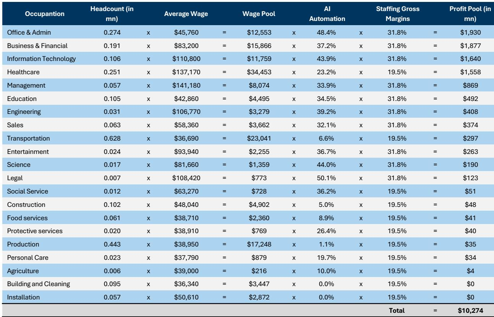
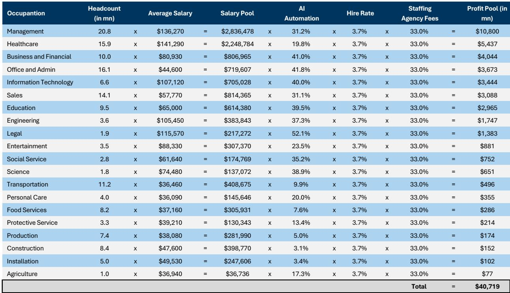
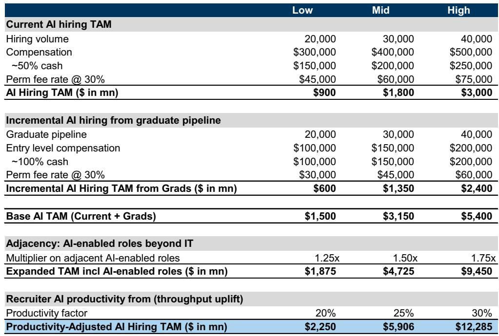

# GS：AI正在重写招聘行业630亿美元利润分配逻辑

当全球四大云厂商的资本开支在2027年逼近1万亿美元时，一个关键问题浮出水面：这笔巨资如何转化为可持续的利润？GS最新报告以招聘行业为切片，给出了一个值得产业决策者反复推敲的答案——AI不是简单地消灭工作岗位，而是在重构“人-平台-技术”之间的价值分配。

这份报告的核心判断是：招聘行业约630亿美元的存量利润池正在被AI重塑，但真正的赢家不是技术本身，而是那些能控制工作流闭环的平台型公司。传统的按人头收费模式正在向按结果收费演进，而这一转变将深刻改变人力资源服务业的竞争格局。

## 1. 存量利润池的“三重挤压”并非均匀分布

GS将招聘行业利润池拆解为三个维度：临时派遣、永久安置和自由职业平台，分别对应约100亿、410亿和120亿美元的AI可替代利润空间。这不是简单的“岗位消失”故事，而是劳动力需求压缩与工作流效率提升的双重作用。

临时派遣受到的冲击最直接，因为AI可以替代大量标准化、重复性的文档处理、数据核对等工作，直接减少企业对临时劳动力的需求。永久安置的利润池虽然更大，但受到的冲击更多体现在“招聘频率”而非“岗位存续”——企业可能不再需要为每个新增职位单独招聘，而是通过AI工具内部调配。

> **KC评论：** 这份报告最有价值的地方不是给出具体的利润数字，而是提供了一个分析框架——判断一个岗位或业务是否容易被AI替代，要看三个维度：任务标准化程度、流程可拆分性、以及结果是否可量化。三个维度都高的，利润池最脆弱。

## 2. 工作流平台正在成为新的价值枢纽

报告最引人注目的发现是：AI创造的增量机会（约380亿美元的工作流自动化市场）远大于它对存量利润池的冲击（约100-410亿美元）。这背后的逻辑是，当企业减少对人工招聘的依赖时，它们愿意为“更精准的匹配”和“更高效的筛选”付费。

LinkedIn和Indeed的案例很说明问题。尽管美国整体职位发布量同比下降7%，但Indeed的Premium Sponsored Job产品通过AI提到功能，实现了用户留存率提升20%、每用户收入增长25%。这意味着平台正在从“发布信息”收费转向“促成结果”收费。

> **KC评论：** 这个“从流量到结果”的转变，本质上是把招聘行业的商业模式从广告业变成了软件业。前者按曝光收费，后者按效果收费。能完成这个转型的平台，估值逻辑会完全不同。

## 3. 报告尚未完全回答的三个关键问题

第一，AI对招聘需求的压缩是否具有非线性特征？报告假设任务级自动化效率提升是线性的，但如果AI能同时完成从职位描述生成到候选人筛选、面试安排的全流程，效率提升可能是指数级的，对应的利润池压缩也会更剧烈。

第二，企业端的“效率-规模”再平衡如何演变？报告指出约28%的AI岗位薪资溢价是支撑招聘平台价值的重要因素，但尚未充分讨论：如果AI工具让企业用更少的人完成更多工作，企业是否会选择将节省的成本转化为利润而非新增招聘？

第三，监管和合规不确定性如何影响AI在招聘行业的渗透速度？报告提到“人类监督”是限制自动化深度的因素之一，但没有量化分析不同司法管辖区对AI招聘的监管差异可能带来的市场分化。

## 4. 给产业观察者的三个分析框架

**第一，看收入结构。** 当一家招聘平台来自“按效果付费”的收入占比超过50%时，它已经完成了从流量生意到技术生意的转型，估值逻辑应该对标SaaS公司而非传统猎头。

**第二，看数据飞轮。** 拥有最多招聘数据的企业，在AI时代拥有最大的模型训练优势。LinkedIn的29%市场份额和Indeed的21%市场份额，本质上是数据壁垒而非品牌壁垒。

**第三，看客户粘性来源。** 如果客户选择一家招聘服务商是因为“服务团队专业”，那么AI带来的替代不确定性较高；如果是因为“系统集成度高”，那么AI反而会强化其壁垒。

这份报告最深刻的洞察或许在于：AI不会让招聘行业消失，但它会迫使每一个参与者回答一个根本性问题——你提供的究竟是人力，还是能力？

For informational purposes only. Portions may be generated,translated,summarized,or edited with AI assistance based on source materials and may contain omissions or errors. Please verify independently. This is not investment,legal,tax,accounting,or other professional advice.

For informational purposes only. Portions may be generated,translated,summarized,or edited with AI assistance based on source materials and may contain omissions or errors. Please verify independently. This is not investment,legal,tax,accounting,or other professional advice.

