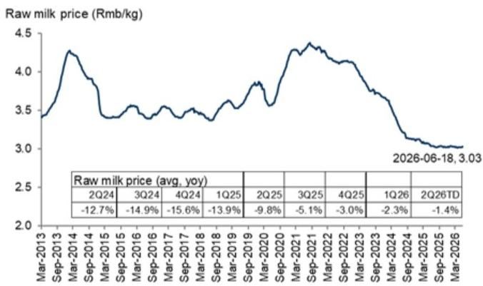
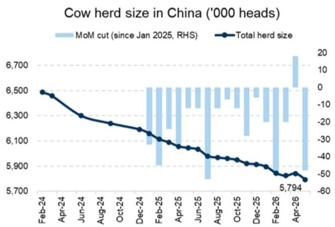
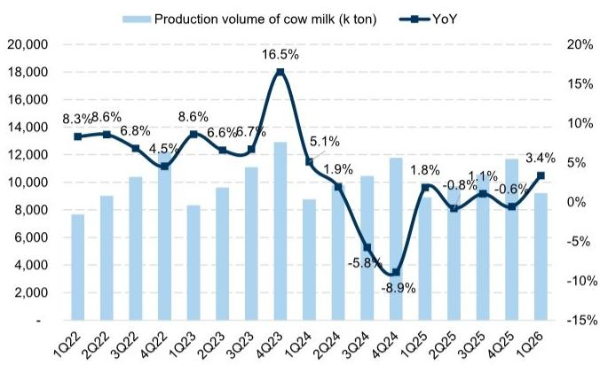
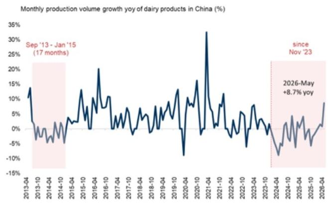

# 中国消费品行业观察

## 6月回顾与企业日总结：环比改善，趋势温和；企业日反馈：食品饮料品牌在折扣零售商渠道势头强劲，定价策略保持谨慎，成本压力趋缓

亚太消费与休闲企业日 2026年6月29日-7月3日

探索 >

Leaf Liu  
+852-3966-4169 | leaf.liu@gs.com  
GS (Asia) L.L.C.

Valerie Zhou  
+852-2978-0820 | valerie.zhou@gs.com  
GS (Asia) L.L.C.

Christina Liu  
+852-2978-6983 | christina.liu@gs.com  
GS (Asia) L.L.C.

上周我们在亚太消费与休闲企业日期间接待了15家以上消费品公司。尽管二季度消费情绪和天气因素存在一定影响，多数公司表示6月环比5月有所改善，这可能得益于较低的基数效应（2025年6月社会零售/餐饮收入增速分别为4.8%/0.9%）、健康渠道库存管理以及端午节日历效应，而天气因素仍对饮料/啤酒/出行相关品类构成一定影响。企业日主要观察如下：1）亮点与分化并存：万辰门店扩张进度超预期，同店销售增长相对稳健。蒙牛/康师傅/颐海维持上半年/全年销售展望，核心净利润表现稳健，华润啤酒维持啤酒板块展望。相比之下，东鹏饮料/百威亚太/重庆啤酒/华润饮料/卫龙分别因天气、去库存及消费情绪等因素调整了上半年或二季度预期。2）成本压力趋缓：多数公司提及近期PET/油脂价格回落，成本压力有所缓解。上半年大部分公司毛利率至少保持稳健，康师傅/东鹏饮料（主要受益于成本锁定）、颐海（2025年下半年提价）/盐津铺子（渠道结构升级）有所扩张，蒙牛/华润饮料/卫龙基本稳定。饮料公司和颐海普遍认为下半年成本压力更为可控，因PET压力自6月起环比减弱，效率提升持续提供缓冲。啤酒公司保持谨慎，维持全年单位成本展望，主要反映物流/铝材成本上涨。3）食品饮料品牌对定价保持谨慎，主要担忧消费情绪偏弱及竞争格局，但更聚焦于高毛利/高单价新品推出。华润啤酒和华润饮料对部分特定SKU进行了小规模区域性价格调整，但对更大范围的价格调整保持谨慎。4）费用投入有所增加但仍可控：上半年饮料/啤酒公司销售费用率可能小幅上升，原因包括体育营销（FIFA/世界杯，但基本在预算范围内）/加速冰柜投放（东鹏饮料）/O2O渗透（啤酒），而直接面向终端消费者的促销已成为主要竞争策略，尤其是饮料领域（通过从渠道返利中重新分配以控制费用水平）。全年来看，蒙牛/颐海/万辰/盐津铺子/华润啤酒预计费用率将受益于支出纪律/效率提升/经营杠杆，饮料公司在下半年仍面临竞争和冰柜投资节奏的影响。5）渠道与业态扩张成为更有意义的增长杠杆：折扣零售商仍是增长最快的渠道。康师傅在该渠道今年至今实现高双位数增长，目前贡献面条/饮料销售的HSD%/3%。华润饮料今年与万辰签署合作，供应差异化SKU。盐津铺子/卫龙在折扣零售商渠道持续快速扩张，SKU宽度不断扩大。6）提升股东回报仍是重要支撑：颐海/康师傅承诺维持高派息率（约100%），华润啤酒/蒙牛承诺每股股息逐年稳定增长，华润饮料承诺2026-2028年三年分红计划并伴随股份回购，东鹏饮料也在考虑长期分红承诺及股份回购。卫龙正在考虑特别分红。

6月回顾：我们的渠道调研和企业日反馈显示，6月环比5月有所改善。具体来看，啤酒趋势环比改善但仍面临挑战，青岛啤酒6月销量同比基本持平，华润啤酒相对稳健，百威/重庆啤酒降幅环比收窄。乳制品表现持续稳健，蒙牛/伊利液态奶销售实现低个位数增长，海天味业6月表现优于5月/4月，尽管公司二季度末更注重健康渠道库存。安井食品6月销售增长恢复至10%以上，受益于低基数。折扣零售商继续积极扩张，5月/6月头部品牌每月新开门店1000-1500家以上，但单店日均GMV/同店销售受不利天气影响，尤其是6月下旬。锅圈6月同店销售在高基数和天气影响下也出现低双位数下降。零食品牌中，洽洽表现突出，6月增速加快，我们将其归因于竞争格局改善及公司主动与折扣零售商合作。饮料方面，部分公司6月环比持平或放缓，可能仍受出行活跃度偏弱影响：农夫山泉整体销售增长低双位数，无糖茶（东方树叶增长40%）表现强劲，尽管5月/6月水业务可能有所下降；东鹏饮料6月环比放缓，控制发货节奏。康师傅饮料维持低个位数增长，主要受茶饮料和直接终端促销支撑，可能从统一手中获取份额。

展望7月及三季度，我们关注：1）餐饮渠道持续低基数（2025年7/8/9月餐饮零售收入同比分别为1.1%/2.1%/0.9%），白酒和零食基数更低；2）天气状况和消费情绪仍是饮料/啤酒旺季的关键变量；3）原材料成本趋势环比缓和，但定价能力仍有限（PET价格从5月初高点9600元/吨回落至近期7200元/吨）；魔芋/葵花籽价格下行，零食亦然；4）折扣零售商三季度门店扩张及单店GMV/同店销售趋势稳定仍是关键。

主要研究观点（积极）：我们继续看好食品饮料折扣零售商（万辰/鸣鸣）的门店加速扩张及长期渗透率和品类扩展空间，乳制品（蒙牛）需求稳步恢复。我们看好海天（港股）/颐海的份额增长执行力和股息支撑。我们将洽洽（链接）从谨慎上调至积极，因其定价能力在竞争缓和及成本利好下恢复。我们重申对茅台/华润啤酒/盐津铺子的积极看法。

作者感谢Lily Qi对本报告的贡献。

## 6月回顾：环比改善但趋势温和；乳制品更具韧性；折扣零售商5月门店加速扩张

## 基于渠道调研的6月子行业趋势：

啤酒销量环比改善。青岛啤酒6月销量基本持平（4月/5月为高个位数下降），华润啤酒继续领先同行，环比增速略快，百威销量降幅收窄（4月/5月为低双位数下降）。重庆啤酒销量降幅也环比收窄。

- 饮料终端销售趋势分化：农夫山泉5月/6月整体销售增长低双位数，瓶装水6月销售放缓至下降，无糖茶保持强劲势头，同比增长40%。康师傅5月/6月面条和饮料均保持低个位数增长，主要受茶饮料支撑，6月基本延续5月趋势。统一饮料销售偏弱，5月/6月为低个位数下降。东鹏饮料6月环比5月放缓，华润饮料二季度表现偏弱，水业务下降中个位数，其他饮料下降双位数。

液态奶需求持续温和恢复，蒙牛和伊利6月均实现低个位数销售增长，环比5月改善，可能受益于端午节日历效应。

调味品：海天味业二季度销售增速放缓，但6月/5月趋势略好于4月；中炬高新5月/6月环比4月放缓，因基数较高。颐海第三方销售增长保持稳健，同比高个位数至10%（5月为高个位数增长）。

- 冷冻食品：安井食品6月增长10-15%，受益于低基数，较5月的高个位数增长有所改善。

■ 折扣零售商保持快速开店节奏，万辰上半年净开门店不少于4100家（总开店不少于4700家），同店销售保持健康。鸣鸣也保持稳健开店节奏，同店销售为正。

零食品牌6月整体趋势偏弱，卫龙压力较大，洽洽增长加速。

## 啤酒月度追踪

图表1：2024-2026年月度销量表（GS预测）

<table><tr><td></td><td>1月</td><td>2月</td><td>3月</td><td>4月</td><td>5月</td><td>6月</td><td>2025E7月</td><td>8月</td><td>9月</td><td>10月</td><td>11月</td><td>12月</td><td>2026E1月</td><td>2月</td><td>3月</td><td>4月</td><td>5月</td><td>6月</td></tr><tr><td>华润啤酒</td><td colspan="2">中个位数增长</td><td>正增长</td><td>正增长，略快于一季度</td><td>低个位数增长</td><td>小幅正增长</td><td>增长4-5%</td><td>低个位数增长</td><td>低个位数增长</td><td>小幅正增长</td><td>持平至小幅正增长</td><td>持平</td><td>正增长</td><td>正增长；1-2月喜力双位数增长</td><td>小幅增长</td><td>低个位数增长，与一季度类似</td><td>慢于4月趋势</td><td>环比加快</td></tr><tr><td>百威亚太中国</td><td colspan="2">中个位数下降</td><td>下降</td><td>低个位数下降</td><td>高个位数下降</td><td>高个位数下降</td><td>低双位数下降</td><td>约中双位数下降</td><td>中个位数下降</td><td>小幅下降</td><td>下降7-8%</td><td>双位数下降</td><td>可能为负</td><td>销量承压</td><td>增长3-4%</td><td>销量低双位数下降（超高端低双位数增长，高端低双位数下降，核心中双位数下降）</td><td>下降12-13%</td><td>高个位数下降</td></tr><tr><td>青岛啤酒</td><td>中个位数下降</td><td>中个位数增长</td><td>双位数增长</td><td>低个位数下降</td><td>中个位数增长</td><td>基本持平</td><td>持平</td><td>增长1.5%</td><td>增长3%</td><td>高个位数下降</td><td>增长1.1%</td><td>增长12%</td><td>销量下降约中个位数</td><td>下降9.5%</td><td>增长5-6%</td><td>销量下降7.5%</td><td>下降9%</td><td>基本持平，较4月/5月改善</td></tr><tr><td>重庆啤酒</td><td colspan="2">正增长</td><td>低个位数增长</td><td>基本稳定</td><td>持平至小幅下降</td><td>低个位数下降</td><td>小幅下降</td><td>低个位数下降</td><td>中个位数增长</td><td>小幅下降</td><td>小幅增长</td><td>小幅增长</td><td>1-2月</td><td>高基数下为负</td><td>正增长</td><td>销量低个位数下降</td><td>高个位数下降</td><td>中个位数下降</td></tr><tr><td>百润</td><td colspan="2">RTD鸡尾酒下降约10%</td><td></td><td></td><td>RTD鸡尾酒销售下降双位数</td><td></td><td>RTD鸡尾酒下降约高双位数</td><td>RTD饮料双位数增长（低基数）</td><td>持平</td><td></td><td>线下发货增长30%</td><td></td><td>双位数以上增长（日历效应）</td><td></td><td></td><td></td><td></td><td></td></tr><tr><td>燕京</td><td></td><td></td><td></td><td></td><td></td><td></td><td></td><td></td><td></td><td></td><td></td><td></td><td></td><td></td><td>中个位数正增长</td><td></td><td></td><td></td></tr><tr><td>行业</td><td colspan="2">-4.90%</td><td>1.90%</td><td>4.80%</td><td>1.30%</td><td>-0.20%</td><td>1.90%</td><td>-1.80%</td><td>3.10%</td><td>-1.00%</td><td>-5.80%</td><td>-8.70%</td><td colspan="2">6.50%</td><td>0.20%</td><td>-0.10%</td><td>-6.20%</td><td></td></tr></table>

来源：GS全球投资研究

食品饮料折扣零售商月度门店扩张及单店GMV追踪
图表2：折扣零售商月度门店数量表

<table><tr><td>门店数量月度追踪</td><td>2025年1月</td><td>2月</td><td>3月</td><td>4月</td><td>5月</td><td>6月</td><td>7月</td><td>8月</td><td>9月</td><td>10月</td><td>11月</td><td>12月</td><td>2026年1月</td><td>2月</td><td>3月</td><td>4月</td><td>5月</td><td>6月</td></tr><tr><td>鸣鸣</td><td>14,737</td><td>14,956</td><td>15,152</td><td>15,474</td><td>15,989</td><td>16,783</td><td>17,584</td><td>18,551</td><td>19,517</td><td>20,513</td><td>21,041</td><td>21,948</td><td>22,250</td><td>23,353</td><td>23,746</td><td>24,682</td><td>25,696</td><td>26,976</td></tr><tr><td>净增</td><td>343</td><td>219</td><td>196</td><td>322</td><td>515</td><td>794</td><td>801</td><td>967</td><td>967</td><td>996</td><td>528</td><td>907</td><td>302</td><td>1,104</td><td>393</td><td>936</td><td>1,014</td><td>1,280</td></tr><tr><td>门店增速</td><td>2.4%</td><td>1.5%</td><td>1.3%</td><td>2.1%</td><td>3.3%</td><td>5.0%</td><td>4.8%</td><td>5.5%</td><td>5.2%</td><td>5.1%</td><td>2.6%</td><td>4.3%</td><td>1.4%</td><td>5.0%</td><td>1.7%</td><td>3.9%</td><td>4.1%</td><td>5.0%</td></tr><tr><td>好想来</td><td>12,977</td><td>13,325</td><td>13,632</td><td>14,119</td><td>14,356</td><td>15,365</td><td>15,565</td><td>15,612</td><td>16,320</td><td>16,619</td><td>16,626</td><td>17,248</td><td>17,834</td><td>18,434</td><td>18,909</td><td>19,509</td><td>20,560</td><td>22,232</td></tr><tr><td>净增</td><td>1,229</td><td>348</td><td>307</td><td>487</td><td>237</td><td>1,009</td><td>200</td><td>47</td><td>708</td><td>299</td><td>7</td><td>622</td><td>586</td><td>600</td><td>475</td><td>600</td><td>1,051</td><td>1,672</td></tr><tr><td>门店增速</td><td>10.5%</td><td>2.7%</td><td>2.3%</td><td>3.6%</td><td>1.7%</td><td>7.0%</td><td>1.3%</td><td>0.3%</td><td>4.5%</td><td>1.8%</td><td>0.0%</td><td>3.7%</td><td>3.4%</td><td>3.4%</td><td>2.6%</td><td>3.2%</td><td>5.4%</td><td>8.1%</td></tr></table>

数据可能与实际数字存在时间/滞后差异

来源：抖音、微信公众号、GeoQ、公司数据、GS全球投资研究

图表3：单店平均GMV汇总（GS预测）

<table><tr><td>门店表现：单店平均GMV同比</td><td>2025年一季度</td><td>二季度</td><td>三季度</td><td>2025年11月</td><td>12月</td><td>四季度</td><td>2026年1-2月</td><td>2026年4月</td><td>2026年5月</td><td>2026年6月</td></tr><tr><td>鸣鸣</td><td colspan="2">中个位数同比下降</td><td>中个位数同比下降</td><td></td><td></td><td>同比持平</td><td>高个位数同比增长</td><td></td><td colspan="2">同店销售稳定</td></tr><tr><td>万辰</td><td>中双位数下降</td><td>中双位数下降</td><td>中个位数下降</td><td>转正</td><td>中个位数增长</td><td>同比增长</td><td>同比增长9%</td><td>中个位数增长</td><td>日均GMV为正</td><td>日均GMV为正</td></tr></table>

来源：公司数据、GS全球投资研究

饮料月度追踪
图表4：饮料月度数据汇总

<table><tr><td colspan="2"></td><td>2025年4月</td><td>5月</td><td>6月</td><td>7月</td><td>8月</td><td>9月</td><td>10月</td><td>11月</td><td>12月</td><td>2026年1月</td><td>2月</td><td>3月</td><td>4月</td><td>5月</td><td>6月</td></tr><tr><td rowspan="5">农夫山泉</td><td>水业务同比</td><td>双位数增长</td><td>增长10%</td><td>增长15%以上</td><td>双位数增长</td><td>低基数下强劲双位数增长</td><td>高基数下下降</td><td>增长约20%</td><td>双位数增长</td><td>高双位数增长</td><td>增长20%以上</td><td>增长15-20%</td><td>正增长</td><td>水业务增速放缓</td><td>放缓</td><td>放缓至负增长</td></tr><tr><td>饮料业务同比（东方树叶）</td><td>正增长</td><td>东方树叶增长50%</td><td>东方树叶增长25%以上</td><td>无糖茶强劲双位数增长</td><td>低基数下无糖茶强劲双位数增长</td><td>茶饮保持强劲势头</td><td>增长约20%（区域差异）</td><td>双位数增长（茶饮）</td><td>增长20%以上（饮料整体）</td><td></td><td></td><td></td><td>东方树叶茶双位数增长</td><td>无糖茶增长25%（基数效应下环比放缓）</td><td>40%</td></tr><tr><td>水：绿瓶水占比</td><td></td><td></td><td></td><td></td><td></td><td></td><td></td><td></td><td></td><td></td><td></td><td></td><td></td><td></td><td></td></tr><tr><td>水AC尼尔森市场份额</td><td></td><td></td><td></td><td></td><td></td><td></td><td></td><td></td><td></td><td></td><td></td><td></td><td></td><td></td><td></td></tr><tr><td>整体同比</td><td>双位数增长</td><td>增长20%以上</td><td>增长20%</td><td>双位数增长</td><td>双位数增长</td><td>双位数增长</td><td>增长约20%</td><td>双位数增长，财年目标完成</td><td>增长约20%</td><td>双位数增长</td><td></td><td></td><td></td><td>整体低双位数</td><td>整体低双位数</td></tr><tr><td rowspan="4">华润饮料</td><td>水业务同比</td><td>同比稳定</td><td></td><td>低个位数增长</td><td></td><td>销量正增长但仍承压</td><td></td><td></td><td></td><td></td><td></td><td></td><td></td><td colspan="3">中个位数下降</td></tr><tr><td>销量同比</td><td></td><td></td><td></td><td>销量下降（pre）</td><td></td><td></td><td></td><td></td><td></td><td>正增长</td><td></td><td></td><td></td><td></td><td></td></tr><tr><td>饮料业务同比</td><td>增长30%-40%</td><td></td><td>双位数增长</td><td></td><td></td><td></td><td></td><td></td><td></td><td></td><td></td><td></td><td colspan="3">双位数下降</td></tr><tr><td>销量同比</td><td></td><td></td><td></td><td>销量增长20%（折扣前）</td><td></td><td></td><td></td><td></td><td></td><td>正增长</td><td></td><td></td><td></td><td></td><td></td></tr><tr><td rowspan="2">康师傅</td><td>饮料销售同比</td><td>百事：正增长；其他：高个位数下降</td><td>百事：正增长；其他：高个位数下降</td><td>百事：正增长；其他：高个位数下降</td><td>百事：低-中个位数正增长；其他：中-高个位数下降</td><td>百事：低-中个位数正增长；其他：中-高个位数下降</td><td>中个位数下降</td><td>非碳酸中-高个位数下降，碳酸低个位数增长，整体低个位数下降</td><td>中个位数下降</td><td>非碳酸高个位数-双位数下降，碳酸小幅正增长</td><td>正增长</td><td>康师傅饮料小幅增长（非碳酸）</td><td></td><td>饮料低个位数增长，碳酸饮料转正增长2-3%</td><td>低个位数增长（非碳酸低个位数增长，碳酸低个位数下降）</td><td>低个位数增长（非碳酸低个位数增长，碳酸低个位数下降）</td></tr><tr><td>面条销售同比</td><td>小幅下降</td><td>低个位数下降</td><td>中个位数下降</td><td>低个位数增长</td><td>中个位数正增长（中端提价）</td><td>中个位数增长</td><td>低个位数增长</td><td></td><td>小幅正增长</td><td>正增长</td><td>中个位数增长</td><td></td><td>正增长，好于饮料</td><td>低个位数增长</td><td>低个位数增长</td></tr><tr><td rowspan="2">统一</td><td>饮料销售同比</td><td>增长近10%</td><td>中个位数增长</td><td>中个位数增长</td><td>下降</td><td>下降</td><td>下降</td><td>中个位数下降</td><td>双位数下降</td><td>下降</td><td>春节效应下高个位数至双位数增长</td><td>1-2月中个位数增长</td><td>正增长</td><td>整体持平</td><td>整体持平，饮料低个位数下降</td><td>低个位数下降</td></tr><tr><td>面条销售同比</td><td>高个位数增长</td><td>高个位数增长</td><td>高个位数增长</td><td>正增长</td><td>正增长</td><td>低个位数增长</td><td>正增长</td><td></td><td></td><td></td><td>1-2月中个位数增长（日历效应）</td><td>正增长</td><td></td><td></td><td></td></tr><tr><td>东鹏饮料</td><td>整体同比</td><td>同比增长35%</td><td>同比增长39%</td><td>能量饮料：同比增长30%</td><td>零售势头增长约50%</td><td>零售势头增长约50%以上</td><td>零售势头增长约55%以上</td><td>零售销售增长58%-60%</td><td>零售销售增长56%，发货增长25%以上</td><td>零售销售增长60%以上，发货增长30%以上</td><td>零售销售增长约60%，发货双位数增长</td><td>1-2月补水啦终端销售符合公司预期</td><td>3月能量饮料终端销售双位数增长符合预期；补水啦终端销售低于预期</td><td colspan="2">4-5月能量饮料环比一季度放缓。补水啦去库存后发货加速</td><td>环比5月放缓</td></tr></table>

来源：GS全球投资研究

乳制品月度追踪
图表5：乳制品月度数据汇总

<table><tr><td colspan="2"></td><td>2024年12月</td><td>2025年1月</td><td>2月</td><td>3月</td><td>4月</td><td>5月</td><td>6月</td><td>7月</td><td>8月</td><td>9月</td><td>11月</td><td>12月</td><td>2026年1月</td><td>2月</td><td>3月</td><td>4月</td><td>5月</td><td>6月</td></tr><tr><td>蒙牛</td><td>液态奶销售同比</td><td>低个位数下降</td><td>双位数下降（UHT奶双位数下降，低温酸奶持平，鲜奶增长30%）</td><td>下降</td><td>持平（鲜奶双位数增长；特仑苏低个位数下降）</td><td>小幅下降至小幅正增长</td><td>下降</td><td>低双位数下降</td><td>高双位数下降</td><td>持平至低个位数增长</td><td>中个位数下降</td><td>下降10%</td><td>日历效应下高个位数-双位数正增长</td><td>中-高个位数增长</td><td>中个位数正增长</td><td>液态奶低-中个位数增长</td><td>正增长</td><td>6月液态奶低个位数正增长，较5月改善</td><td></td></tr><tr><td>伊利</td><td>液态奶销售同比</td><td>下降13%</td><td>下降3%（金典好于基础UHT奶）；3月起正增长</td><td colspan="3">中个位数增长（基础UHT奶好于金典；5月液态奶正增长）</td><td>下降</td><td>低个位数下降</td><td>中个位数下降</td><td>稳定至中个位数下降；三季度液态奶销量下降约8%</td><td>中个位数下降</td><td>中个位数下降</td><td>中个位数增长</td><td>中个位数增长</td><td>同比稳定</td><td>液态奶低个位数增长</td><td>液态奶持平</td><td>6月液态奶低个位数正增长，较5月改善</td><td></td></tr></table>

来源：GS全球投资研究

## 乳制品供需更新

图表6：原奶价格自6月中旬以来稳定在约3.0元/公斤；二季度至今原奶均价同比低个位数下降

最新价格截至2026年6月18日。

图表7：2026年5月奶牛存栏量同比下降4.2%

来源：农业农村部

## 图表8：2026年一季度牛奶产量同比增长3.4%

来源：农业农村部、GS全球投资研究

图表9：5月中国乳制品产量同比增长8.7%

来源：国家统计局

## 零食月度追踪

图表10：零食月度数据汇总

<table><tr><td>洽洽</td><td>2024年12月</td><td>2025年1月</td><td>2月</td><td>3月</td><td>4月</td><td>5月</td><td>6月</td><td>7月</td><td>8月</td><td>9月</td><td>10月</td><td>11月</td><td>12月</td><td>2026年1月</td><td>2月</td><td>3月</td><td>4月</td><td>5月</td><td>6月</td></tr><tr><td>洽洽</td><td>1月同比下降，12月+1月持平</td><td></td><td></td><td></td><td>30-40%</td><td>约双位数</td><td>持平</td><td>持平</td><td>小幅下降</td><td></td><td></td><td>高基数下下降</td><td></td><td>30%</td><td></td><td>同比下降</td><td>高个位数增长（基数效应）</td><td></td><td>高个位数至低双位数增长</td></tr><tr><td>卫龙</td><td>2024年12月</td><td>2025年1月</td><td>2月</td><td>3月</td><td>4月</td><td>5月</td><td>6月</td><td>7月</td><td>8月</td><td>9月</td><td>10月</td><td>11月</td><td>12月</td><td>2026年1月</td><td>2月</td><td>3月</td><td>4月</td><td>5月</td><td>6月</td></tr><tr><td>卫龙</td><td>同比增长</td><td></td><td></td><td>同比增长30%</td><td>25%</td><td>19%-20%</td><td></td><td>21%</td><td>线下+双位数</td><td>20%以上</td><td>高双位数增长</td><td>增长17-18%</td><td>双位数增长</td><td>20%</td><td></td><td>整体中双位数</td><td>增长18%</td><td></td><td>偏弱</td></tr><tr><td>调味面制品</td><td></td><td></td><td></td><td></td><td>小幅下降</td><td>中-高个位数下降</td><td></td><td>低个位数下降</td><td>低个位数下降</td><td>持平</td><td>下降5%</td><td>下降5-6%</td><td></td><td>增长15%</td><td></td><td></td><td></td><td></td><td></td></tr><tr><td>蔬菜制品</td><td></td><td></td><td></td><td></td><td></td><td>48%</td><td></td><td>45%</td><td></td><td></td><td></td><td>增长38%</td><td>增长30%以上</td><td>增长65%</td><td></td><td></td><td>下降</td><td></td><td></td></tr><tr><td>魔芋</td><td></
