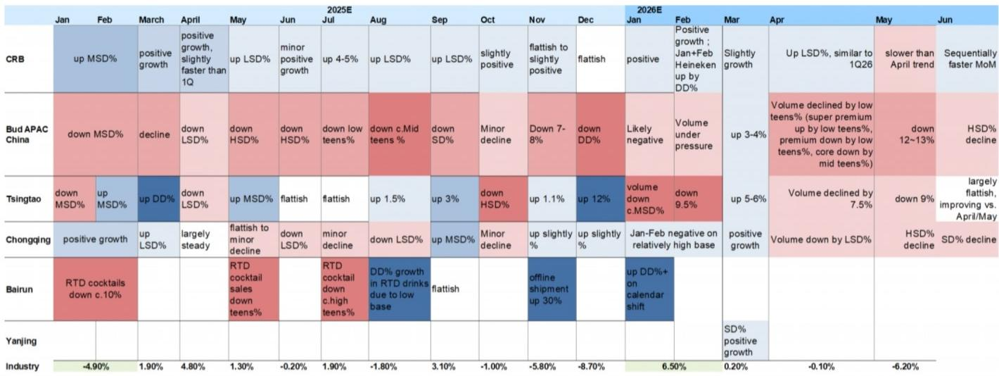
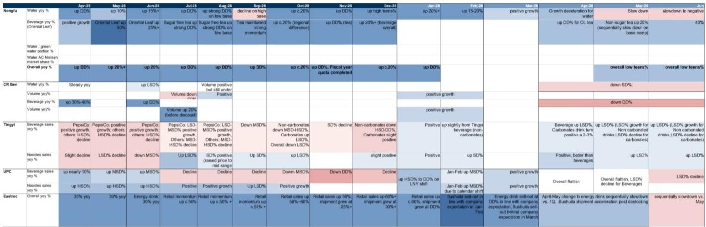
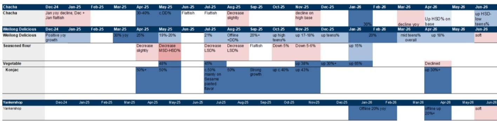

# 消费公司6月环比改善，但真正驱动增长的渠道只有一个

6月环比5月有改善，但整体仍处于调整阶段——这是某机构在亚太消费与休闲企业日之后给出的判断。这份覆盖15家以上消费品公司的调研总结，最值得关注的信号不是“改善”本身，而是改善的驱动力高度集中：**价值零售商渠道正在成为多数食品饮料品牌增长最快的分销通路，而传统商超和餐饮渠道仍在调整中。**

报告覆盖了啤酒、饮料、乳制品、调味品、零食和冷冻食品六大子行业。6月环比改善主要得益于低基数、端午节日历效应以及健康渠道库存管理，但天气因素继续影响饮料和啤酒的旺季表现。真正让分析师感到“有看头”的，是渠道结构的分化——价值零售商的月度净开店数已从年初的300-500家/月加速到5-6月的1000-1500家/月，而单店GMV在天气扰动下仍能保持正增长。

## 1. 成本不确定性正在缓解，但品牌方并未因此获得定价权

PET价格从5月初的9600元/吨回落至7200元/吨，油价回调也在压缩包材成本。多数公司1H26毛利率至少保持韧性，部分企业如统一和东鹏因成本锁定而有所扩张。但调研中反复出现的一个信号是：**品牌方对提价普遍谨慎**。即便成本端不确定性减轻，管理层仍担心消费信心不足和竞争加剧，更倾向于通过高毛利新品而非直接涨价来改善利润结构。

这意味着，成本改善的红利大概率会以促销或渠道补贴的形式流向终端，而非直接转化为利润率提升。对于读者而言，真正值得关注的是那些能够在不提价的情况下实现份额扩张的公司，而非单纯依赖成本拐点的标的。

> **KC评论：** 成本下降但不敢涨价，这个组合在消费行业历史上往往意味着竞争格局出现变化。完整报告中对各公司1H26毛利率的拆解值得细读——哪些公司能通过产品结构升级自然提升ASP，哪些只是被动受益于成本锁仓，决定了后续利润弹性的可持续性。

## 2. 价值零售商正在重塑快消品的分销版图

调研中最突出的结构性亮点是价值零售渠道。以万辰和鸣鸣很忙为代表的折扣零食/社区超市，月均净开店已从2025年的500-800家跃升至2026年5-6月的1000-1500家。更关键的是，**品牌方对这一渠道的投入正在从“试水”转向“战略级合作”**。

统一在价值零售渠道的销售额同比增长达到高双位数，该渠道目前贡献其方便面和饮料销售的约5%和3%。华润饮料今年与万辰签署了合作协议，专门供应差异化SKU。盐津铺子和卫龙也在加速SKU宽度扩张。相比之下，传统商超和餐饮渠道的恢复仍然缓慢——6月餐饮零售同比仅增长0.9%，对啤酒和白酒的影响尤为明显。

这个趋势尚未被市场充分关注。价值零售渠道的快速扩张不仅是开店数量的增长，更是品类渗透率和品牌集中度的提升。对于食品饮料公司而言，能否在这一渠道建立先发优势，可能决定了未来2-3年的市场份额走向。

## 3. 股东回报正在成为安全垫，但分红承诺的含金量需区分

调研中多家公司强调了股东回报承诺：颐海和统一维持约100%的派息率；华润啤酒和蒙牛承诺每股股息逐年稳定增长；华润饮料公布了2026-2028年三年分红计划并搭配股份回购；东鹏也在考虑长期分红承诺加回购；卫龙则考虑派发特别股息。

**但需要区分的是，高派息率在利润增长节奏变化时可能不可持续。** 那些在收入承压时仍能维持分红承诺的公司，要么现金流极其强劲（如统一），要么对资本开支有严格纪律（如颐海）。而部分公司的高分红更多是应对估值不确定性的短期策略，而非长期承诺。

## 4. 报告尚未完全回答的两个关键问题

第一，**价值零售渠道的盈利能力边界在哪里？** 当前品牌方涌入这一渠道，部分原因是传统渠道增长仍在调整。但价值零售商的商业模式本身要求低加价率和高周转，品牌方在这一渠道的净利率是否显著低于传统渠道？调研提到了SKU宽度扩张，但没有给出渠道利润率的分拆数据。

第二，**天气扰动结束后，需求是反弹还是继续调整？** 6月环比改善部分归因于低基数，而7-9月是饮料和啤酒的传统旺季。如果天气恢复正常但消费信心没有明显回升，旺季可能只是“不那么差”，而非“真正好”。报告在文中明确将“天气条件和消费情绪”列为关键摇摆变量，但没有给出基准情景下的3Q26收入预测。

> **KC评论：** 这份报告最有价值的部分不是6月环比改善的判断，而是渠道结构变化的细节。对于关注消费品的研究者，建议重点看原文中各家公司在价值零售渠道的销售占比和增长趋势，以及啤酒月度销量表格中6月与5月的环比变化幅度——这些数字比任何定性判断都更有说服力。

---

对于决策者而言，当前阶段最值得追问的不是“消费何时复苏”，而是“哪些公司正在渠道变革中建立结构性优势”。调研指向一个方向：那些能在价值零售渠道快速铺开、同时保持费用纪律的公司，更有可能在调整环境中实现份额和利润的双击。

For informational purposes only. Portions may be generated,translated,summarized,or edited with AI assistance based on source materials and may contain omissions or errors. Please verify independently. This is not investment,legal,tax,accounting,or other professional advice.

For informational purposes only. Portions may be generated,translated,summarized,or edited with AI assistance based on source materials and may contain omissions or errors. Please verify independently. This is not investment,legal,tax,accounting,or other professional advice.

