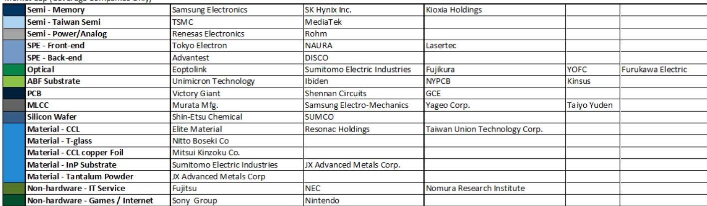
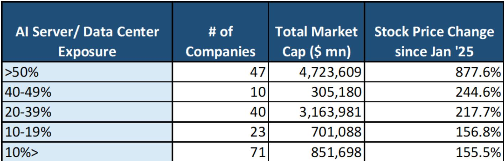
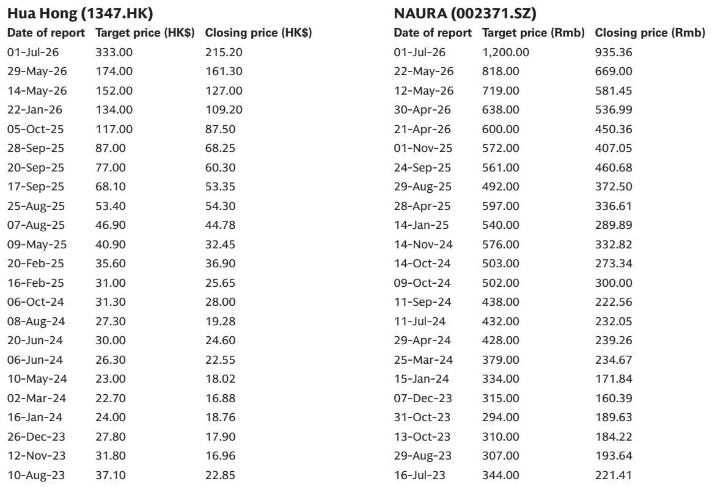

# GS：GS提出逆向防御策略，AI趋势下这些公司反而受益

亚洲科技供应链今年上半年的行情，由AI服务器和数据中心硬件驱动。但进入下半年，GS团队在最新策略报告中传递了一个更精细的信号：**AI硬件的供需变化正在从核心环节向周边蔓延，研究逻辑也从“关注AI”转向“在AI领域里寻找能涨价、能扩产、估值尚未充分反映的公司”**。

这份报告覆盖了37家公司研究，横跨日本、韩国、中国台湾和大陆的硬件与非硬件领域。但真正值得关注的，不是名单本身，而是GS构建的“不确定性偏好切换”框架——他们同时给出了进攻和防守两套方案，这在当前高波动的宏观环境中并不多见。

## 1. 供需变化正在向外围扩散，硅片和模拟芯片是下一个关注点

GS的核心判断是：AI驱动的硬件需求周期“仍然大且长”。他们观察到，芯片和组件的供应变化并未缓解，反而在1H26从存储、MLCC等环节，向硅片和模拟/功率半导体（不含中国）蔓延。

这意味着，信越化学、SUMCO等硅片厂商，以及瑞萨电子、罗姆半导体等模拟芯片公司，可能在2H26成为新的受益者。这些公司此前并非AI硬件的直接焦点，但供应瓶颈的传导逻辑正在将它们拉入视野。

> **KC评论：** GS在这里给出了一个非常具体的选股框架——他们关注的是“能否通过及时研究解锁产能瓶颈”以及“估值是否落后于未来盈利贡献”。换句话说，光有AI概念不够，公司还得有能力把订单变成产量，并且市场尚未充分定价。

## 2. 不确定性偏好下降时，AI趋势反而催生了新的防御性机会

报告中最具反直觉色彩的部分，是他们对“不确定性规避”情景的应对方案。GS认为，如果市场情绪转冷导致AI硬件股回调，读者不应简单离场，而应关注那些**因AI趋势而开始获得新业务**的公司。

逻辑是这样的：AI的普及不仅带来机会，也带来新的需求——网络安全、系统集成、软件架构重构等需求随之上升。GS点名了NRI、Baycurrent、NEC、富士通和Recruit Holdings，认为这些公司正在从“AI变革”中抓住新的增长曲线。

这其实是一种“逆向防御”：不是买低波动资产，而是买那些被AI情绪影响、但实际受益于AI扩散的标的。

## 3. 报告没有完全回答的问题：周期何时进入“技术降级”拐点

GS在报告中反复提到两个他们持续监控的指标：一是半导体/组件供应是否超过需求，二是技术演进是否从“高附加值”转向“降本”。他们坦言，这两个拐点尚未出现。

但报告没有给出明确的触发条件或时间表。对于读者而言，这恰恰是最需要独立判断的部分。如果AI硬件的技术升级速度节奏变化——比如从先进制程转向成熟制程的降本方案——那么当前高估值的高端硬件公司可能面临重新定价。

GS选股框架中有一条“估值滞后于AI盈利贡献”，隐含的前提是盈利增长能持续。一旦技术降级发生，这条逻辑的根基就会动摇。

> **KC评论：** 报告给出的37只标的覆盖了日本、韩国、台湾和大陆的多个环节，但真正值得细读的是GS对每只公司的“不确定性-回报”分析。他们特别指出，对于已经涨过的公司，需要更仔细地审视公司层面的新闻流和时机。这份报告的价值不在名单，而在筛选逻辑。

For informational purposes only. Portions may be generated,translated,summarized,or edited with AI assistance based on source materials and may contain omissions or errors. Please verify independently. This is not investment,legal,tax,accounting,or other professional advice.

For informational purposes only. Portions may be generated,translated,summarized,or edited with AI assistance based on source materials and may contain omissions or errors. Please verify independently. This is not investment,legal,tax,accounting,or other professional advice.

