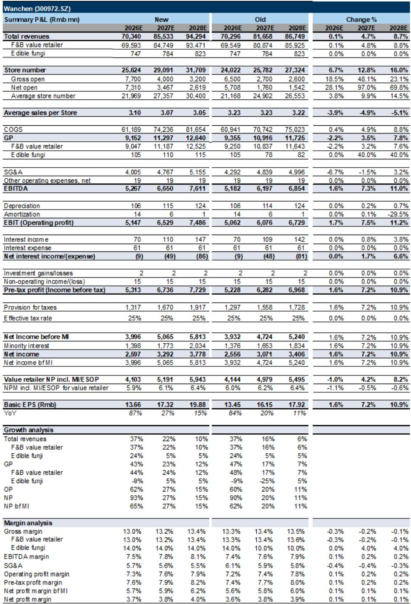
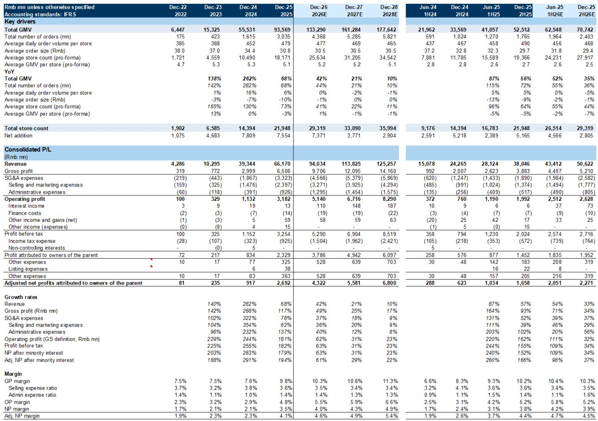
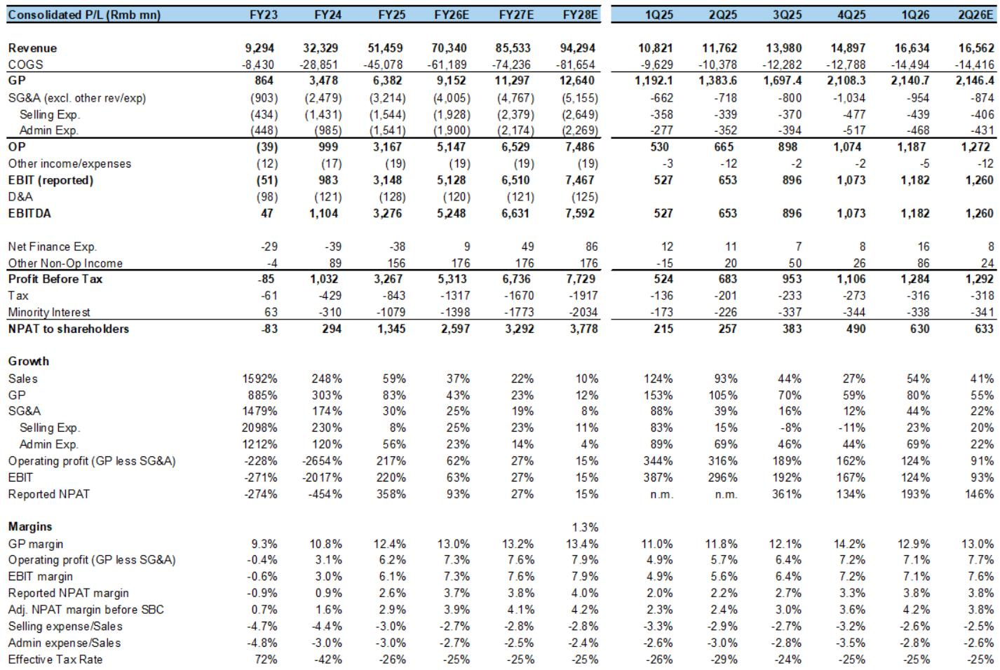

# 中国价值零售领域的领先企业：不仅是增长，更是行业格局的重塑

即将到来的2026年上半年财报季，对于中国价值零售领域最重要的启示，并非营收超预期的幅度，而是确认了两家领先企业——明忙与万辰——正在推动行业的结构性变革。它们加速开店——仅2026年上半年，各自净增门店超过4500家——并非机会主义的扩张，而是一项深思熟虑的战略：整合分散的市场，提高进入门槛，并在小型竞争者做出反应之前锁定长期竞争优势。对于观察者而言，问题已不再是这些公司能否增长，而是市场是否正确定价其盈利能力的持续性。

该领域的两家领先企业已从近期低点分别回升29%和18%，但仍较5月中旬的高点低约15%。这一差距表明，市场对快速扩张能否与健康的单店经济共存仍存疑虑。报告的分析认为，这是可以做到的——2026年上半年的证据支持这一论点。但战略层面的影响远不止于一次财报超预期。

## 门店加速扩张反映的是有意识的市场份额争夺，而非鲁莽扩张

核心数据引人注目。明忙与万辰在2026年上半年分别净增门店超过4500家，而去年同期仅为1500家和2500家。月度净增门店数在5月和6月加速至超过1000家，领先于暑期学校假期。这不是渐进式的铺开，而是一次有意识的加速，表明管理层对单店经济模型的信心，以及他们在窗口期关闭前抢占市场份额的意图。

这次扩张在战略上的重要意义在于其地理上的纪律性。例如，万辰已表示，2026年上半年70%的新开门店集中在它的优势市场——长三角与山河四省。这不是散弹式打法，而是一种“筑垒”策略。通过在已具备供应链基础设施、品牌认知度和加盟商关系的区域加深密度，领先企业使得小型区域玩家在这些区域竞争变得越来越不经济。

报告的追踪数据强化了这一点：小型连锁店在2026年至今的门店扩张非常有限。领先企业不仅在增长，它们还在压缩其他竞争者的生存空间。这意味着，该行业的长期结构正从分散的区域玩家格局，转向双头垄断格局。明忙与万辰的合计市场份额预计将从2024-2025年的超过70%，提升至2026年的80%。

## 单店GMV的韧性证明，规模不必牺牲单店经济

关于快速门店扩张，最常见的担忧是“蚕食效应”。如果一家公司开店过快，新店会分流现有门店的客流，导致平均单店收入下降。报告的数据直接挑战了这一假设。

2026年上半年，两家公司预计都将报告平均单店GMV的正增长，这得益于：1-2月春节期间的强劲交易（管理层表示单店GMV实现高个位数增长）；现有门店同店销售增长的持续提升；在更理性的竞争环境下，选址质量的改善；以及2025年上半年单店GMV出现中个位数至两位数下降所带来的低基数效应。

这是一个关键数据点。它表明，可触达的市场规模仍然足够大，能够吸收快速的新店扩张，而不会稀释现有门店的表现。该行业的长期门店潜力估计超过10万家，而到2026年底预计约为6.8万家。两家领先企业仍处于渗透的早期阶段。

报告也承认存在一些逆风。天气和客流问题影响了6月及第二季度后期的单店GMV。进入2026年下半年，由于两家公司在2025年下半年已恢复单店GMV正增长，面对更高的比较基数，平均单店GMV增长预计将环比放缓。但核心结论是结构性的：该行业能够以当前甚至更快的速度支持持续扩张，而不会导致单店经济崩溃。

## 加盟商单店经济保持健康，这是整个论点的基石

加盟商的单店盈利能力是整个价值零售模式的基础。如果加盟商无法盈利，扩张引擎就会熄火。报告指出，在定价纪律下，加盟商的毛利率保持稳定或有所改善，投资回收期仍保持在两年左右的吸引水平。

这并非偶然。两家行业领先企业在开店补贴上保持了理性与纪律，特殊补贴仅针对特定位置或区域获批。它们并非通过不可持续的激励措施来购买增长，而是维持定价纪律，在保护加盟商利润的同时，仍允许快速扩张网络。

在加盟商层面，报告预计采购规模效应和物流优化将进一步支持毛利率的扩张。这形成了一个良性循环：随着网络扩大，加盟商获得更强的供应商议价能力，将部分节省的成本传递给加盟商以保持其回报吸引力，并将剩余部分留作自身利润扩张。报告预测，2026年两家公司的调整后净利润率将同比提升0.5至1.0个百分点。

这里的战略洞察是，价值零售模式受益于小型玩家无法复制的结构性成本优势。餐饮品牌之所以向价值零售渠道提供有吸引力的定价，是因为这些渠道提供了可扩展性、高增长和运营费用节省。领先企业正成为众多消费品类的默认分销渠道，而这一地位随着门店数量的增长只会更加稳固。

## 报告留下了一个关键问题：当“低垂的果实”被摘完后会发生什么？

尽管报告细节看多，但它并未完全解答观察者面临的最重要的战略问题之一。当前的扩张主要依赖于深耕优势市场以及探索渗透不足的低线城市的空白区域。但随着门店密度增加，行业接近8万至10万家门店，新开门店的边际回报最终将会下降。

报告预测，从2025年到2030年，行业门店数量将以11%的年复合增长率扩张，领先企业的合计市场份额将持续上升。但它并未模拟当低线城市的“轻松扩张”耗尽，领先企业被迫在重叠区域更直接地相互竞争时会发生什么。届时，近年来理性竞争的环境可能会变得更加激烈，从而可能对加盟商利润造成压力，并减缓门店扩张的步伐。

仅依赖近期盈利动能的观察者，可能低估了这一转折点的重要性。报告的长期预测假设了在吸引人的单店经济下持续扩张，但这一假设的证据是从领先企业主要向无争议区域扩张的时期推断出来的。下一阶段的增长可能会截然不同。

## 观察者的决策框架：评估价值零售机会的三个问题

对于试图在该领域定位的观察者，报告的分析建议了一个基于三个问题的结构化方法。

第一，门店扩张速度是否可持续？报告提供的证据表明，目前来看是可持续的，因为可触达市场广阔，且领先企业在补贴和选址方面保持纪律。但观察者需要监控月度开店数据、加盟商投资回收期以及任何补贴升级的迹象。一旦任何一家领先企业诉诸激进的财务激励来维持增长，扩张的质量就在恶化。

第二，单店GMV的韧性是趋势还是暂时现象？当前的韧性得益于有利的季节性因素、低基数效应以及向冷链和冷藏冷冻产品的品类扩张。观察者应追踪，当2026年下半年比较基数正常化后，单店GMV能否保持稳定。如果单店GMV开始显著下降，整个观察逻辑将从“量驱动增长”的故事转向“利润压缩”的叙事。

第三，双头垄断的终值是多少？报告分别以2026年预估市盈率17倍和14倍为这些股票估值，而它们的盈利增长率在2028年前分别为25%和21%的年复合增长率。这意味着市场已为未来几年的强劲增长定价，但尚未为行业整合的结构性优势赋予溢价。如果双头垄断的论点如报告所述成立，这些公司的长期盈利能力可能支撑更高的估值倍数。如果竞争环境恶化，当前的估值倍数可能显得昂贵。

## 完整报告包含使这一论点具体化的数据

以上分析基于报告的战略逻辑和关键数据点，但完整文件包含了详细的门店追踪、财务预测和估值分析，将这些洞察转化为可操作的观察结论。原始图表——包括月度开店追踪、单店GMV趋势以及截至2028年的财务预测——为“中国价值零售领先企业正在构建持久的竞争护城河”这一论点提供了实证基础。

加入社区，阅读完整报告并查看原始图表。

*仅供参考。部分内容可能基于源材料通过AI辅助生成、翻译、总结或编辑，可能存在遗漏或错误。请独立核实。本文不构成专业建议。*

仅供参考。部分内容可能基于源材料通过AI辅助生成、翻译、总结或编辑，可能存在遗漏或错误。请独立核实。本文不构成专业建议。

