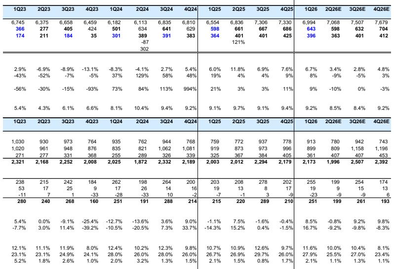
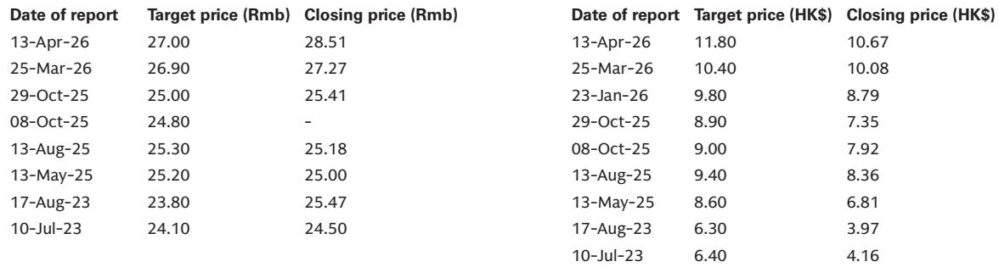
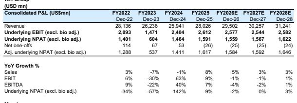

# WH Group Faces a Coordinated Squeeze Across Three Continents: The 2Q26 Earnings Inflection Demands a Strategic Response, Not Passive Holding

The narrative surrounding WH Group has shifted from recovery to a test of operational resilience. After a period of robust earnings expansion, the company is entering a phase where profit growth is not only slowing but is expected to turn negative in the second quarter of 2026. The central thesis is no longer about cyclical tailwinds; it is about the company's ability to navigate a synchronized compression of margins across its three primary operating theaters. The report projects a high-single-digit year-over-year decline in operating profit for 2Q26, bringing the first half of 2026 to broadly flattish growth. This is not a random blip. It is the result of a deliberate trade-off in China, a cost-driven squeeze in the US, and a base-effect hangover in Europe. The question for observers is whether this is a buying opportunity in a high-dividend-yield story or the beginning of a structural earnings downgrade cycle.

The timing matters. The broader consumer staples sector in China is under scrutiny for demand sustainability, while global protein markets are recalibrating after a period of elevated input costs. WH Group sits at the intersection of these pressures. The company's 7% dividend yield offers a floor for the stock, but the earnings trajectory will determine whether that yield is sustainable or a trap. The report's adjustments—lowering net income forecasts by 2%—run deeper than the numbers. The company is choosing volume over profit in its most important market, absorbing cost inflation in its most profitable one, and waiting for a cyclical recovery in its most volatile one. Each of these choices carries second-order consequences that the market has not fully priced.

## The Chinese Packaged Meat Business Is Voluntarily Sacrificing Margin to Defend Market Share, and the Cost Is Visible in 2Q26

The most significant driver of the 2Q26 earnings headwind is the deliberate decision by Shuanghui, WH Group's China-listed entity, to lower unit profits in its packaged meat business by an estimated 13% year-over-year. This is not a passive response to weak demand; it is an active strategy to stimulate volume growth of 2%. The logic is straightforward: in a mixed consumer backdrop, maintaining shelf space and brand relevance requires competitive pricing. But the arithmetic is brutal. A 13% decline in unit profit to drive only 2% volume growth implies a negative operating leverage that will compress margins even as revenue stabilizes.

The implication for observers is that the packaged meat segment, which has historically been the profit engine for WH Group's China operations, is losing its pricing power. The segment's EBIT margin, which peaked at 27.4% in 2025, is projected to decline to 26.1% in 2026 and further to 24.7% by 2028. This is not a temporary promotional cycle; it is a structural erosion of profitability. The company is betting that volume gains will eventually translate into market share that can be monetized later. But the risk is that consumers become conditioned to lower prices, making it difficult to restore margins without losing the newly acquired volume.

Meanwhile, the fresh pork business in China remains a drag. Hog production losses are narrowing thanks to operational improvements, but the segment's EBIT margin remains below 2%. The hog price environment is softening, which provides some relief on the input cost side but also signals weak demand for fresh pork. The China business, which accounts for roughly one-third of group EBIT, is effectively in a managed decline. The company is extracting cash from a mature market while trying to defend its position, but the trajectory suggests that China will be a diminishing contributor to earnings growth over the next two to three years.

## US and International Operations Face a Cost Inflation Squeeze That Packaged Meat Margins Cannot Fully Absorb

The US business, which contributes the majority of group EBIT, is confronting a different but equally challenging dynamic. The report highlights elevated costs for beef and freight/diesel, which are directly impacting the packaged meat segment. Unlike in China, where the company is voluntarily cutting prices, in the US the pressure is coming from the cost side. The hypothetical packer margin tracker in the report suggests that the margin per head is under pressure, even as the hog production segment enjoys a supportive commodity backdrop.

The US hog production business has been a standout performer, swinging from losses to profits as the commodity cycle turned favorable. But the packaged meat segment, which generates the bulk of the profit, is seeing its margin compress. The US packaged meat EBIT margin is projected to decline from 12.6% in 2025 to 10.4% in 2026. This is a significant compression for a business that has been the bedrock of WH Group's profitability.

The strategic question is whether the US business can offset the China headwind. The answer, based on the report's projections, is no. The US and international segment's total EBIT is expected to decline by 3.5% in 2026, even as revenue grows by 4.5%. This is a classic margin squeeze: revenue is up, but costs are rising faster. The company's ability to pass through higher costs to consumers is limited in a competitive protein market. The report does not specify the magnitude of the cost increases, but the implication is clear: the US business is entering a period of margin normalization after a strong 2024 and 2025.

## The European Hog Production Business Faces a Tough Base Effect That Will Mask Underlying Recovery Until the Second Half of 2026

The European segment is the most volatile of the three, and it is currently experiencing a high-double-digit year-over-year decline in operating profit. This is largely a function of a tough comparison base: the hog production business had an unusually strong performance in the prior year. The report notes that packaged meats in Europe continue to grow at double-digit rates, which provides some cushion, but the hog production losses are the dominant factor.

The good news is that this headwind is expected to be transitory. With hog prices stabilizing, the report projects narrowing losses in the European hog business from the third quarter of 2026. This creates a potential inflection point in the second half of the year. If the European business stabilizes, it could provide a tailwind that partially offsets the weakness in China and the US.

But the timing is critical. The second quarter of 2026 will be the trough for European earnings, and the recovery will not be visible until the third quarter. This means that the 2Q26 earnings print will be the worst of the three regions simultaneously. The synchronized nature of the headwinds is what makes this period particularly challenging. Observers who focus on the full-year outlook may be tempted to look through the 2Q26 weakness, but the risk is that the recovery in Europe and the US is slower than expected, while the China margin erosion accelerates.

## What the Report Does Not Fully Answer: The Sustainability of the Dividend and the Risk of a Structural Earnings Downgrade

The report maintains a positive view on the dividend, highlighting a 7% yield as a key support for the stock. But it does not fully address the question of dividend sustainability if earnings continue to decline. The report's own projections show EBIT declining by 1% in 2026 and 2027, with net income essentially flat. This is sufficient to cover the current dividend, but it leaves no margin for error. If the China margin erosion is worse than expected, or if the US cost inflation persists, the dividend coverage ratio could become a concern.

More importantly, the report does not explore the possibility of a structural earnings downgrade. The projections show EBIT margins declining from 9.3% in 2025 to 8.3% by 2028. This is a gradual erosion, but it is a trend, not a cycle. If the company cannot restore pricing power in China or pass through costs in the US, the earnings base may be permanently lower. The report raises this question.

The open question is whether WH Group can reinvent its packaged meat business in China to compete on value rather than price, or whether it will be forced into a prolonged period of margin compression. The report's data suggests that the company is betting on volume, but the evidence from other consumer staples markets is that volume-led strategies in mature categories often fail to restore margins. This is the analytical tension that the report leaves for readers to resolve.

## A Decision Framework for Observers: How to Evaluate WH Group Through the 2Q26 Earnings Cycle

For those trying to make a decision on WH Group, the 2Q26 earnings cycle should be evaluated through three lenses: the trajectory of the China margin, the persistence of US cost inflation, and the timing of the European recovery.

First, track the China packaged meat margin on a quarterly basis. If the 13% unit profit decline in 2Q26 is followed by a stabilization in 3Q26, the strategy may be working. If the decline accelerates, it signals a loss of pricing power that will require a reassessment of the China earnings base. The key metric to watch is the packaged meat EBIT margin, which should not fall below 25% if the company is to maintain its overall earnings profile.

Second, monitor US input costs, particularly beef prices and freight rates. The report's hypothetical margin trackers are useful tools. If packer margins continue to deteriorate, the US packaged meat segment will face a more severe compression than the report currently projects. The company's ability to manage its cost structure through operational improvements will be critical.

Third, watch the European hog production results in 3Q26. If the narrowing losses materialize as expected, it will provide a meaningful offset to the headwinds elsewhere. If the recovery is delayed, the full-year earnings will be under pressure.

The decision framework is not about predicting the exact earnings number. It is about identifying the signals that will confirm or refute the report's base case. The report projects a broadly stable full-year operating profit. The risk is that the 2Q26 weakness is not a trough but a trend. The reward is that the 7% dividend yield provides a floor, and any recovery in margins will drive significant upside.

## The Full Report Contains the Charts and Data That Make These Trade-Offs Visible

The analysis above is based on the report's projections and hypothetical trackers, but the full report contains the detailed quarterly earnings summaries, segment-level breakdowns, and margin trackers that allow observers to build their own scenarios. The exhibits on North American hog and packer margins are particularly valuable for understanding the US cost dynamics. The China quarterly EBIT data reveals the pace of margin erosion in the packaged meat business. The Europe segment data shows the timing of the base effect headwind.

For informational purposes only. Portions may be generated, translated, summarized, or edited with AI assistance based on source materials and may contain omissions or errors. Please verify independently. This is not professional advice.

For informational purposes only. Portions may be generated, translated, summarized, or edited with AI assistance based on source materials and may contain omissions or errors. Please verify independently. This is not professional advice.

