# 宏观环境与利率观察：美元走强背景下人民币展现韧性，利率维持低位

本观察报告追踪最新动态，识别宏观环境与利率市场的关键指标，包括估值/政策立场、技术面、资金流向和基本面。以下是我们对宏观环境与利率市场的主要观察总结。

■ 关于经济活动的讨论有所增加，但宽松预期仍较为有限。5月数据显示内需出现变化。5月社会消费品零售总额同比下降0.6%，单月固定资产投资同比下降10.6%。零售数据的变化部分反映了以旧换新补贴效应的减弱和高基数影响，而固定资产投资的变化则主要受到财政政策执行节奏和房地产投资状况的影响。我们的增长分解模型显示，4-5月内需同比增速约为1-2%。虽然名义出口保持增长，但实际出口增速近两个月放缓至同比约4.5%，低于一季度15.2%的同比增速。综合来看，这些因素指向二季度实际GDP同比增速可能低于4.5%，这与市场参与者对经济活动节奏的关注相吻合。尽管如此，宽松预期仍然有限：4.5-5.0%的增长目标区间为政策制定者提供了对短期波动的容忍度，而中国的政策反应机制仍以应对为主。我们认为，近期的政策应对更可能通过加快财政政策执行、保持银行间流动性充裕和定向信贷宽松来实现。7月政治局会议将是观察政策信号的下一个重要窗口。

尽管美元走强，人民币韧性依然存在。6月上半月，美元/人民币即期汇率曾下探至6.75区间，但在6月美联储会议后回升至6.79区间，使得6月人民币兑美元汇率基本呈现区间震荡。新的贬值压力主要来自中美利差扩大，反映了美国短端利率的上升。尽管如此，美元指数6月上涨约2%，而人民币兑美元贬值幅度有限，表明支撑人民币韧性的政策锚依然存在。因此，CFETS人民币指数6月上涨约2%。短期内，我们预计美元/人民币汇率将在夏季保持区间波动：中间价下调的步伐可能不足以抵消做多美元/人民币头寸的正向利差，但出口商在美元/人民币汇率较高时的结汇意愿将限制上行空间。政策偏好和市场预期仍倾向于人民币兑美元渐进式升值。9月下旬可能的访问以及美联储加息预期的消退，可能成为人民币兑美元重新走强的催化剂。更广泛地看，我们预计在美元走强背景下，人民币将表现优于其他货币。欧元/人民币汇率已引起读者更多关注，做空欧元、做多离岸人民币的动能有所上升。人民币兑欧元升值有基本面支撑，中国对欧洲贸易顺差持续扩大，同时也有助于回应欧洲对人民币低估的关切。

利率应保持低位，但回报表现曲线可能保持陡峭。6月，尽管政策利率下调预期有限且面临季末流动性需求，现金回报表现和互换利率仍保持低位。从基本面看，内需变化和油价下跌为利率维持在相对较低水平提供了理由，尤其是短端利率。尽管6月PPI同比可能进一步上升，但随着油价明显下跌，PPI可能接近峰值，而核心CPI因黄金和旅游相关服务价格走低而保持疲软。从资金流向看，贷款需求偏弱表明银行可能继续将更多资金配置于债券投资。此外，央行引入隔夜逆回购操作，且操作利率低于政策利率，表明政策倾向于保持银行间流动性充裕。这些因素应能将短端利率锚定在低位。在曲线远端，三季度加快财政政策执行并发行更多超长期国债，可能限制长端回报表现的下行空间。因此，我们预计10年期国债回报表现将保持低位但区间波动，而10年与30年期利差可能保持相对陡峭。

## 外汇市场

## 1. 估值与政策立场

图表1：6月人民币兑CFETS篮子升值约2%，而美元/人民币即期汇率在6.80附近波动
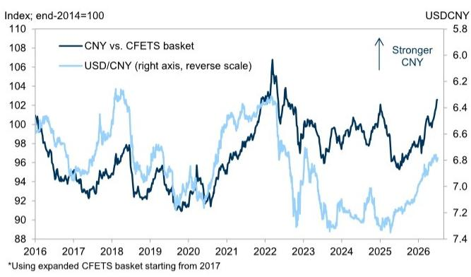
来源：彭博、万得

图表2：6月尽管美元走强，美元/离岸人民币即期汇率在6.80附近保持基本稳定
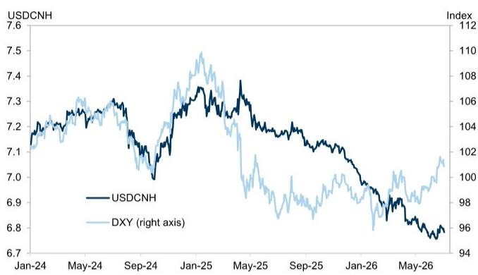
DXY：美元指数，衡量美元兑一篮子货币的价值。

来源：彭博

图表3：6月逆周期因子收窄至约+200个基点
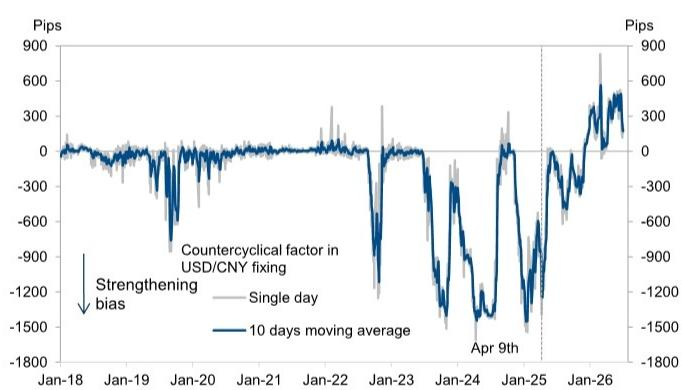
我们通过计算官方每日人民币中间价与基于官方人民币中间价机制文件估算的中间价之间的差值来衡量逆周期因子。
来源：彭博、GS全球投资研究部汇编数据

图表4：过去几个月美元/离岸人民币明日次日掉期点呈横盘走势
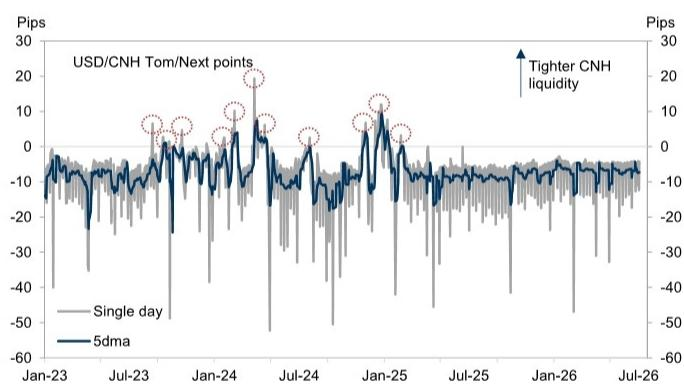
明日次日（Tom/Next）是一种短期外汇掉期，允许读者展期其即期头寸。正（负）明日次日掉期点意味着做多美元、做空离岸人民币的负（正）利差回报。红色圆圈表示离岸人民币短端流动性紧张的时间点（可能为当局进行的离岸人民币流动性管理）。
来源：彭博、GS全球投资研究部汇编数据

## 2. 技术面

图表5：6月美元/离岸人民币的利差波动比显著上升
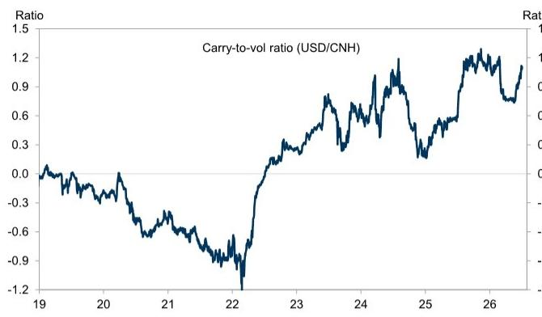

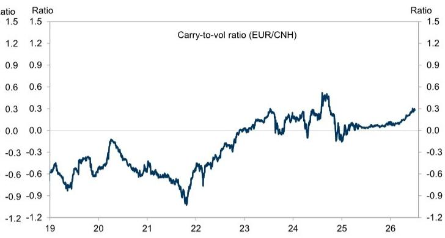
利差定义为3个月美元/离岸人民币、欧元/离岸人民币远期合约的年化利差回报，波动率指外汇总回报的3个月滚动已实现波动率。
来源：彭博、GS全球投资研究部

图表6：6月买入美元、卖出离岸人民币的动能上升，而买入离岸人民币、卖出欧元的动能持续
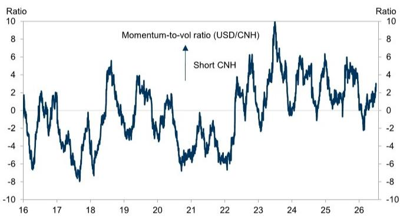

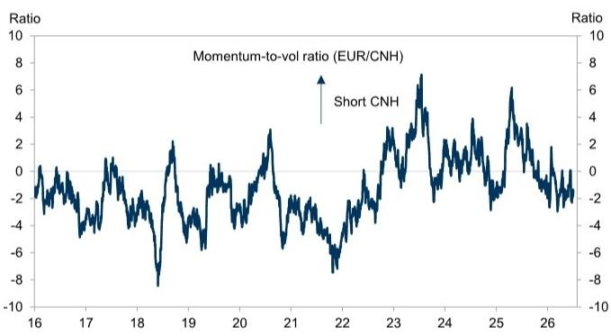
动能定义为3个月累计外汇总回报，波动率指外汇总回报的3个月滚动已实现波动率。
来源：彭博、GS全球投资研究部

图表7：6月下旬离岸人民币/人民币基差收窄至约-200个基点
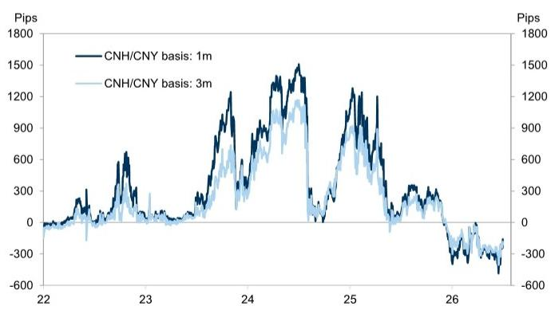
离岸人民币/人民币基差定义为美元/离岸人民币可交割远期与美元/人民币无本金交割远期之差。
来源：彭博、GS全球投资研究部

图表8：6月交叉货币互换利率仍低于无本金交割利率互换利率
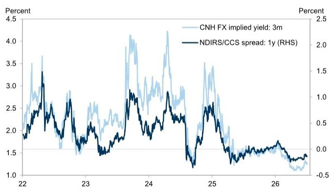
NDIRS/CCS利差：离岸人民币交叉货币互换利率减去人民币无本金交割利率互换利率。
来源：彭博、GS全球投资研究部

图表9：美元走强背景下，美元/人民币中间价横盘整理
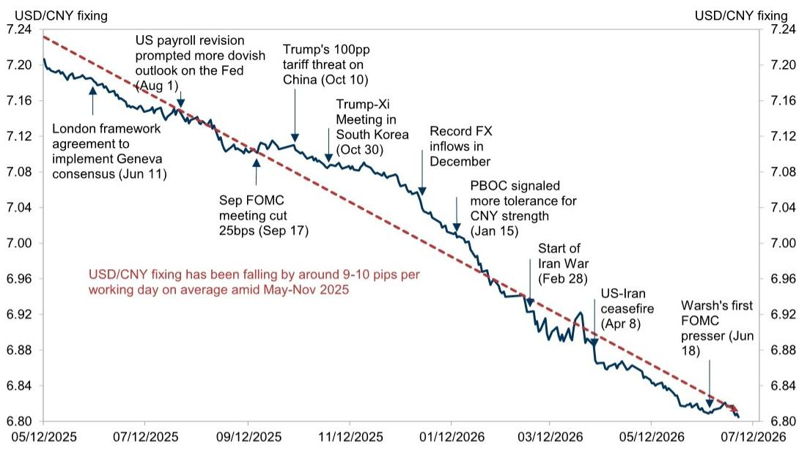
来源：中国人民银行

## 3. 基本面

图表10：5月中国贸易差额因商品贸易顺差扩大而上升
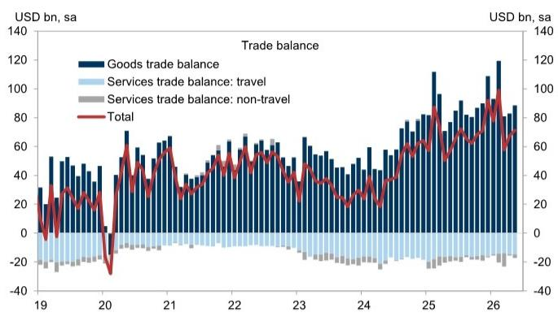
来源：Haver Analytics、GS全球投资研究部

图表11：2026年5月，中国旅行出口约为2019年水平的214%，旅行进口约为2019年水平的99%
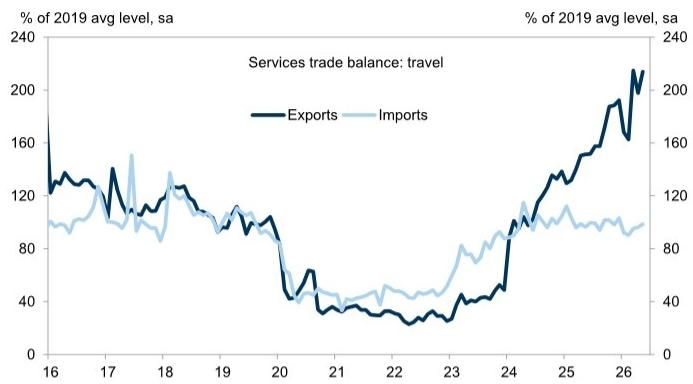
旅行进口定义为中国居民在海外用于旅游、教育和医疗服务的支出；旅行出口定义为非居民在中国的支出。两者均包括旅游支出。
来源：Haver Analytics、GS全球投资研究部

图表12：4月至5月，银行净外部资产和官方外汇储备均有所上升
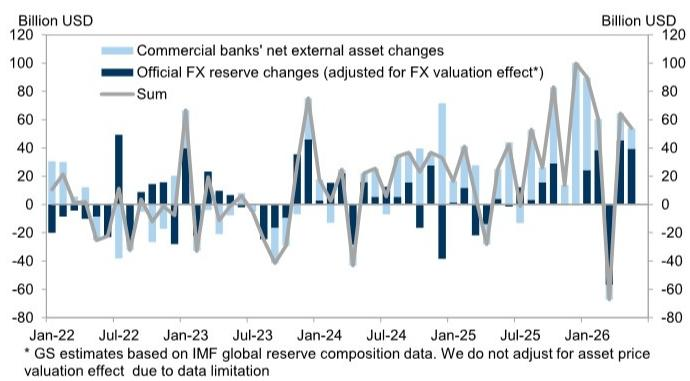
来源：中国人民银行、CEIC、GS全球投资研究部汇编数据
图表13：截至2026年5月，中国官方外汇储备为34420亿美元，商业银行持有15050亿美元净外部资产

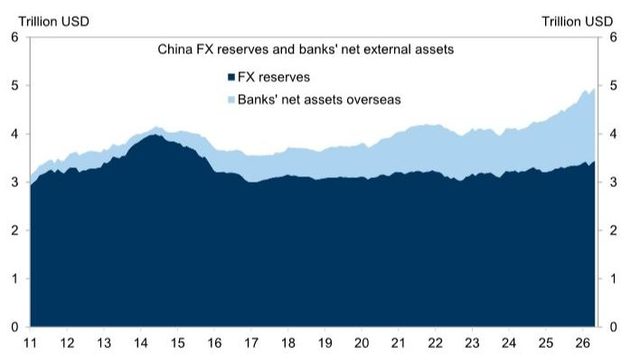
来源：中国人民银行、CEIC、GS全球投资研究部汇编数据

## 利率市场

## 1. 利率水平与期限结构

图表14：6月10年期国债回报表现横盘整理，而30年期国债回报表现小幅上升
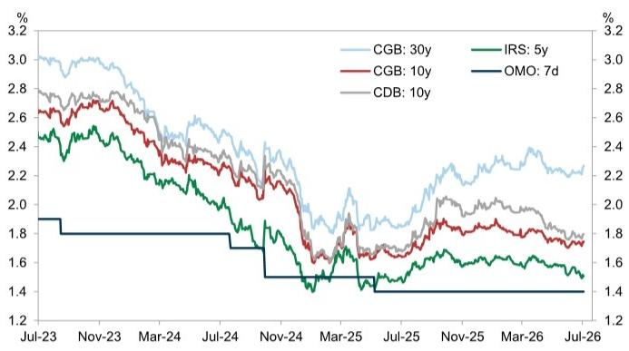
来源：CEIC、GS全球投资研究部

图表15：6月短端回报表现呈下行趋势
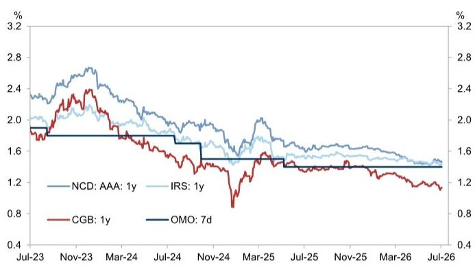
来源：万得

图表16：6月现货债券曲线陡峭化，而利率互换曲线平坦化
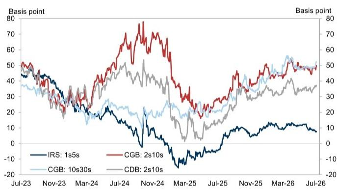
来源：万得、GS全球投资研究部

图表17：6月，短期债券的外汇对冲回报表现相对于美国国债回报表现下降，主要反映了美国短端利率的上升
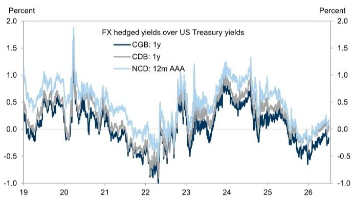
CGB：中央政府债券，CDB bond：国家开发银行债券，NCD：可转让存单。
来源：彭博、万得、GS全球投资研究部

## 2. 技术面

图表18：6月，接收人民币利率的短期动能显著上升
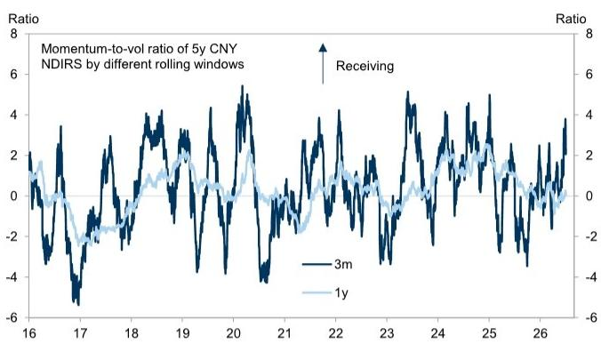
动能定义为某一时期年化滚动即期回报，波动率指某一时期即期回报的已实现波动率。
来源：彭博、GS全球投资研究部

图表19：6月下旬，权益市场走低，利率互换利率下降
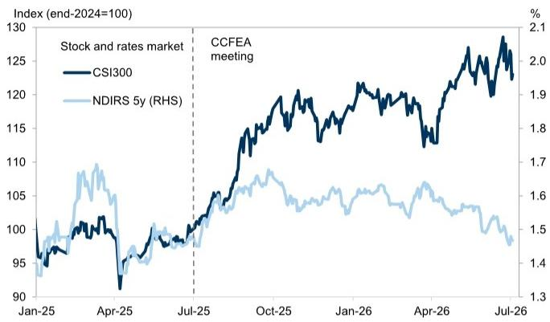
7月1日由主席主持的中央财经委员会会议呼吁规范无序降价和生产者之间的过度竞争。
来源：彭博、万得

图表20：6月长端互换利差收窄
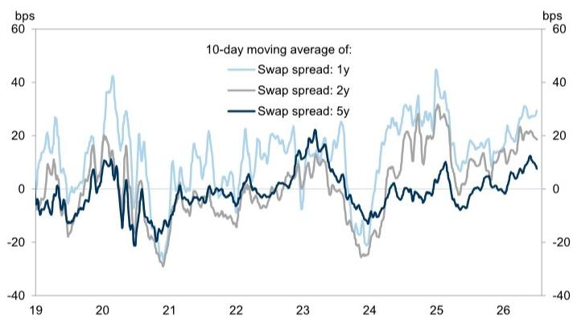
互换利差：在岸利率互换利率减去国债回报表现。
来源：万得、GS全球投资研究部

## 3. 基本面

图表21：6月CPI通胀一年期共识预测小幅上升
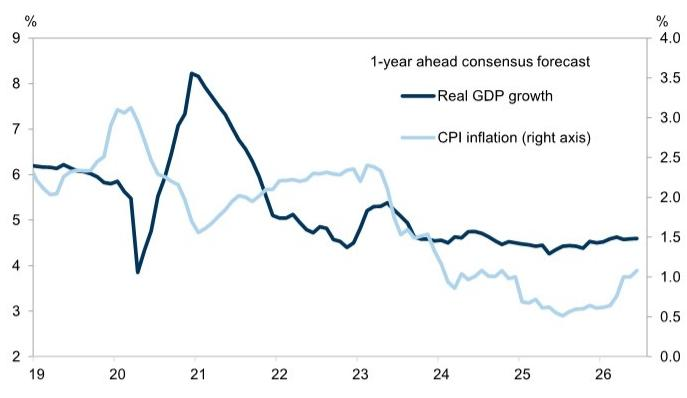
来源：Consensus Economics、GS全球投资研究部

图表22：6月票据贴现率有所回升，但仍处于低位
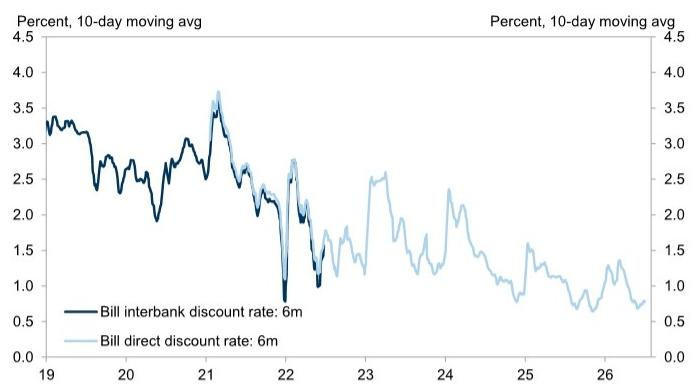
银行间票据贴现率自2022年6月起停止发布。由于银行间贴现率与直接贴现率走势密切相关，此后我们使用直接贴现率作为代理指标。
来源：万得、GS全球投资研究部

图表23：自2026年3月以来，1年期和10年期国债回报表现均低于模型隐含的“公允价值”
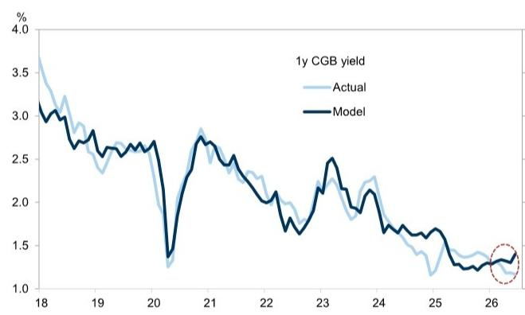

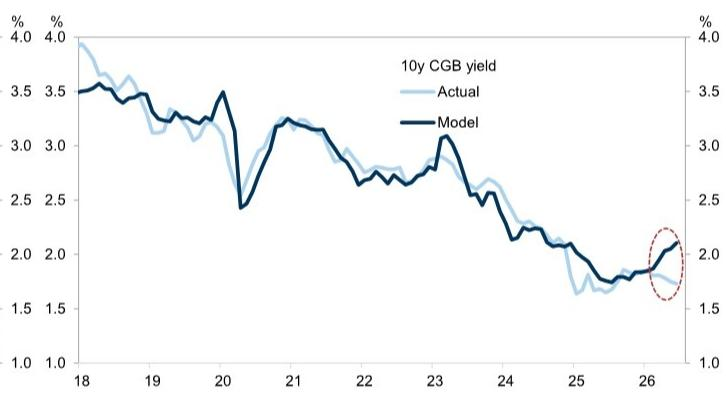
我们校准了一个简单的OLS模型来考察国债回报表现的驱动因素，包括一年期增长/通胀预测、1年期/10年期美国国债回报表现，以及公开市场操作目标利率与7天回购定盘利率之间的利差。我们调整了2025年8月以来的模型输出，以反映利息收入增值税豁免的取消。
来源：万得、GS全球投资研究部

## 4. 流动性与杠杆

图表24：6月央行主要通过公开市场操作注入流动性
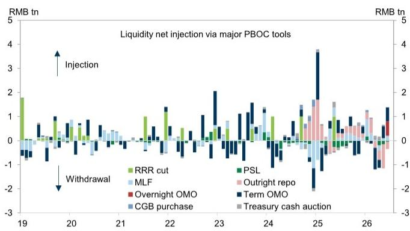
定期公开市场操作：期限超过隔夜的公开市场操作（即7天/14天/1个月质押式逆回购）；MLF：中期借贷便利；PSL：抵押补充贷款。
来源：CEIC、GS全球投资研究部

## 图表25：6月中旬银行间隔夜回购利率飙升，随后回落至略低于政策利率的水平

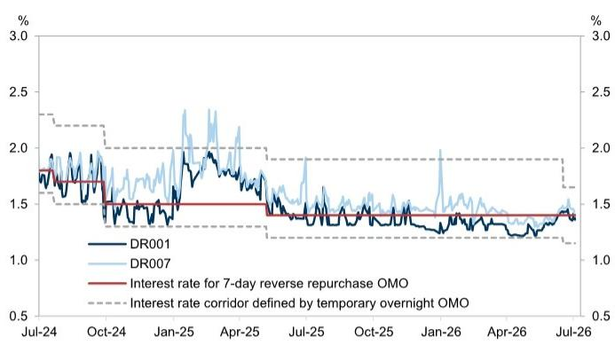
来源：CEIC、GS全球投资研究部

图表26：6月7天银行间回购利率升至公开市场操作目标利率之上
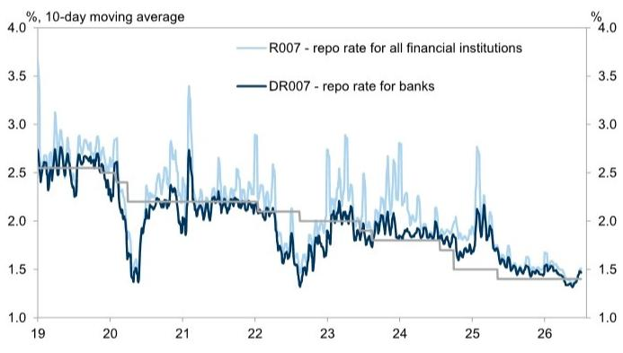
来源：万得、GS全球投资研究部

图表27：6月随着回购利率上升，债券市场金融杠杆有所缓和
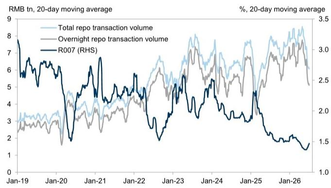
来源：万得、GS全球投资研究部

## 5. 债券供给与需求

图表28：6月中央政府债券净发行量约为3180亿元人民币，慢于2025年节奏
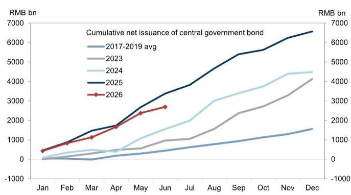
截至2026年6月，中央政府已使用年度国债发行额度的40%。中央政府债券包括中央政府一般债券和中央政府特别债券。
来源：万得、GS全球投资研究部

图表29：6月国债平均发行规模低于2025年水平
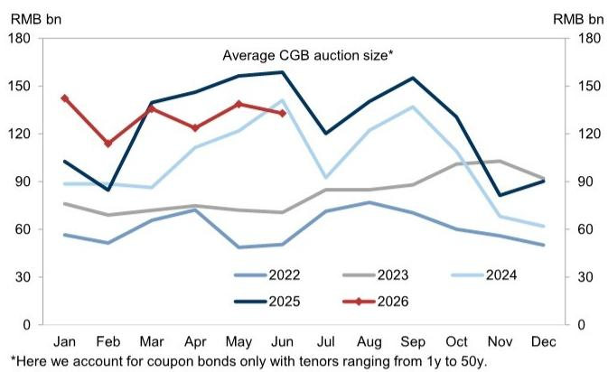
来源：万得、GS全球投资研究部

图表30：6月地方政府一般债券净发行量约为340亿元人民币
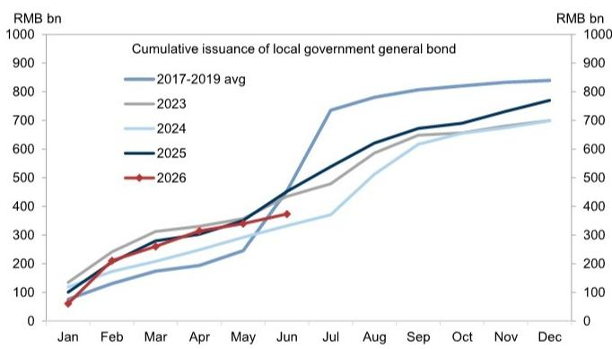
截至2026年6月，地方政府已使用其一般债券发行额度的47%。此处指地方政府一般用途新增债券。不包括再融资和债务置换债券。
来源：万得、GS全球投资研究部

图表31：6月地方政府专项债券发行量约为3720亿元人民币，快于4月和5月
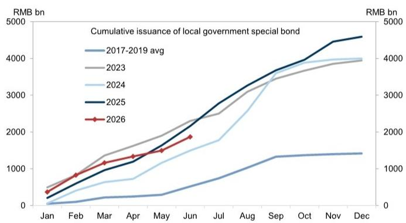
截至2026年6月，地方政府已使用其专项债券发行额度的43%。中央政府于2025年四季度批准了额外5000亿元人民币的地方政府债券发行额度，其中2000亿元指定用于地方政府专项债券发行。此处指地方政府专项用途新增债券。不包括再融资和债务置换债券。2022年，政府批准了约5000亿元人民币的额外地方政府专项债券发行额度。

图表32：截至6月，政府债券额度使用率为41.5%，慢于去年
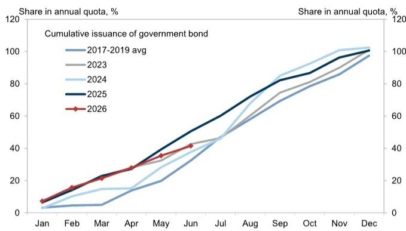
政府债券发行额度包括两会期间批准的中央和地方政府发行的一般和专项债券额度，但不包括地方政府发行的再融资债券。年末数字可能超过100%，因为财政部偶尔会在年底批准额外的地方政府债券额度。
来源：万得、GS全球投资研究部

图表33：6月政策性银行债券余额小幅下降
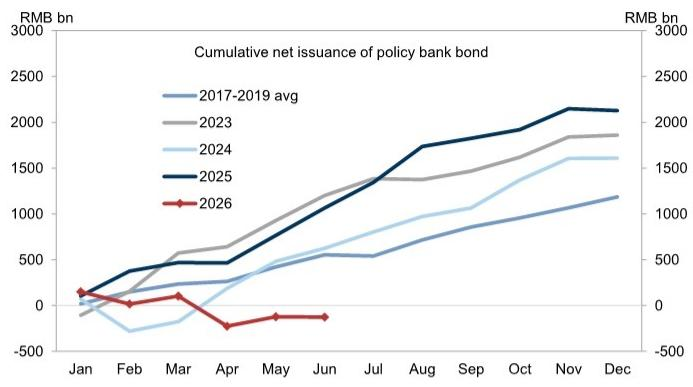
来源：万得、GS全球投资研究部

图表34：6月可转让存单余额增加7470亿元人民币
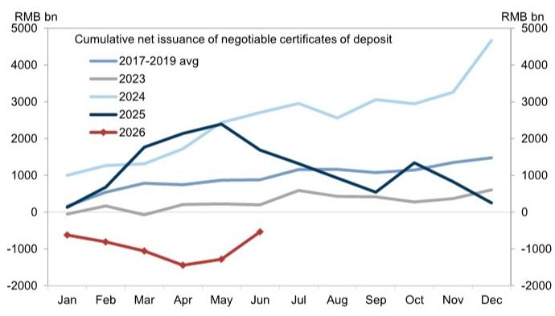
来源：万得、GS全球投资研究部

图表35：截至6月，城投债券年初至今净发行量为2430亿元人民币
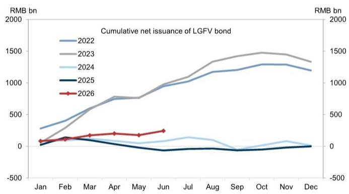
我们基于YY评级提供的城投名单更新了城投债券发行追踪。
来源：万得、GS全球投资研究部

图表36：6月城投债券发行回报表现小幅下降
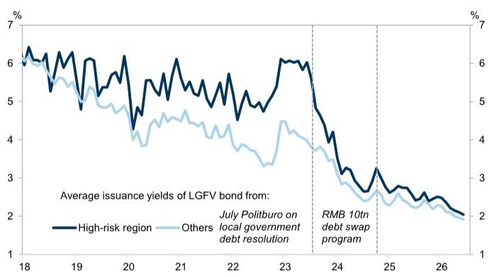
我们计算规模加权平均发行回报表现。高风险区域包括天津、内蒙古、辽宁、吉林、黑龙江、广西、重庆、贵州、云南、甘肃、青海和宁夏。
来源：万得、GS全球投资研究部

图表37：5月至6月，社会融资规模下的政府债券净发行量下降（约7890亿元人民币），而企业债券净发行量上升
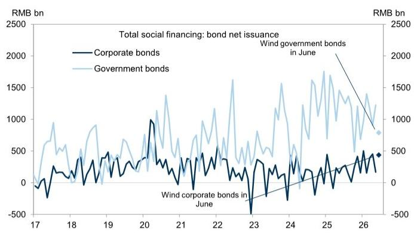
此处我们对万得与社会融资规模之间的政府债券发行数据统计差异进行了调整。
来源：万得、GS全球投资研究部
图表38：2026年上半年，特殊再融资债券发行量约为1.6万亿元人民币（约占2026年额度的82%），而地方政府专项债券新增发行量约为4310亿元人民币（约占2026年额度的54%）

LGGB指地方政府一般债券，LGSB指地方政府专项债券。一般债券为无收益的公共工程（如消防站）融资，并通过一般公共预算收入（如税收）偿还。专项债券为有收益的项目（如收费高速公路）融资，并通过指定项目收入偿还。最新的债务置换计划包括：1）2024-28年每年8000亿元人民币的专项新增债券，以及2）2024-26年每年2万亿元人民币的再融资债券。2024年四季度和2025年四季度，未使用的地方政府债券额度分别被用于债务化解，金额分别为4000亿元人民币和3000亿元人民币。

图表39：5月银行买入政府债券和可转让存单 2026年5月读者债券需求单月流量

<table><tr><td rowspan="2">人民币 十亿</td><td colspan="3">利率债</td><td colspan="5">非金融信用债</td><td rowspan="2">可转让存单</td><td rowspan="2">商业银行债券</td></tr><tr><td>国债</td><td>地方债</td><td>政金债</td><td>企业债</td><td>超短期融资券</td><td>短期融资券</td><td>中期票据</td><td>定向工具</td></tr>
<tr><td>商业银行</td><td>650.2</td><td>1039.4</td><td>197.3</td><td>-6.5</td><td>-10.2</td><td>22.9</td><td>-73.2</td><td>-3.9</td><td>287.9</td><td>-84.7</td></tr>
<tr><td>基金</td><td>148.8</td><td>167.7</td><td>-94.5</td><td>-5.3</td><td>-45.6</td><td>-8.4</td><td>138.6</td><td>8.2</td><td>-250.3</td><td>-71.9</td></tr>
<tr><td>境外读者</td><td>61.1</td><td>1.5</td><td>13.5</td><td>0.0</td><td>-0.8</td><td>0.0</td><td>1.6</td><td>0.0</td><td>7.0</td><td>-0.3</td></tr>
<tr><td>证券公司</td><td>70.7</td><td>-10.4</td><td>1.5</td><td>-2.5</td><td>-2.5</td><td>1.9</td><td>-8.7</td><td>-2.2</td><td>-19.3</td><td>-12.0</td></tr>
<tr><td>保险</td><td>12.6</td><td>34.3</td><td>-4.6</td><td>-0.3</td><td>0.0</td><td>0.0</td><td>5.8</td><td>0.0</td><td>0.3</td><td>-8.0</td></tr>
</table>

国债：中央政府债券，地方债：地方政府债券，政金债：政策性银行债券，可转让存单：可转让存单，超短期融资券：超短期融资券，短期融资券：短期融资券，中期票据：中期票据，定向工具：定向工具。

来源：万得、GS全球投资研究部

## 附录：外汇政策公告与市场动态摘要

在本附录中，我们总结了自2020年以来的主要外汇政策公告以及中国值得关注的外汇相关新闻。按照此前报告的分类，每项公告被标记为四类之一：价格、流动性、资本流动和口头指引。在汇率出现大幅波动（例如10天内贬值1%）时，中国人民银行可能会介入，使用各种工具稳定美元/人民币即期汇率。这些影响在日度层面往往是短暂的，但它们确实减缓了汇率变动的步伐（更多细节请参见我们之前的报告）。

图表40：稳定汇率的主要外汇政策（及相关新闻）摘要

<table><tr><td>日期</td><td>类别</td><td>外汇政策与市场动态</td></tr>
<tr><td>2020年3月</td><td>资本流动</td><td>中国人民银行和国家外汇管理局宣布，金融机构跨境融资宏观审慎调节参数由1上调至1.25</td></tr>
<tr><td>2020年10月</td><td>流动性</td><td>中国人民银行将远期售汇风险准备金率从20%下调至0%</td></tr>
<tr><td>2020年10月</td><td>价格</td><td>媒体报道人民币逆周期因子被淡出</td></tr>
<tr><td>2020年12月</td><td>资本流动</td><td>中国人民银行和国家外汇管理局将金融机构跨境融资宏观审慎调节参数从1.25下调至1</td></tr>
<tr><td>2020年12月</td><td>价格</td><td>媒体报道中国主要国有银行被观察到买入美元以缓和人民币快速升值</td></tr>
<tr><td>2021年1月</td><td>资本流动</td><td>中国人民银行将外币境外贷款余额的货币转换系数从0调整为0.5</td></tr>
<tr><td>2021年1月</td><td>资本流动</td><td>中国人民银行和国家外汇管理局将境内企业境外放款的宏观审慎调节参数从0.3上调至0.5</td></tr>
<tr><td>2021年1月</td><td>资本流动</td><td>中国人民银行和国家外汇管理局将企业跨境融资宏观审慎调节参数从1.25下调至1</td></tr>
<tr><td>2021年6月</td><td>流动性</td><td>中国人民银行将外汇存款准备金率从5%上调至7%</td></tr>
<tr><td>2021年12月</td><td>流动性</td><td>中国人民银行进一步将外汇存款准备金率从7%上调至9%</td></tr>
<tr><td>2022年5月</td><td>流动性</td><td>中国人民银行宣布将外汇存款准备金率从9%下调至8%，为2017年以来首次下调</td></tr>
<tr><td>2022年9月</td><td>流动性</td><td>中国人民银行将外汇存款准备金率从8%下调至6%</td></tr>
<tr><td>2022年9月</td><td>价格</td><td>媒体报道中国货币当局重启人民币逆周期因子</td></tr>
<tr><td>2022年9月</td><td>流动性</td><td>中国人民银行将远期售汇风险准备金率从0%上调至20%</td></tr>
<tr><td>2022年9月</td><td>价格</td><td>媒体报道中国人民银行已要求主要国有银行在离岸市场卖出美元买入人民币</td></tr>
<tr><td>2022年10月</td><td>资本流动</td><td>中国人民银行和国家外汇管理局决定将金融机构和企业的跨境融资宏观审慎调节参数从1上调至1.25</td></tr>
<tr><td>2022年10月</td><td>价格</td><td>媒体报道中国主要国有银行在在岸和离岸即期市场卖出美元以支撑走弱的人民币</td></tr>
<tr><td>2023年6月</td><td>价格</td><td>媒体报道中国人民银行设定了强于预期的人民币交易区间，且国有银行卖出美元</td></tr>
<tr><td>2023年7月</td><td>资本流动</td><td>中国人民银行和国家外汇管理局进一步将金融机构和企业的跨境融资宏观审慎调节参数从1.25上调至1.5</td></tr>
<tr><td>2023年7月</td><td>价格</td><td>媒体报道中国主要国有银行在在岸和离岸即期市场卖出美元以支撑人民币</td></tr>
<tr><td>2023年8月</td><td>价格</td><td>媒体报道中国商业银行被要求减少或推迟购买美元，以减缓人民币贬值</td></tr>
<tr><td>2023年8月</td><td>价格</td><td>媒体报道中国主要国有银行多次在在岸和离岸即期外汇市场卖出美元买入人民币，以减缓人民币贬值</td></tr>
<tr><td>2023年8月</td><td>价格</td><td>媒体报道中国人民银行被观察到收紧离岸人民币资金</td></tr>
<tr><td>2023年8月</td><td>价格</td><td>媒体报道中国人民银行已要求部分国内银行限制部分债券通的资金流出，以确保离岸市场人民币供应减少</td></tr>
<tr><td>2023年9月</td><td>流动性</td><td>中国人民银行宣布自9月15日起将外汇存款准备金率从6%下调至4%</td></tr>
<tr><td>2023年9月</td><td>价格</td><td>媒体报道中国人民银行已要求部分大型银行错开并调整美元购买，以缓解人民币贬值压力</td></tr>
<tr><td>2023年9月</td><td>资本流动</td><td>媒体报道超过5000万美元的大额美元购买需经中国人民银行批准</td></tr>
<tr><td>2023年9月</td><td>流动性</td><td>9月离岸人民币资金依然紧张，因中国人民银行额外发行100亿元人民币离岸人民币央票，并对国有银行进行窗口指导</td></tr>
<tr><td>2023年10月</td><td>资本流动</td><td>媒体报道中国证监会已禁止现有内地客户进行新的离岸经纪投资，以防止读者绕过中国的外汇管制</td></tr>
<tr><td>2023年11月</td><td>价格</td><td>媒体报道中国主要国有银行积极买入人民币，以加速其兑走弱美元的回升</td></tr>
<tr><td>2023年11月</td><td>资本流动</td><td>国家外汇管理局正在简化外汇程序，取消对合格境外机构读者（QFII）及其人民币计价版本（RQFII）资金流出要求等优化措施</td></tr>
<tr><td>2023年12月</td><td>价格</td><td>媒体报道中国主要国有银行积极卖出美元以支撑人民币</td></tr>
<tr><td>2024年1月</td><td>流动性及价格</td><td>媒体报道随着股市下跌，中国主要国有银行收紧离岸人民币流动性，并在在岸积极卖出美元以支撑人民币</td></tr>
<tr><td>2024年3月</td><td>价格</td><td>媒体报道中国主要国有银行积极卖出美元买入人民币</td></tr>
<tr><td>2024年4月</td><td>价格</td><td>媒体报道中国主要国有银行积极卖出美元买入人民币</td></tr>
<tr><td>2024年6月</td><td>价格</td><td>媒体报道中国主要国有银行积极卖出美元买入人民币</td></tr>
<tr><td>2024年8月</td><td>价格</td><td>媒体报道人民币快速升值期间，中国主要国有银行买入美元</td></tr>
<tr><td>2025年1月</td><td>口头指引</td><td>中国人民银行承诺增强外汇市场的“韧性”而非“弹性”，表明在美国关税宣布后，政策转向控制贬值速度</td></tr>
<tr><td>2025年1月</td><td>资本流动</td><td>中国人民银行和国家外汇管理局进一步将金融机构和企业的跨境融资宏观审慎调节参数从1.5上调至1.75</td></tr>
<tr><td>2025年4月</td><td>价格</td><td>媒体报道中国主要国有银行积极卖出美元以稳定美元/人民币即期汇率</td></tr>
<tr><td>2025年5月</td><td>价格</td><td>媒体报道人民币快速升值期间，中国主要国有银行买入美元</td></tr>
<tr><td>2025年7月</td><td></td><td>路透社报道中国人民银行就美元弱势向银行进行调研，暗示对人民币快速升值的担忧</td></tr>
<tr><td>2025年8月</td><td></td><td>路透社报道中国出口商押注人民币稳定，创纪录地卖出美元/人民币期权，避免外汇兑换</td></tr>
<tr><td>2025年9月</td><td>价格</td><td>彭博报道中国主要国有银行积极买入美元以减缓人民币升值</td></tr>
<tr><td>2025年12月</td><td>价格</td><td>路透社报道中国主要国有银行积极买入美元以减缓人民币升值</td></tr>
<tr><td>2026年3月</td><td>流动性</td><td>中国人民银行将远期售汇风险准备金率从20%下调至0%</td></tr>
<tr><td>2026年3月</td><td>资本流动</td><td>中国人民银行和国家外汇管理局将境内企业境外放款的宏观审慎调节参数从0.5上调至0.6</td></tr>
<tr><td>2026年6月</td><td>流动性</td><td>媒体报道中国主要国有银行上调美元存款利率</td></tr>
</table>

注：在此期间很可能有更多未正式公布/确认的资本管制措施。请参考《亚洲经济分析：积极的结构性发展可能有助于抵消中国的资本外流压力》，2019年8月中的示例。

## 来源：路透社、GS全球投资研究部汇编数据

## 中国经济研究团队

Andrew Tilton
+852-2978-1802
andrew.tilton@gs.com
GS（亚洲）有限责任公司

Hui Shan
+852-2978-6634
hui.shan@gs.com
GS（亚洲）有限责任公司

Lisheng Wang +852-3966-4004 lisheng.wang@gs.com GS（亚洲）有限责任公司

Xinquan Chen
+852-2978-2418
xinquan.chen@gs.com
GS（亚洲）有限责任公司

Yuting Yang
+852-2978-7283
yuting.y.yang@gs.com
GS（亚洲）有限责任公司

Chelsea Song +852-2978-0106 chelsea.song@gs.com GS（亚洲）有限责任公司

## 披露附录

## Reg AC

我们，Xinquan Chen和Danny Suwanapruti，特此证明本报告中表达的所有观点准确反映了我们的个人观点，这些观点未受公司业务或客户关系考虑的影响。

除非另有说明，本报告封面所列人员为GS全球投资研究部分析师。

撰稿作者：Xinquan Chen GS（亚洲）有限责任公司，Danny Suwanapruti GS（新加坡）私人有限公司

除非另有说明，本报告撰稿作者披露中列出的人员为GS全球投资研究部分析师。

## 披露信息

## 监管披露

## 美国法律法规要求的披露

请参见上述针对本报告提及公司的特定监管披露，以了解以下任何要求的披露：待定交易中的主承销商或联合主承销商；1%或以上的持股；特定服务的报酬；客户关系类型；前期管理/联合管理的公开发行；董事职位；对于股权证券，做市和/或专家角色。GS可能作为本金交易本报告讨论的发行人的债务证券（或相关衍生品）。

以下是额外要求的披露：持股和重大利益冲突：GS政策禁止其分析师、向分析师汇报的专业人员及其家庭成员持有分析师覆盖范围内任何公司的证券。分析师薪酬：分析师的薪酬部分基于GS的盈利能力，其中包括投资银行收入。分析师作为高管或董事：GS政策通常禁止其分析师、向分析师汇报的人员或其家庭成员担任分析师覆盖范围内任何公司的高管、董事或顾问。非美国分析师：非美国分析师可能不是GS（美国）有限责任公司的关联人员，因此可能不受FINRA规则2241或FINRA规则2242关于与主题公司沟通、公开露面以及交易分析师所覆盖证券的限制。

## 美国以外司法管辖区法律法规要求的额外披露

以下为各司法管辖区要求的披露，除非已根据美国法律法规在上文作出。

澳大利亚：GS澳大利亚私人有限公司及其关联公司不是澳大利亚的授权存款机构（定义见1959年银行法（联邦）），在澳大利亚不提供
